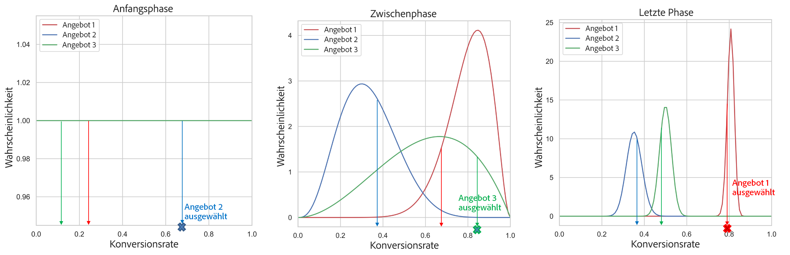

# Modelle für die automatische Optimierung {#auto-optimization-model}

Das Modell der automatischen Optimierung von [!DNL Adobe Journey Optimizer] ist ein verstärktes Lernmodell, das die Klickrate eines Angebots (CTR) maximiert, indem es alle Angebote (oder Inhalte) untersucht und Elemente dann nach Anwendung der Eignungsregeln und Häufigkeitsbegrenzungen nach dem prognostizierten CTR sortiert.

## Anwendungsbeispiele und Vorteile {#use-cases-benefits}

Die automatische Optimierung kann jederzeit verwendet werden, wenn Sie eine schnelle und einfache Einrichtung wünschen, nach insgesamt erfolgreichen Angeboten suchen und die Angebotsklicks innerhalb eines einzigen Kanals maximieren möchten. Beispiel:

* Wählen Sie die besten Angebote aus, die auf einer Web-Seite eingefügt werden sollen, um die Angebotsklicks zu maximieren.
* Wählen Sie die besten Angebote aus, die in eine E-Mail eingefügt werden sollen, um die Angebotsklicks zu maximieren.
* Wählen Sie die besten Angebote aus, die in den Bildschirm einer Mobile App eingefügt werden sollen, um die Angebotsklicks zu maximieren.

Die automatische Optimierung ist in folgenden Fällen eine gute Wahl:

* Angebote ändern sich im Laufe der Zeit oder häufig: Das Modell der automatischen Optimierung wird alle sechs Stunden neu trainiert.

## Anforderungen und Einschränkungen {#requirements-limitations}

Die automatische Optimierung hat die folgenden Anforderungen und Einschränkungen:

* Für die automatische Optimierung ist ein Trainings-Datensatz erforderlich, der die Feldergruppe Angebotsereignisse, Angebotsklickereignisse und die Feldergruppe Erlebnisereignis - Vorschlagsinteraktionen enthält.
* Modelle mit automatischer Optimierung können nicht in Anfragen an die Batch Decisioning-API verwendet werden.
* Die automatische Optimierung wird immer für Angebotsklicks optimiert. Verwenden Sie das Modell [Personalisierte Optimierung“, um für ein anderes Ziel als &#x200B;](personalized-optimization-model.md) zu maximieren.
* Die automatische Optimierung versucht, die insgesamt erfolgreichsten Angebote zu finden, ohne für jeden Kunden ein personalisiertes Ranking zu finden. Um personalisierte Rankings für jeden Kunden zu finden, verwenden Sie das Modell [Personalisierte Optimierung](personalized-optimization-model.md) .

Um ein Modell für automatische Optimierung zu trainieren, muss der Datensatz die folgenden Mindestanforderungen erfüllen:

* Mindestens 2 Angebote im Datensatz müssen innerhalb der letzten 14 Tage mindestens 100 Anzeigeereignisse und 5 Klickereignisse aufweisen.
* Angebote mit weniger als 100 Anzeigen und/oder 5 Klickereignissen innerhalb der letzten 14 Tage werden vom Modell als neue Angebote behandelt und sind nur für die Bereitstellung durch den Exploration-Bandit geeignet.
* Angebote mit mehr als 100 Anzeigen und 5 Klickereignissen in den letzten 14 Tagen werden vom Modell als vorhandene Angebote behandelt und können sowohl von Exploration- als auch von Exploitation-Bandits bedient werden.

Bis zum ersten Mal ein Modell für automatische Optimierung trainiert wurde, werden Angebote im Rahmen einer Auswahlstrategie, die ein Modell für automatische Optimierung verwendet, nach dem Zufallsprinzip bereitgestellt.

## Ausgleich zwischen Optimierung und Lernen {#balancing-optimization-learning}

Die automatische Optimierung ist ein [&#x200B; Lernmodell](https://en.wikipedia.org/wiki/Reinforcement_learning){target="_blank"} das anhand des realen Kundenverhaltens Informationen zur Durchklickleistung von Angeboten liefert. Verstärkte Lernmodelle zielen darauf ab, ein Ziel zu maximieren, indem Maßnahmen mit besser vorhergesagten Ergebnissen ausgewählt werden. Ein Modell, das jedem Kunden immer das/die Element(e) mit dem besten prognostizierten Ergebnis präsentiert, würde jedoch nie etwas über die Leistung von neuen Elementen erfahren, die im Laufe der Zeit eingeführt wurden (das so genannte „Kaltstartproblem„), noch würde es etwas über Leistungsänderungen anderer vorhandener Elemente erfahren, die sich aus Verhaltensänderungen von Kunden im Laufe der Zeit ergeben. Verstärkte Lernmodelle müssen daher mit dem umgehen, was gemeinhin als &quot;[-Exploit-Trade-off“ bezeichnet wird](https://en.wikipedia.org/wiki/Exploration%E2%80%93exploitation_dilemma){target="_blank"} d. h. eine Balance zwischen Optimierung und Lernen herstellen.

Die automatische Optimierung nutzt einen häufig verwendeten Ansatz, den [Multi-Armed Bandit](https://de.wikipedia.org/wiki/Mehrarmiger_Bandit){target="_blank"}, um den Zielkonflikt zu bewältigen. Der mehrarmige Bandit trifft Ranking-Entscheidungen basierend auf:

* Die prognostizierte Clickthrough-Rate jedes Elements
* Die Unterschiede in der prognostizierten Clickthrough-Rate jedes Elements
* Der Grad der Unsicherheit des Modells bezüglich seiner Vorhersagen für jedes Element.

Mehrarmige Banditen nutzen diese Informationen zusammen mit zufälliger Variabilität, um die zu ergreifenden Maßnahmen auszuwählen. Die automatische Optimierung ist ein [-Algorithmus](https://en.wikipedia.org/wiki/Ensemble_learning){target="_blank"} der mehrere mehrarmige Banditen enthält, um sicherzustellen, dass alle Angebote ausreichend untersucht werden und gleichzeitig die Gesamtleistung maximiert wird.

Bei der Beantwortung einer Rangfolgeanfrage entscheidet ein „beaufsichtigender“ mehrarmiger Bandit zunächst, ob diese Anfrage auf Exploration ausgerichtet oder auf Exploitation ausgerichtet sein soll. Diese Entscheidung wird mit einem „epsilon-gierigen“ Ansatz getroffen.

Die zweite Ebene des Rankings wird von einem von zwei [Thompson-Stichprobenverfahren](https://en.wikipedia.org/wiki/Thompson_sampling){target="_blank"} Banditen ausgeführt:

* 10 % des Traffics werden einem explorationsorientierten Bandit zugewiesen, der mit höherer Wahrscheinlichkeit neue Angebote oder Angebote mit eingeschränkten Daten empfiehlt, unter der Annahme, dass das Modell davon profitieren würde, mehr über das Kundenverhalten als Reaktion auf diese Angebote zu erfahren.
* 90 % des Traffics werden einem ausbeutungsfokussierten Banditen zugewiesen, der im Laufe der Zeit mit größerer Wahrscheinlichkeit konsistent leistungsstarke Angebote empfiehlt, unter der Annahme, dass neue oder datenarme Angebote mit größerer Wahrscheinlichkeit unterdurchschnittlich abschneiden, bis das Gegenteil bewiesen ist.

In einem technischen Sinne sind diese Annahmen Parameter der A-priori-Wahrscheinlichkeitsverteilung, auch als [&#x200B; bezeichnet](https://en.wikipedia.org/wiki/Prior_probability){target="_blank"}. Je mehr Anzeige- und Klickdaten die Angebote sammeln, desto geringer wird der Einfluss der gewählten Prioren, und die Prognosen der beiden Banditen neigen dazu, sich im Laufe der Zeit anzunähern.

Unser Ansatz, mehrere Banditen zu kombinieren und dedizierten Traffic für die Exploration zuzuweisen, bietet mehrere Vorteile:

* Das Modell lernt am schnellsten die neuesten Angebote mit den geringsten Daten kennen
* Das Modell lernt weiterhin alle Angebote kennen und reagiert auf Veränderungen im Kundenverhalten im Laufe der Zeit
* Das Modell überpasst nicht, indem es Angebote mit höherer scheinbarer CTR, aber nur wenigen Beobachtungen aggressiv bevorzugt oder Angebote mit niedrigerer scheinbarer CTR, aber nur wenigen Beobachtungen, aggressiv benachteiligt
* Das Modell ist robust bei der Handhabung von Traffic-Zuordnungsentscheidungen über Hunderte von Angeboten mit spärlichen Klickdaten und mit sehr unterschiedlichen Mengen historischer Daten

## Thompson-Stichprobenverfahren {#thompson-sampling}

[Thompson-Stichprobenverfahren](https://en.wikipedia.org/wiki/Thompson_sampling){target="_blank"} oder Bayes&#39;sche Banditen, ist ein Bayes&#39;scher Ansatz für das Problem des mehrarmigen Banditen. Das Modell behandelt durchschnittliche 𝛍 aus jedem Angebot als zufällige Variable und verwendet die bisher gesammelten Daten, um unsere „Überzeugung“ über die durchschnittliche Belohnung zu aktualisieren. Diese „Überzeugung“ wird mathematisch durch eine A-posteriori-Wahrscheinlichkeitsverteilung dargestellt - im Wesentlichen eine Reihe von Werten für die durchschnittliche Belohnung gemeinsam mit der Plausibilität (oder Wahrscheinlichkeit), dass die Belohnung diesen Wert für jedes Angebot hat. Anschließend entnehmen wir für jede Entscheidung einen Punkt aus jeder dieser A-posteriori-Belohnungsverteilungen und wählen das Angebot aus, dessen Belohnung den höchsten Wert hatte.

Dieser Vorgang wird in der folgenden Abbildung veranschaulicht, in der wir drei verschiedene Angebote haben. Anfänglich haben wir keine Erkenntnisse aus den Daten, und wir gehen davon aus, dass alle Angebote eine einheitliche A-posteriori-Belohnungsverteilung haben. Wir ziehen eine Stichprobe aus der A-posteriori-Belohnungsverteilung eines jeden Angebots. Die aus der Verteilung von Angebot 2 ausgewählte Stichprobe hat den höchsten Wert. Dies ist ein Beispiel für eine Exploration. Nach der Anzeige von Angebot 2 erfassen wir jede potenzielle Belohnung (z. B. Konversion/Keine Konversion) und aktualisieren die A-posteriori-Verteilung von Angebot 2 mithilfe des Satzes von Bayes wie unten beschrieben. Wir setzen diesen Prozess fort und aktualisieren die A-posteriori-Verteilungen jedes Mal, wenn ein Angebot angezeigt und die Belohnung erfasst wird. In der zweiten Abbildung wird Angebot 3 ausgewählt. Obwohl Angebot 1 die höchste durchschnittliche Belohnung hat (die A-posteriori-Belohnungsverteilung ist am weitesten rechts), hat der Prozess der Stichprobenziehung aus jeder Verteilung dazu geführt, dass wir das scheinbar suboptimale Angebot 3 ausgewählt haben. Dadurch geben wir uns die Möglichkeit, mehr über die wahre Belohnungsverteilung von Angebot 3 zu erfahren.

Je mehr Stichproben gesammelt werden, desto größer wird das Konfidenzniveau und desto genauer ist die erzielte Schätzung der möglichen Belohnung (entsprechend engerer Belohnungsverteilungen). Dieser Prozess der Aktualisierung unserer Annahmen durch die Verfügbarkeit neuer Erkenntnisse wird als **Bayes&#39;sche Inferenz“**.

Wenn ein Angebot (z. B. Angebot 1) ein eindeutiger Gewinner ist, wird seine A-posteriori-Belohnungsverteilung von anderen getrennt. Zu diesem Zeitpunkt ist die von Angebot 1 in die Stichprobe einbezogene Belohnung für jede Entscheidung wahrscheinlich die höchste, und wir wählen sie mit einer höheren Wahrscheinlichkeit aus. Wir sprechen von Exploitation (Ausbeutung): Wir sind der festen Überzeugung, dass Angebot 1 das beste ist, und daher wird es ausgewählt, um die Belohnungen zu maximieren.

**Abbildung 1**: *Für jede Entscheidung wird ein Punkt aus den A-posteriori-Belohnungsverteilungen entnommen. Das Angebot mit dem höchsten Stichprobenwert (Konversionsrate) wird ausgewählt. In der Anfangsphase haben alle Angebote eine einheitliche Verteilung, da wir aus den Daten keine Erkenntnisse zu den Konversionsraten der Angebote erhalten. Je mehr Stichproben wir sammeln, desto enger und genauer werden die A-posteriori-Verteilungen. Am Schluss wird jedes Mal das Angebot mit der höchsten Konversionsrate ausgewählt.*

+++ Berechnungsdetails

Zur Berechnung/Aktualisierung der Verteilungen verwenden wir **Satz von Bayes**. Für jedes Angebot ***i*** möchten wir sein ***P(𝛍i | Daten)*** berechnen, d. h. für jedes Angebot ***i*** möchten wir feststellen, wie wahrscheinlich der Belohnungswert **𝛍i** auf Basis der bisher für dieses Angebot gesammelten Daten ist.

Nach dem Satz von Bayes:

***A-posteriori = Wahrscheinlichkeit * A-priori***

Die **A-priori-Wahrscheinlichkeit** ist die anfängliche Einschätzung der Wahrscheinlichkeit, ein Ergebnis zu erzeugen. Die Wahrscheinlichkeit, nachdem einige Erkenntnisse gesammelt wurden, wird als „A-**-Wahrscheinlichkeit“**.

Die automatische Optimierung ist so konzipiert, dass binäre Belohnungen (Klick/kein Klick) berücksichtigt werden. In diesem Fall stellt die Wahrscheinlichkeit die Anzahl der Erfolge aus n Versuchen dar und wird durch eine Binomialverteilung modelliert. Bei einigen Wahrscheinlichkeitsfunktionen befindet sich der Posterior, wenn Sie einen bestimmten Prior wählen, in derselben Verteilung wie der Prior. Ein solcher Prior wird dann **konjugierter Priori** genannt. Diese Art von Prior macht die Berechnung der A-posteriori-Verteilung sehr einfach. Die [Beta](https://de.wikipedia.org/wiki/Beta-Verteilung){target="_blank"}Verteilung ist ein Konjugat vor der binomialen Wahrscheinlichkeit (binäre Belohnungen) und daher eine praktische und sinnvolle Wahl für die A-priori- und A-posteriori-Wahrscheinlichkeitsverteilungen. Die Beta-Verteilung basiert auf zwei Parametern ***(α*** und ***β***. Diese Parameter können als Anzahl von Erfolgen und Fehlschlägen betrachtet werden und als Mittelwert gegeben durch:

Die Wahrscheinlichkeitsfunktion wird, wie oben erläutert, durch eine Binomialverteilung modelliert, mit s Erfolgen (Konvertierungen) und f Misserfolgen (keine Konvertierungen), und q ist eine Zufallsvariable mit einer Beta-Verteilung.

Der Prior wird von der Beta-Verteilung modelliert und die A-posteriori-Verteilung hat die folgende Form:

+++

### Verzerrungen durch Erkundung und Verzerrungen durch Ausbeutung {#exploration-exploitation-bias}

Für die Parameter (α&#x200B;***, β*** muss ***Ausgangswert*** werden. Die automatische Optimierung umfasst sowohl einen explorationsneutralen Thompson-Sampling-Bandit als auch einen Exploitation-neutralen Thompson-Sampling-Bandit, die unterschiedliche anfängliche ***α***-, ***β***-Prioren in ihren Beta-Distributionen verwenden.

Bei einem allgemeinen Thompson-Stichprobenansatz wird der Posterior berechnet, indem einfach die Anzahl der Erfolge und Misserfolge zu den vorhandenen Parametern (α&#x200B;***,**&#x200B;**&#x200B;**&#x200B;β)*** wird. Die automatische Optimierung nutzt verschiedene Gewichtungsfaktoren für neue Erfolge und Fehler, um die Auswirkungen neuer Daten im Vergleich zu früheren Daten sowohl in den explorationsbasierten als auch in den ausnutzungsbasierten Banditen zu ändern.

## Verweise {#references}

Einen tieferen Einblick in das Thompson-Stichprobenverfahren für Banditen erhalten Sie in den folgenden Forschungsarbeiten:

* [Eine empirische Auswertung des Thompson-Stichprobenverfahrens](https://proceedings.neurips.cc/paper/2011/file/e53a0a2978c28872a4505bdb51db06dc-Paper.pdf){target="_blank"}
* [Analyse des Thompson-Stichprobenverfahrens für das Problem des mehrarmigen Banditen](https://proceedings.mlr.press/v23/agrawal12/agrawal12.pdf){target="_blank"}
