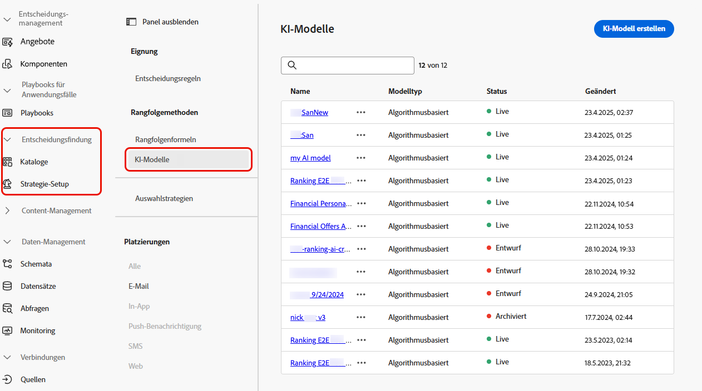
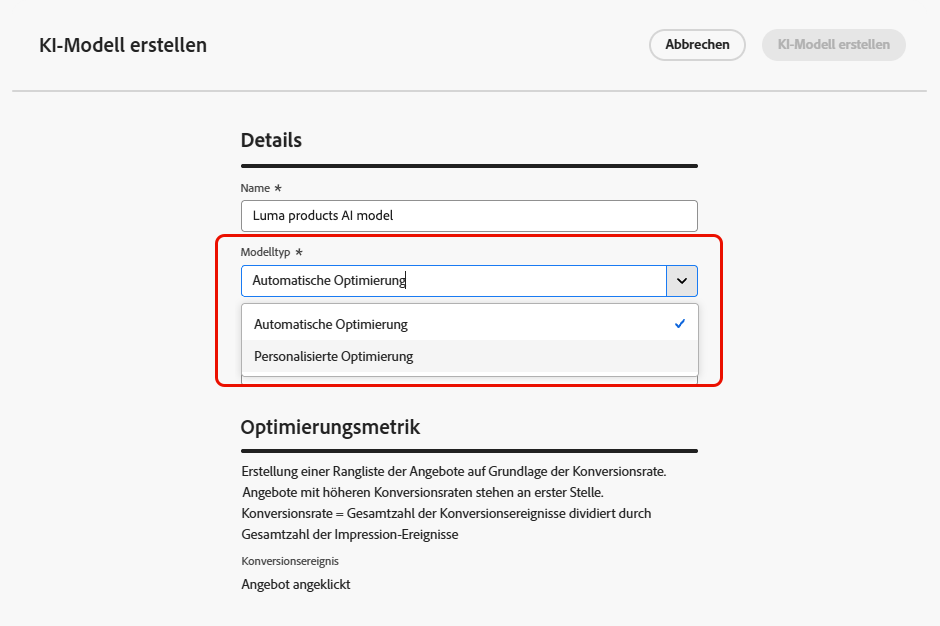
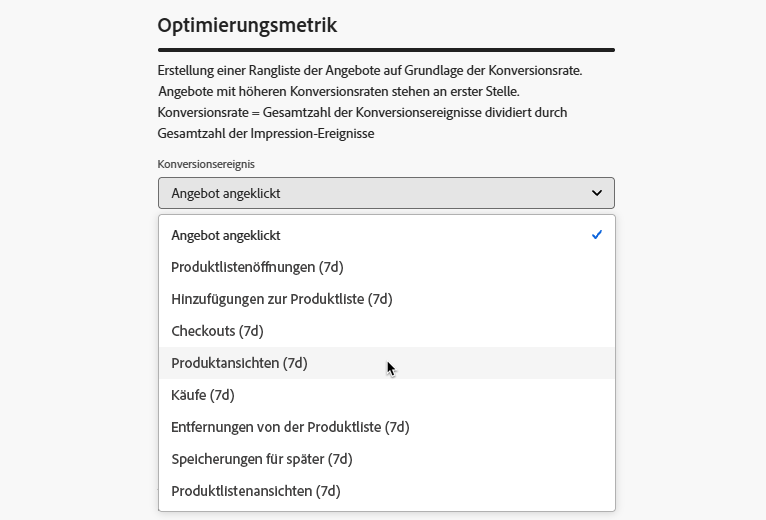
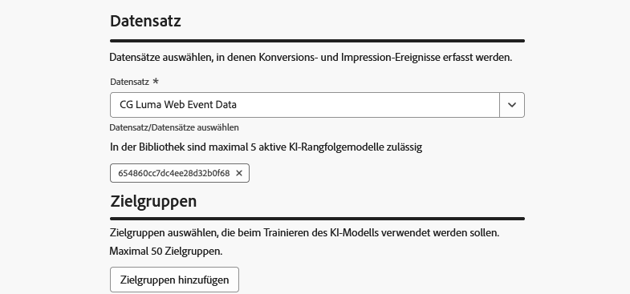

# Erstellen von KI-Modellen {#create-ai-models}

[!DNL Journey Optimizer] ermöglicht Ihnen die Erstellung von **KI-Modellen**, um Angebote nach Ihren Geschäftszielen zu ordnen.

>[!CAUTION]
>
>Zum Erstellen, Bearbeiten oder Löschen von KI-Modellen benötigen Sie die Berechtigung zur **Verwaltung von Rangfolgestrategien**. [Weitere Informationen](../../administration/high-low-permissions.md#manage-ranking-strategies)

## Erstellen eines KI-Modells {#create-ranking-strategy}

>[!CONTEXTUALHELP]
>id="ajo_exd_ai_model_metric"
>title="Optimierungsmetrik"
>abstract="[!DNL Journey Optimizer] erstellt die Rangfolge von Angeboten anhand der **Konversionsrate** (Konversionsrate = Gesamtanzahl der Konversionsereignisse / Gesamtzahl der Impression-Ereignisse). Die Konversionsrate wird anhand von zwei Metriktypen berechnet: **Impression-Ereignisse** (angezeigte Angebote) und **Konversionsereignisse** (Angebote, die zu Klicks über E-Mail oder Web führen). Diese Ereignisse werden automatisch mit dem Web SDK oder dem bereitgestellten Mobile SDK erfasst."

Gehen Sie wie folgt vor, um ein neues KI-Modell zu erstellen:

1. Erstellen Sie einen Datensatz, in dem Konversionsereignisse erfasst werden. [Weitere Informationen](../data-collection/create-dataset.md)

1. Navigieren Sie zum Menü **[!UICONTROL Entscheidungsfindung]** > **[!UICONTROL Strategie-Setup]** und wählen Sie **[!UICONTROL KI-Modelle]** aus.

   

   Alle bisher erstellten KI-Modelle werden aufgelistet.

1. Klicken Sie auf die Schaltfläche **[!UICONTROL KI-Modell erstellen]**.

1. Geben Sie einen eindeutigen Namen und gegebenenfalls eine Beschreibung für das KI-Modell an.

1. Wählen Sie den Typ des KI-Modells aus, das Sie erstellen möchten:

   * **[!UICONTROL Automatische Optimierung]** optimiert Angebote basierend auf der bisherigen Angebots-Performance. [Weitere Informationen](auto-optimization-model.md)
   * Die **[!UICONTROL personalisierte Optimierung]** optimiert und personalisiert Angebote auf Grundlage von Zielgruppen und Angebots-Performance. [Weitere Informationen](personalized-optimization-model.md)

   

1. Der Abschnitt **[!UICONTROL Optimierungsmetrik]** enthält Informationen zum Konversionsereignis, das vom KI-Modell zur Berechnung des Angebotsrangs verwendet wird.

   [!DNL Journey Optimizer] erstellt die Rangfolge von Angeboten anhand der **Konversionsrate** (Konversionsrate = Gesamtanzahl der Konversionsereignisse / Gesamtzahl der Impression-Ereignisse). Die Konversionsrate wird anhand von zwei Metriktypen berechnet:
   * **Impression-Ereignisse** (angezeigte Angebote)
   * **Konversionsereignisse** (Angebote per E-Mail oder im Web, die zu Klicks führen).

   Diese Ereignisse werden automatisch mit dem Web SDK oder dem bereitgestellten Mobile SDK erfasst. Weitere Informationen finden Sie im Überblick über das [Adobe Experience Platform Web SDK](https://experienceleague.adobe.com/docs/experience-platform/edge/home.html?lang=de).

   +++ Optimieren von Modellen für benutzerdefinierte Metriken in [!DNL Customer Journey Analytics]

   >[!NOTE]
   >
   >Diese Funktion steht nur Kundinnen und Kunden von [!DNL Customer Journey Analytics] mit Administratorrechten zur Verfügung.
   >
   >Bevor Sie beginnen, stellen Sie sicher, dass Sie Journey Optimizer mit Customer Journey Analytics integriert haben, um Journey Optimizer-Datensätze in Ihre Standard-Datenansichten zu exportieren.  [Informationen zum Verwenden von Daten aus  [!DNL Journey Optmizer]  in  [!DNL Customer Journey Analytics]](../../reports/cja-ajo.md)

   **[!UICONTROL Personalisierte Optimierungsmodelle]** sind ein KI-Modelltyp, mit dem Sie Geschäftsziele definieren und mithilfe von Kundendaten geschäftsorientierte Modelle trainieren können, um personalisierte Angebote bereitzustellen und KPIs zu maximieren.

   Personalisierte Optimierungsmodelle verwenden standardmäßig **Angebot-Klicks** als Optimierungsmetrik. Wenn Sie mit [!DNL Customer Journey Analytics] arbeiten, können Sie mit [!DNL Decisioning] Ihre eigenen benutzerdefinierten Metriken verwenden, um Ihr Modell zu optimieren.

   Wählen Sie dazu den Modelltyp **[!UICONTROL Personalisierte Optimierung]** aus und erweitern Sie die Dropdown-Liste **[!UICONTROL Konversionsereignis]**. In der Liste werden alle Metriken aus Ihrer standardmäßigen [!DNL Customer Journey Analytics]-[Datenansicht](https://experienceleague.adobe.com/de/docs/analytics-platform/using/cja-dataviews/data-views){target="_blank"} angezeigt. Wählen Sie die Metrik aus, für die Sie Ihr Modell optimieren möchten.

   {width=85%}

   >[!NOTE]
   >
   >Standardmäßig verwenden Metriken in [!DNL Customer Journey Analytics] ein Attributionsmodell „Letztkontakt“, mit dem 100 % des Credits dem Touchpoint zugewiesen werden, der zuletzt vor der Konversion auftritt.
   >
   >Es ist zwar möglich, das Attributionsmodell zu ändern, aber nicht alle Attributionsmodelle eignen sich ideal für die Optimierung von KI-Modellen.  Wir empfehlen, mit Sorgfalt ein Attributionsmodell auszuwählen, das Ihren Optimierungszielen entspricht, um die Genauigkeit und Leistung des Modells sicherzustellen.
   >
   >Weitere Informationen zu verfügbaren Attributionsmodellen und Anleitungen zu ihrer Verwendung finden Sie in der [[!DNL Customer Journey Analytics] Dokumentation](https://experienceleague.adobe.com/de/docs/analytics-platform/using/cja-dataviews/component-settings/attribution){target="_blank"}

   +++

1. Wählen Sie die Datensätze aus, in denen die Konversions- und Impression-Ereignisse erfasst werden. In [diesem Abschnitt](../data-collection/create-dataset.md) erfahren Sie, wie Sie solche Datensätze erstellen.

   {width=85%}

   >[!CAUTION]
   >
   >In der Dropdown-Liste werden nur Datensätze angezeigt, die aus Schemata erstellt wurden, die mit der Feldergruppe (früher als Mixin bezeichnet) **[!UICONTROL Erlebnisereignis – Vorschlagsinteraktionen]** verknüpft sind.

1. Wenn Sie ein KI-Modell für die **[!UICONTROL personalisierte Optimierung]** erstellen, wählen Sie ein oder mehrere Segmente aus, die für das Training des KI-Modells verwendet werden sollen.

   <!--➡️ [Discover this feature in video](#video)-->

   >[!NOTE]
   >
   >Sie können bis zu 5 Zielgruppen auswählen.

1. Speichern und aktivieren Sie das KI-Modell.

<!--At this point, you must have:

* created the AI model,
* defined which type of event you want to capture - offer displayed (impression) and/or offer clicked (conversion),
* and in which dataset you want to collect the event data.-->

Jedes Mal, wenn ein Angebot angezeigt und/oder angeklickt wird, soll nun das entsprechende Ereignis automatisch von der Feldergruppe **[!UICONTROL Erlebnisereignis – Vorschlagsinteraktionen]** mithilfe des [Adobe Experience Platform Web SDK](https://experienceleague.adobe.com/docs/experience-platform/edge/web-sdk-faq.html?lang=de#what-is-adobe-experience-platform-web-sdk%3F){target="_blank"} oder Mobile SDK erfasst werden.

Um Ereignistypen (angezeigtes Angebot oder angeklicktes Angebot) senden zu können, müssen Sie für jeden Ereignistyp in einem Erlebnisereignis, das an Adobe Experience Platform gesendet wird, den richtigen Wert festlegen. [Weitere Informationen dazu](../data-collection/schema-requirement.md)

<!--
## How-to video {#video}

Learn how to create a personalized optimization model and how to apply it to a decision.

>[!VIDEO](https://video.tv.adobe.com/v/3419954?quality=12)-->
