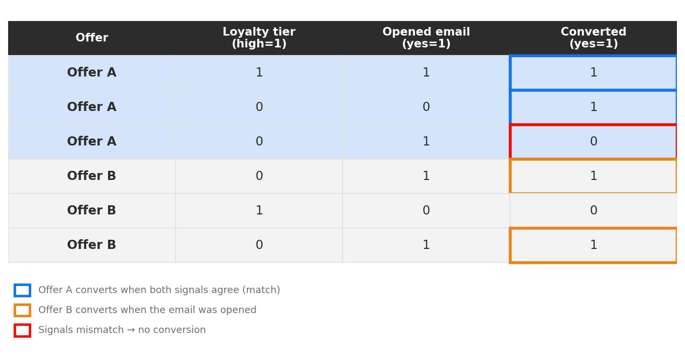
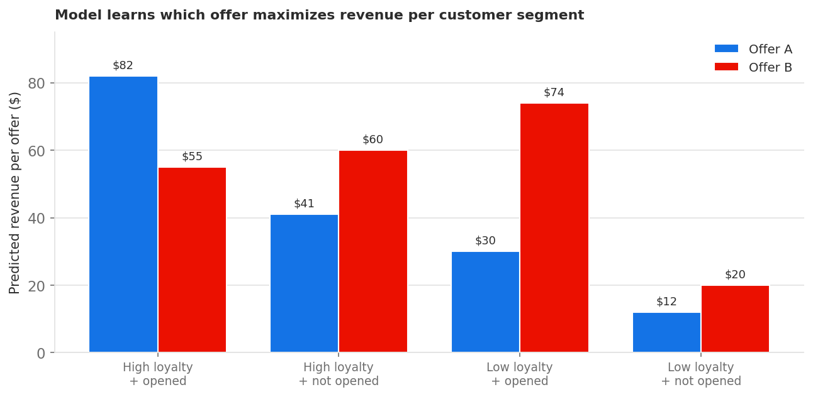

# Modell zur personalisierten Optimierung {#personalized-optimization-model}

>[!BEGINSHADEBOX]

**Auf dieser Seite:** Erfahren Sie, wie das Modell der personalisierten Optimierung maschinelles Lernen nutzt, um aus Kunden-, Angebots- und kontextuellen Daten zu lernen, einschließlich der Anwendungsfälle, Ensemble-Modellkomponenten, Datensatzanforderungen, Annahmen und Kaltstart-Verhalten, sodass Sie entscheiden können, wann es zur Bereitstellung personalisierter Angebote und zur Maximierung Ihrer KPIs verwendet werden soll.

>[!ENDSHADEBOX]

Durch die Nutzung modernster Technologien im Bereich des überwachten maschinellen Lernens und des Deep Learning ermöglicht es die personalisierte Optimierung einem Business-Anwender (Marketing-Experten), Geschäftsziele zu definieren und seine Kundendaten zu nutzen, um geschäftsorientierte Modelle zu trainieren, um personalisierte Angebote bereitzustellen und KPIs zu maximieren.

Im Gegensatz zur nicht personalisierten Rangfolge, die die Optimierung auf der Grundlage der globalen Leistung der einzelnen Angebote vornimmt, lernt die personalisierte Optimierung die Beziehung zwischen den Attributen eines einzelnen Kunden und den Angeboten kennen, die am ehesten den ausgewählten KPI für diesen Kunden bestimmen. Das Ergebnis ist eine Angebotsauswahl, die auf jedes Profil zugeschnitten ist, und nicht auf ein einzelnes bestes Angebot, das jedem unterbreitet wird.

## Anwendungsbeispiele und Vorteile {#use-cases}

Personalisierte Optimierung ist gut für Entscheidungsszenarien geeignet, in denen verschiedene Kundinnen und Kunden unterschiedlich auf die verfügbaren Angebote reagieren und in denen der Angebotskatalog sinnvoll differenziert ist und sich nicht oft ändert. Häufige Anwendungsfälle sind:

* **Next-Best-Offer-Selection**: Auswahl mehrerer konkurrierender Angebote oder Aktionen, die jedem Kunden in Echtzeit unterbreitet werden sollen.
* **Inhaltspersonalisierung**: Auswahl des Inhalts (z. B. Banner, Kreativ) oder der Nachricht für jeden Kunden über Web, Mobile, E-Mail und andere Kanäle.
* **Zielgruppengerechte Personalisierung**: Integrieren Sie die Zielgruppenzugehörigkeit und kontextuelle Signale, damit die Empfehlungen widerspiegeln, wer der Kunde ist und in welchem Kontext die Interaktion abläuft.
* **Umsatz- und Wertoptimierung**: Optimierung auf kontinuierliche Ergebnisse wie Umsatz oder Kundenlebenszeitwert sowie binäre Ergebnisse wie Klicks und Konversionen.

Wichtigste Vorteile:

* Maximiert den von Ihnen gewählten Business-KPI, indem es das Angebot bereitstellt, auf das jeder Kunde am ehesten reagiert, anstatt ein einziges global optimales Angebot zu erstellen.
* Passt sich kontinuierlich an, wenn neue Interaktionsdaten eingehen, und wägt die Exploration unzureichend getesteter Angebote mit der Nutzung bewährter Köpfe ab.
* Unterstützt sowohl binäre als auch kontinuierliche Optimierungsmetriken mit Rangfolgenwerten, die direkt in KI-Modellformel-Builder-Ausdrücken verwendet werden können.
* Reduziert den manuellen Aufwand für A/B-Tests und das Erstellen von Regeln, indem die Anpassung von Angebot an Kunde automatisch erlernt wird.

## Datensatzanforderungen {#dataset}

Um ein personalisiertes Optimierungsmodell zu trainieren, muss der Datensatz innerhalb der letzten 30 Tage über mindestens zwei Angebote mit mindestens 250 Anzeigeereignissen (z. B. Impressions) und einem Erfolgsereignis (z. B. Klick oder Konversion) verfügen.

Angebote mit weniger als 250 Anzeigeereignissen und/oder ohne Erfolgsereignisse innerhalb der letzten 30 Tage bleiben für die Aufnahme in den Exploration-Traffic geeignet. Sie können auch in den Personalisierungs-Traffic aufgenommen werden, werden jedoch so lange wie das am schlechtesten bewertete prognostizierte Angebot in der Entscheidungsfindung behandelt, bis sie die erforderlichen minimalen Anzeige-/Erfolgsereignisse erreichen und das Modell neu trainiert wird.

Bis ein Modell für personalisierte Optimierung zum ersten Mal trainiert wird, werden Angebote im Rahmen einer Auswahlstrategie mit einem personalisierten Optimierungsmodell nach dem Zufallsprinzip bereitgestellt.

## Funktionsweise {#how}

Das Modell lernt komplexe Wechselwirkungen zwischen Angeboten, Informationen über Benutzende und kontextuelle Informationen, um Endbenutzenden personalisierte Angebote zu empfehlen. Funktionen werden durch Eingaben in das Modell verfügbar.

Es gibt drei Arten von Funktionen:

| Funktionstypen | Hinzufügen von Funktionen zu Modellen |
|--------------|----------------------------|
| Entscheidungs-Objekte (placementID, activityID, decisionScopeID) | Teil der Feedback-Erlebnisereignisse aus dem Entscheidungs-Management, die an AEP gesendet werden |
| Zielgruppen | Bis zu 50 Zielgruppen können beim Erstellen des KI-Rangfolgenmodells als Funktionen hinzugefügt werden |
| Kontextdaten | Teil der Feedback-Erlebnisereignisse aus dem Decisioning, die an AEP gesendet werden. Verfügbare Kontextdaten zum Hinzufügen zum Schema: Details zu Commerce, Kanal, Anwendung, Web, Umgebung und Gerät sowie placeContext |

Das Modell umfasst zwei Phasen:

* In der Phase des **Offline-Modelltrainings** wird ein Modell durch Erlernen und Speichern von in historischen Daten ersichtlichen Merkmalsinteraktionen trainiert.
* In der Phase **Online** Schlussfolgerung werden die Angebote auf der Grundlage der vom Modell in Echtzeit generierten Punktzahlen eingestuft. Im Gegensatz zu herkömmlichen kollaborativen Filtertechniken, bei denen es schwierig ist, Merkmale für Benutzer und Angebote einzubeziehen, ist die personalisierte Optimierung eine auf Deep Learning basierende Empfehlungsmethode, die in der Lage ist, komplexe und nichtlineare Interaktionsmuster von Merkmalen einzubeziehen und zu lernen.

Das Modell unterstützt die Optimierung von kontinuierlichen Variablen (z. B. Umsatz und Kundenlebenszeitwert) sowie binären Variablen (z. B. Klicks und Konversionen). Prognostizierte Werte für eine binäre Metrik, z. B. Klicks, liegen immer zwischen 0 und 1. Prognostizierte Werte für eine kontinuierliche Metrik, z. B. der Bestellwert, sind immer eine Zahl größer oder gleich null. Die Rangfolgenwerte werden normalisiert, um ein konsistentes Verhalten über beide Metriktypen hinweg sicherzustellen, wenn sie in Formeln oder Vergleichen verwendet werden.

## Veranschaulichendes Beispiel {#illustrative-example}

### Binäre Antwort (Konversion) {#binary-response}

Stellen Sie sich einen vereinfachten Datensatz mit historischen Interaktionen zwischen Benutzern und Angeboten vor. In jeder Zeile wird ein angezeigtes Angebot, zwei Kundensignale - Treuestufe (hoch = 1) und ob der Kunde eine aktuelle E-Mail geöffnet hat (ja = 1) - aufgezeichnet und angegeben, ob der Kunde konvertiert hat (ja = 1).

Bei Angebot A ist die Konversion wahrscheinlicher, wenn beide Signale übereinstimmen (hoch oder beides niedrig). Bei Angebot B ist die Konversion wahrscheinlicher, wenn die E-Mail geöffnet wurde, unabhängig von der Treuestufe. Basierend auf dem erlernten Muster kann das Modell das bessere Angebot für jeden Kunden auf der Grundlage seiner Signale vorhersagen.

*Abbildung 1: In der hervorgehobenen Zeile „Fehlende Übereinstimmung“ wurde Angebot A angezeigt, wenn die Signale nicht übereinstimmten und nicht konvertiert wurden. Basierend auf dem gelernten Muster wäre Angebot B die bessere Empfehlung für diesen Kunden beim nächsten Mal.*

Dies ist der Kern des Ansatzes: Erlernen und Speichern historischer Merkmalsinteraktionen und deren Anwendung, um personalisierte Prognosen für jeden Kunden zu generieren.

### Fortlaufende Antwort (Umsatz) {#continuous-response}

Dieselbe Idee gilt für kontinuierliche Ergebnisse. Anstatt vorherzusagen, ob ein Kunde konvertiert, prognostiziert das Modell einen kontinuierlichen Wert (erwarteten Umsatz) für jedes Angebot und Kundensegment und ordnet Angebote nach diesem prognostizierten Wert.

*Abbildung 2: Prognostizierter Umsatz für zwei Angebote in vier Kundensegmenten. Bei Kundinnen und Kunden mit hoher Treue, die die E-Mail geöffnet haben, dürfte Angebot A den höchsten Umsatz erzielen; bei Kundinnen und Kunden mit geringer Treue, die die E-Mail geöffnet haben, ist Angebot B die bessere Wahl. Das Modell wählt für jedes Segment das Angebot mit dem höchsten prognostizierten Wert aus, anstatt eine Regel auf alle Kunden anzuwenden.*

## Komponenten des Ensemble-Modells {#ensemble}

Die personalisierte Optimierung wird als Gesamtmodell bereitgestellt - mehrere komplementäre Modellarme laufen zusammen, und eine Überwachungsebene entscheidet, wie viel Live-Traffic jede Arme erhält. Mit diesem Design kann das System zwei Ziele gleichzeitig verfolgen: Erlernen, welche Angebote die beste Leistung erbringen (Exploration), und Bedienen der bereits bekannten Angebote, die eine gute Leistung erbringen (Exploitation).

**Ausgleich zwischen Exploration und Exploitation**

Jedes Entscheidungssystem steht vor einem Zielkonflikt zwischen der Untersuchung zu wenig getesteter Angebote, um Informationen zu sammeln, und der Nutzung bewährter Angebote, um den sofortigen Gewinn zu maximieren. Wenn zu wenig Traffic für die Exploration reserviert wird, bleiben potenzielle Angebote mit hohem Potenzial unentdeckt. Durch die Reservierung von zu vielen Opfern werden bereits bestehende Angebote aufgewertet. Das Ensemble verwaltet diese Balance automatisch, indem es eine minimale Erkundungsfläche hält und den verbleibenden Traffic im Laufe der Zeit in Richtung der leistungsfähigeren personalisierten Arme verlagert.

Das Ensemble besteht aus vier Traffic-Wappen:

### Uniform random (Explorationsarm) {#uniform-random}

Der einheitliche Zufallsarm weist den Kunden nach dem Zufallsprinzip aus den geeigneten Angeboten Angebote zu. Da es kein Angebot bevorzugt, erzeugt es objektive Daten darüber, wie Kunden im gesamten Katalog reagieren - das Rohmaterial, aus dem die personalisierten Waffen lernen. Es ist der einzige aktive Arm, bevor das erste Modell trainiert wird, und anschließend hält es weiterhin eine minimale Explorationsfläche bereit, sodass das System weiter lernt.

* Bei Initialisierung: 100 % des Traffics.
* Nach dem ersten erfolgreichen Trainings-Lauf: mindestens 5-20 % des Traffics je nach Anzahl der beobachteten Impression- und Konversionsereignisse pro Angebot, maximal jedoch 85 %.

### Neuronales Netzwerk (personalisierter Arm) {#neural-network}

Das neuronale Netzwerk ist ein personalisierter Arm, der anhand von Attributen und Zielgruppenzugehörigkeiten das beste Angebot für einen bestimmten Kunden vorhersagt. Sie lernt komplexe, nichtlineare Interaktionen zwischen Angeboten, Kundenmerkmalen und Kontext und ist gut geeignet, subtile Muster über viele Funktionen hinweg zu erfassen.

* Bei Initialisierung: 0 % des Traffics.
* Nach dem ersten erfolgreichen Trainings-Lauf: mindestens 5% des Traffics, maximal 85%.

### Kontextuelle Bandit (personalisierter Arm) {#contextual-bandit}

Der kontextuelle Bandit ist ein zweiter personalisierter Zweig, der anhand der Zielgruppenzugehörigkeit ebenfalls das beste Angebot für jeden Kunden vorhersagt. Dabei wird ein Bandit-Ansatz verwendet, bei dem Lernprozesse und Leistung kontinuierlich in Einklang gebracht werden. Wenn es neben dem neuronalen Netzwerk läuft, kann das Ensemble auf die Stärken von zwei verschiedenen personalisierten Methoden zurückgreifen.

* Bei Initialisierung: 0 % des Traffics.
* Nach dem ersten erfolgreichen Trainings-Lauf: mindestens 5% des Traffics, maximal 85%.

### Neuer Angebotsverbesserer (nicht personalisierte Komponente) {#new-offer-booster}

Der neue Angebotsverstärker ist ein Thompson-Sampling-Bandit (nicht personalisiert), der insgesamt siegreich ist und optimistische Annahmen über die Leistung neuer Angebote trifft - Angebote mit wenigen aufgezeichneten Impression-Ereignissen innerhalb der Modell-Lookback-Periode. Dies gibt viel versprechenden neuen Angeboten die frühzeitige Offenlegung, die sie benötigen, um sich zu bewähren, und behebt einen bekannten „Kaltstart“-Mangel, bei dem das Modell ansonsten Schwierigkeiten hatte, ausreichend Traffic auf neue oder leistungsstarke, aber einschränkend geeignete Angebote zu lenken.

* Wenn echte Impression- und Konversionsdaten erfasst werden, nähert sich die geschätzte Performance jedes Angebots schnell der tatsächlichen zugrunde liegenden Performance an, und die Auswirkungen der optimistischen Annahmen fallen auf nahezu null.
* Wenn keine Angebote relativ neu sind - z. B. wenn alle Angebote eine ähnliche Anzahl von Impressionen aufweisen oder alle mehr als 1.000 Impressionen aufweisen - liegt der optimistische Effekt bei nahezu null und dieser Arm verhält sich im Endeffekt wie ein nicht personalisiertes Gesamtsieger-Modell.
* Bei Initialisierung: 0 % des Traffics.
* Nach dem ersten erfolgreichen Trainingslauf: 5% des Traffics.

### Wie der Traffic über die Arme verteilt wird {#traffic-allocation}

Bei der Initialisierung hat noch kein Modell trainiert, sodass 100 % des Traffics auf die einheitliche zufällige Baseline entfallen - der einzige Arm mit einer erlernten Verteilung, aus der Stichproben entnommen werden können. Nach dem ersten erfolgreichen Trainings-Lauf erhält jede Testverzweigung eine minimale Traffic-Untergrenze (5 %), und der Supervisorenbandit ordnet den verbleibenden Traffic basierend auf der beobachteten Leistung zu. Während das Modell über aufeinander folgende Runden hinweg trainiert, konvergiert der Verkehr zu den leistungsstärksten Armen mit einer maximalen Zuordnung von 85 % Verkehr.

*Abbildung 3: Eine mögliche Trajektorie der Verkehrszuweisung über die vier Ensemble-Arme bei der Initialisierung und über aufeinander folgende Trainingsrunden. Bei der Initialisierung fließt der gesamte Traffic zur zufälligen Baseline. Nach jedem Trainings-Lauf verschiebt der aufsichtliche Thompson-Sampling-Bandit die Zuteilung in Richtung leistungsfähigerer Arme, während mindestens 5 % Traffic beibehalten werden. Die tatsächliche Zuordnung variiert je nach beobachteter Leistung der Testverzweigung.*

## Grundlegende Modellannahmen und -beschränkungen {#key}

Um die Vorteile der personalisierten Optimierung zu maximieren, müssen einige wichtige Voraussetzungen und Beschränkungen beachtet werden.

* **Die Angebote sind so unterschiedlich, dass auch die Präferenzen der Benutzenden bezüglich der in Frage kommenden Angebote unterschiedlich sind**. Wenn die Angebote zu ähnlich sind, hat das resultierende Modell weniger Wirkung, da die Reaktionen scheinbar zufällig sind.Wenn eine Bank beispielsweise zwei Kreditkarten anbietet, deren einziger Unterschied die Farbe ist, spielt es möglicherweise keine Rolle, welche Karte empfohlen wird. Wenn jedoch jede Karte unterschiedliche Bedingungen hat, bietet dies eine Begründung dafür, warum bestimmte Kunden sich für eine Karte entscheiden. Zudem bietet sie einen ausreichenden Unterschied zwischen den Angeboten, um ein wirkungsvolleres Modell zu erstellen.
* **Die Zusammensetzung des Traffics von Benutzenden ist stabil**. Wenn sich die Zusammensetzung des Benutzenden-Traffics während des Trainings der Modelle und der Vorhersagephase drastisch ändert, kann sich die Modell-Performance verschlechtern. Angenommen, in der Trainings-Phase des Modells sind nur Daten für Benutzende in Zielgruppe A verfügbar, aber das trainierte Modell wird verwendet, um Prognosen für Benutzende in Zielgruppe B zu generieren. In diesem Fall kann die Modell-Performance beeinträchtigt werden.
* **Die Performance der Angebote ändert sich innerhalb eines kurzen Zeitraums nicht dramatisch**, da dieses Modell wöchentlich aktualisiert wird und die Performance-Änderungen mit der Aktualisierung des Modells übermittelt werden. Ein Beispiel: Ein Produkt war früher sehr beliebt, aber in einem öffentlichen Bericht wird festgestellt, dass das Produkt gesundheitsschädlich ist, und das Produkt wird sehr schnell unpopulär. In diesem Szenario könnte das Modell dieses Produkt so lange empfehlen, bis das Modell aufgrund von Verhaltensänderungen der Benutzenden aktualisiert wird.

## „Kaltstart“-Problem {#cold-start}

„Kaltstart“-Probleme treten auf, wenn es nicht genügend Daten für Empfehlungen gibt. Für die personalisierte Optimierung gibt es vier Arten von „Kaltstart“-Problemen.

* **Nachdem ein neues KI-Modell ohne historische Daten erstellt**, werden die Angebote über einen bestimmten Zeitraum nach dem Zufallsprinzip bereitgestellt, um die erforderlichen Daten zu erfassen, die dann zum Trainieren des ersten Modells verwendet werden.
* **Nach der Freigabe des ersten KI** Modells wird ein Teil des gesamten Traffics für eine einheitliche zufällige Untersuchung zugewiesen, während der Rest für Modellempfehlungen verwendet wird. Die Traffic-Verteilung über die Bandit-Komponenten „Exploration“ und „Exploitation“ wird automatisch auf der Grundlage von Faktoren wie der Anzahl der Angebote und deren Leistungsschwellen angepasst.
* **Nachdem der Angebotssammlung neue Angebote hinzugefügt**, die in der mit dem KI-Ranking-Modell verknüpften Strategie ausgewählt wurden, werden diese Angebote zu geeigneten Kandidaten für die Exploration sowohl durch die einheitlichen zufälligen als auch durch die neuen Angebotsverstärker-Modellarme (innerhalb von 60 Minuten). Während des nächsten geplanten Trainings-Laufs wird die geschätzte Leistung des Angebots im neuen Modellarm Angebotsverbesserer aktualisiert, und das Angebot wird für die Aufnahme in die personalisierten Modellarme qualifiziert, wenn es den Impression- und Klickschwellenwert erreicht.
* **Nachdem dem bestehenden Zielgruppensatz neue Profile hinzugefügt**, die mit der mit dem KI-Ranking-Modell verknüpften Auswahlstrategie verknüpft sind, übernehmen sie Personalisierungsattribute aus dem Zielgruppensatz selbst. Daher erhalten sie von Anfang an personalisierte Angebote, die auf diesen Attributen basieren, ohne dass ein „Kaltstart“-Problem auftritt.

## Erneutes Training {#re-training}

Die Modelle werden wöchentlich neu trainiert, um die neuesten Interaktionen zwischen den Merkmalen zu erlernen und der Verschlechterung der Modell-Performance entgegenzuwirken. Informationen zum Überwachen des Trainings-Status und der Modellleistung finden Sie unter [KI-Modellüberwachung](ai-model-observability.md).
