# Erstellen von Ranglistenformeln {#create-ranking-formulas}

**Rangfolgeformeln** ermöglichen es Ihnen, Regeln zu definieren, die bestimmen, welches Angebot zuerst unterbreitet werden soll, anstatt die Prioritätswerte zu berücksichtigen.

Um diese Regeln zu erstellen, bietet der KI-Formel-Builder in **[!UICONTROL Adobe Journey Optimizer]** mehr Flexibilität und Kontrolle bei der Rangfolge von Angeboten. Anstatt sich nur auf eine statische Angebotspriorität zu verlassen, können Sie nun benutzerdefinierte Rangfolgenformeln definieren, die Werte von KI-Modellen, Angebotsprioritäten, Profilattribute, Angebotsattribute und kontextuelle Signale über eine geführte Benutzeroberfläche kombinieren.

Dieser Ansatz ermöglicht es Ihnen, die Angebotsrangfolge dynamisch auf der Grundlage einer beliebigen Kombination aus KI-gesteuerter Tendenz, geschäftlichem Nutzen und Echtzeit-Kontext anzupassen, was die Abstimmung der Entscheidungsfindung auf Marketing-Ziele und Kundenanforderungen erleichtert. Der KI-Formel-Builder unterstützt einfache oder erweiterte Formeln, je nachdem, wie viel Kontrolle Sie anwenden möchten.

Sobald eine Rangfolgenformel erstellt wurde, können Sie diese einer [Auswahlstrategie](../selection-strategies.md) zuweisen. Wenn mit dieser Auswahlstrategie mehrere Angebote für diese Platzierung infrage kommen, verwendet die Entscheidungs-Engine die ausgewählte Formel, um zu berechnen, welches Angebot zuerst bereitgestellt werden soll.

➡️ [Funktion im Video kennenlernen](#video)

## Leitlinien und Einschränkungen {#ranking-guardrails}

Beachten Sie vor dem Erstellen von Rangfolgeformeln die folgenden Einschränkungen:

* Der KI-Formel-Builder unterstützt keine [personalisierten Optimierungsmodelle](personalized-optimization-model.md) die kontinuierliche Metriken verwenden.
* Wenn ein KI-Modell in einer Rangfolgenformel verwendet wird, werden die Daten nicht im Bericht [Konversionsrate für Holdout- und modellgesteuerten Traffic](../../reports/campaign-global-report-cja-code.md#conversion-rate) angezeigt.
* Die Verschachtelungstiefe in einer Rangfolgenformel ist auf 30 Ebenen begrenzt, gemessen durch die Zählung von `)` in der PQL-Zeichenfolge.
* Eine Zeichenfolge der Rangfolgeformeln kann für UTF-8-codierte Zeichen bis zu 8 KB groß sein (8.000 ASCII-Zeichen oder 2.000-4.000 Nicht-ASCII-Zeichen).
* Lookback-Zeiträume werden in Rangfolgeformeln (z. B. Erlebnisereignisse aus dem letzten Monat) nicht unterstützt. Beim Versuch, solche Formeln zu speichern, ist ein Trigger aufgetreten.
* [KI-gestützte Formeloptimierung](#optimize) gilt nur für Rangfolgenformeln, deren codebasierter PQL-Ausdruck größer als **2 KB** in UTF-8-codierter Größe ist. Kleinere Formeln werden nicht analysiert.

## Erstellen der Rangfolgenformel und Festlegen von Eigenschaften {#create-ranking-formula}

>[!CONTEXTUALHELP]
>id="ajo_exd_config_formulas"
>title="Erstellen von Ranglistenformeln"
>abstract="Mithilfe von Formeln kann festgelegt werden, welches Entscheidungselement zuerst angezeigt werden soll, anstatt die Prioritätswerte des Elements zu berücksichtigen. Sobald eine Rangfolgenformel erstellt wurde, können Sie diese einer Auswahlstrategie zuweisen."

Gehen Sie wie folgt vor, um eine Rangfolgenformel zu erstellen:

1. Rufen Sie das Menü **[!UICONTROL Strategie-Setup]** auf und wählen Sie dann die Registerkarte **[!UICONTROL Rangfolgenformeln]** aus. Es wird die Liste der zuvor erstellten Rangfolgen angezeigt.

   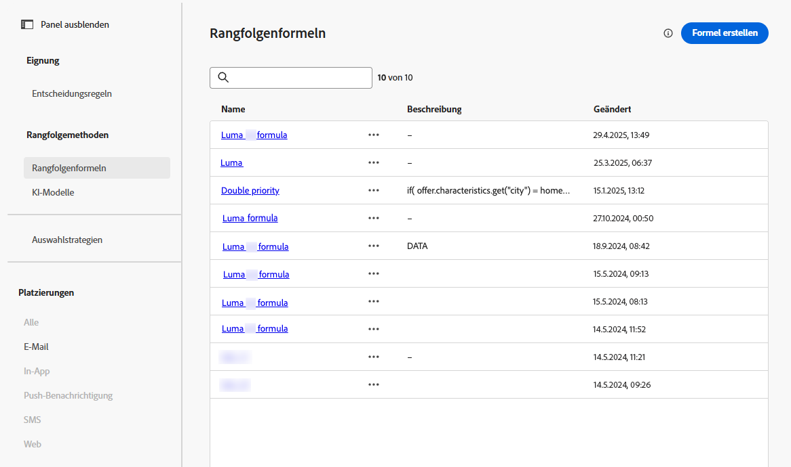

1. Klicken Sie auf **[!UICONTROL Formel erstellen]**.

1. Geben Sie den Namen der Formel an und fügen Sie bei Bedarf eine Beschreibung hinzu.

   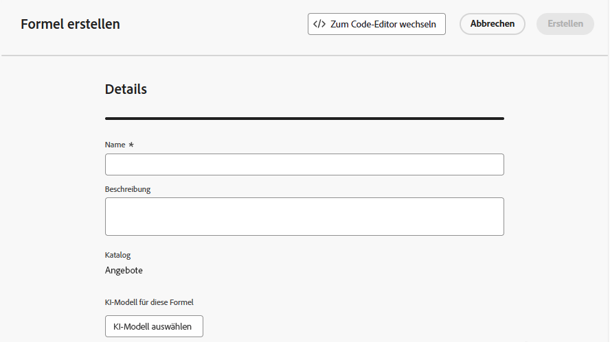{width="80%"}

1. Klicken Sie optional auf **[!UICONTROL KI-Modell auswählen]**, um das Modell festzulegen, das als Referenz zur Erstellung der Rangfolgenformel verwendet wird.

   Jedes Mal, wenn Sie bei der Definition Ihrer unten stehenden Formel auf eine Modellbewertung verweisen, wird das von Ihnen ausgewählte KI-Modell verwendet.

1. Definieren Sie die Bedingungen, die den Rangfolgewert für die übereinstimmenden Entscheidungselemente bestimmen. Sie haben folgende Möglichkeiten:

   * Füllen Sie den Abschnitt **[!UICONTROL Kriterien]** mit dem [Formel-Builder](#ranking-select-criteria) aus und/oder
   * Klicken Sie **[!UICONTROL Zum Code-Editor wechseln]**, um die Rangfolgelogik mit [PQL im Code-Editor zu definieren oder ](#ranking-code-editor).

## Verwenden von Adobe Experience Platform-Daten {#aep-data}

Im Abschnitt **[!UICONTROL Datensatzsuche]** können Sie Daten aus Adobe Experience Platform verwenden, um die Rangfolgelogik dynamisch anzupassen, um reale Bedingungen widerzuspiegeln.

Dies ist besonders nützlich bei Attributen, die sich häufig ändern, z. B. Produktverfügbarkeit oder Echtzeitpreise. [Informationen zum Verwenden von Adobe Experience Platform-Daten für die Entscheidungsfindung](../aep-data-exd.md)


## Definieren von Kriterien mithilfe des Formel-Builders {#ranking-select-criteria}

Definieren Sie **Kriterien** die den Rangfolgenwert für die übereinstimmenden Entscheidungselemente bestimmen.

Mit einer intuitiven Benutzeroberfläche können Sie durch die Anpassung von KI-Bewertungen (Tendenz), Angebotswert (Priorität), kontextuellen Hebeln und externen Profiltendenzen die Entscheidungsfindung einzeln oder in Kombination verfeinern, um jede Interaktion zu optimieren. <!--Whether you are maximizing revenue, promoting strategic offers, or balancing business goals with real-time context, the formula builder gives you total control in defining ranking strategies.-->

<!--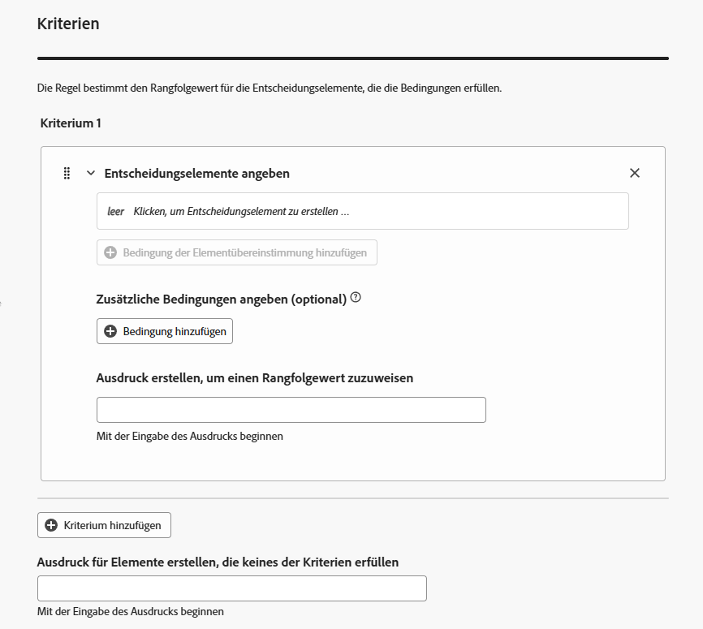{width="80%"}-->

1. Klicken Sie bei Bedarf auf **[!UICONTROL Zum Code-Editor wechseln]**, um einen Ausdruck hinzuzufügen, der die **PQL-Syntax**. Diese Option ergänzt die Felder in der Benutzeroberfläche in den folgenden Schritten, sodass Sie beide Ansätze in derselben Rangfolgenformel kombinieren können. Weitere Informationen zur Verwendung der PQL-Syntax finden Sie in der [ Dokumentation ](https://experienceleague.adobe.com/de/docs/experience-platform/segmentation/pql/overview). Die Syntax für Entscheidungselementattribute und Beispiele für das Kopieren und Einfügen finden Sie im Abschnitt [Verwenden des Code-Editors](#ranking-code-editor) .

   

   >[!NOTE]
   >
   >Durch den Wechsel zum Code-Editor werden Ihre Kriterien um ausdrucksbasierte Eingaben erweitert und die anderen Felder der Benutzeroberfläche werden nicht entfernt.

1. Geben Sie im Abschnitt **[!UICONTROL Kriterium 1]** die Entscheidungselemente an, auf die Sie einen Rangfolgenwert anwenden möchten, indem Sie Folgendes durchführen:
   * Wählen Sie ein [Entscheidungselement-Attribut](../items.md#attributes)
   * Logischen Operator auswählen
   * Übereinstimmende Bedingung hinzufügen - Sie können entweder einen Wert eingeben oder ein Profilattribut oder [Kontextdaten“ ](../context-data.md)

   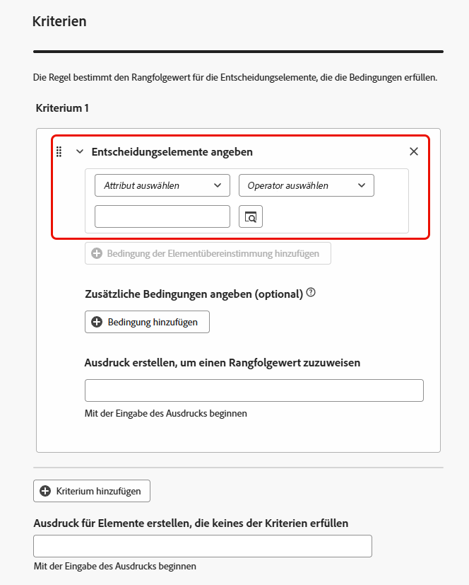{width="70%"}

1. Optional können Sie zusätzliche Elemente angeben, um die übereinstimmenden Bedingungen zu verfeinern, damit Ihre Kriterien erfüllt sind.

   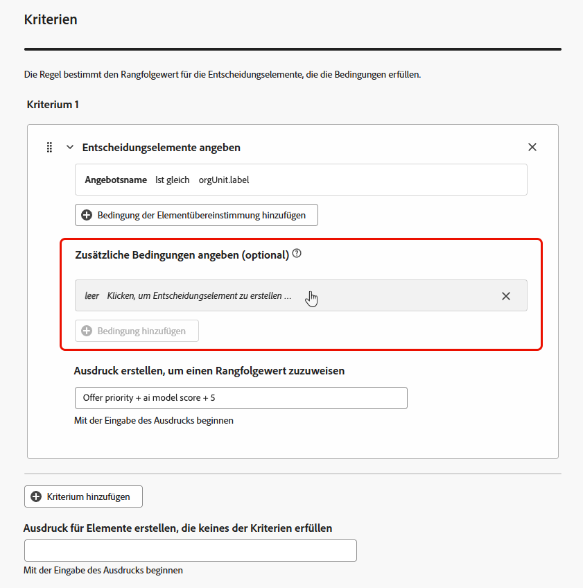{width="80%"}

   Sie haben beispielsweise Kriterium 1 so definiert: „Das benutzerdefinierte Attribut *Wetter* *ist gleich* der Bedingung *Warm*“. Darüber hinaus können Sie eine weitere Bedingung hinzufügen, z. B. wenn die erste Bedingung erfüllt ist und wenn die Temperatur zum Zeitpunkt der Anfrage 23 Grad überschreitet, dann ist Kriterium 1 wahr.<!--Add a screenshot with the example-->

1. Erstellen Sie einen Ausdruck, der den Entscheidungselementen, die die oben definierte Bedingung erfüllen, einen Rangfolgenwert zuweist. Sie können eine der folgenden Optionen referenzieren:

   * die Punktzahl, die aus dem KI-Modell hervorgegangen ist, das Sie optional im Abschnitt **[!UICONTROL Details]** [oben](#create-ranking-formula) ausgewählt haben;
   * die Priorität des Entscheidungselements, die ein Wert ist, der beim [Erstellen eines Entscheidungselements](../items.md#attributes) manuell zugewiesen wird; <!--If a profile qualifies for multiple decision items, a higher priority grants the item precedence over others.-->
   * alle Attribute, die im Profil live sein könnten, z. B. jede extern abgeleitete Tendenzbewertung;
   * ein statischer Wert, den Sie in einem freien Format zuweisen können;
   * jede Kombination der oben genannten Optionen

   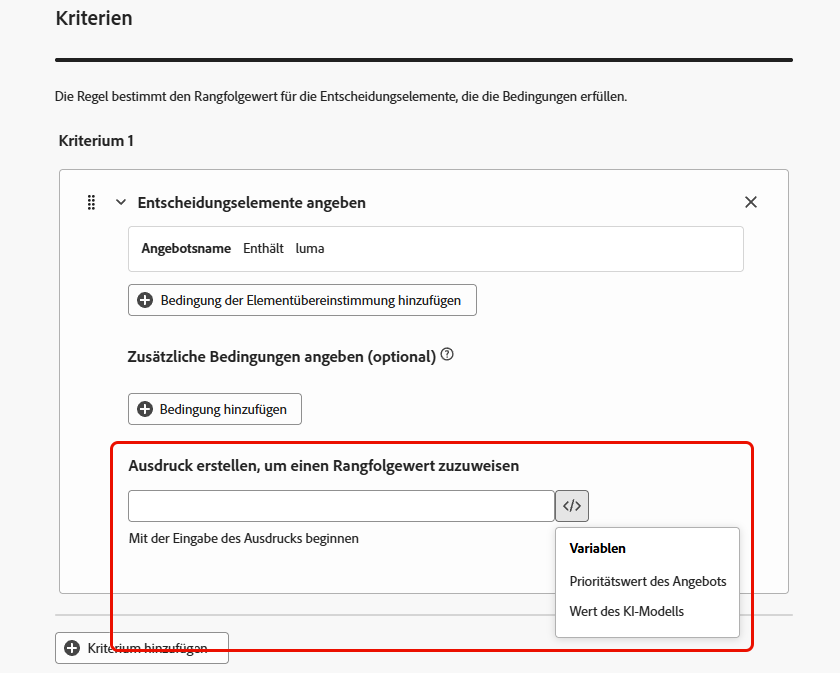{width="70%"}

   >[!NOTE]
   >
   >Klicken Sie auf das Symbol neben dem Feld, um vordefinierte Variablen hinzuzufügen.

1. Klicken Sie auf **[!UICONTROL Kriterium hinzufügen]**, um ein oder mehrere Kriterien beliebig oft hinzuzufügen. Es gilt folgende Logik:
   * Wenn das erste Kriterium für ein bestimmtes Entscheidungselement zutrifft, hat es Vorrang vor den nächsten Kriterien.
   * Wenn dies nicht der Fall ist, wechselt die Entscheidungs-Engine zum zweiten Kriterium usw.

1. Im letzten Feld können Sie einen Ausdruck erstellen, der allen Entscheidungselementen zugewiesen wird, die die oben genannten Kriterien nicht erfüllen.

   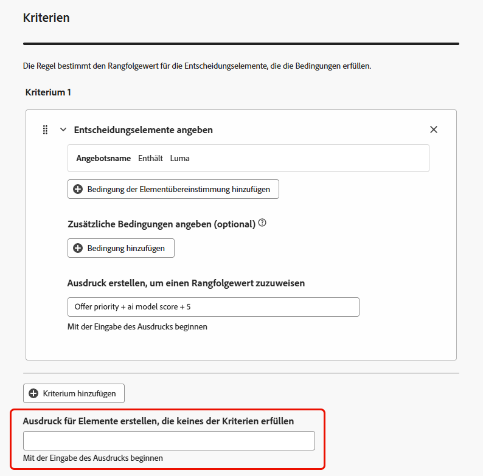{width="70%"}

   +++Beispiel für Rangfolgenformeln

   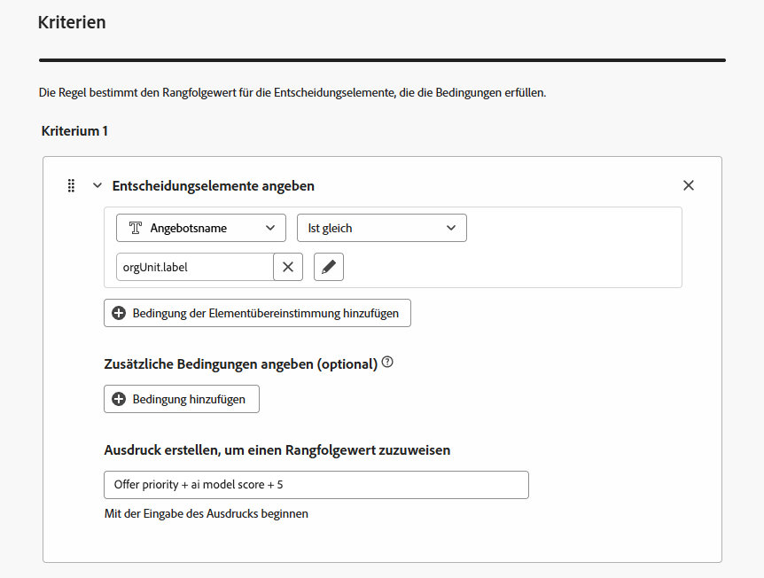{width="80%"}

   Wenn die Region des Entscheidungselements (benutzerdefiniertes Attribut) gleich dem geografischen Label des Profils (Profilattribut) ist, wird der hier ausgedrückte Rangfolgenwert (eine Kombination aus der Priorität des Entscheidungselements, dem Wert des KI-Modells und einem statischen Wert) auf alle Entscheidungselemente angewendet, die diese Bedingung erfüllen.

   +++

1. Wenn Ihre Formel fertig ist, klicken Sie auf **[!UICONTROL Erstellen]**.

Sie können jetzt über die Liste auf die Rangfolgenformel zugreifen, um ihre Details anzuzeigen und sie zu bearbeiten oder zu löschen. Sie kann in einer [Auswahlstrategie](../selection-strategies.md) verwendet werden, um die geeigneten Entscheidungselemente in einer Rangfolge zu ordnen.

## Definieren von Kriterien mit dem Code-Editor {#ranking-code-editor}

Verwenden Sie **[!UICONTROL Zum Code-Editor wechseln]** wenn Sie eine Rangfolgelogik als **PQL-Ausdruck schreiben** bearbeiten möchten.


>[!NOTE]
>
>Diese Aktion verhindert ein Zurückkehren zur Standard-Builder-Ansicht für diese Formel.

Sie können Profilattribute, [Kontextdaten](../context-data.md) und [Entscheidungselementattribute](../items.md#attributes) nutzen.

Sie möchten zum Beispiel die Priorität aller Angebote durch Hinzufügen des Attributs „heiß“ erhöhen, wenn das Wetter heiß ist. Zu diesem Zweck wurde **contextData.weather=hot** im Entscheidungsaufruf übergeben.

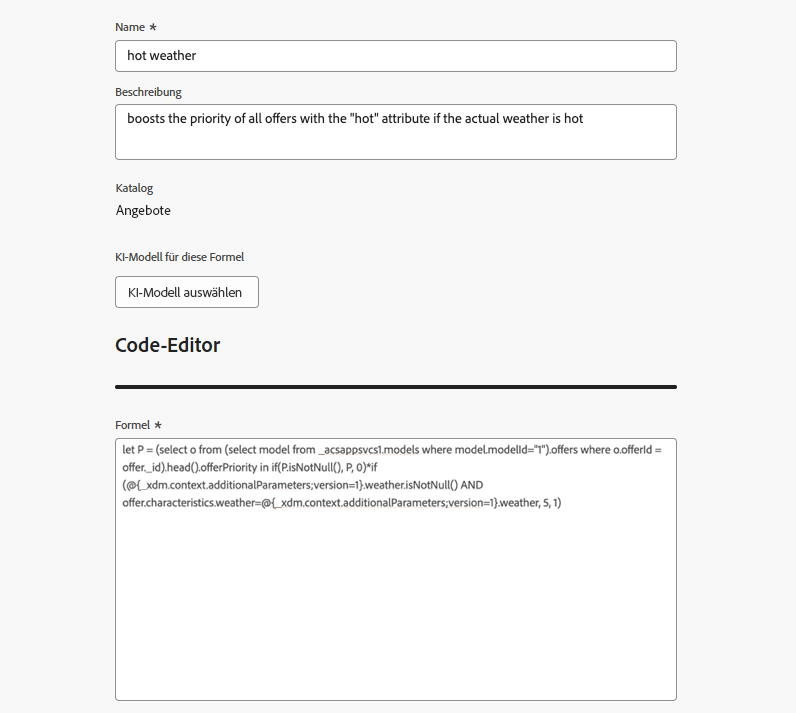{width="80%"}

Um Attribute im Zusammenhang mit Ihren Entscheidungselementen in Formeln zu nutzen, stellen Sie sicher, dass Sie die korrekte Syntax im Code Ihrer Rangfolgenformel befolgen. Erweitern Sie jeden Abschnitt, um weitere Informationen zu erhalten:

+++Verwenden von Standardattributen von Entscheidungselementen

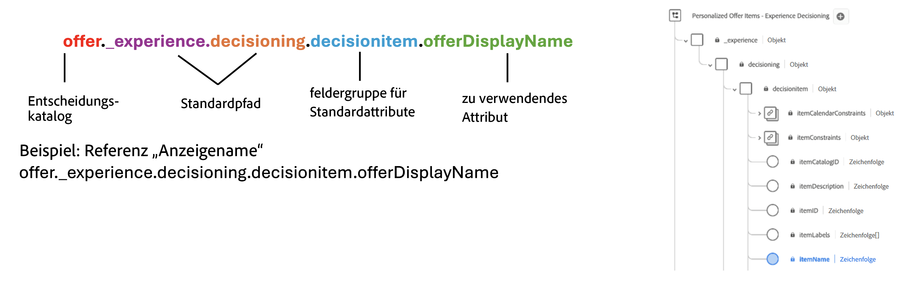

+++

+++Verwenden benutzerdefinierter Attribute von Entscheidungselementen

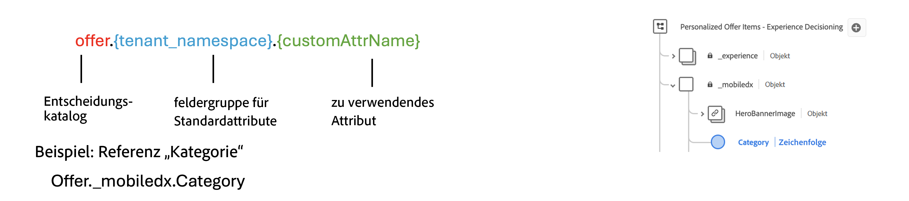

+++

Sie können je nach Bedarf viele verschiedene Code-basierte Rangfolgeformeln erstellen. Im Folgenden finden Sie einige Beispiele.

+++Verstärken von Angeboten mit bestimmten Angebotsattributen auf der Grundlage von Profilattributen

Wenn das Profil in der Stadt lebt, die dem Angebot entspricht, verdoppeln Sie die Priorität für alle Angebote in dieser Stadt.

**Rangfolgeformel:**

```
if( offer.characteristics.get("city") = homeAddress.city, offer.rank.priority * 2, offer.rank.priority)
```

+++

+++Verstärken von Angeboten, deren Enddatum in weniger als 24 Stunden liegt

**Rangfolgeformel:**

```
if( offer.selectionConstraint.endDate occurs <= 24 hours after now, offer.rank.priority * 3, offer.rank.priority)
```

+++

+++Verstärken von Angeboten entsprechend der Neigung der Kunden, das angebotene Produkt zu kaufen

Sie können die Punktzahl für ein Angebot basierend auf einem Tendenzwert für den Kunden erhöhen.

In diesem Beispiel lautet der Instanzmandant *_salesvelocity* und das Profilschema enthält einen Bereich von Werten, die in einem Array gespeichert sind:

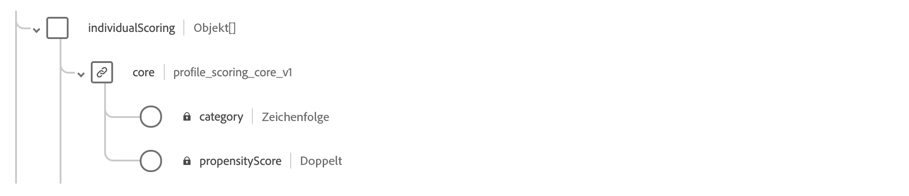

In diesem Fall für ein Profil wie:

```
{"_salesvelocity": {"individualScoring": [
                    {"core": {
                            "category":"insurance",
                            "propensityScore": 96.9
                        }},
                    {"core": {
                            "category":"personalLoan",
                            "propensityScore": 45.3
                        }},
                    {"core": {
                            "category":"creditCard",
                            "propensityScore": 78.1
                        }}
                    ]}
}
```

+++

+++Verstärken von Angeboten basierend auf der Postleitzahl und dem Jahreseinkommen eines Profils

In diesem Beispiel versucht das System immer zuerst, ein Angebot anzuzeigen, das mit der Postleitzahl übereinstimmt. Wenn keine Übereinstimmung gefunden wird, wird ein allgemeines Angebot verwendet und die Anzeige von Angeboten für andere Postleitzahlen wird vermieden.

```pql
if( offer._luma.offerDetails.zipCode = _luma.zipCode,luma.annualIncome / 1000 + 10000, if( not offer.luma.offerDetails.zipCode,_luma.annualIncome / 1000, -9999) )
```

Was die Formel bewirkt:

* Wenn das Angebot dieselbe Postleitzahl wie die Benutzerin bzw. der Benutzer hat, weisen Sie ihm eine sehr hohe Punktzahl zu, damit es zuerst ausgewählt wird.
* Wenn das Angebot überhaupt keine Postleitzahl hat (es handelt sich um ein allgemeines Angebot), geben Sie ihm eine normale Punktzahl, die auf dem Einkommen der Benutzerin bzw. des Benutzers basiert.
* Wenn das Angebot eine andere Postleitzahl hat als die Benutzerin bzw. der Benutzer, geben Sie ihm eine sehr niedrige Punktzahl, damit es nicht ausgewählt wird.

+++

+++Verstärken von Angeboten basierend auf Kontextdaten

Mit [!DNL Journey Optimizer] können Sie bestimmte Angebote basierend auf Kontextdaten verstärken, die beim Entscheidungsaufruf übergeben werden. Wenn beispielsweise `contextData.weather=hot` übergeben wird, muss die Priorität aller Angebote mit `attribute=hot` erhöht werden.

>[!NOTE]
>
>Weiterführende Informationen zum Übergeben von Kontextdaten<!-- using the **Edge Decisioning** and **Decisioning** APIs--> finden Sie in [diesem Abschnitt](../context-data.md).

Beachten Sie, dass bei Verwendung des **Decisioning**-API die Kontextdaten zum Profilelement im Anfragehauptteil hinzugefügt werden wie im folgenden Beispiel:

```
"xdm:profiles": [
{
    "xdm:identityMap": {
        "crmid": [
            {
            "xdm:id": "CRMID1"
            }
        ]
    },
    "xdm:contextData": [
        {
            "@type":"_xdm.context.additionalParameters;version=1",
            "xdm:data":{
                "xdm:weather":"hot"
            }
        }
    ]
    
}],
```

+++

## KI-gestützte Formeloptimierung {#optimize}

[!DNL Journey Optimizer] können Rangfolgeformeln automatisch analysieren und Vereinfachungen vorschlagen, die die ursprüngliche Logik beibehalten. Nur Formeln, deren PQL-Ausdruck größer als **2 KB** (UTF-8-kodiert) ist, sind zulässig. Kleinere Ausdrücke werden nicht analysiert. Wenn eine Vereinfachung gefunden wird, wird in der Liste neben dem Formelnamen ein roter Indikator angezeigt.

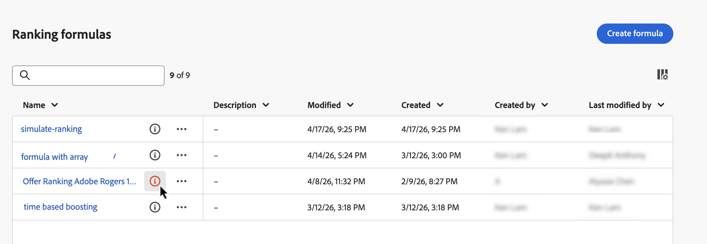

>[!NOTE]
>
>Die KI-gestützte Formeloptimierung stützt sich auf dieselben generativen KI-Funktionen wie **KI-Assistent** und verwendet dieselben Zugriffssteuerungen. Benutzern muss für die Ressource **[!UICONTROL KI-Assistent]** die Berechtigung **[!UICONTROL Inhalt generieren]** gewährt werden. Weitere Informationen finden Sie unter [Zugriff auf KI-Assistent](../../content-management/gs-generative.md#generative-access).

So optimieren Sie eine Rangfolgenformel:

1. Klicken Sie in der Liste der Rangfolgeformeln auf das rote Symbol neben dem Namen der Formel.

1. Das Fenster **[!UICONTROL Optimieren]** wird geöffnet, in dem der ursprüngliche PQL-Ausdruck zusammen mit der von KI vorgeschlagenen Version angezeigt wird.

   

1. Um zu überprüfen, ob beide Ausdrücke identische Ranking-Ergebnisse liefern, klicken Sie auf **[!UICONTROL Optimierungsanalyse herunterladen (TSV)]**, um eine Datei herunterzuladen, die zeigt, wie simulierte Profile für jede Version ausgewertet werden.

1. Wenn Sie zufrieden sind, klicken **[!UICONTROL auf]**, um den ursprünglichen Ausdruck durch den optimierten Ausdruck zu ersetzen.

## Anleitungsvideo {#video}

Erfahren Sie, wie Sie mit dem KI-gestützten Formel-Builder in Adobe Journey Optimizer Strategien zur benutzerdefinierten Angebotsrangfolge erstellen.

>[!VIDEO](https://video.tv.adobe.com/v/3464446/?learn=on&enablevpops)
