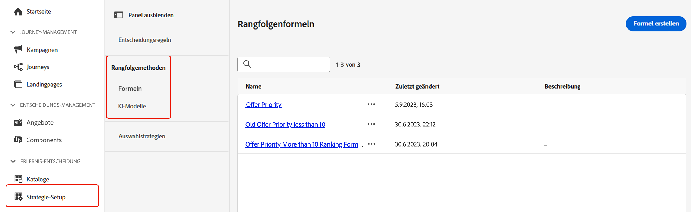

# Rangfolgenmethoden {#rankings}

Mit Rangfolgenmethoden können Elemente, die für ein bestimmtes Profil angezeigt werden sollen, nach Rang geordnet werden. Nachdem eine Rangfolgenmethode erstellt wurde, kann sie einer Entscheidungsstrategie zugewiesen werden, um festzulegen, welche Elemente zuerst ausgewählt werden sollen.

Es stehen zwei Arten von Rangfolgemethoden zur Verfügung:

* Mithilfe von **Formeln** kann festgelegt werden, welches Element zuerst angezeigt werden soll, anstatt die Prioritätswerte der Elemente zu berücksichtigen.

* **KI-Modelle** ermöglichen es, trainierte Modellsysteme zu verwenden, die mehrere Datenpunkte nutzen, um zu bestimmen, welches Element zuerst angezeigt werden soll.

## Erstellen von Rangfolgenmethoden {#create}

Gehen Sie wie folgt vor, um eine Rangfolgenmethode zu erstellen:

1. Navigieren Sie zum Menü **[!UICONTROL Strategie-Setup]** und wählen Sie dann das Menü **[!UICONTROL Formeln]** oder **[!UICONTROL KI-Modelle]** je nach dem Rangfolgentyp aus, den Sie verwenden möchten.

   

1. Klicken Sie oben rechts im Bildschirm auf die Schaltfläche **[!UICONTROL Formel erstellen]** oder **[!UICONTROL KI-Modell erstellen]**.

   Detaillierte Informationen zum Erstellen von Rangfolgenformeln und KI-Modellen finden Sie in den folgenden Abschnitten:

   * [Rangfolgenformeln](ranking-formulas.md)
   * [KI-Modelle](ai-models.md)

1. Konfigurieren Sie die Formel oder das KI-Modell entsprechend Ihren Anforderungen und speichern Sie die Formel bzw. das Modell dann.

Ihre Rangfolgenmethode kann nun in einer [Auswahlstrategie](../selection-strategies.md) verwendet werden, um die geeigneten Entscheidungselemente zu ordnen.

