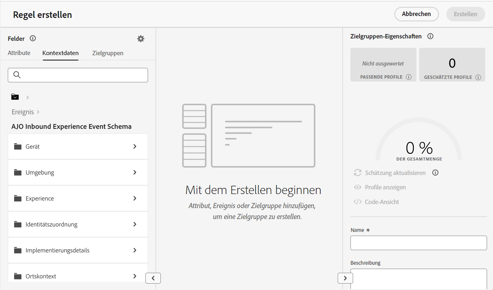

# Entscheidungsregeln {#rules}

>[!CONTEXTUALHELP]
>id="ajo_exd_config_rules"
>title="Erstellen von Entscheidungsregeln"
>abstract="Entscheidungsregeln ermöglichen es, die Zielgruppe für Entscheidungselemente zu definieren, indem Einschränkungen angewendet werden, entweder direkt auf der Entscheidungselementebene oder innerhalb einer bestimmten Auswahlstrategie. Dadurch kann genauer gesteuert werden, welche Artikel wem präsentiert werden sollen."

>[!BEGINSHADEBOX „Was Sie in diesem Dokumentationshandbuch finden“]

* [Erste Schritte mit Experience Decisioning](gs-experience-decisioning.md)
* Verwalten Ihrer Entscheidungselemente: [Konfigurieren des Elementkatalogs](catalogs.md) – [Erstellen von Entscheidungselementen](items.md) – [Verwalten von Elementsammlungen](collections.md)
* Konfigurieren der Elementauswahl: **[Erstellen von Entscheidungsregeln](rules.md)** – [Erstellen von Ranking-Methoden](ranking.md)
* [Erstellen von Auswahlstrategien](selection-strategies.md)
* [Erstellen von Entscheidungsrichtlinien](create-decision.md)

>[!ENDSHADEBOX]

Entscheidungsregeln ermöglichen es, die Zielgruppe für Entscheidungselemente zu definieren, indem Einschränkungen angewendet werden, entweder direkt auf der Entscheidungselementebene oder innerhalb einer bestimmten Auswahlstrategie. Dadurch kann genauer gesteuert werden, welche Artikel wem präsentiert werden sollen.

Nehmen wir beispielsweise ein Szenario, in dem Entscheidungselemente mit Yoga-bezogenen Produkten für Frauen vorhanden sind. Mit Entscheidungsregeln kann z. B. festgelegt werden, dass diese Elemente nur für Profile angezeigt werden sollen, deren Geschlecht „weiblich“ ist und die „Yoga“ als einen „Zielpunkt“ angegeben haben.

>[!NOTE]
>
>Zusätzlich zu den Entscheidungsregeln auf Element- und Auswahlstrategieebene können Sie auch Ihre gewünschte Zielgruppe auf Kampagnenebene definieren. [Weitere Informationen](../campaigns/create-campaign.md#audience)

Die Liste der Entscheidungsregeln ist im Menü **[!UICONTROL Entscheidungsregeln]** unter **[!UICONTROL Konfiguration]** verfügbar.

## Erstellen einer Entscheidungsregel {#create}

Gehen Sie wie folgt vor, um eine Entscheidungsregel zu erstellen:

1. Navigieren Sie zu **[!UICONTROL Konfiguration]** > **[!UICONTROL Entscheidungsregeln]** und klicken Sie auf die Schaltfläche **[!UICONTROL Regel erstellen]**.

1. Der Bildschirm zur Erstellung von Entscheidungsregeln wird geöffnet. Benennen Sie Ihre Regel und geben Sie eine Beschreibung an.

1. Erstellen Sie die Entscheidungsregel nach Ihren Bedürfnissen mit dem Adobe Experience Platform Segment Builder. Zu diesem Zweck können Sie verschiedene Datenquellen wie Profilattribute, Zielgruppen oder Kontextdaten aus Adobe Experience Platform nutzen. [Lernen Sie, wie Sie Kontextdaten in Entscheidungsregeln nutzen können](#context-data)

   

   >[!NOTE]
   >
   >Der zum Erstellen von Entscheidungsregeln bereitgestellte Segment Builder weist einige Besonderheiten im Vergleich zum Experience Platform-Segmentierungs-Service auf. Das in der Dokumentation beschriebene globale Verfahren gilt jedoch weiter, um Entscheidungsregeln zu erstellen. [Weitere Informationen zum Erstellen von Segmentdefinitionen](../audience/creating-a-segment-definition.md)

1. Während Sie neue Felder im Arbeitsbereich hinzufügen und konfigurieren, zeigt der Bereich **[!UICONTROL Zielgruppeneigenschaften]** Informationen zur geschätzten Anzahl der zur Zielgruppe gehörenden Profile an. Klicken Sie auf **[!UICONTROL Schätzung aktualisieren]**, um diese Daten zu aktualisieren.

   >[!NOTE]
   >
   >Profilschätzungen sind nicht verfügbar, wenn Regelparameter Daten enthalten, die nicht im Profil enthalten sind, z. B. Kontextdaten.

1. Sobald Ihre Entscheidungsregel fertig ist, klicken Sie auf **[!UICONTROL Speichern]**. Die erstellte Regel erscheint in der Liste und kann in Entscheidungselementen und Auswahlstrategien verwendet werden, um die Präsentation von Entscheidungselementen in Profilen zu steuern.

## Nutzung von Kontextdaten in Entscheidungsregeln {#context-data}

Auf dem Bildschirm zur Erstellung von Erlebnis-Entscheidungsregeln können Sie alle in Adobe Experience Platform verfügbaren Informationen nutzen, um Entscheidungsregeln zu erstellen. Sie können zum Beispiel eine Entscheidungsregel entwerfen, die verlangt, dass die aktuelle Temperatur höher als 25 °C sein muss.

Dazu müssen Sie zunächst definieren, welche Daten Sie in der Erlebnis-Entscheidung zur Verfügung stellen wollen. Sobald dies geschehen ist, werden diese Daten nahtlos in die Erlebnis-Entscheidung auf der Registerkarte **[!UICONTROL Kontextdaten]** integriert, die beim Erstellen einer Entscheidungsregel verfügbar ist.

Hier erfahren Sie, wie Sie die Erlebnis-Entscheidung mit Daten aus Adobe Experience Platform versorgen können:

1. Erstellen Sie ein **Erlebnisereignis-Schema** in Adobe Experience Platform und den dazugehörigen **Datensatz**. [Lernen Sie, wie man Schemata erstellt](https://experienceleague.adobe.com/de/docs/experience-platform/xdm/ui/resources/schemas){target="_blank"}

1. So erstellen Sie einen neuen Adobe Experience Platform-Datenstrom:

   1. Navigieren Sie zum Menü **[!UICONTROL Datenströme]** und wählen Sie **[!UICONTROL Neuer Datenstrom]**.

   1. Wählen Sie in der Dropdown-Liste **[!UICONTROL Ereignisschema]** das zuvor erstellte Erlebnis-Ereignisschema aus und klicken Sie auf **[!UICONTROL Speichern]**.

      

   1. Klicken Sie auf **[!UICONTROL Dienst hinzufügen]** und wählen Sie „Adobe Experience Platform“ als Dienst. Wählen Sie in der Dropdown-Liste **[!UICONTROL Ereignisdatensatz]** den zuvor erstellten Ereignisdatensatz und aktivieren Sie die Option **[!UICONTROL Adobe Journey Optimizer]**.

      

Sobald der Datenstrom gespeichert ist, werden die Informationen des ausgewählten Datensatzes automatisch abgerufen und in die Erlebnis-Entscheidung integriert. In der Regel sind sie innerhalb von etwa 24 Stunden verfügbar.

Weitere Anleitungen für die Arbeit mit Adobe Experience Platform finden Sie in den folgenden Ressourcen:

* [Schemata für das Experience-Datenmodell (XDM)](https://experienceleague.adobe.com/de/docs/experience-platform/xdm/schema/composition){target="_blank"}
* [Datensätze](https://experienceleague.adobe.com/de/docs/experience-platform/catalog/datasets/overview){target="_blank"}
* [Datenströme](https://experienceleague.adobe.com/de/docs/experience-platform/datastreams/overview){target="_blank"}
