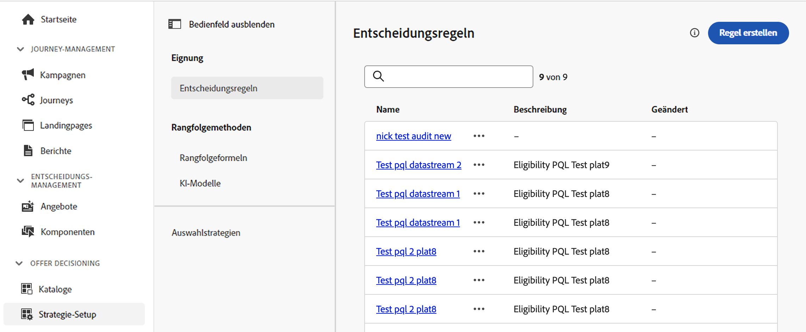

# Entscheidungsregeln {#rules}

>[!CONTEXTUALHELP]
>id="ajo_exd_config_rules"
>title="Erstellen von Entscheidungsregeln"
>abstract="Entscheidungsregeln ermöglichen es, die Zielgruppe für Entscheidungselemente zu definieren, indem Einschränkungen angewendet werden, entweder direkt auf der Entscheidungselementebene oder innerhalb einer bestimmten Auswahlstrategie. Dadurch kann genauer gesteuert werden, welche Artikel wem präsentiert werden sollen."

>[!BEGINSHADEBOX &quot;Was Sie in diesem Handbuch finden werden&quot;]

* [Erste Schritte mit Offer Decisioning](gs-experience-decisioning.md)
* Verwalten Sie Ihre Entscheidungselemente: [Konfigurieren des Elementkatalogs](catalogs.md) - [Erstellen von Entscheidungselementen](items.md) - [Verwalten von Elementsammlungen](collections.md)
* Konfigurieren der Elementauswahl: **[Entscheidungsregeln erstellen](rules.md)** - [Erstellen von Ranking-Methoden](ranking.md)
* [Erstellen von Auswahlstrategien](selection-strategies.md)
* [Erstellen von Entscheidungsrichtlinien](create-decision.md)

>[!ENDSHADEBOX]

Entscheidungsregeln ermöglichen es, die Zielgruppe für Entscheidungselemente zu definieren, indem Einschränkungen angewendet werden, entweder direkt auf der Entscheidungselementebene oder innerhalb einer bestimmten Auswahlstrategie. Dadurch kann genauer gesteuert werden, welche Artikel wem präsentiert werden sollen.

Nehmen wir beispielsweise ein Szenario, in dem Entscheidungselemente mit Yoga-bezogenen Produkten für Frauen vorhanden sind. Mit Entscheidungsregeln kann festgelegt werden, dass diese Elemente nur für Profile angezeigt werden sollen, deren Geschlecht „weiblich“ ist und die „Yoga“ als einen „Zielpunkt“ angegeben haben.

>[!NOTE]
>
>Zusätzlich zu den Entscheidungsregeln auf Element- und Auswahlstrategieebene können Sie auch Ihre gewünschte Zielgruppe auf Kampagnenebene definieren. [Weitere Informationen](../campaigns/create-campaign.md#audience)

Die Liste der Entscheidungsregeln ist unter **[!UICONTROL Konfiguration]** im Menü **[!UICONTROL Entscheidungsregeln]** verfügbar.

<!---->

>[!IMPORTANT]
>
>Vorerst werden Entscheidungsregeln in Journey Optimizer mithilfe des Menüs **Entscheidungs-Management** verwaltet. Daher umfasst die Liste **[!UICONTROL Entscheidungsregeln]** im Offer Decisioning Regeln, die entweder aus dem Menü **[!UICONTROL Entscheidungs-Management]** oder aus dem Menü **[!UICONTROL Offer Decisioning]** in Journey Optimizer erstellt wurden.

Gehen Sie wie folgt vor, um eine Regel zu erstellen:

1. Navigieren Sie zu **[!UICONTROL Konfiguration]** > **[!UICONTROL Entscheidungsregeln]**.
1. Die Benutzeroberfläche für das Entscheidungs-Management von Journey Optimizer wird im zentralen Bereich angezeigt. Folgen Sie den Schritten, die in der [Dokumentation zum Entscheidungs-Management](../offers/offer-library/creating-decision-rules.md) beschrieben sind, um Ihre Regel auf der Grundlage Ihrer Anforderungen zu erstellen.

1. Nachdem die Regel erstellt wurde, wird sie in der Liste angezeigt. Sie kann dann in Entscheidungselementen und Auswahlstrategien eingesetzt werden, um die Präsentation von Entscheidungselementen in Profilen zu steuern.
