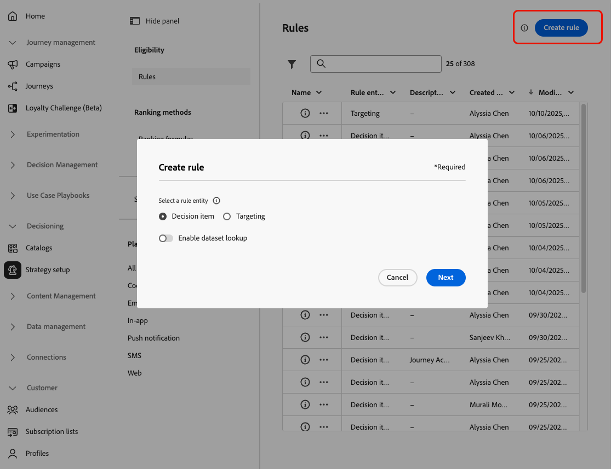

# Regeln erstellen {#rules}

>[!CONTEXTUALHELP]
>id="ajo_exd_config_rules"
>title="Erstellen von Regeln"
>abstract="Sie können zwei Regeltypen erstellen: **Entscheidungsregeln** die in Entscheidungselementen oder Auswahlstrategien verwendet werden können, um zu steuern, welche Elemente welcher Zielgruppe unterbreitet werden sollen, oder **Targeting-Regeln** um bestimmte Zielgruppensegmente zu bestimmen, die für den Empfang personalisierter Inhalte geeignet sind, oder um einen bestimmten Journey-Pfad einzugeben.  Beim Erstellen einer Entscheidungsregel können Sie „Datensatzsuche aktivieren **[!UICONTROL auswählen,]** Adobe Experience Platform-Daten zu verwenden. Dadurch können Sie Eignungskriterien definieren, die auf dynamischen, externen Attributen basieren, sodass Entscheidungselemente nur angezeigt werden, wenn sie relevant sind."

## Über Regeln {#about}

In [!DNL Journey Optimizer] können Sie zwei Arten wiederverwendbarer Regeln erstellen:

* [Entscheidungsregeln](#decision-rules)
* [Zielgruppenbestimmungsregeln](#targeting-rules)

### Entscheidungsregeln {#decision-rules}

Entscheidungsregeln ermöglichen es Ihnen, die Audience für Entscheidungselemente zu definieren, indem Sie Einschränkungen anwenden, entweder direkt auf der Entscheidungselementebene oder innerhalb einer bestimmten Auswahlstrategie. Dadurch kann genauer gesteuert werden, welche Artikel wem präsentiert werden sollen.

Nehmen wir beispielsweise ein Szenario, in dem Entscheidungselemente mit Yoga-bezogenen Produkten für Frauen vorhanden sind. Mit Entscheidungsregeln kann z. B. festgelegt werden, dass diese Elemente nur für Profile angezeigt werden sollen, deren Geschlecht „weiblich“ ist und die „Yoga“ als einen „Zielpunkt“ angegeben haben.

>[!NOTE]
>
>Zusätzlich zu den Entscheidungsregeln auf Element- und Auswahlstrategieebene können Sie auch Ihre gewünschte Zielgruppe auf Kampagnenebene definieren. [Weitere Informationen](../campaigns/create-campaign.md#audience)

### Zielgruppenbestimmungsregeln {#targeting-rules}

>[!AVAILABILITY]
>
>Zielgruppenbestimmungsregeln sind derzeit nur eingeschränkt verfügbar. Wenden Sie sich an den Adobe-Support, um Zugriff zu erhalten.
>
>Beachten Sie, dass diese Funktion nur für Organisationen verfügbar ist, die das Add-on **Decisioning** erworben haben. Er wird nach und nach für alle Kunden eingeführt.

Mit Zielgruppenbestimmungsregeln können spezifische Qualifikationen festgelegt werden, die eine Kundin oder ein Kunde erfüllen muss, um für den Erhalt personalisierter Inhalte oder die Eingabe eines bestimmten Journey-Pfads berechtigt zu sein. Diese Regeln basieren auf bestimmten Zielgruppensegmenten, mit denen Sie Unterzielgruppen in Ihren Journey und Kampagnen ansprechen können.

Häufig handelt es sich dabei um eine Kombination mehrerer Attribute zusätzlich zu Kundenverhaltensereignissen und Kontextdaten. Um Zeit und Aufwand zu sparen, können Sie Targeting-Regeln einmal erstellen und dann in Ihren Journey und Kampagnen wiederverwenden, sodass Sie sie zum Zeitpunkt der Erstellung schnell inline ändern können.

Sie können die folgenden Regeln verwenden:

* Beim Erstellen [Zielgruppenbestimmung zur Inhaltsoptimierung](../campaigns/campaigns-message-optimization.md#targeting) in Journey oder Kampagnen;
* Beim Erstellen der [Journey-Pfadoptimierung](../building-journeys/optimize.md#targeting).

➡️ [Funktion im Video kennenlernen](#video)

## Zugriff auf Regeln {#access}

Die Liste der Regeln ist im Menü **[!UICONTROL Entscheidungsfindung]** > **[!UICONTROL Strategie einrichten]** verfügbar.

Die folgenden Aktionen sind verfügbar:

* Sie können nach der Regelentität filtern **[!UICONTROL Entscheidungselement]** oder **[!UICONTROL Targeting]** - [Weitere Informationen](#about).

* Wählen Sie eine Regel aus, indem Sie auf ihren Namen klicken, und bearbeiten Sie sie mit dem Regel-Builder. [Weitere Informationen](#create)

* Über die Schaltfläche **[!UICONTROL Mehr Aktionen]** neben jedem Element haben Sie folgende Möglichkeiten:

   * Wenn Sie die Entität **[!UICONTROL Entscheidungselement]** ausgewählt haben, fügen Sie die Regel einem Paket hinzu, um sie in eine andere Sandbox zu exportieren. Erfahren Sie, wie [&#x200B; Objekte in eine andere Sandbox exportieren &#x200B;](../configuration/copy-objects-to-sandbox.md).
   * Duplizieren Sie eine Regel.
   * Löschen einer Regel.

{width=100%}

* Klicken Sie auf das Symbol **[!UICONTROL Weitere Informationen]**, um die Formel anzuzeigen, aus der die Regel besteht.

{width=60%}

## Erstellen einer Regel {#create}

Gehen Sie wie folgt vor, um eine Regel zu erstellen:

1. Navigieren Sie zu **[!UICONTROL Decisioning]** > **[!UICONTROL Strategie einrichten]** > **[!UICONTROL Regeln]** und klicken Sie dann auf die Schaltfläche **[!UICONTROL Regel erstellen]**.

1. Wählen Sie die Regelentität aus, um anzugeben, für welchen Objekttyp die Regel erstellt werden soll.

   {width=90%}

   * **[!UICONTROL Entscheidungselement]** - Die Regel kann auf ein [Entscheidungselement](#decision-rules) im Kontext von Entscheidungsfindung angewendet werden;
   * **[!UICONTROL Targeting]** - Die Regel kann beim Erstellen von [Targeting](#targeting-rules)-Regeln verwendet werden, entweder im Rahmen der [Inhaltsoptimierung](../campaigns/campaigns-message-optimization.md#targeting) in einer Kampagne oder einer Journey, entweder in der [Journey optimieren](../building-journeys/optimize.md#targeting).

1. Wenn Sie eine Regel **[!UICONTROL Entscheidungselement]** erstellen, können Sie **[!UICONTROL Datensatzsuche aktivieren]** auswählen, um Daten aus Adobe Experience Platform zur Anreicherung Ihrer Entscheidungslogik mit externen Daten zu verwenden. Dies ist besonders nützlich bei Attributen, die sich häufig ändern, beispielsweise die Produktverfügbarkeit oder Echtzeitpreise.

   >[!AVAILABILITY]
   >
   >Diese Funktion steht derzeit allen Kundinnen und Kunden als öffentliche Beta-Version zur Verfügung. Wenden Sie sich an Ihren Kontakt in der Kundenbetreuung, wenn Sie Zugriff wünschen. [Informationen zum Verwenden von Adobe Experience Platform-Daten für die Entscheidungsfindung](../experience-decisioning/aep-data-exd.md)

1. Der Bildschirm zur Regelerstellung wird geöffnet. Benennen Sie Ihre Regel und geben Sie eine Beschreibung an.

1. Erstellen Sie mit dem Segment Builder von Adobe Experience Platform die Regel entsprechend Ihren Anforderungen. Dazu können verschiedene Datenquellen genutzt werden, z. B.:
   * Profilattribute;
   * Entscheidungselement-Attribute - nur beim Erstellen einer Regel **[!UICONTROL Entscheidungselement]** verfügbar;
   * Zielgruppen;
   * Kontextdaten von Adobe Experience Platform. [Weitere Informationen zur Nutzung von Kontextdaten](context-data.md)

   {width=85%}

   >[!NOTE]
   >
   >Der zum Erstellen von Regeln bereitgestellte Segment Builder weist einige Besonderheiten im Vergleich zum Segmentierungs-Service von Adobe Experience Platform auf. Der in der Dokumentation beschriebene globale Prozess gilt jedoch für das Erstellen von Regeln in [!DNL Journey Optimizer]. [Weitere Informationen zum Erstellen von Segmentdefinitionen](../audience/creating-a-segment-definition.md)

1. Während Sie neue Felder im Arbeitsbereich hinzufügen und konfigurieren, zeigt der Bereich **[!UICONTROL Zielgruppeneigenschaften]** Informationen zur geschätzten Anzahl der zur Zielgruppe gehörenden Profile an. Klicken Sie auf **[!UICONTROL Schätzung aktualisieren]**, um diese Daten zu aktualisieren.

   {width=85%}

   >[!NOTE]
   >
   >Profilschätzungen sind nicht verfügbar, wenn die Regelparameter Daten enthalten, die nicht im Profil gespeichert sind, z. B. Kontextdaten.

1. Sobald Ihre Regel fertig ist, klicken Sie auf **[!UICONTROL Erstellen]**. Die erstellte Regel wird in der Liste angezeigt und steht je nach der von Ihnen erstellten Entität zur Verwendung zur Verfügung:

   * in **Entscheidungspunkten** und **Auswahlstrategien** für die Präsentation von Entscheidungselementen für Profile;
   * Oder beim Erstellen von **Targeting** in der Inhaltsoptimierung oder Pfadoptimierung.

>[!NOTE]
>
>Die Verschachtelungstiefe in einer Regel ist auf 30 Ebenen begrenzt. Dies wird durch die Zählung der schließenden Klammern gemessen, die in der PQL-Zeichenfolge `)` sind.
>
>Eine Regelzeichenfolge kann für UTF-8-kodierte Zeichen bis zu 15 KB groß sein. Das entspricht 15.000 ASCII-Zeichen (jeweils 1 Byte) oder 3.750 bis 7.500 Nicht-ASCII-Zeichen (jeweils 2 bis 4 Byte).
>
>[Erfahren Sie mehr über Eignungsregeln, Leitplanken und Einschränkungen](decisioning-guardrails.md#eligibility-rules)

## Anleitungsvideo {#video}

Erfahren Sie, wie Sie wiederverwendbare **Targeting-Regeln** in Adobe Journey Optimizer erstellen, duplizieren und anwenden, um Kampagnen effizient auf der Grundlage von Kundenattributen wie Region, Sprache und Verhalten zu personalisieren und so Zeit zu sparen und gleichzeitig die Genauigkeit der Zielgruppe zu verbessern.

>[!VIDEO](https://video.tv.adobe.com/v/3476127/?quality=12)
