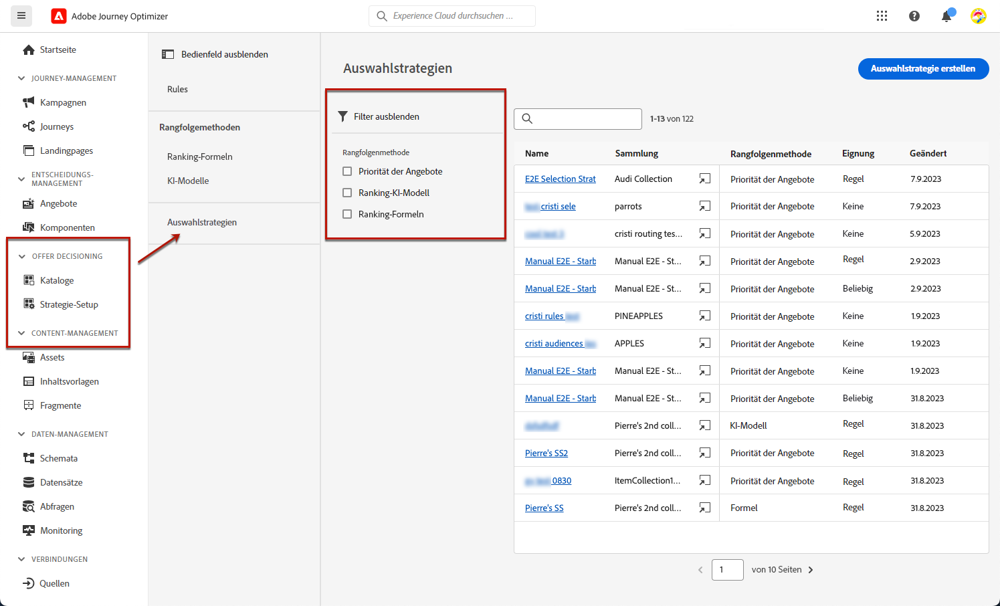
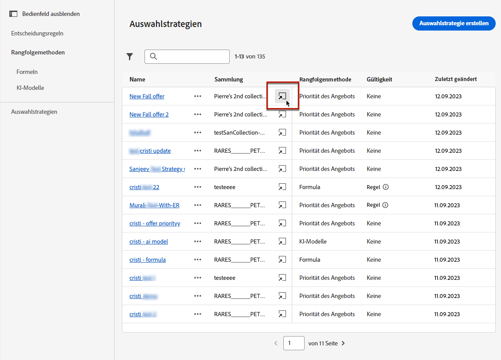
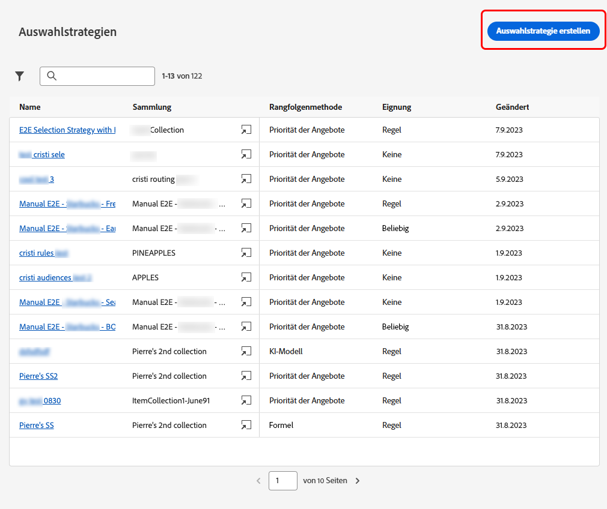
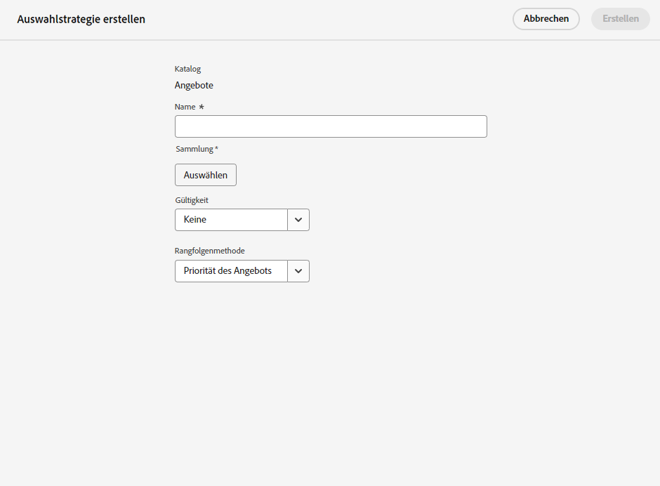
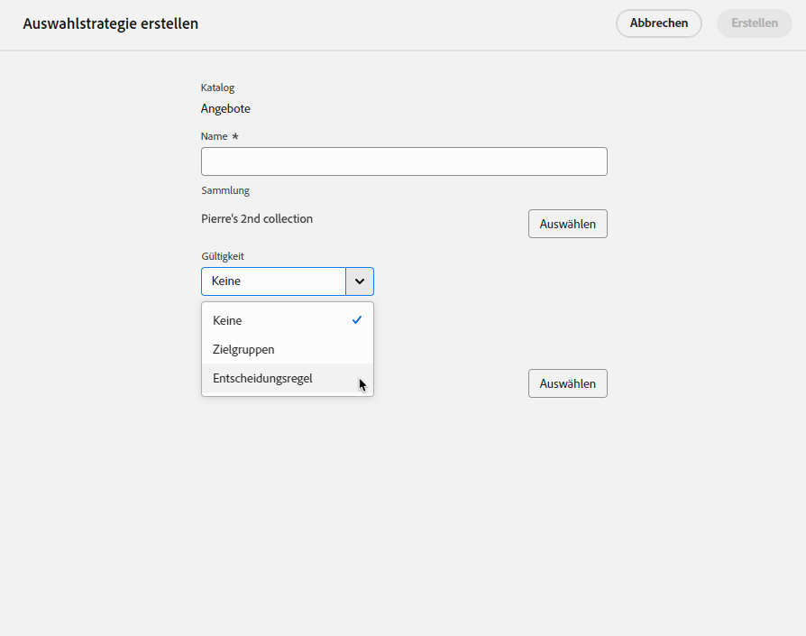
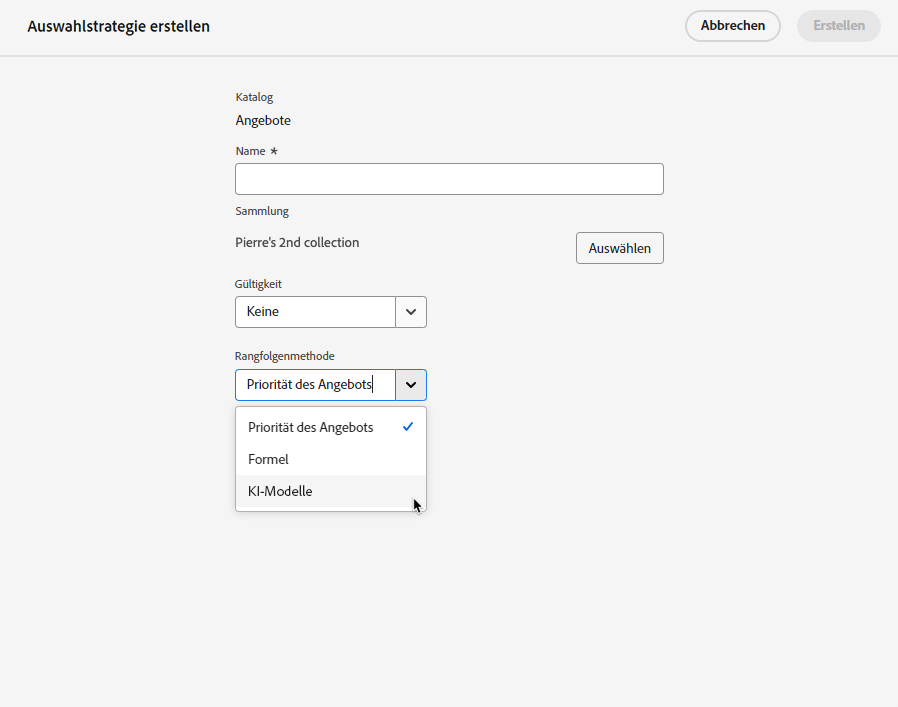
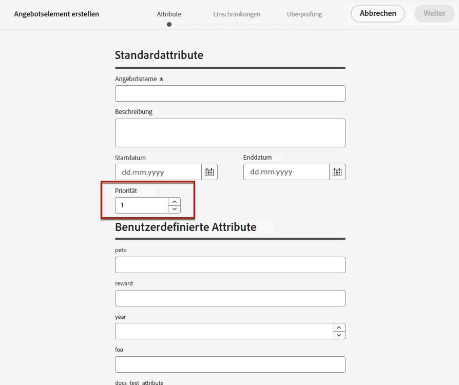

# Erstellen von Auswahlstrategien {#selection-strategies}

>[!CONTEXTUALHELP]
>id="ajo_exd_config_strategies"
>title="Definieren von Auswahlstrategien"
>abstract="Eine Auswahlstrategie ist ein wiederverwendbares Element, das sich zusammensetzt aus einer Sammlung, die mit einer Eignungsbegrenzung verknüpft ist, und einer Rangfolgenmethode, mit der bestimmt wird, welche Angebote angezeigt werden, wenn sie in einer Entscheidungsrichtlinie ausgewählt sind."
>additional-url="https://experienceleague.adobe.com/docs/journey-optimizer/using/experience-decisioning/create-decision.html?lang=de" text="Erstellen von Entscheidungsrichtlinien"

>[!CONTEXTUALHELP]
>id="ajo_exd_strategy_eligibility"
>title="Eingrenzen der qualifizierten Profile"
>abstract="Sie können die Auswahl der Angebote für diese Auswahlstrategie einschränken. Standardmäßig sind alle Profile qualifiziert. Sie können jedoch Zielgruppen oder Regeln verwenden, um die Angebotsauswahl auf bestimmte Profile zu beschränken."
>additional-url="https://experienceleague.adobe.com/docs/journey-optimizer/using/audiences-profiles-identities/audiences/about-audiences.html?lang=de" text="Verwenden von Zielgruppen"
>additional-url="https://experienceleague.adobe.com/docs/journey-optimizer/using/experience-decisioning/selection/rules.html?lang=de" text="Verwenden von Entscheidungsregeln"

>[!BEGINSHADEBOX]

Inhalt dieses Dokumentationshandbuchs:

* [Erste Schritte mit Offer Decisioning](gs-experience-decisioning.md)
* Verwalten Ihrer Entscheidungselemente
   * [Konfigurieren des Elementkatalogs](catalogs.md)
   * [Erstellen von Entscheidungselementen](items.md)
   * [Verwalten von Elementsammlungen](collections.md)
* Konfigurieren der Elementauswahl
   * [Erstellen von Entscheidungsregeln](rules.md)
   * [Erstellen von Rangfolgemethoden](ranking.md)
* **[Erstellen von Auswahlstrategien](selection-strategies.md)**
* [Erstellen von Entscheidungsrichtlinien](create-decision.md)

>[!ENDSHADEBOX]

Eine Auswahlstrategie ist ein wiederverwendbares Element, das aus einer Sammlung besteht, die mit einer Eignungsbegrenzung verknüpft ist, und einer Rangfolgenmethode, mit der bestimmt wird, welche Angebote angezeigt werden, wenn sie in einer [Entscheidungsrichtlinie](create-decision.md) ausgewählt sind.

## Zugreifen auf und Verwalten von Auswahlstrategien

1. Navigieren Sie zu **[!UICONTROL Erlebnisentscheidungen]** > **[!UICONTROL Konfiguration]** > **[!UICONTROL Auswahlstrategien]**.

1. Es werden alle Auswahlstrategien aufgelistet, die bisher erstellt wurden. Es stehen Filter zur Verfügung, mit denen Sie Strategien gemäß der Rangfolgenmethode abrufen können.

   

1. Klicken Sie auf den Namen einer Auswahlstrategie, um sie zu bearbeiten.

1. Es werden auch die Sammlung, Rangfolgenmethode und Eignung angezeigt, die für jede Strategie ausgewählt wurden. Sie können auf das Symbol neben jedem Sammlungsnamen klicken, um eine Sammlung direkt zu bearbeiten.

   

## Erstellen einer Auswahlstrategie

Gehen Sie wie folgt vor, um eine neue Auswahlstrategie zu erstellen.

1. Klicken Sie im Bestand der **[!UICONTROL Auswahlstrategien]** auf **[!UICONTROL Auswahlstrategie erstellen]**.

   

1. Fügen Sie einen Namen für Ihre Strategie hinzu.

   >[!NOTE]
   >
   >Derzeit ist nur der Standardkatalog für **[!UICONTROL Angebote]** verfügbar.

1. Füllen Sie die Details für Ihre Auswahlstrategie aus, beginnend mit dem Namen.

   

1. Wählen Sie die [Sammlung](collections.md) aus, die die zu berücksichtigenden Angebote enthält.

1. Verwenden Sie das Feld **[!UICONTROL Eignung]**, um die Auswahl der Angebote für diese Platzierung zu beschränken.

   

   * Um die Angebotsauswahl auf die Mitglieder einer Experience Platform-Zielgruppe zu beschränken, wählen Sie **[!UICONTROL Zielgruppen]** aus und wählen Sie dann eine Zielgruppe aus der Liste. [Erfahren Sie, wie Sie mit Zielgruppen arbeiten können](../audience/about-audiences.md)

   * Wenn Sie eine Auswahlbegrenzung mit einer Entscheidungsregel hinzufügen möchten, verwenden Sie die Option **[!UICONTROL Entscheidungsregel]** und wählen Sie die gewünschte Regel aus. [Erfahren Sie, wie Sie eine Regel erstellen](rules.md)

1. Definieren Sie die Rangfolgenmethode, die Sie zur Auswahl des besten Angebots für jedes Profil verwenden möchten. [Weitere Informationen](#select-ranking-method)

   

   * Wenn mehrere Angebote für diese Strategie infrage kommen, verwendet die Methode [Angebotspriorität](#offer-priority) den Wert, der in den Angeboten definiert ist.

   * Wenn Sie ein bestimmtes berechnetes Ergebnis verwenden möchten, um zu entscheiden, welches geeignete Angebot geliefert werden soll, wählen Sie [Formel](#ranking-formula) oder [KI-Modell](#ai-ranking).

1. Klicken Sie auf **[!UICONTROL Erstellen]**. Es kann jetzt in einer [Entscheidung](create-decision.md) verwendet werden

## Auswählen einer Rangfolgenmethode {#select-ranking-method}

>[!CONTEXTUALHELP]
>id="ajo_exd_strategy_ranking"
>title="Festlegen der Rangfolge von Angeboten"
>abstract="Wenn mehrere Angebote für eine bestimmte Auswahlstrategie infrage kommen, können Sie beim Erstellen einer Entscheidungsstrategie die Methode wählen, die für jedes Profil das beste Angebot auswählt: Priorität oder Ranglistenformel."
>additional-url="https://experienceleague.adobe.com/docs/journey-optimizer/using/experience-decisioning/create-decision.html?lang=de" text="Erstellen von Entscheidungsrichtlinien"

Wenn mehrere Angebote für eine bestimmte Platzierung infrage kommen, können Sie beim Erstellen einer Entscheidungsstrategie die Methode wählen, die für jedes Profil das beste Angebot auswählt. Sie können Angebote nach folgenden Kriterien sortieren:

* [Angebotspriorität](#offer-priority)
* [Formel](#ranking-formula)
* [KI-Rangfolge](#ai-ranking)

### Angebotspriorität {#offer-priority}

Wenn mehrere Angebote für eine bestimmte Platzierung in einer Entscheidung infrage kommen, werden standardmäßig die Angebote mit der höchsten **Priorität** zuerst an die Kundinnen und Kunden gesendet.

Die Prioritätswerte der Angebote werden beim Erstellen eines [Entscheidungselements](items.md) zugewiesen.

### Rangfolgenformel {#ranking-formula}

Zusätzlich zur Angebotspriorität können Sie mit Journey Optimizer **Rangfolgenformeln** erstellen. Dabei handelt es sich um Formeln, die bestimmen, welches Angebot für eine bestimmte Platzierung zuerst präsentiert werden soll, anstatt die Prioritätswerte der Angebote zu berücksichtigen.

Sie können beispielsweise die Priorität aller Angebote erhöhen, deren Enddatum weniger als 24 Stunden entfernt ist, oder die Priorität von Angeboten aus der Kategorie „Laufen“ erhöhen, wenn das Interesse eines Profils „Laufen“ ist. Näheres dazu, wie Sie eine Rangfolgenformel erstellen, finden Sie in [diesem Abschnitt](ranking.md).

Wenn sie erstellt wurde, können Sie diese Formel in einer Auswahlstrategie verwenden. Wenn mit dieser Auswahlstrategie mehrere Angebote für diese Platzierung infrage kommen, verwendet die Entscheidung die ausgewählte Formel, um zu berechnen, welches Angebot zuerst bereitgestellt werden soll.

### KI-Rangfolge {#ai-ranking}

Sie können auch ein System mit trainierten Modellen verwenden, das automatisch eine Rangfolge der Angebote erstellt, die für ein bestimmtes Profil angezeigt werden sollen, indem Sie ein KI-Modell auswählen. In [diesem Abschnitt](ranking.md) erfahren Sie, wie Sie ein KI-Modell erstellen.

Wenn ein KI-Modell erstellt wurde, können Sie es in einer Auswahlstrategie verwenden. Wenn mehrere Angebote geeignet sind, bestimmt das System mit trainierten Modellen, welches Angebot für diese Auswahlstrategie zuerst gezeigt werden soll.
