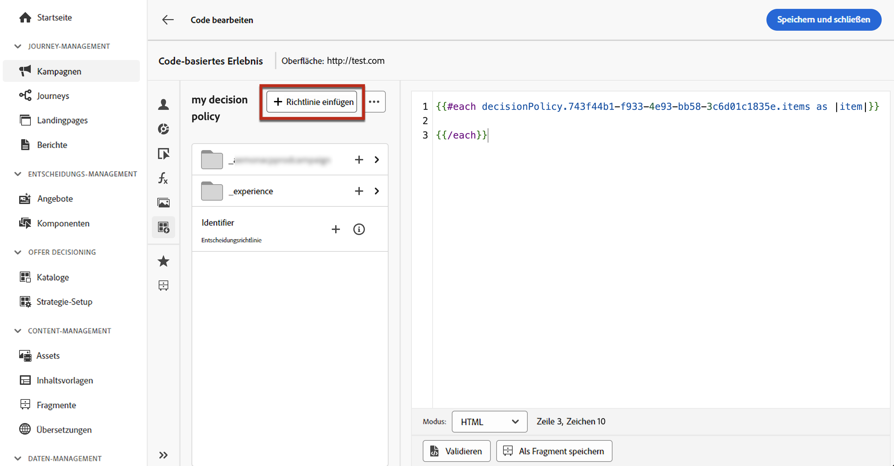
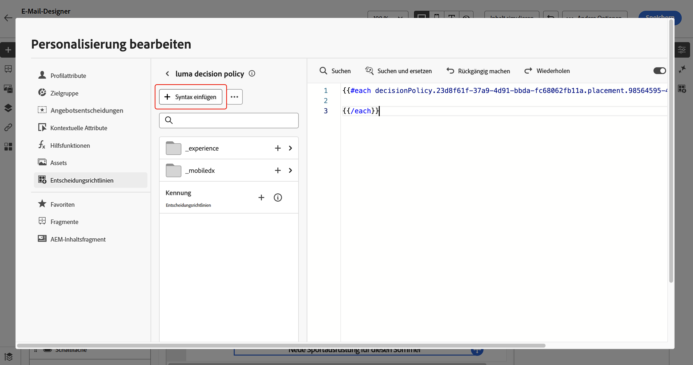
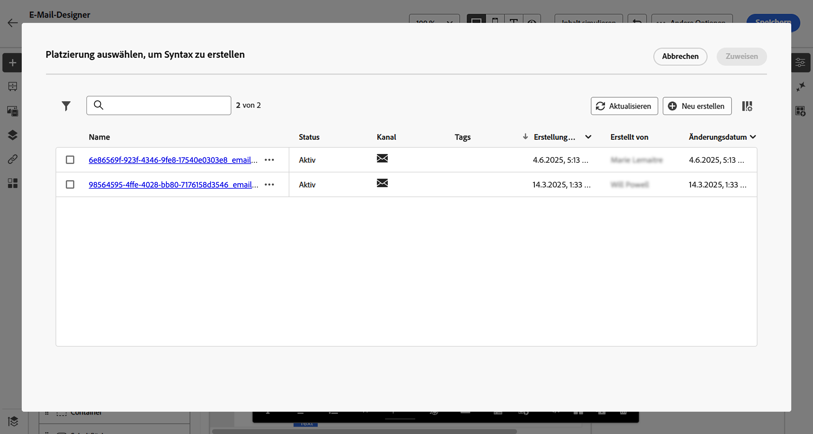
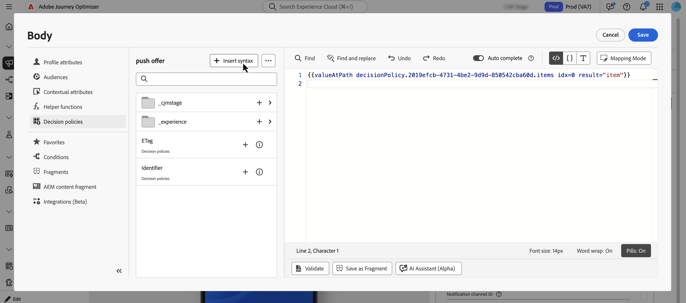
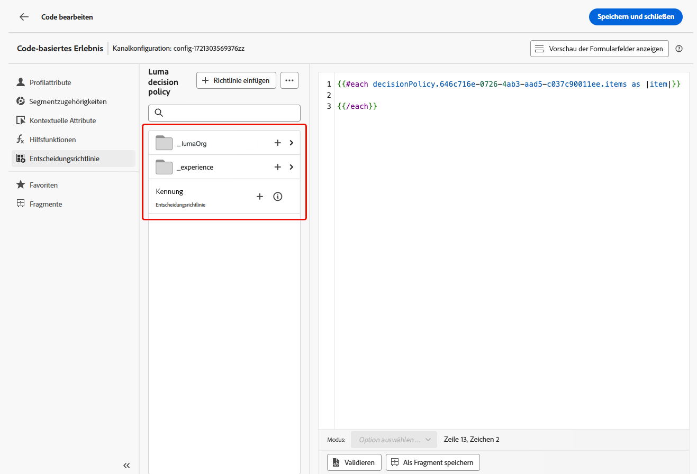
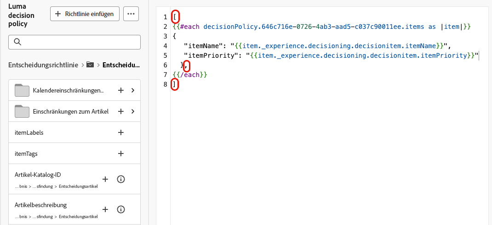
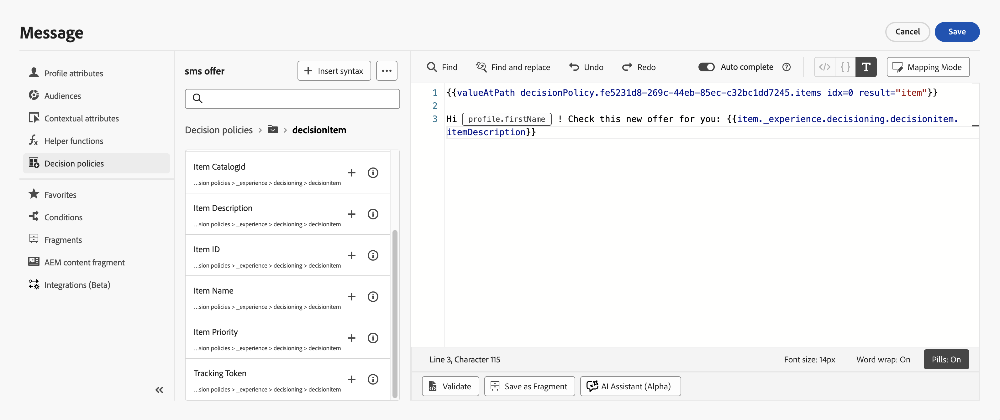
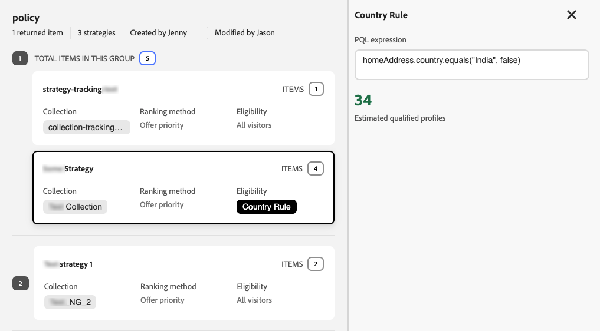
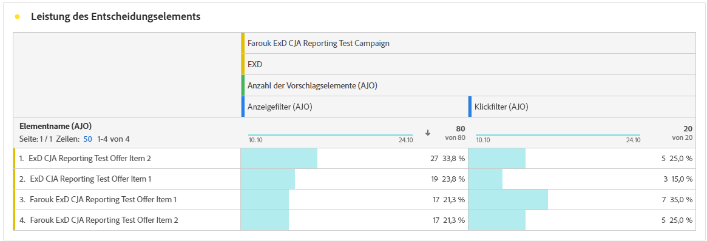

# Verwenden von Entscheidungsrichtlinien in Nachrichten {#create-decision}

Nachdem Sie Ihrem Inhalt eine Entscheidungsrichtlinie hinzugefügt haben, können Sie Attribute aus zurückgegebenen Entscheidungselementen zur Personalisierung verwenden. Fügen Sie dazu zunächst den Entscheidungsrichtlinien-Code in Ihren Inhalt ein.

>[!CAUTION]
>
>Entscheidungsrichtlinien stehen allen Kundinnen und Kunden für die Kanäle **Code-basiertes Erlebnis**, **SMS**, **Push-Benachrichtigung** und **E** zur Verfügung.

## Einfügen des Entscheidungsrichtlinien-Codes {#insert}

>[!BEGINTABS]

>[!TAB Code-basiertes Erlebnis]

1. Bearbeiten Sie Ihr Code-basiertes Erlebnis und navigieren Sie zu **[!UICONTROL Entscheidungsrichtlinie]**.

2. Wählen **[!UICONTROL Richtlinie einfügen]**, um den Entscheidungsrichtlinien-Code hinzuzufügen.

   

>[!NOTE]
>
>Wenn Ihre Entscheidungsrichtlinie für Code-basierte Erlebnisse Entscheidungselemente einschließlich Fragmenten enthält, können Sie diese Fragmente im Entscheidungsrichtlinien-Code nutzen. [Erfahren Sie, wie Sie Fragmente nutzen](fragments-decision-policies.md)

>[!TAB E-Mail]

1. Öffnen Sie den **Personalization** Editor und navigieren Sie zu **[!UICONTROL Entscheidungsrichtlinien]**.

2. Wählen Sie **[!UICONTROL Syntax einfügen]**, um den Code für Ihre Entscheidungsrichtlinie hinzuzufügen.

   

   >[!NOTE]
   >
   >Wenn die Einfügeoption nicht angezeigt wird, ist möglicherweise bereits eine Entscheidungsrichtlinie für die übergeordnete Komponente konfiguriert.

3. Wenn der Komponente noch keine Platzierung zugewiesen wurde, wählen Sie eine aus der Liste aus und klicken Sie auf **[!UICONTROL Zuweisen]**.

   

   >[!NOTE]
   >
   >Wenn Sie mehrere Entscheidungsrichtlinien in derselben E-Mail verwenden (z. B. eine für die Kopfzeile und eine für die Fußzeile), wird dasselbe Angebot für alle Platzierungen dedupliziert: es wird nicht zweimal gerendert. Die zweite Entscheidungsrichtlinie gibt keinen Inhalt zurück und zeigt eine Leerstelle an, es sei denn, Sie haben ein Fallback-Angebot konfiguriert. In diesem Fall wird stattdessen das Fallback angezeigt.

Sie können den Entscheidungsrichtlinien-Code auch einfügen, wenn Sie den Modus **[!UICONTROL Eigenen Code erstellen]** in der E-Mail-Designer verwenden. Navigieren Sie zu **[!UICONTROL Entscheidungsrichtlinien]** und wählen Sie **[!UICONTROL Syntax einfügen]** - die Benutzeroberfläche für die Platzierungsauswahl wird angezeigt, damit Sie eine Platzierung direkt zuweisen können. [Erfahren Sie, wie Sie Ihren eigenen E-Mail-Inhalt codieren](../email/code-content.md).

>[!AVAILABILITY]
>
>Das Einfügen von Entscheidungsrichtlinien im **[!UICONTROL Code your own]**-Modus ist nur eingeschränkt verfügbar.

>[!NOTE]
>
>Im Modus **[!UICONTROL Eigenen Code erstellen]** kann pro Richtlinie nur ein Entscheidungselement zurückgegeben werden, da die Komponente **[!UICONTROL Raster wiederholen]** nicht verfügbar ist.

>[!TAB SMS]

1. Öffnen Sie den **Personalization** Editor und navigieren Sie zu **[!UICONTROL Entscheidungsrichtlinien]**.

2. Wählen Sie **[!UICONTROL Syntax einfügen]**, um den Code für Ihre Entscheidungsrichtlinie hinzuzufügen.

   

>[!TAB Push-Benachrichtigung]

1. Öffnen Sie den **Personalization** Editor und navigieren Sie zu **[!UICONTROL Entscheidungsrichtlinien]**.

2. Wählen Sie **[!UICONTROL Syntax einfügen]**, um den Code für Ihre Entscheidungsrichtlinie hinzuzufügen.

   

>[!IMPORTANT]
>
>Für Experience Decisioning mit Push-Benachrichtigungen ist eine bestimmte Version der Mobile SDK erforderlich. Bevor Sie diese Funktion implementieren, überprüfen Sie die [Versionshinweise](https://developer.adobe.com/client-sdks/home/release-notes){target="_blank"}, um die erforderliche Version zu identifizieren und sicherzustellen, dass Sie das Upgrade entsprechend durchgeführt haben. Sie können auch alle verfügbaren SDK-Versionen für Ihre Plattform in [diesem Abschnitt](https://developer.adobe.com/client-sdks/home/current-sdk-versions){target="_blank"} anzeigen.

>[!ENDTABS]

Der Entscheidungsrichtlinien-Code wird hinzugefügt. Sie können jetzt Attribute aus den zurückgegebenen Entscheidungselementen verwenden, um Ihren Inhalt zu personalisieren.

>[!NOTE]
>
>Wiederholen Sie diese Sequenz für Code-basierte Erlebnis- und E-Mail-Kanäle einmal pro Entscheidungselement, das Sie zurückgeben möchten. Wenn Sie beispielsweise beim Erstellen der Entscheidung zwei Elemente zurückgeben [, wiederholen &#x200B;](create-decision-policy.md) die Sequenz zweimal. Bei SMS- und Push-Kanälen kann nur ein Entscheidungselement zurückgegeben werden.

## Mit Entscheidungselementattributen personalisieren {#attributes}

Nachdem Sie den Code für eine Entscheidungsrichtlinie zu Ihrem Inhalt hinzugefügt haben, werden alle Attribute aus den zurückgegebenen Entscheidungselementen für die Personalisierung verfügbar. [Erfahren Sie, wie Sie mit Personalisierung &#x200B;](../personalization/personalize.md).

Attribute werden im „Angebote“ ([) &#x200B;](catalogs.md). Sie werden im Personalisierungseditor in den folgenden Ordnern angezeigt:
* **Benutzerdefinierte Attribute**: `_\<imsOrg\>` Ordner
* **Standardattribute**: `_experience` Ordner

Entscheidungselementattribute und kontextuelle Attribute werden in [!DNL Journey Optimizer] Fragmenten nicht standardmäßig unterstützt. Sie können jedoch stattdessen globale Variablen verwenden, wie unten beschrieben.

Um ein Attribut hinzuzufügen, klicken Sie auf das **`+`** neben dem Attribut. Sie können beliebig viele Attribute hinzufügen. Sie können auch andere Personalisierungsattribute wie Profildaten einbeziehen.

* Umschließen **bei**- und **Code-basierten**-Kanälen die Attribute in der `#each` Schleife mithilfe von eckigen Klammern `[ ]` und fügen Sie ein Komma vor dem schließenden `/each`-Tag hinzu.

  +++Siehe Beispiel

  

  +++

* Stellen Sie bei **SMS**- und **Push**-Kanälen sicher, dass Sie Attribute nach dem Syntaxcode für die Entscheidungsrichtlinie einfügen. Diese Syntax sollte immer in Zeile 1 beibehalten werden.

  +++Siehe Beispiel

  

  +++

  >[!NOTE]
  >Wenn Sie ein Bild-Asset-Attribut in SMS- oder Push-Inhalt einfügen (z. B. in den Titel oder Hauptteil), wird der Attributwert als URL angezeigt. Das Bild selbst wird in diesen Feldern nicht gerendert.

* Um die Entscheidungselement-Nachverfolgung zu aktivieren, fügen Sie das `trackingToken` Attribut hinzu: `trackingToken: {{item._experience.decisioning.decisionitem.trackingToken}}`

## Vorschau und Test Ihres Inhalts

Nachdem Sie Ihren Inhalt erstellt haben, sollten Sie ihn in der Vorschau anzeigen und testen, bevor Sie Ihren Journey oder Ihre Kampagne aktivieren. Entscheidungselemente werden basierend auf ausgewählten Profilen in der Simulationsoberfläche dargestellt. [Informationen zum Anzeigen von Inhalten in der Vorschau und Testen von Inhalten](../content-management/preview-test.md).

## Nächste Schritte {#final-steps}

Sobald Ihr Inhalt fertig ist, überprüfen und veröffentlichen Sie Ihre Kampagne oder Ihren Journey:

* [Veröffentlichen einer Journey](../building-journeys/publish-journey.md)
* [Überprüfen und Aktivieren einer Kampagne](../campaigns/review-activate-campaign.md)

Sobald Ihre Entwickelnden bei Code-basierten Erlebnissen einen API- oder SDK-Aufruf zum Abrufen von Inhalten für die in Ihrer Kanalkonfiguration definierte Oberfläche starten, werden die Änderungen auf Ihre Web-Seite oder App angewendet.

## Details der Entscheidungsrichtlinie in der Kampagnenübersicht anzeigen {#decision-policy-summary}

Wenn eine Aktion oder eine API-ausgelöste [Kampagne](../campaigns/get-started-with-campaigns.md) Entscheidungsrichtlinien in ihrem Inhalt verwendet, zeigt die Zusammenfassungsseite der Kampagne einen **[!UICONTROL Entscheidungsrichtlinien]** Abschnitt mit allen in der Kampagne verwendeten Richtlinien an.

Sie können auch auf die technischen Details jeder Entscheidungsrichtlinie zugreifen und sie in die Zwischenablage kopieren, was bei der Fehlerbehebung beim Adobe-Support oder Ihrem Entwicklungsteam hilfreich sein kann.

Gehen Sie wie folgt vor, um auf Details zur Entscheidungsrichtlinie und technische Informationen zuzugreifen.

1. Öffnen Sie die Kampagnenzusammenfassung, indem Sie während der [Konfiguration“ auf **&#x200B;**&#x200B;Zum Aktivieren überprüfen](../campaigns/review-activate-campaign.md#action-campaign-review) klicken oder eine Kampagne aus der Liste **[!UICONTROL Kampagnen]** öffnen.

1. Im Abschnitt **[!UICONTROL Entscheidungsrichtlinien]** werden alle in der Kampagne verwendeten Richtlinien aufgelistet.

   

1. Wählen Sie eine Entscheidungsrichtlinie aus oder klicken Sie auf **[!UICONTROL Alle anzeigen]**. Sie können die Details für jede Richtlinie überprüfen, einschließlich:

   * Die in der Entscheidungsrichtlinie verwendeten Strategien
   * Die Anzahl der zurückzugebenden Elemente
   * Die für jede Auswahlstrategie verwendeten Sammlungs-, Ranking- und Eignungsregeln
   * Das Fallback-Angebot, das verwendet wird, wenn kein Entscheidungselement geeignet ist

   

1. Klicken Sie auf eine Sammlung, um alle darin enthaltenen Entscheidungselemente anzuzeigen.

1. Klicken Sie auf ein Entscheidungselement, um auf seine Details zuzugreifen und es bei Bedarf zu bearbeiten. Es wird in einer neuen Browser-Registerkarte geöffnet. Klicken Sie alternativ auf **[!UICONTROL Element anzeigen]**, um Entscheidungselemente anzuzeigen, die sich nicht in einer Sammlung befinden.

   

1. Sie können auch Informationen zu den Rangfolgenmethoden und Eignungsregeln anzeigen, die für die einzelnen Auswahlstrategien verwendet werden.

   {width="80%"}

1. Zurück in der Kampagnenzusammenfassung können Sie auch eine Entscheidungsrichtlinie im Abschnitt **[!UICONTROL Aktionen]** auswählen und auf das Symbol **Informationen** klicken, um auf die technischen Details der Entscheidungsrichtlinie zuzugreifen.

   

1. Klicken Sie auf das **In Zwischenablage kopieren**, um eine JSON-Darstellung der Entscheidungsrichtlinie in die Zwischenablage zu kopieren.

   Die kopierte JSON-Datei enthält den Namen und die ID Ihrer Organisation, den Sandbox-Namen, die ID der Entscheidungsrichtlinie und die vollständige Struktur der Entscheidungsrichtlinie. Sie können diese Informationen an den Adobe-Support oder Ihr Engineering-Team weitergeben, um Entscheidungs-Policy-Probleme schneller zu beheben.

## Reporting-Dashboards verwenden

Um zu sehen, wie Ihre Entscheidungen funktionieren, können Sie vordefinierte Entscheidungsmetriken im Kampagnen- oder Journey-Bericht anzeigen oder benutzerdefinierte Customer Journey Analytics-Dashboards erstellen, um die Leistung zu messen und Erkenntnisse darüber zu erhalten, wie Ihre Entscheidungsrichtlinien und Angebote bereitgestellt und interagiert werden. [Erfahren Sie mehr über Decisioning-Reporting](cja-reporting.md).

