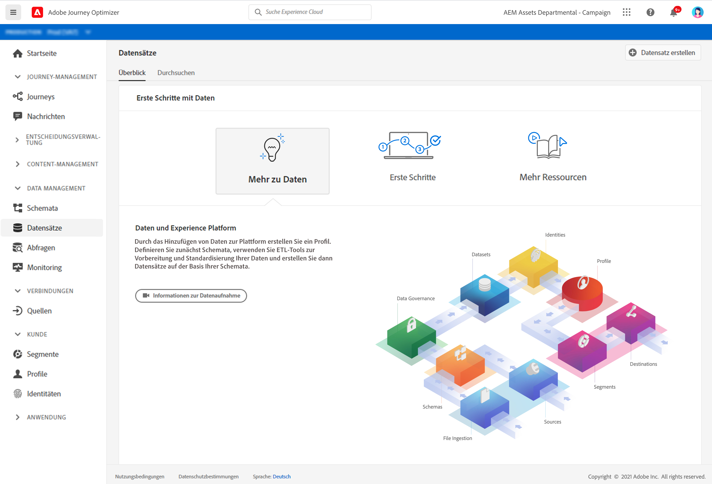

# Erste Schritte mit Datensätzen {#datasets-gs}

Alle Daten, die in Adobe Experience Platform aufgenommen werden, werden im Data Lake als Datensätze persistiert. Ein Datensatz ist ein Konstrukt zur Datenspeicherung und -verwaltung, in dem Daten (in der Regel) in einer Tabelle erfasst werden, die ein Schema (Spalten) und Felder (Zeilen) beinhaltet.

Erfahren Sie, wie Sie Datensätze in [dieser Dokumentation](https://experienceleague.adobe.com/docs/experience-platform/catalog/datasets/overview.html){target=&quot;_blank&quot;} erstellen.

Das Hinzufügen von Daten zu Adobe Experience Platform ist die Grundlage für die Erstellung eines Profils. Anschließend können Sie Profile in [!DNL Adobe Journey Optimizer] nutzen. Definieren Sie zunächst Schemata, verwenden Sie ETL-Tools, um Ihre Daten vorzubereiten und zu standardisieren, und erstellen Sie dann Datensätze basierend auf Ihren Schemas.

➡️ [Erfahren Sie, wie Sie einen Datensatz](#video-dataset) erstellen und konfigurieren (Video)

Der Arbeitsbereich **Datensätze** in der [!DNL Adobe Journey Optimizer]-Benutzeroberfläche ermöglicht es Ihnen, Daten zu untersuchen und Datensätze zu erstellen.

Erfahren Sie, wie Sie die Benutzeroberfläche von Datensätzen in der [Übersichtsdokumentation zur Datenerfassung](https://experienceleague.adobe.com/docs/experience-platform/ingestion/home.html?lang=de){target=&quot;_blank&quot;} verwenden.

Eine schrittweise Dokumentation zum Zuordnen einer CSV-Datei zu einem XDM-Schema finden Sie in [dieser Dokumentation](https://experienceleague.adobe.com/docs/experience-platform/ingestion/tutorials/map-a-csv-file.html?lang=de){target=&quot;_blank&quot;}

## Anleitungsvideo{#video-dataset}

Erfahren Sie, wie Sie einen Datensatz erstellen, ihn einem Schema zuordnen, ihm Daten hinzufügen und bestätigen, dass die Daten erfasst wurden.

>[!VIDEO](https://video.tv.adobe.com/v/334293?quality=12)

**Siehe auch**

* [Erstellen eines Schemas, eines Datensatzes und Erfassen von Daten zum Hinzufügen von Testprofilen in Journey Optimizer](building-journeys/creating-test-profiles.md)
* [Streaming-Erfassung - Übersicht](https://experienceleague.adobe.com/docs/experience-platform/ingestion/streaming/overview.html?lang=de){target=&quot;_blank&quot;}
* [Daten in Adobe Experience Platform aufnehmen](https://experienceleague.adobe.com/docs/experience-platform/ingestion/tutorials/ingest-batch-data.html?lang=en){target=&quot;_blank&quot;}

