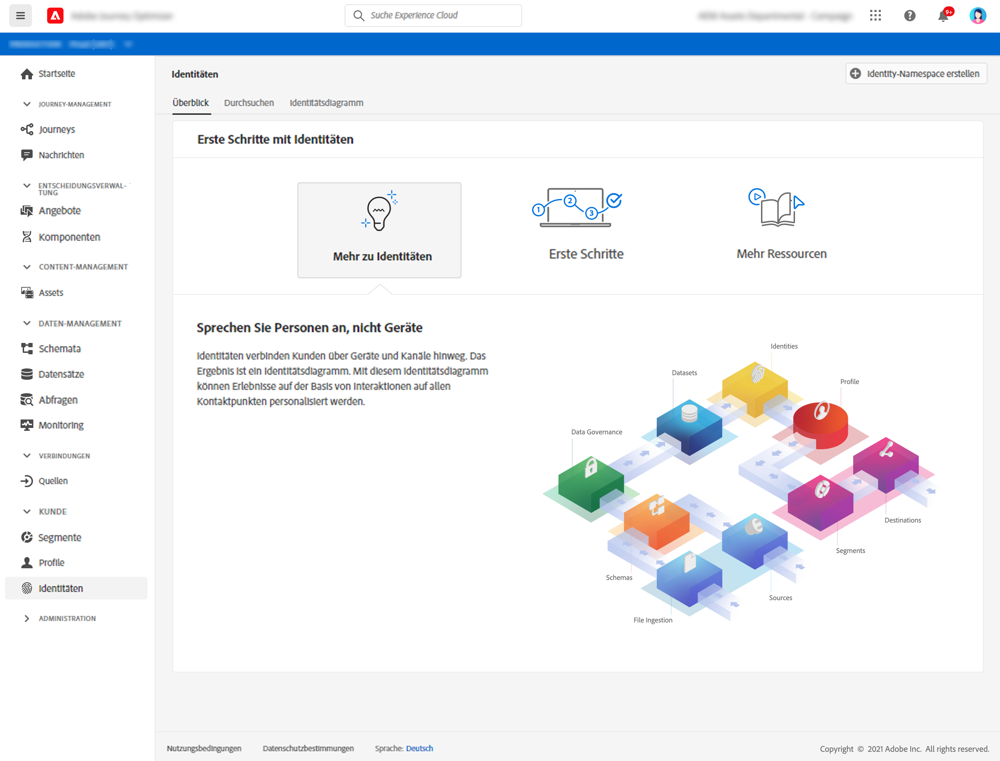

# Erste Schritte mit Identitäten {#identities-gs}

Eine Identität besteht aus Daten, die für eine Entität (normalerweise eine Person) eindeutig sind. Eine Identität wie z. B. eine Anmeldekennung, eine ECID oder eine Treueprogramm-ID wird als bekannte Identität bezeichnet.

Persönlich identifizierbare Informationen (PII) wie E-Mail-Adresse und Telefonnummer dienen zur direkten Identifizierung eines Kunden. Daher werden personenbezogene Daten verwendet, um die verschiedenen Identitäten eines Kunden systemübergreifend abzugleichen.

In [!DNL Adobe Journey Optimizer], **Identitäten** verknüpfen Verbraucher geräteübergreifend und kanalübergreifend. Das Ergebnis ist ein [Identitätsdiagramm](#id-graph). Das verknüpfte Identitätsdiagramm wird verwendet, um Erlebnisse basierend auf Interaktionen über all Ihre geschäftlichen Touchpoints hinweg zu personalisieren.

Weitere Informationen zu **Identity Service** finden Sie in [dieser Dokumentation](https://experienceleague.adobe.com/docs/experience-platform/identity/home.html?lang=de){target=&quot;_blank&quot;}.

## Identitäts-Namespaces

**** Identitäts-Namespaces sind eine Komponente des Identity Service, die als Indikatoren für den Kontext dient, auf den sich eine Identität bezieht. Sie unterscheiden beispielsweise den Wert `name@email.com` als E-Mail-Adresse oder `443522` als numerische CRM-ID. Das Verwenden von Identitäts-Namespaces setzt ein Verständnis der verschiedenen beteiligten Adobe Experience Platform-Dienste voraus. Bevor Sie Namespaces nutzen, lesen Sie bitte die Dokumentation für folgende Dienste:

Weitere Informationen zu **Identitäts-Namespaces** finden Sie in [dieser Dokumentation](https://experienceleague.adobe.com/docs/experience-platform/identity/namespaces.html?lang=de){target=&quot;_blank&quot;}.

## Identitätsdiagramm{#id-graph}

Das **Identitätsdiagramm** ist eine Zuordnung der Beziehungen zwischen verschiedenen Identitäten für einen bestimmten Kunden und bietet Ihnen eine visuelle Darstellung der Interaktion Ihres Kunden mit Ihrer Marke über verschiedene Kanäle hinweg. Alle Diagramme zur Kundenidentität werden vom Adobe Experience Platform Identity Service als Reaktion auf Kundenaktivitäten nahezu in Echtzeit verwaltet und aktualisiert.

Mit dem Identitätsdiagramm-Viewer in der [!DNL Adobe Journey Optimizer]-Benutzeroberfläche können Sie visualisieren und besser verstehen, welche Kundenidentitäten zusammengeführt werden und auf welche Weise. Mit dem Viewer können Sie verschiedene Teile des Diagramms ziehen und damit komplexe Identitätsbeziehungen untersuchen, effizienter debuggen und von erhöhter Transparenz bei der Verwendung von Informationen profitieren.

Weitere Informationen zu **Identitätsdiagramm** in [dieser Dokumentation](https://experienceleague.adobe.com/docs/experience-platform/identity/ui/identity-graph-viewer.html){target=&quot;_blank&quot;}.

