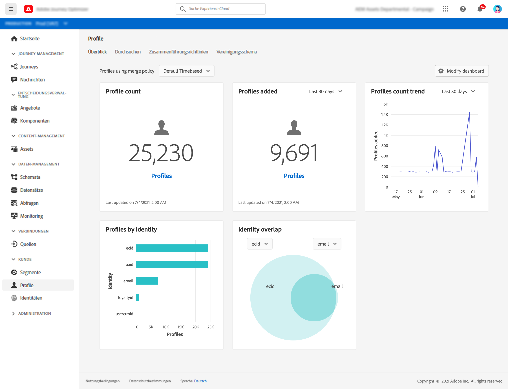

# Erste Schritte mit Profilen {#profiles-gs}

Nutzen Sie das Echtzeit-Kundenprofil in [!DNL Adobe Journey Optimizer], um eine ganzheitliche Sicht auf jeden einzelnen Kunden zu erhalten, indem Sie Daten aus verschiedenen Kanälen, einschließlich Online, Offline, CRM und Drittanbieter, kombinieren. **** Mit Profilen können Sie Ihre Kundendaten in einer einheitlichen Ansicht zusammenfassen, die eine umsetzbare, mit Zeitstempel versehene Übersicht über jede Kundeninteraktion bietet.

>[!NOTE]
>
>Wenn Ihr Unternehmen neu bei [!DNL Adobe Journey Optimizer] ist und noch keine aktiven Profildatensätze oder Zusammenführungsrichtlinien erstellt wurden, ist das Dashboard **Profile** nicht sichtbar. Stattdessen enthält der Tab **Übersicht** Links zur Adobe Experience Platform-Dokumentation, die Ihnen bei den ersten Schritten mit dem Echtzeit-Kundenprofil helfen.

Informationen zum Zugriff auf das Profil-Dashboard **Profil-Dashboard** und detaillierte Informationen zu den im Dashboard angezeigten Metriken finden Sie in [diesem Abschnitt](https://experienceleague.adobe.com/docs/experience-platform/profile/ui/user-guide.html?lang=de){target=&quot;_blank&quot;}.

Sie können Datenfragmente aus mehreren Quellen zusammenführen und kombinieren, um eine vollständige Ansicht Ihrer einzelnen Kunden zu erhalten. Beim Zusammenführen dieser Daten dienen Zusammenführungsrichtlinien als Regeln, mit denen bestimmt wird, wie Daten priorisiert werden und welche Daten kombiniert werden, um eine einheitliche Ansicht zu schaffen.

Weitere Informationen zu **Zusammenführungsrichtlinien** finden Sie in dieser [Dokumentation](https://experienceleague.adobe.com/docs/experience-platform/profile/merge-policies/ui-guide.html){target=&quot;_blank&quot;}.

**Siehe auch**

* [Dokumentation zum Echtzeit-Kundenprofil](https://experienceleague-review.corp.adobe.com/docs/experience-platform/query/home.html){target=&quot;_blank&quot;}
* [Überblick über das Echtzeit-Kundenprofil](https://experienceleague.adobe.com/docs/experience-platform/profile/home.html?lang=de){target=&quot;_blank&quot;}
