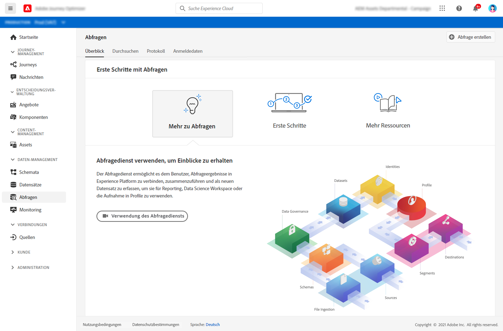

# Erste Schritte mit Abfragen {#queries-gs}

Der Abfrage-Editor ist ein interaktives Tool von Adobe Experience Platform Query Service, mit dem Sie Abfragen für Kundenerlebnisdaten in der [!DNL Adobe Journey Optimizer]-Benutzeroberfläche schreiben, validieren und ausführen können.

Der Abfrage-Editor unterstützt die Entwicklung von Abfragen für die Analyse und Datenexploration und ermöglicht Ihnen das Ausführen interaktiver Abfragen zu Entwicklungszwecken sowie nicht-interaktiver Abfragen zum Ausfüllen von [Datensätzen](get-started-datasets.md).

Erfahren Sie, wie Sie den Abfrage-Editor in [dieser Dokumentation](https://experienceleague.adobe.com/docs/experience-platform/query/ui/user-guide.html){target=&quot;_blank&quot;} verwenden.

**Siehe auch**

* [Dokumentation zu Query Service](https://experienceleague-review.corp.adobe.com/docs/experience-platform/query/home.html){target=&quot;_blank&quot;}
* [Video Query Service - Übersicht](https://experienceleague-review.corp.adobe.com/docs/platform-learn/tutorials/queries/understanding-query-service.html){target=&quot;_blank&quot;}
