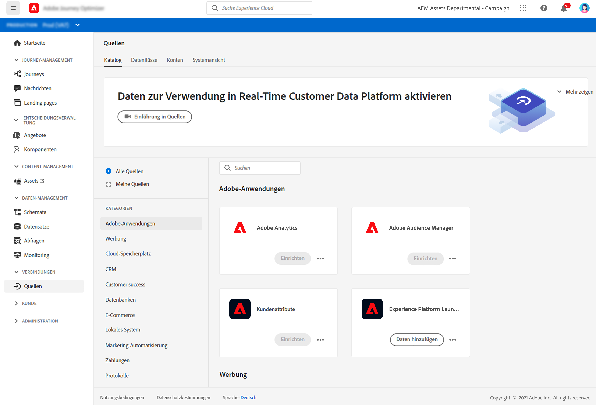

# Erste Schritte mit Quellen-Connectoren {#sources-gs}

Adobe Experience Platform ermöglicht die Aufnahme von Daten aus externen Quellen und bietet spezielle Services, mittels derer Sie eingehende Daten strukturieren, beschriften und erweitern können. Sie können Daten aus verschiedenen Quellen erfassen, z. B. aus Adobe Apps, Cloud-basierten Speichern, Datenbanken und vielen anderen.

Weitere Informationen zum Erfassen von Daten aus externen Quellen mit Quell-Connectoren finden Sie in [dieser Dokumentation](https://experienceleague.adobe.com/docs/experience-platform/sources/home.html?lang=de){target=&quot;_blank&quot;}.
