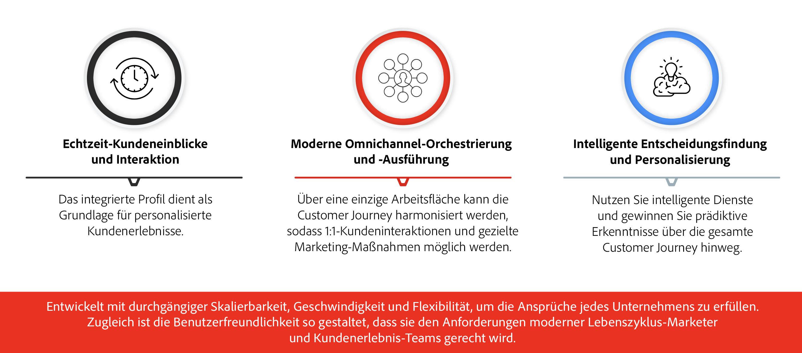

# Erste Schritte mit Journey Optimizer {#cjm-gs}

>[!CONTEXTUALHELP]
>id="test_id"
>title="Testinhalt"
>abstract="Testen Sie Inhalt auf die Integration der kontextuellen Hilfe in AJO."

## Was ist [!DNL Adobe Journey Optimizer]?{#about-cjm}

[!DNL Adobe Journey Optimizer] hilft Unternehmen, ihren Kunden vernetzte, kontextbezogene und personalisierte Erlebnisse bereitzustellen. Die Customer Journey umfasst den gesamten Prozess der Kundeninteraktion mit der Marke, von der ersten Kontaktaufnahme bis zum Kaufabschluss. Sie beginnt mit der Wahrnehmungsphase, in der der Kunde die Marke kennenlernt und Interaktionen mit ihr aufnimmt. Der Kunde wird seine Interaktion mit der Marke weiter vertiefen, die Website und physische Filiale besuchen und Einkäufe tätigen, Nachrichten versenden oder Kundenrezensionen posten.

[!DNL Adobe Journey Optimizer] basiert nativ auf  [!DNL Adobe Experience Platform] und kombiniert ein einheitliches Echtzeit-Kundenprofil, ein API-First Open Framework, zentralisierte offer decisioning und künstliche Intelligenz (KI) sowie maschinelles Lernen (ML) zur Personalisierung und Optimierung. Journey Optimizer ermöglicht es Marken, die nächste beste Interaktion mit Skalierung, Geschwindigkeit und Flexibilität über die gesamte Journey hinweg intelligent zu bestimmen. Mit [!DNL Adobe Journey Optimizer] können Unternehmen innerhalb derselben Anwendung sowohl geplante Marketing-Kampagnen (z. B. wöchentliche Promotions für einen Einzelhandelsgeschäft) als auch maßgeschneiderte individuelle Nachrichten (z. B. eine Push-Benachrichtigung für einen Artikel, den ein Kunde einer Treueprogramm angesehen hat und der zuvor nicht auf Lager war) erstellen und bereitstellen.

➡️ [Discover Journey Optimizer](https://experienceleague.adobe.com/docs/journey-optimizer-learn/tutorials/introduction-to-journey-optimizer/introduction.html){target=&quot;_blank&quot;} (Video)

## Anwendungsbeispiele

* Marketingexperten können [!DNL Adobe Journey Optimizer] verwenden, um sowohl personalisierte Kommunikation als auch zielgruppenbasierte Batch-Kommunikation zu senden. Beispielsweise sendet ein Bekleidungsgeschäft in der Regel Umfragen nach dem Kauf an alle Kunden, die in der letzten Woche Produkte gekauft haben. Aufgrund des schlechten Wetters kam es bei einigen Sendungen zu Verspätungen. Da der Bekleidungsladen erkennt, welche Kunden ihre Sendungen nicht erhalten haben, kann er sie vom geplanten Versand der Kundenzufriedenheit ausschließen und stattdessen eine personalisierte E-Mail versenden, in der er sich für die Verzögerung entschuldigt und einen Rabattcode mit Produktempfehlungen anbietet, die auf den früheren Käufen des Kunden basieren.

   Marketingexperten können die Anwendung auch verwenden, um verhaltensbasierte Echtzeit-Kommunikation zu senden. Beispielsweise könnte derselbe Einzelhändler einen treuen Kunden ansprechen, der in Echtzeit auf den Parkplatz des Stores gelangt, indem er ihm eine Push-Benachrichtigung über einen Pullover sendet, der wieder in der Größe des Kunden vorrätig ist.

* Nicht-Marketingexperten wie Teams für Betriebsabläufe und Support, die mit dem Kundenerlebnis beschäftigt sind, können [!DNL Adobe Journey Optimizer] verwenden, um eine Vielzahl von Aufgaben zu verwalten, z. B. betriebliche Benachrichtigungen oder sogar um den Onboarding-Prozess zu überwachen. Nehmen wir beispielsweise einen Vergnügungspark, in dem Parkbesucher eine mobile App als Teil ihres Parkerlebnisses herunterladen. Wartungspersonal kann [!DNL Adobe Journey Optimizer] verwenden, um Parkbesucher über Fahrten zu informieren, die aufgrund von Wartungsarbeiten derzeit geschlossen sind.

## Wichtigste Funktionen

[!DNL Adobe Journey Optimizer] ist eine agile und skalierbare Anwendung zur Erstellung und Bereitstellung personalisierter, vernetzter und zeitnaher
Kundenerlebnisse in allen Mobile Apps, Geräten oder Kanälen.

Die wichtigsten Funktionen von Creative Designer ermöglichen Folgendes:

* **Echtzeit-Kundeneinblicke und Interaktion** : Ein integriertes Profil verbindet Live-Daten aus allen Quellen über Touchpoints von Kunden hinweg, einschließlich verhaltensbezogener, Transaktions-, Finanz- und Betriebsdaten, um persönliche und kontextbezogene Erlebnisse für Kunden in ihrer Zeit zu optimieren.

* **Moderne Omnichannel-Orchestrierung und -Ausführung**  - Eine einzige Arbeitsfläche, auf der die Journey für 1:1-Kundeninteraktionen und Marketingkontakte harmonisiert und optimiert werden kann, um Marken dabei zu helfen, im gesamten Kundenlebenszyklus einen Mehrwert zu erzielen. Journey, die in [!DNL Adobe Journey Optimizer] entwickelt wurden, können dynamisch und ereignisbasiert sein, um Marken dabei zu helfen, auf Echtzeitsignale zu reagieren und diese Interaktionen mit terminierten Kampagnen zu verbinden, sodass die richtigen Entscheidungen darüber getroffen werden können, welche Nachrichten ein Kunde senden soll, wann und über welche Kanäle.

* **Intelligente Entscheidungsfindung und Personalisierung** : Marken können zentralisierte Entscheidungen treffen und künstliche Intelligenz und maschinelles Lernen integrieren, um prädiktive Einblicke über das gesamte Kundenerlebnis hinweg zu gewinnen. Dies erleichtert die Automatisierung von Entscheidungen und die Optimierung des skalierten Erlebnisses. offer decisioning ermöglicht zentralisierte Angebote über mehrere Kanäle im Maßstab bis [!DNL Adobe Journey Optimizer].

## Architektur

Machen Sie sich mit der grundlegenden Architektur von [!DNL Adobe Journey Optimizer], den Integrationspunkten und der Beziehung von [!DNL Journey Optimizer] zu anderen Adobe Apps vertraut.

>[!VIDEO](https://video.tv.adobe.com/v/334205?quality=12)

>[!NOTE]
>
> Für [!DNL Journey Optimizer] gelten die allgemeinen Datenschutzrichtlinien und -verfahren von Adobe Experience Cloud. [Weitere Informationen zum Datenschutz](https://www.adobe.com/de/privacy/experience-cloud.html) in Adobe Experience Cloud.
> Beachten Sie auch die [Limits für Echtzeit-Kundenprofil-Daten, bevor Sie ](https://experienceleague.adobe.com/docs/experience-platform/profile/guardrails.html) starten.

**Siehe auch**

* [Wichtige Schritte für den Start](quick-start.md)
* [Erstellen Ihrer ersten Nachricht](get-started-content.md)
* [Entwerfen von Journeys und Senden von Nachrichten](building-journeys/journey-gs.md)
* [Live-Berichte](reports/live-report.md)
* [Häufig gestellte Fragen zu Journey Optimizer](assets/do-not-localize/AJO-FAQ.pdf)  (PDF)
