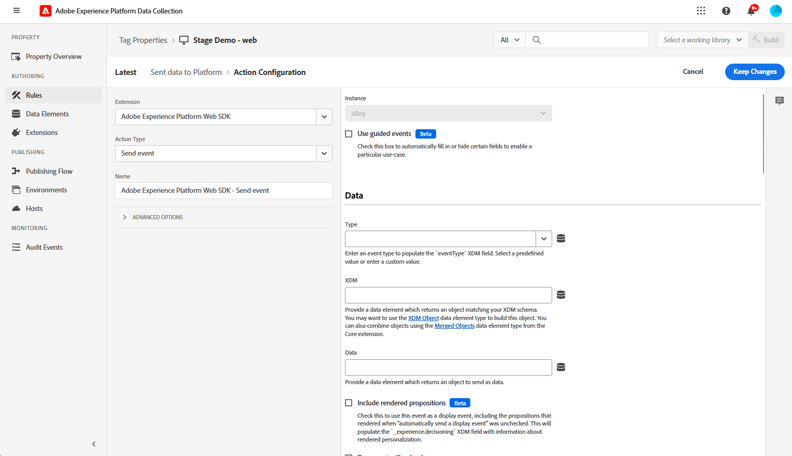
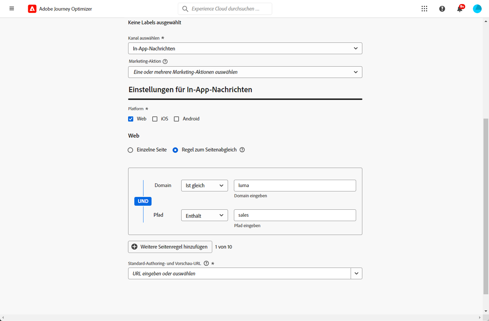

# Konfigurieren des Web-In-App-Kanals {#configure-in-app-web}

## Voraussetzungen {#prerequisites}

* Stellen Sie sicher, dass Sie die neueste Version für Ihre **Adobe Experience Platform Web SDK**-Erweiterung verwenden.

* Installieren Sie die **Adobe Experience Platform Web SDK**-Erweiterung unter den **Tag-Eigenschaften** und aktivieren Sie die Option für den **Personalisierungsspeicher**.

  Diese Konfiguration ist für das Speichern von Ereignisverläufen auf dem Client unerlässlich. Sie ist eine Voraussetzung für die Implementierung von Häufigkeitsregeln im Regel-Builder. [Weitere Informationen](https://experienceleague.adobe.com/docs/experience-platform/tags/extensions/client/web-sdk/web-sdk-extension-configuration.html?lang=de){target="_blank"}

  

## Konfigurieren einer „Daten an Platform gesendet“-Regel {#configure-sent-data-trigger}

1. Navigieren Sie in Ihrer Instanz für die **Adobe Experience Platform-Datenerfassung** zu den mit der **Adobe Experience Platform Web SDK**-Erweiterung konfigurierten **Tag-Eigenschaften**.

1. Wählen Sie im Menü **Authoring** die Option **Regeln** und dann **Neue Regel erstellen** oder **Regel hinzufügen** aus.

   

1. Klicken Sie im Abschnitt **Ereignisse** auf **Hinzufügen** und legen Sie folgende Konfiguration fest:

   * **Erweiterung**: Core

   * **Ereignistyp**: Bibliothek geladen (Seitenanfang)

   

1. Wählen Sie **Änderungen beibehalten** aus, um die Ereigniskonfiguration zu speichern.

1. Klicken Sie im Abschnitt **Aktionen** auf **Hinzufügen** und legen Sie folgende Konfiguration fest:

   * **Erweiterung**: Adobe Experience Platform Web SDK

   * **Aktionstyp**: Ereignis senden

   

1. Aktivieren Sie im Abschnitt **Personalisierung** Ihres **Aktionstyps** die Option zum **Rendern visueller Personalisierungsentscheidungen**.

   

1. Definieren Sie im Abschnitt **Entscheidungskontext** die **Schlüssel**-**Wert**-Paare, die bestimmen, welches Erlebnis bereitgestellt werden soll.

   

1. Speichern Sie Ihre **Aktionskonfiguration**, indem Sie auf **Änderungen beibehalten** klicken.

1. Navigieren Sie zum Menü für den **Veröffentlichungsfluss**. Erstellen Sie eine neue **Bibliothek** oder wählen Sie eine vorhandene **Bibliothek** aus und fügen Sie Ihre neu erstellte **Regel** hinzu. [Weitere Informationen](https://experienceleague.adobe.com/docs/experience-platform/tags/publish/libraries.html?lang=de#create-a-library){target="_blank"}

1. Wählen Sie über Ihre **Bibliothek** die Option **Speichern und für Entwicklung erstellen** aus.

   

## Konfigurieren einer manuellen Regel {#configure-manual-trigger}

1. Navigieren Sie in Ihrer Instanz für die **Adobe Experience Platform-Datenerfassung** zu den mit der **Adobe Experience Platform Web SDK**-Erweiterung konfigurierten **Tag-Eigenschaften**.

1. Wählen Sie im Menü **Authoring** die Option **Regeln** und dann **Neue Regel erstellen** oder **Regel hinzufügen** aus.

   

1. Klicken Sie im Abschnitt **Ereignisse** auf **Hinzufügen** und legen Sie folgende Konfiguration fest:

   * **Erweiterung**: Core

   * **Ereignistyp**: Klick

   

1. Definieren Sie in der **Klickkonfiguration** den **Selektor**, der ausgewertet werden soll.

   

1. Klicken Sie auf **Änderungen beibehalten**, um die **Ereigniskonfiguration** zu speichern.

1. Klicken Sie im Abschnitt **Aktionen** auf **Hinzufügen** und legen Sie folgende Konfiguration fest:

   * **Erweiterung**: Adobe Experience Platform Web SDK

   * **Aktionstyp**: Regelsätze auswerten

   

1. Aktivieren Sie im Abschnitt **Aktion zum Auswerten von Regelsätzen** Ihres **Aktionstyps** die Option zum **Rendern visueller Personalisierungsentscheidungen**.

   

1. Definieren Sie im Abschnitt **Entscheidungskontext** die **Schlüssel**-**Wert**-Paare, die bestimmen, welches Erlebnis bereitgestellt werden soll.

1. Rufen Sie das Menü **Veröffentlichungsfluss** auf, erstellen Sie eine neue **Bibliothek** oder wählen Sie eine vorhandene **Bibliothek** aus und fügen Sie Ihre neu erstellte **Regel** hinzu. [Weitere Informationen](https://experienceleague.adobe.com/docs/experience-platform/tags/publish/libraries.html?lang=de#create-a-library){target="_blank"}

1. Wählen Sie über Ihre **Bibliothek** die Option **Speichern und für Entwicklung erstellen** aus.

   

## Erstellen einer In-App-Web-Konfiguration {#in-app-config}

1. Öffnen Sie das Menü **[!UICONTROL Kanäle]** > **[!UICONTROL Allgemeine Einstellungen]** > **[!UICONTROL Kanalkonfigurationen]** und klicken Sie dann auf **[!UICONTROL Kanalkonfiguration erstellen]**.

   

1. Geben Sie einen Namen und eine Beschreibung (optional) für die Konfiguration ein und wählen Sie dann den zu konfigurierenden Kanal aus.

   >[!NOTE]
   >
   > Namen müssen mit einem Buchstaben (A–Z) beginnen. Ein Name darf nur alphanumerische Zeichen enthalten. Sie können auch die Zeichen Unterstrich `_`, Punkt `.` und Bindestrich `-` verwenden.

1. Um der Konfiguration benutzerdefinierte oder grundlegende Datennutzungs-Labels zuzuweisen, können Sie **[!UICONTROL Zugriff verwalten]** auswählen. [Erfahren Sie mehr über die Zugriffssteuerung auf Objektebene (Object Level Access Control, OLAC)](../administration/object-based-access.md).

1. Wählen Sie eine **[!UICONTROL Marketing-Aktion]** aus, um Einverständnisrichtlinien mit den Nachrichten zu verknüpfen, die diese Konfiguration verwenden. Es werden alle mit der Marketing-Aktion verknüpften Einverständnisrichtlinien genutzt, um die Präferenzen Ihrer Kundinnen und Kunden zu respektieren. [Weitere Informationen](../action/consent.md#surface-marketing-actions)

1. Wählen Sie den Kanal **In-App-Messaging** aus.

1. Definieren Sie eine App-Konfiguration. Sie haben zwei Möglichkeiten, Änderungen vorzunehmen:

   * Sie können entweder eine **[!UICONTROL Seiten-URL]** eingeben, um Änderungen auf eine bestimmte Seite anzuwenden.

   * Sie können eine Regel erstellen, um mehrere URLs, die demselben Muster entsprechen, als Ziel festzulegen.

     +++ Erstellen einer Regel zum Seitenabgleich

      1. Wählen Sie **[!UICONTROL Regel zum Seitenabgleich]** als App-Konfiguration aus und geben Sie Ihre **[!UICONTROL Seiten-URL]** ein.

      1. Definieren Sie im Fenster **[!UICONTROL Konfigurationsregel bearbeiten]** die Kriterien für die Felder **[!UICONTROL Domain]** und **[!UICONTROL Seite]**.
      1. Personalisieren Sie Ihre Kriterien über die Dropdown-Listen für Bedingungen weiter.

         Wenn Sie beispielsweise Elemente bearbeiten möchten, die auf allen Vertriebs-Produktseiten Ihrer Luma-Website angezeigt werden, wählen Sie „Domain“ > „Beginnt mit“ > „luma und Seite“ > „Enthält“ > „Sales“ aus.

         

      1. Klicken Sie auf **[!UICONTROL Eine weitere Seitenregel hinzufügen]**, um bei Bedarf eine weitere Regel zu erstellen.

      1. Wählen Sie die **[!UICONTROL Standard-Authoring- und Vorschau-URL]** aus.

      1. Speichern Sie Ihre Änderungen. Die Regel wird auf dem Bildschirm **[!UICONTROL Kampagne erstellen]** angezeigt.

     +++

1. Übermitteln Sie Ihre In-App-Web-Konfiguration.

Sie können jetzt innerhalb einer Kampagne [eine Web-In-App erstellen](../in-app/create-in-app-web.md).
