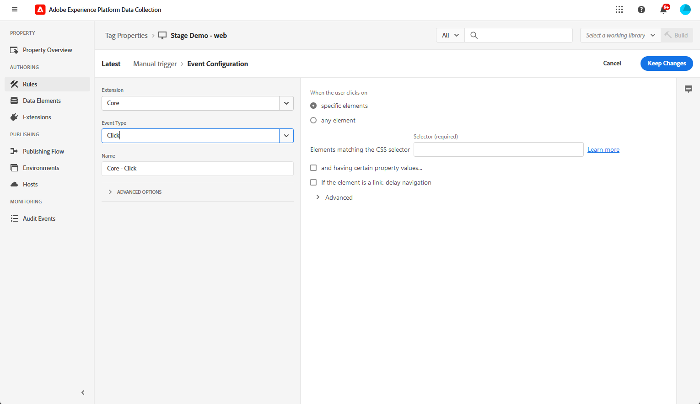

# Web-In-App-Kanal konfigurieren {#configure-in-app-web}

## Voraussetzungen {#prerequisites}

* Stellen Sie sicher, dass Sie die neueste Version für Ihre **Adobe Experience Platform Web SDK** -Erweiterung.

* Installieren Sie die **Adobe Experience Platform Web SDK** -Erweiterung in **Tag-Eigenschaften** und aktivieren Sie die **Personalisierungsspeicherung** -Option.

  Diese Konfiguration ist für das Speichern von Ereignisverläufen auf dem Client unerlässlich, eine Voraussetzung für die Implementierung von Frequenzregeln in den Rule Builder. [Weitere Informationen](https://experienceleague.adobe.com/docs/experience-platform/tags/extensions/client/web-sdk/web-sdk-extension-configuration.html?lang=en)

  

## Konfigurieren von gesendeten Daten für die Plattformregel {#configure-sent-data-trigger}

1. Zugriff auf **Adobe Experience Platform-Datenerfassung** Instanz und navigieren Sie zu **Tag-Eigenschaften** mit dem **Adobe Experience Platform Web SDK** -Erweiterung.

1. Aus dem **Authoring** Menü auswählen **Regeln** then **Neue Regel erstellen** oder **Regel hinzufügen**.

   

1. Im **Veranstaltungen** Abschnitt, klicken Sie auf **Hinzufügen** und konfigurieren Sie sie wie folgt:

   * **Erweiterung**: Core

   * **Ereignistyp**: Bibliothek geladen (Seitenanfang).

   

1. Klicks **Änderungen beibehalten** , um die Ereigniskonfiguration zu speichern.

1. Im **Aktionen** Abschnitt, klicken Sie auf **Hinzufügen** und konfigurieren Sie sie wie folgt:

   * **Erweiterung**: Adobe Experience Platform Web SDK

   * **Aktionstyp**: Ereignis senden

   

1. Im **Personalisierung** -Abschnitt Ihres **Aktion** type, aktivieren Sie die **visuelle Personalisierungsentscheidungen rendern** -Option.

   

1. Im **Entscheidungskontext** -Abschnitt, definieren Sie die **Schlüssel** und **Wert** Paare, die bestimmen, welches Erlebnis bereitgestellt werden soll.

   

1. Speichern Sie **Aktion** Konfiguration durch Klicken auf **Änderungen beibehalten**.

1. Navigieren Sie zum **Veröffentlichungsfluss** Menü. Erstellen Sie eine neue **Bibliothek** oder wählen Sie ein vorhandenes **Bibliothek** und fügen Sie Ihre neu erstellte **Regel** zu. [Weitere Informationen](https://experienceleague.adobe.com/docs/experience-platform/tags/publish/libraries.html?lang=en#create-a-library)

1. Von Ihrem **Bibliothek** auswählen **Speichern und in der Entwicklung erstellen**.

   

## Manuelle Regel konfigurieren {#configure-manual-trigger}

1. Zugriff auf **Adobe Experience Platform-Datenerfassung** Instanz und navigieren Sie zu **Tag-Eigenschaften** mit dem **Adobe Experience Platform Web SDK** -Erweiterung.

1. Aus dem **Authoring** Menü auswählen **Regeln** then **Neue Regel erstellen** oder **Regel hinzufügen**.

   

1. Im **Veranstaltungen** Abschnitt, klicken Sie auf **Hinzufügen** und konfigurieren Sie sie wie folgt:

   * **Erweiterung**: Core

   * **Ereignistyp**: Klicken

   

1. Im **Klickkonfiguration**, definieren Sie die **Selektor** wird bewertet.

   

1. Klicks **Änderungen beibehalten** , um die **Ereignis** Konfiguration.

1. Im **Aktionen** Abschnitt, klicken Sie auf **Hinzufügen** und konfigurieren Sie sie wie folgt:

   * **Erweiterung**: Adobe Experience Platform Web SDK

   * **Aktionstyp**: Regelsätze auswerten

   

1. Im **Aktion zum Auswerten von Regelsätzen** -Abschnitt Ihres **Aktion** type, aktivieren Sie die **visuelle Personalisierungsentscheidungen rendern** -Option.

   

1. Im **Entscheidungskontext** -Abschnitt, definieren Sie die **Schlüssel** und **Wert** Paare, die bestimmen, welches Erlebnis bereitgestellt werden soll.

1. Zugriff auf **Veröffentlichungsfluss** , erstellen Sie eine neue **Bibliothek** oder wählen Sie ein vorhandenes **Bibliothek** und fügen Sie Ihre neu erstellte **Regel**. [Weitere Informationen](https://experienceleague.adobe.com/docs/experience-platform/tags/publish/libraries.html?lang=en#create-a-library)

1. Von Ihrem **Bibliothek** auswählen **Speichern und in der Entwicklung erstellen**.

   

