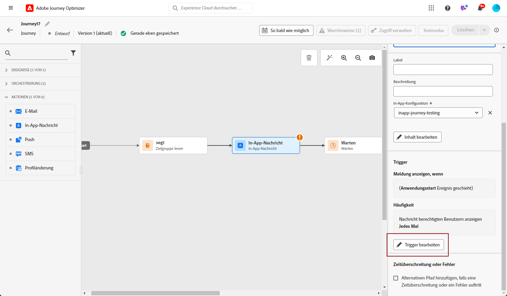

# Erstellen einer In-App-Nachricht in einer Journey erstellen. {#create-in-app-journey}

1. Öffnen Sie Ihre Journey und ziehen Sie eine **[!UICONTROL In-App]**-Aktivität per Drag-and-Drop aus dem Bereich **[!UICONTROL Aktionen]** der Palette.

   Wenn ein Profil das Ende seiner Journey erreicht, laufen alle ihm angezeigten In-App-Nachrichten automatisch ab. Aus diesem Grund wird nach Ihrer In-App-Aktivität automatisch eine Warteaktivität hinzugefügt, um einen angemessenen Zeitpunkt zu gewährleisten.

   

1. Geben Sie einen **[!UICONTROL Titel]** und eine **[!UICONTROL Beschreibung]** für Ihre Nachricht ein.

1. Wählen Sie die [In-App-Oberfläche](inapp-configuration.md) aus, die verwendet werden soll.

   

1. Sie können jetzt über die Schaltfläche **[!UICONTROL Inhalt bearbeiten]** mit der Erstellung Ihrer Inhalte beginnen. [Weitere Informationen](design-in-app.md)

1. Klicken Sie auf **[!UICONTROL Trigger bearbeiten]**, um Ihren Trigger zu konfigurieren.

   

1. Wählen Sie die Häufigkeit Ihres Auslösers aus, wenn Ihre In-App-Nachricht aktiv ist:

   * **[!UICONTROL Jedes Mal anzeigen]**: Die Nachricht wird immer angezeigt, wenn die im Dropdown-Menü **[!UICONTROL Mobile-App-Auslöser]** ausgewählten Ereignisse eintreten.
   * **[!UICONTROL Einmal anzeigen]**: Die Nachricht wird nur beim ersten Mal angezeigt, wenn die im Dropdown-Menü **[!UICONTROL Mobile-App-Auslöser]** ausgewählten Ereignisse eintreten.
   * **[!UICONTROL Bis zu Clickthrough anzeigen]**: Diese Nachricht wird anzeigen, wenn die im Dropdown-Menü **[!UICONTROL Mobile-App-Auslöser]** ausgewählten Ereignisse eintreten, bis vom SDK ein Interaktionsereignis mit einer Aktion „angeklickt“ übermittelt wird.

1. Wählen Sie aus dem/den Dropdown-Menü(s) **[!UICONTROL Mobile-App-Auslöser]** die Ereignisse und Kriterien aus, die Ihre Nachricht auslösen:

   1. Wählen Sie aus der linken Dropdown-Liste das Ereignis aus, das eintreten muss, damit Ihre Nachricht ausgelöst wird.
   1. Wählen Sie aus der rechten Dropdown-Liste die für das ausgewählte Ereignis erforderliche Validierung aus.
   1. Klicken Sie auf die Schaltfläche **[!UICONTROL Hinzufügen]**, wenn Sie möchten, dass der Auslöser mehrere Ereignisse oder Kriterien berücksichtigt. Wiederholen Sie dann die obigen Schritte.
   1. Wählen Sie die Art der Verknüpfung Ihrer Ereignisse aus, z. B. **[!UICONTROL Und]**, wenn Sie möchten, dass **beide** Auslöser erfüllt sind, damit eine Nachricht angezeigt wird. Wählen Sie stattdessen **[!UICONTROL Oder]**, wenn Sie möchten, dass die Nachricht angezeigt, dass **einer** der Auslöser erfüllt ist.
   1. Klicken Sie auf **[!UICONTROL Speichern]**, wenn Ihre Triggers konfiguriert sind.

   

1. Schließen Sie bei Bedarf Ihren Journey-Fluss ab, indem Sie zusätzliche Aktionen oder Ereignisse per Drag-and-Drop verschieben. [Weitere Informationen](../building-journeys/about-journey-activities.md)

1. Sobald Ihre In-App-Nachricht fertig ist, schließen Sie die Konfiguration ab und veröffentlichen Sie Ihre Journey, um sie zu aktivieren.

Weitere Informationen zur Konfiguration einer Journey finden Sie auf [dieser Seite](../building-journeys/journey-gs.md).

## Einschränkungen bei In-App-Aktivitäten {#in-app-activity-limitations}

* Diese Funktion ist derzeit nicht für Kundinnen und Kunden im Gesundheitswesen verfügbar.

* Personalisierung kann nur Profilattribute enthalten.

* Die In-App-Anzeige ist an die Journey-Lebensdauer gebunden, d. h. wenn die Journey für ein Profil endet, werden alle In-App-Nachrichten innerhalb dieser Journey nicht mehr für dieses Profil angezeigt.  Daher ist es nicht möglich, eine In-App-Nachricht direkt von einer Journey-Aktivität aus zu stoppen. Stattdessen müssen Sie die gesamte Journey beenden, um zu verhindern, dass die In-App-Nachrichten dem Profil angezeigt werden.

* Im Testmodus hängt die Anzeige der App von der Journey-Lebensdauer ab. Um zu verhindern, dass die Journey während des Tests zu früh endet, passen Sie den **[!UICONTROL Wartezeit]**-Wert für Ihre **[!UICONTROL Warten]**-Aktivitäten an.

* **[!UICONTROL Reaktion]**-Aktivitäten können nicht verwendet werden, um auf ein Öffnen oder Klicken in der App zu reagieren.

* Eine Aktivierungsverzögerung tritt zwischen dem Zeitpunkt, zu dem ein Benutzerprofil eine In-App-Aktivität auf der Arbeitsfläche erreicht, und dem Zeitpunkt, zu dem es diese In-App-Nachricht zu sehen beginnt, auf. Diese Verzögerung kann zwischen 15 Minuten und 1 Stunde betragen.

**Verwandte Themen:**

* [Entwerfen der In-App-Nachricht](design-in-app.md)
* [Testen und Senden der In-App-Nachricht](send-in-app.md)
* [In-App-Bericht](../reports/campaign-global-report.md#inapp-report)
* [In-App-Konfiguration](inapp-configuration.md)
