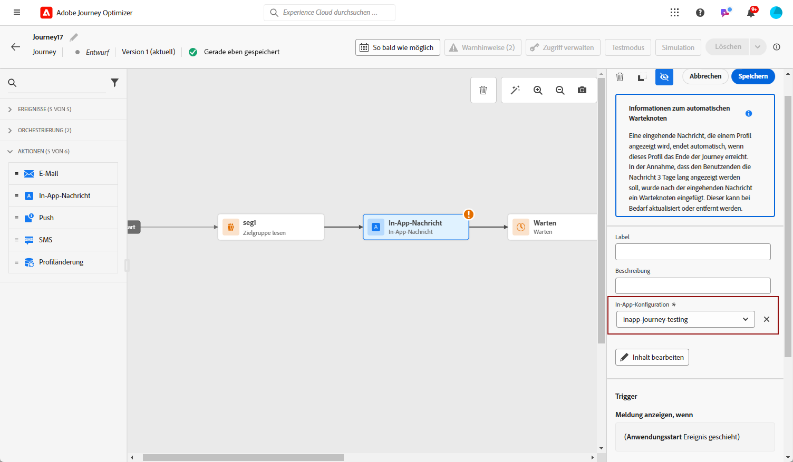

# Erstellen einer In-App-Nachricht in einer Journey {#create-in-app-journey}

Gehen Sie wie folgt vor, um eine In-App-Nachricht zu einer Journey hinzuzufügen:

1. Öffnen Sie Ihre Journey und ziehen Sie eine **[!UICONTROL In-App]**-Aktivität per Drag-and-Drop aus dem Bereich **[!UICONTROL Aktionen]** der Palette.

   Wenn ein Profil das Ende seiner Journey erreicht, laufen alle ihm angezeigten In-App-Nachrichten automatisch ab. Aus diesem Grund wird nach Ihrer In-App-Aktivität automatisch eine Warteaktivität hinzugefügt, um einen angemessenen Zeitpunkt zu gewährleisten.

   

1. Geben Sie einen **[!UICONTROL Titel]** und eine **[!UICONTROL Beschreibung]** für Ihre Nachricht ein.

1. Wählen Sie die [In-App-Oberfläche](inapp-configuration.md) aus, die verwendet werden soll.

   

1. Sie können jetzt über die Schaltfläche **[!UICONTROL Inhalt bearbeiten]** mit der Erstellung Ihrer Inhalte beginnen. [Weitere Informationen](design-in-app.md)

1. Klicken Sie auf **[!UICONTROL Trigger bearbeiten]**, um Ihren Trigger zu konfigurieren.

   

1. Wählen Sie im Fenster **[!UICONTROL In-App-Nachricht-Auslöser]** die Ereignisse und Kriterien aus, die Ihre Nachricht auslösen sollen:

   1. Klicken Sie auf die Schaltfläche **[!UICONTROL Bedingung hinzufügen]**, wenn Sie möchten, dass der Trigger mehrere Ereignisse oder Kriterien berücksichtigt.
   1. Wählen Sie in der Dropdown-Liste **[!UICONTROL Ereignis auswählen]** den Ereignistyp für Ihren Auslöser aus.
   1. Wählen Sie die Art der Verknüpfung Ihrer Ereignisse aus, z. B. **[!UICONTROL Und]**, wenn Sie möchten, dass **beide** Auslöser erfüllt sind, damit eine Nachricht angezeigt wird. Wählen Sie stattdessen **[!UICONTROL Oder]**, wenn Sie möchten, dass die Nachricht angezeigt wird, wenn **einer** der Auslöser erfüllt ist.
   1. Klicken Sie auf **[!UICONTROL Gruppe erstellen]**, um Trigger zu gruppieren.

   

1. Wählen Sie die Häufigkeit Ihres Auslösers aus, wenn Ihre In-App-Nachricht aktiv ist:

   * **[!UICONTROL Jedes Mal]**: Die Nachricht wird immer angezeigt, wenn die im Dropdown-Menü **[!UICONTROL Mobile-App-Auslöser]** ausgewählten Ereignisse eintreten.
   * **[!UICONTROL Einmal anzeigen]**: Die Nachricht wird nur beim ersten Mal angezeigt, wenn die im Dropdown-Menü **[!UICONTROL Mobile-App-Trigger]** ausgewählten Ereignisse eintreten.
   * **[!UICONTROL Bis zu Clickthrough]**: Diese Nachricht wird anzeigt, wenn die im Dropdown-Menü **[!UICONTROL Mobile-App-Trigger]** ausgewählten Ereignisse eintreten, bis vom SDK ein Interaktionsereignis mit der Aktion „Angeklickt“ übermittelt wird.
   * **[!UICONTROL X-mal]**: Die Nachricht wird nur eine bestimmte Anzahl von Malen angezeigt, bestimmt durch den Wert, der im Feld **[!UICONTROL Anzahl der Anzeigen]** festgelegt ist.

1. Wählen Sie den Wochentag und den Zeitpunkt aus, zu dem Ihre In-App-Nachricht ausgelöst werden soll, und klicken Sie auf **[!UICONTROL Speichern]**.

1. Schließen Sie bei Bedarf Ihren Journey-Fluss ab, indem Sie zusätzliche Aktionen oder Ereignisse per Drag-and-Drop verschieben. [Weitere Informationen](../building-journeys/about-journey-activities.md)

1. Sobald Ihre In-App-Nachricht fertig ist, schließen Sie die Konfiguration ab und veröffentlichen Sie Ihre Journey, um sie zu aktivieren.

Weitere Informationen zur Konfiguration einer Journey finden Sie auf [dieser Seite](../building-journeys/journey-gs.md).

## In-App-Bericht {#inapp-report}

Im **[!UICONTROL globalen Bericht]** Ihrer Journey finden Sie auf der Registerkarte **[!UICONTROL In-App]** die wichtigsten Informationen zu den In-App-Sendungen, die in Ihren Journeys versendet wurden.

Erfahren Sie mehr über den [globalen Bericht zur Journey](../reports/journey-global-report.md).

+++Erfahren Sie mehr über die verschiedenen Metriken und Widgets, die für den In-App-Bericht verfügbar sind.

Die **[!UICONTROL In-App-Leistung]** In KPIs werden die wichtigsten Informationen bezüglich der Interaktion Ihrer Besucher mit Ihren In-App-Nachrichten beschrieben, z. B.:

* **[!UICONTROL Eindeutige Impressions]**: Anzahl der eindeutigen Nutzer, an die die In-App-Nachricht gesendet wurde.

* **[!UICONTROL Impressions]**: Gesamtzahl der an alle Benutzer gesendeten In-App-Nachrichten.

* **[!UICONTROL Klickrate]**: Prozentualer Anteil der Benutzer, die mit den in der In-App-Nachricht enthaltenen Schaltflächen interagiert haben, im Verhältnis zur Zahl der Benutzer, die die Nachricht gesehen haben.

* **[!UICONTROL Abweisungsrate]**: Prozentsatz der In-App-Nachrichten, die von Empfängern abgewiesen wurden.

Das Diagramm **[!UICONTROL In-App-Zusammenfassung]** zeigt die Entwicklung Ihrer In-App-Impressions für den betroffenen Zeitraum an.

Das Diagramm und die Tabelle **[!UICONTROL Klicks nach Schaltfläche]** enthalten die verfügbaren Daten für das Empfängerverhalten je nach Schaltfläche:

* **[!UICONTROL Klicks]**: Gesamtzahl der Empfänger, die mit den in der In-App-Nachricht enthaltenen Schaltflächen interagiert haben.

* **[!UICONTROL Klickrate]**: Prozentualer Anteil der Benutzer, die mit den in der In-App-Nachricht enthaltenen Schaltflächen interagiert haben, im Verhältnis zur Zahl der Benutzer, die die Nachricht gesehen haben.
+++

**Verwandte Themen:**

* [Entwerfen der In-App-Nachricht](design-in-app.md)
* [Testen und Senden der In-App-Nachricht](send-in-app.md)
* [In-App-Bericht](../reports/campaign-global-report.md#inapp-report)
* [In-App-Konfiguration](inapp-configuration.md)
