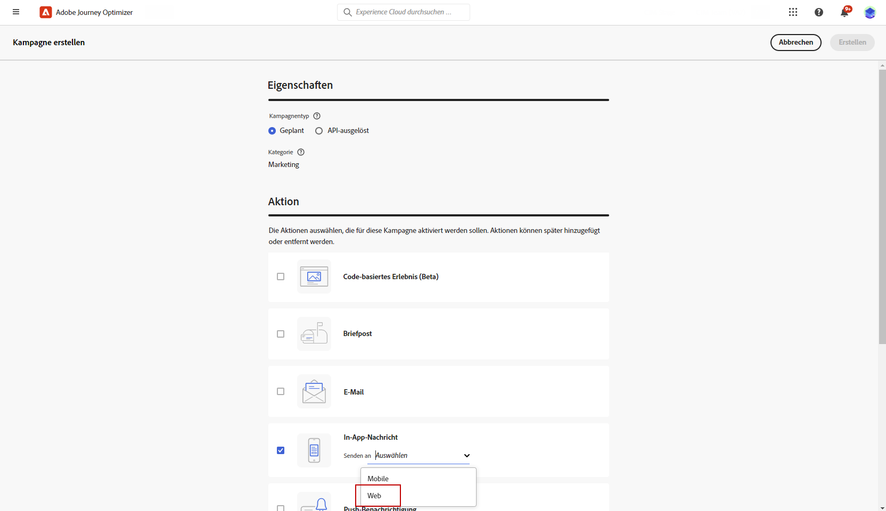
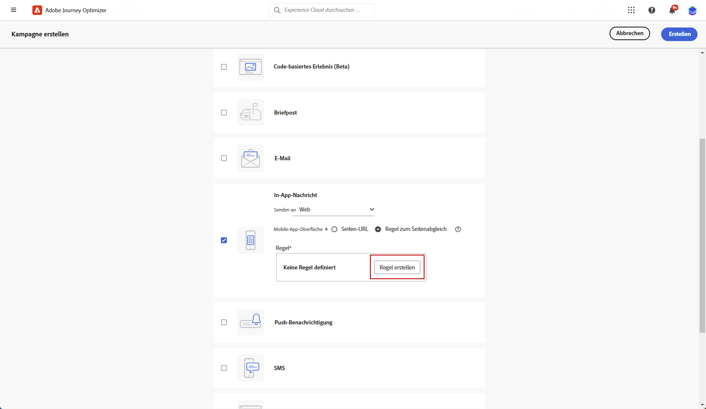
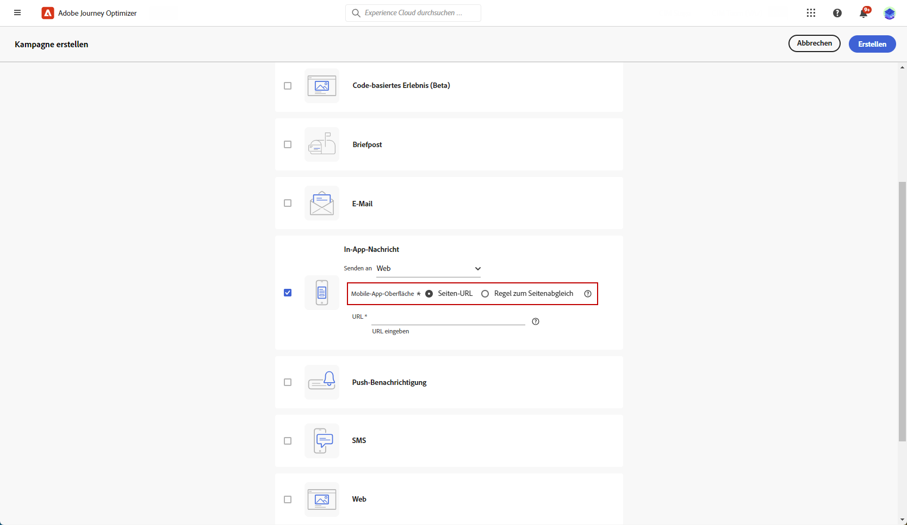
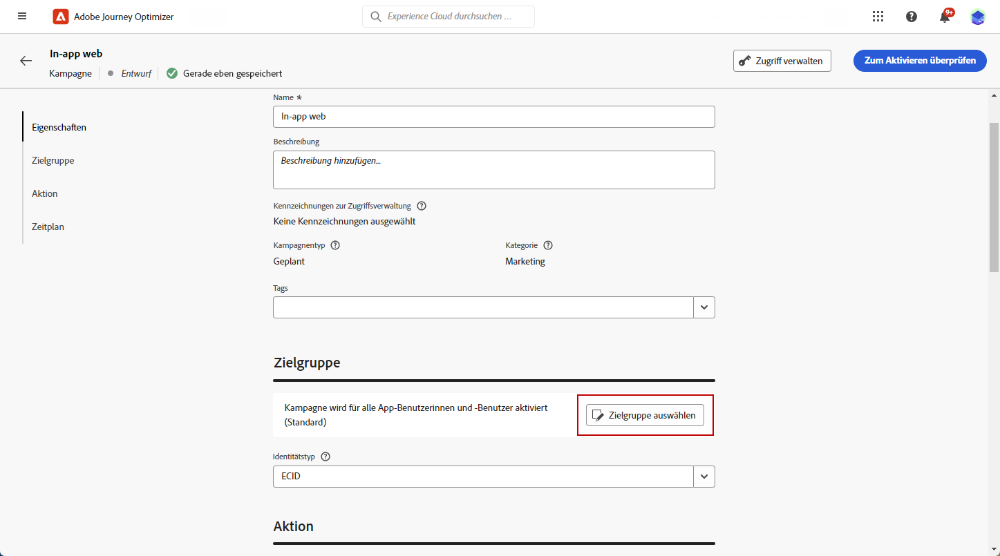
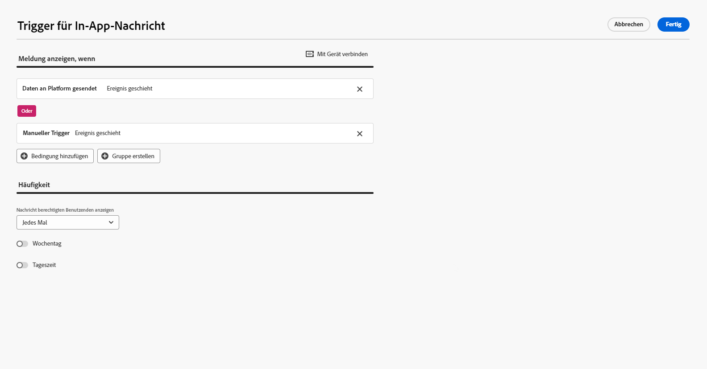
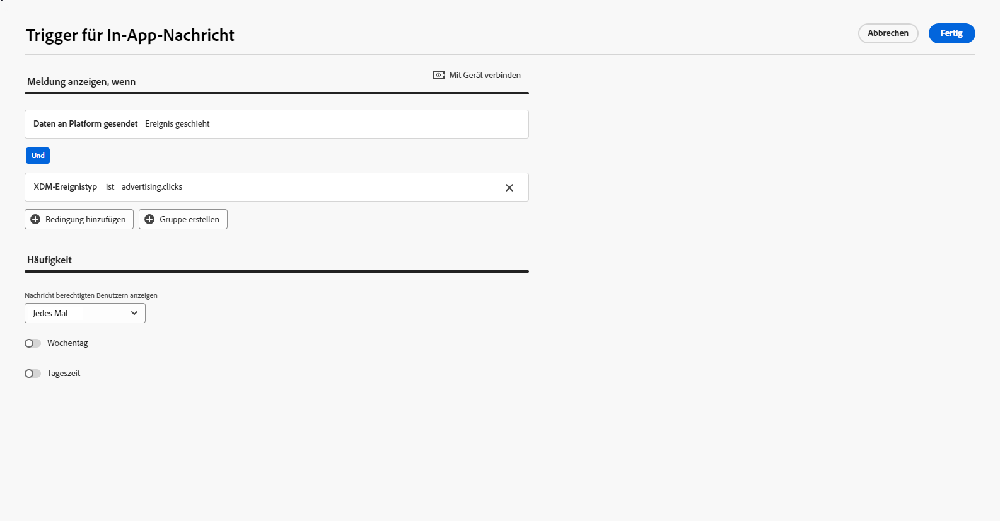
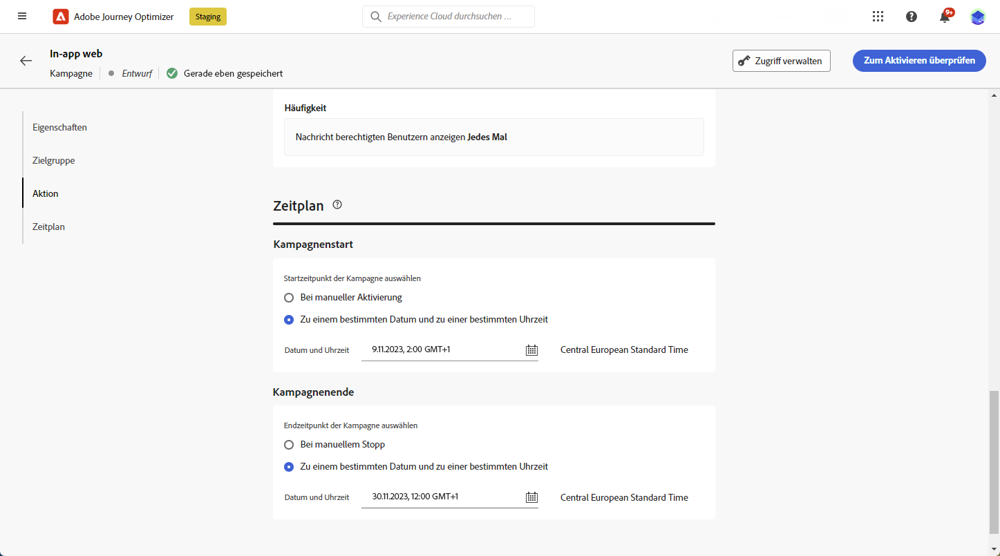
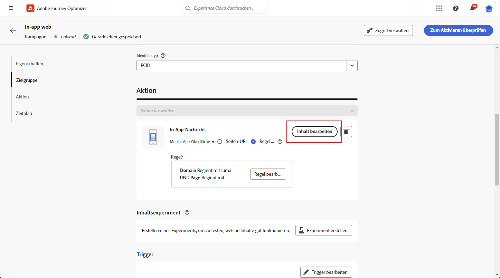

# Erstellen einer Web-In-App-Nachricht {#create-in-app-web}

## Konfigurieren des Web-In-App-Kanals {#configure-web-inapp}

Gehen Sie wie folgt vor, um Ihren Web-In-App-Kanal einzurichten:

* Installieren Sie die Web SDK-Tag-Erweiterung, um Web-In-App-Nachrichten zu unterstützen. [Weitere Informationen](https://experienceleague.adobe.com/docs/experience-platform/tags/extensions/client/web-sdk/web-sdk-extension-configuration.html?lang=de)

* Passen Sie Ihre Trigger an. Web-In-App-Nachrichten unterstützen zwei Arten von Triggern: „Daten an Platform gesendet“ und „Manuell“. [Weitere Informationen](https://experienceleague.adobe.com/docs/experience-platform/edge/personalization/ajo/web-in-app-messaging.html?lang=de)

## Erstellen einer Web-In-App-Nachrichtenkampagne {#create-inapp-web-campaign}

1. Rufen Sie das Menü **[!UICONTROL Kampagnen]** auf und klicken Sie auf **[!UICONTROL Kampagne erstellen]**.

1. Wählen Sie im Abschnitt **[!UICONTROL Eigenschaften]** den Ausführungstyp der Kampagne aus: Geplant oder API-ausgelöst. Weitere Informationen zu Kampagnentypen finden Sie auf [dieser Seite](../campaigns/create-campaign.md#campaigntype).

1. Wählen Sie im Abschnitt **[!UICONTROL Aktionen]** die Option **[!UICONTROL In-App-Nachricht]** aus. Wählen Sie im Dropdown-Menü **[!UICONTROL Senden an]** die Option „Web“ aus.

   

1. Definieren Sie eine Mobile-App-Oberfläche. Sie haben zwei Möglichkeiten, Änderungen vorzunehmen:

   * Sie können entweder eine **[!UICONTROL Seiten-URL]** eingeben, um Änderungen auf eine bestimmte Seite anzuwenden.

   * Sie können eine Regel erstellen, um mehrere URLs, die demselben Muster entsprechen, als Ziel festzulegen.

+++ Erstellen einer Regel zum Seitenabgleich

      1. Wählen Sie unter „Mobile-App-Oberfläche“ die Option **[!UICONTROL Regel zum Seitenabgleich]** aus.
      1. Klicken Sie auf **[!UICONTROL Regel erstellen]**.

         

      1. Definieren Sie im Fenster **[!UICONTROL Oberflächenregel bearbeiten]** die Kriterien für die Felder **[!UICONTROL Domain]** und **[!UICONTROL Seite]**.
      1. Personalisieren Sie Ihre Kriterien über die Dropdown-Listen für Bedingungen weiter.

         Wenn Sie beispielsweise Elemente bearbeiten möchten, die auf allen Sales-Seiten Ihrer Luma-Website angezeigt werden, wählen Sie „Domain“ > „Beginnt mit“ > „luma und Seite“ > „Enthält“ > „Sales“ aus.

         

      1. Speichern Sie Ihre Änderungen. Die Regel wird auf dem Bildschirm **[!UICONTROL Kampagne erstellen]** angezeigt.

+++

   

1. Nachdem Sie die Mobile-App-Oberfläche ausgewählt und konfiguriert haben, klicken Sie auf **[!UICONTROL Erstellen]**.

## Definieren der Web-In-App-Nachrichtenkampagne {#configure-inapp}

1. Geben Sie im Abschnitt **[!UICONTROL Eigenschaften]** den **[!UICONTROL Titel]** und die **[!UICONTROL Beschreibung]** ein.

1. Um der In-App-Nachricht benutzerdefinierte oder Core-Datennutzungskennzeichnungen zuzuweisen, wählen Sie **[!UICONTROL Zugang verwalten]** aus. [Weitere Informationen](../administration/object-based-access.md).

1. Klicken Sie auf die Schaltfläche **[!UICONTROL Zielgruppe auswählen]**, um die Zielgruppe aus der Liste der verfügbaren Adobe Experience Platform-Zielgruppen zu definieren. [Weitere Informationen](../audience/about-audiences.md).

   

1. Wählen Sie im Feld **[!UICONTROL Identity-Namespace]** den Namespace aus, der zur Identifizierung der Personen in der ausgewählten Zielgruppe verwendet werden soll. [Weitere Informationen](../event/about-creating.md#select-the-namespace).

1. Im Menü **[!UICONTROL Aktion]** finden Sie die zuvor unter **[!UICONTROL Mobile-App-Oberfläche]** konfigurierten Einstellungen. Sie können hier bei Bedarf Änderungen vornehmen oder Ihre Regel aktualisieren, indem Sie auf **[!UICONTROL Regel bearbeiten]** klicken.

1. Klicken Sie auf **[!UICONTROL Experiment erstellen]**, um mit der Konfiguration Ihres Inhaltsexperiments zu beginnen und Abwandlungen zu erstellen, deren Performance zu messen und die beste Option für Ihre Zielgruppe zu ermitteln. [Weitere Informationen](../campaigns/content-experiment.md)

1. Klicken Sie auf **[!UICONTROL Trigger bearbeiten]**, um die Ereignisse und Kriterien auszuwählen, die Ihre Nachricht auslösen sollen. Mit Rule Builder können Benutzerinnen und Benutzer Kriterien und Werte angeben, die, wenn sie erfüllt sind, eine Reihe von Aktionen auslösen, z. B. das Senden einer In-App-Nachricht.

   1. Klicken Sie auf die Ereignis-Dropdown-Liste, um Ihren Trigger bei Bedarf zu ändern.

      +++Siehe verfügbare Trigger.

      | Paket | Auslöser | Definition |
      |---|---|---|
      | Plattform | Daten an Platform gesendet | Wird ausgelöst, wenn die Mobile App ein Edge-Erlebnisereignis ausgibt, um Daten an die Adobe Experience Platform zu senden. Normalerweise der API-Aufruf [sendEvent](https://developer.adobe.com/client-sdks/documentation/edge-network/api-reference/#sendevent) aus der AEP Edge-Erweiterung. |
      | Manuell | Manueller Trigger | Zwei verknüpfte Datenelemente: ein Schlüssel, bei dem es sich um eine Konstante handelt, die den Datensatz definiert (beispielsweise Geschlecht, Farbe, Preis), und ein Wert, bei dem es sich um eine Variable handelt, die zum Datensatz gehört (z. B. männlich/weiblich, grün, 100). |

+++

   1. Klicken Sie auf die Schaltfläche **[!UICONTROL Bedingung hinzufügen]**, wenn Sie möchten, dass der Trigger mehrere Ereignisse oder Kriterien berücksichtigt.

   1. Wählen Sie die Bedingung **[!UICONTROL Oder]**, wenn Sie weitere **[!UICONTROL Trigger]** hinzufügen möchten, um Ihre Regel weiter zu erweitern.

      

   1. Wählen Sie die Bedingung **[!UICONTROL Und]**, wenn Sie ein benutzerdefiniertes **[!UICONTROL Merkmal]** hinzufügen und Ihre Regel besser anpassen möchten.

      +++Sehen Sie sich die verfügbaren Merkmale an.

      | Paket | Merkmal | Definition |
      |---|---|---|
      | Plattform | XDM-Ereignistyp | Wird ausgelöst, wenn der angegebene Ereignistyp vorliegt. |
      | Plattform | XDM-Wert | Wird ausgelöst, wenn der angegebene XDM-Wert vorliegt. |
+++

      

   1. Klicken Sie auf **[!UICONTROL Gruppe erstellen]**, um Trigger zu gruppieren.

1. Wählen Sie die Häufigkeit Ihres Auslösers aus, wenn Ihre In-App-Nachricht aktiv ist. Die folgenden Optionen sind verfügbar:

   * **[!UICONTROL Immer]**: Die Nachricht wird immer angezeigt, wenn die im Dropdown-Menü **[!UICONTROL Mobile-App-Trigger]** ausgewählten Ereignisse eintreten.
   * **[!UICONTROL Einmal anzeigen]**: Die Nachricht wird nur beim ersten Mal angezeigt, wenn die im Dropdown-Menü **[!UICONTROL Mobile-App-Trigger]** ausgewählten Ereignisse eintreten.
   * **[!UICONTROL Bis zu Clickthrough]**: Diese Nachricht wird anzeigt, wenn die im Dropdown-Menü **[!UICONTROL Mobile-App-Trigger]** ausgewählten Ereignisse eintreten, bis vom SDK ein Interaktionsereignis mit der Aktion „Angeklickt“ übermittelt wird.
   * **[!UICONTROL X-mal]**: Diese Nachricht wird X-mal angezeigt.

1. Wählen Sie bei Bedarf aus, an welchem **[!UICONTROL Wochentag]** oder zu welcher **[!UICONTROL Tageszeit]** die In-App-Nachricht angezeigt wird.

1. Kampagnen sind so konzipiert, dass sie an einem bestimmten Datum oder in regelmäßigen Abständen ausgeführt werden. Erfahren Sie in [diesem Abschnitt](../campaigns/create-campaign.md#schedule), wie Sie den **[!UICONTROL Zeitplan]** der Kampagne konfigurieren können.

   

1. Sie können jetzt über die Schaltfläche **[!UICONTROL Inhalt bearbeiten]** mit der Erstellung Ihrer Inhalte beginnen. [Weitere Informationen](design-in-app.md)

   

**Verwandte Themen:**

* [Testen und Senden der In-App-Nachricht](send-in-app.md)
* [In-App-Bericht](../reports/campaign-global-report.md#inapp-report)
* [In-App-Konfiguration](inapp-configuration.md)
