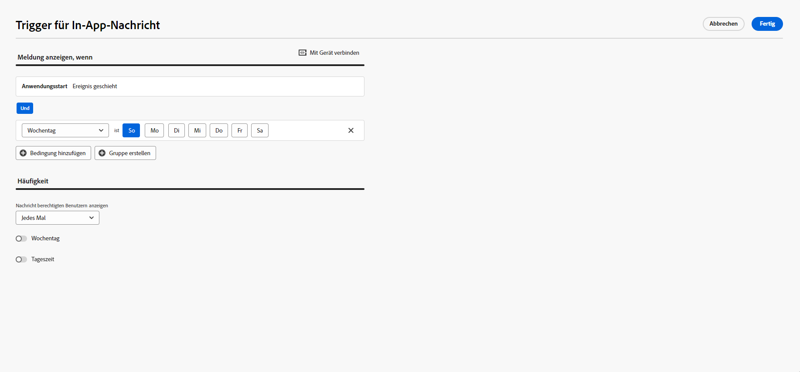

# Erstellen einer In-App-Nachricht {#create-in-app}

Sie können eine In-App-Nachricht zu einer Kampagne oder einem Journey hinzufügen. Gehen Sie wie folgt vor, um in beiden Kontexten eine In-App-Nachricht zu erstellen.

>[!BEGINTABS]

>[!TAB Hinzufügen einer In-App-Nachricht zu einer Journey]

Gehen Sie wie folgt vor, um eine In-App-Nachricht zu einer Journey hinzuzufügen:

1. Öffnen Sie Ihre Journey und ziehen Sie eine **[!UICONTROL In-App]**-Aktivität per Drag-and-Drop aus dem Bereich **[!UICONTROL Aktionen]** der Palette.

   Wenn ein Profil das Ende seiner Journey erreicht, laufen alle ihm angezeigten In-App-Nachrichten automatisch ab. Aus diesem Grund wird nach Ihrer In-App-Aktivität automatisch eine Warteaktivität hinzugefügt, um einen angemessenen Zeitpunkt zu gewährleisten.

   

1. Geben Sie einen **[!UICONTROL Titel]** und eine **[!UICONTROL Beschreibung]** für Ihre Nachricht ein.

1. Wählen Sie die [In-App-Oberfläche](inapp-configuration.md) aus, die verwendet werden soll.

   

1. Sie können jetzt über die Schaltfläche **[!UICONTROL Inhalt bearbeiten]** mit der Erstellung Ihrer Inhalte beginnen. [Weitere Informationen](design-in-app.md)

1. Klicken Sie auf **[!UICONTROL Trigger bearbeiten]**, um Ihren Trigger zu konfigurieren.

   

1. Wählen Sie die Häufigkeit Ihres Auslösers aus, wenn Ihre In-App-Nachricht aktiv ist:

   * **[!UICONTROL Jedes Mal anzeigen]**: Die Nachricht wird immer angezeigt, wenn die im Dropdown-Menü **[!UICONTROL Mobile-App-Auslöser]** ausgewählten Ereignisse eintreten.
   * **[!UICONTROL Einmal anzeigen]**: Die Nachricht wird nur beim ersten Mal angezeigt, wenn die im Dropdown-Menü **[!UICONTROL Mobile-App-Auslöser]** ausgewählten Ereignisse eintreten.
   * **[!UICONTROL Bis zu Clickthrough anzeigen]**: Diese Nachricht wird anzeigen, wenn die im Dropdown-Menü **[!UICONTROL Mobile-App-Auslöser]** ausgewählten Ereignisse eintreten, bis vom SDK ein Interaktionsereignis mit einer Aktion „angeklickt“ übermittelt wird.

1. Wählen Sie aus dem/den Dropdown-Menü(s) **[!UICONTROL Mobile-App-Auslöser]** die Ereignisse und Kriterien aus, die Ihre Nachricht auslösen:

   1. Wählen Sie aus der linken Dropdown-Liste das Ereignis aus, das eintreten muss, damit Ihre Nachricht ausgelöst wird.
   1. Wählen Sie aus der rechten Dropdown-Liste die für das ausgewählte Ereignis erforderliche Validierung aus.
   1. Klicken Sie auf die Schaltfläche **[!UICONTROL Hinzufügen]**, wenn Sie möchten, dass der Auslöser mehrere Ereignisse oder Kriterien berücksichtigt. Wiederholen Sie dann die obigen Schritte.
   1. Wählen Sie die Art der Verknüpfung Ihrer Ereignisse aus, z. B. **[!UICONTROL Und]**, wenn Sie möchten, dass **beide** Auslöser erfüllt sind, damit eine Nachricht angezeigt wird. Wählen Sie stattdessen **[!UICONTROL Oder]**, wenn Sie möchten, dass die Nachricht angezeigt, dass **einer** der Auslöser erfüllt ist.
   1. Klicken Sie auf **[!UICONTROL Speichern]**, wenn Ihre Triggers konfiguriert sind.

   

1. Schließen Sie bei Bedarf Ihren Journey-Fluss ab, indem Sie zusätzliche Aktionen oder Ereignisse per Drag-and-Drop verschieben. [Weitere Informationen](../building-journeys/about-journey-activities.md)

1. Sobald Ihre In-App-Nachricht fertig ist, schließen Sie die Konfiguration ab und veröffentlichen Sie Ihre Journey, um sie zu aktivieren.

Weitere Informationen zur Konfiguration einer Journey finden Sie auf [dieser Seite](../building-journeys/journey-gs.md).

>[!TAB Hinzufügen einer In-App-Nachricht zu einer Kampagne]

Gehen Sie wie folgt vor, um einer Kampagne eine In-App-Nachricht hinzuzufügen:

1. Rufen Sie das Menü **[!UICONTROL Kampagnen]** auf und klicken Sie auf **[!UICONTROL Kampagne erstellen]**.

1. Wählen Sie im Abschnitt **[!UICONTROL Eigenschaften]** den Ausführungstyp der Kampagne aus: Geplant oder API-ausgelöst. Weitere Informationen zu Kampagnentypen finden Sie auf [dieser Seite](../campaigns/create-campaign.md#campaigntype).

1. Wählen Sie im Bereich **[!UICONTROL Aktionen]** die **[!UICONTROL In-App-Nachricht]** und die **[!UICONTROL Programmoberfläche]** aus, die Sie zuvor für Ihre In-App-Nachricht konfiguriert haben. Klicken Sie dann auf **[!UICONTROL Erstellen]**.

   Erfahren Sie mehr über In-App-Konfiguration auf [dieser Seite](inapp-configuration.md).

   

1. Geben Sie im Abschnitt **[!UICONTROL Eigenschaften]** den **[!UICONTROL Titel]** und die **[!UICONTROL Beschreibung]** ein.

1. Um der In-App-Nachricht benutzerdefinierte oder Core-Datennutzungskennzeichnungen zuzuweisen, wählen Sie **[!UICONTROL Zugang verwalten]** aus. [Weitere Informationen](../administration/object-based-access.md).

1. Klicken Sie auf die Schaltfläche **[!UICONTROL Zielgruppe auswählen]**, um die Zielgruppe aus der Liste der verfügbaren Adobe Experience Platform-Zielgruppen zu definieren. [Weitere Informationen](../audience/about-audiences.md).

   

1. Wählen Sie im Feld **[!UICONTROL Identity-Namespace]** den Namespace aus, der zur Identifizierung der Personen in der ausgewählten Zielgruppe verwendet werden soll. [Weitere Informationen](../event/about-creating.md#select-the-namespace).

1. Klicken Sie auf **[!UICONTROL Experiment erstellen]**, um mit der Konfiguration Ihres Inhaltsexperiments zu beginnen und Abwandlungen zu erstellen, deren Leistung zu messen und die beste Option für Ihre Zielgruppe zu ermitteln. [Weitere Informationen](../campaigns/content-experiment.md)

1. Klicken Sie auf **[!UICONTROL Trigger bearbeiten]**, um die Ereignisse und Kriterien auszuwählen, die Ihre Nachricht auslösen sollen. Mit Rule Builder können Benutzerinnen und Benutzer Kriterien und Werte angeben, die, wenn sie erfüllt sind, eine Reihe von Aktionen auslösen, z. B. das Senden einer In-App-Nachricht.

   1. Klicken Sie auf die Ereignis-Dropdown-Liste, um Ihren Trigger bei Bedarf zu ändern.

   1. Klicken Sie auf die Schaltfläche **[!UICONTROL Bedingung hinzufügen]**, wenn Sie möchten, dass der Trigger mehrere Ereignisse oder Kriterien berücksichtigt.

   1. Wählen Sie die Bedingung **[!UICONTROL Oder]**, wenn Sie weitere **[!UICONTROL Trigger]** hinzufügen möchten, um Ihre Regel weiter zu erweitern.

      

   1. Wählen Sie die Bedingung **[!UICONTROL Und]**, wenn Sie **[!UICONTROL Merkmale]** hinzufügen und Ihre Regel besser anpassen möchten.

      +++Sehen Sie sich die verfügbaren Eigenschaften an.

      | Package | Eigenschaften  | Definition |
      |---|---|---|
      | Geräteinformationen | Betreibername | Wird ausgelöst, wenn einer der Betreibernamen aus der Liste vorliegt. |
      | Geräteinformationen | Gerätename | Wird ausgelöst, wenn einer der Gerätenamen vorliegt |
      | Geräteinformationen | Gebietsschema | Wird ausgelöst, wenn eine der Sprachen aus der Liste vorliegt. |
      | Geräteinformationen | Betriebssystemversion | Wird ausgelöst, wenn eine der angegebenen Betriebssystemversionen vorliegt. |
      | Geräteinformationen | Vorherige Betriebssystemversion | Wird ausgelöst, wenn eine der angegebenen vorherigen Betriebssystemversionen vorliegt. |
      | Geräteinformationen | Betriebsmodus | Wird ausgelöst, wenn der Betriebsmodus entweder eine Anwendung oder eine Erweiterung ist. |
      | Anwendungslebenszyklus | App-ID | Wird ausgelöst, wenn die angegebene App-ID vorliegt. |
      | Anwendungslebenszyklus | Wochentag | Wird ausgelöst, wenn der angegebene Wochentag vorliegt. |
      | Anwendungslebenszyklus | Tag seit der ersten Verwendung | Wird ausgelöst, wenn die angegebene Anzahl von Tagen seit der ersten Verwendung erreicht ist. |
      | Anwendungslebenszyklus | Tag seit der letzten Verwendung | Wird ausgelöst, wenn die angegebene Anzahl von Tagen seit der letzten Verwendung erreicht ist. |
      | Anwendungslebenszyklus | Tage seit Aktualisierung | Wird ausgelöst, wenn die angegebene Anzahl von Tagen seit der letzten Aktualisierung erreicht ist. |
      | Anwendungslebenszyklus | Installationsdatum | Wird ausgelöst, wenn das angegebene Installationsdatum erreicht ist. |
      | Anwendungslebenszyklus | Starts | Wird ausgelöst, wenn die angegebene Anzahl von Starts erreicht ist. |
      | Anwendungslebenszyklus | Tageszeit | Wird ausgelöst, wenn die angegebene Tageszeit erreicht ist. |
      | Places | Aktueller POI | Wird vom Places-SDK ausgelöst, wenn Ihre Kundin bzw. Ihr Kunde den festgelegten Zielpunkt (Point of Interest, POI) aufruft. |
      | Places | Zuletzt eingegebener POI | Wird vom Places-SDK ausgelöst, je nachdem, welcher Zielpunkt (Point of Interest, POI) zuletzt von Ihrer Kundin bzw. Ihrem Kunden eingegeben wurde. |
      | Places | Letzter verlassener POI | Wird vom Places-SDK ausgelöst, je nachdem, welcher Zielpunkt (Point of Interest, POI) von Ihrer Kundin bzw. Ihrem Kunden zuletzt verlassen wurde. |

+++

      

   1. Klicken Sie auf **[!UICONTROL Gruppe erstellen]**, um Trigger zu gruppieren.

1. Wählen Sie die Häufigkeit Ihres Auslösers aus, wenn Ihre In-App-Nachricht aktiv ist. Die folgenden Optionen sind verfügbar:

   * **[!UICONTROL Immer]**: Die Nachricht wird immer angezeigt, wenn die im Dropdown-Menü **[!UICONTROL Mobile-App-Trigger]** ausgewählten Ereignisse eintreten.
   * **[!UICONTROL Einmal anzeigen]**: Die Nachricht wird nur beim ersten Mal angezeigt, wenn die im Dropdown-Menü **[!UICONTROL Mobile-App-Trigger]** ausgewählten Ereignisse eintreten.
   * **[!UICONTROL Bis zu Clickthrough]**: Diese Nachricht wird anzeigt, wenn die im Dropdown-Menü **[!UICONTROL Mobile-App-Trigger]** ausgewählten Ereignisse eintreten, bis vom SDK ein Interaktionsereignis mit der Aktion „Angeklickt“ übermittelt wird.
   * **[!UICONTROL X-mal]**: Diese Nachricht wird X-mal angezeigt.

1. Wählen Sie bei Bedarf aus, an welchem **[!UICONTROL Wochentag]** oder zu welcher **[!UICONTROL Tageszeit]** die In-App-Nachricht angezeigt wird.

1. Kampagnen sind so konzipiert, dass sie an einem bestimmten Datum oder in regelmäßigen Abständen ausgeführt werden. Erfahren Sie in [diesem Abschnitt](../campaigns/create-campaign.md#schedule), wie Sie den **[!UICONTROL Zeitplan]** der Kampagne konfigurieren können.

   

1. Sie können jetzt über die Schaltfläche **[!UICONTROL Inhalt bearbeiten]** mit der Erstellung Ihrer Inhalte beginnen. [Weitere Informationen](design-in-app.md)

   

>[!ENDTABS]

## Anleitungsvideos{#video}

* Das folgende Video zeigt, wie Sie In-App-Nachrichten in Ihren Kampagnen erstellen, konfigurieren und veröffentlichen können.

  >[!VIDEO](https://video.tv.adobe.com/v/3410430?quality=12&learn=on)

* Erfahren Sie im folgenden Video, wie Sie Inhaltsexperimente konfigurieren und analysieren, um In-App-Nachrichten mit A/B-Tests zu testen.

  >[!VIDEO](https://video.tv.adobe.com/v/3419898)

**Verwandte Themen:**

* [Entwerfen der In-App-Nachricht](design-in-app.md)
* [Testen und Senden der In-App-Nachricht](send-in-app.md)
* [In-App-Bericht](../reports/campaign-global-report.md#inapp-report)
* [In-App-Konfiguration](inapp-configuration.md)