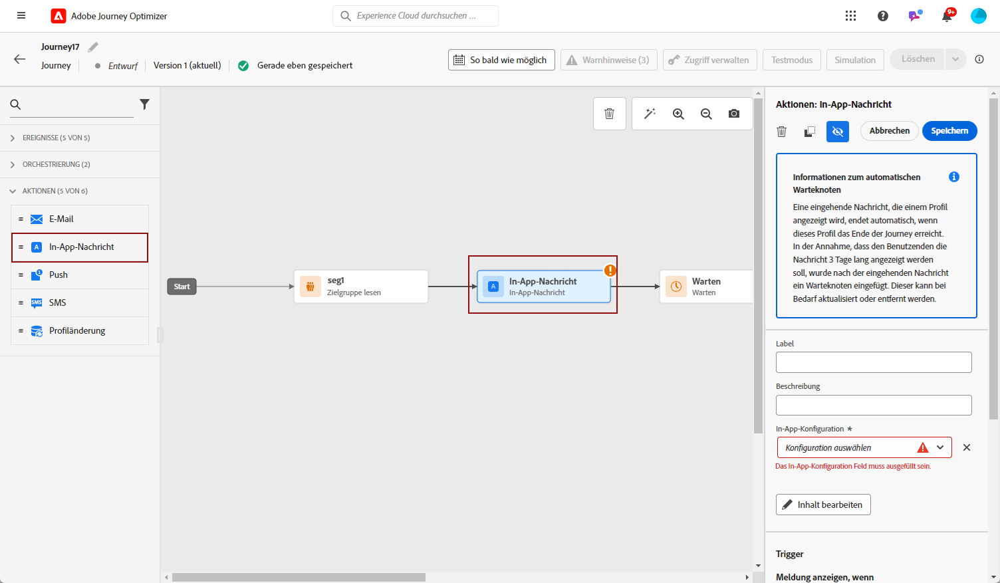
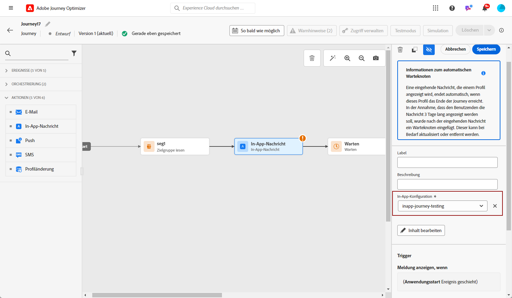
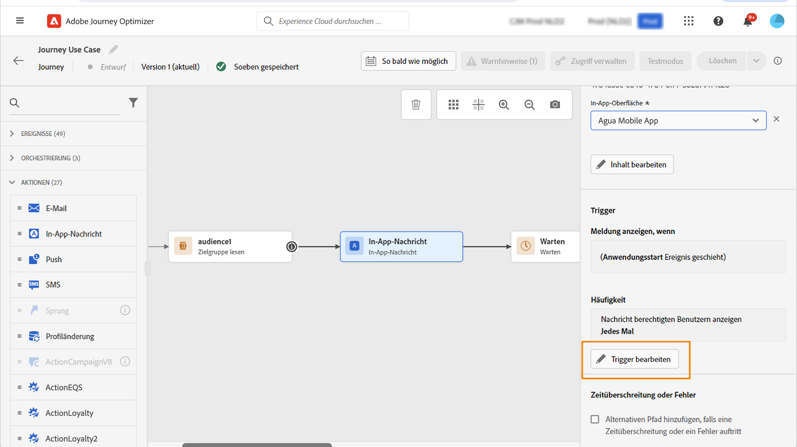
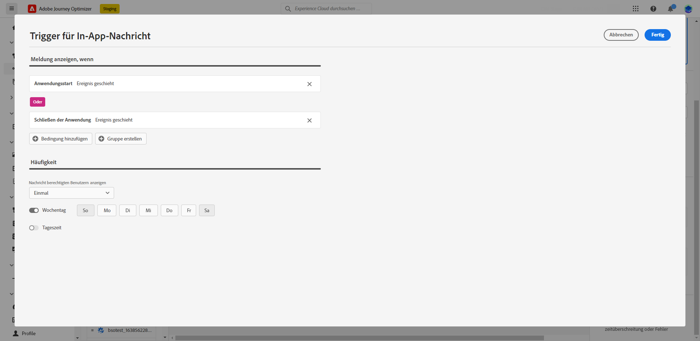
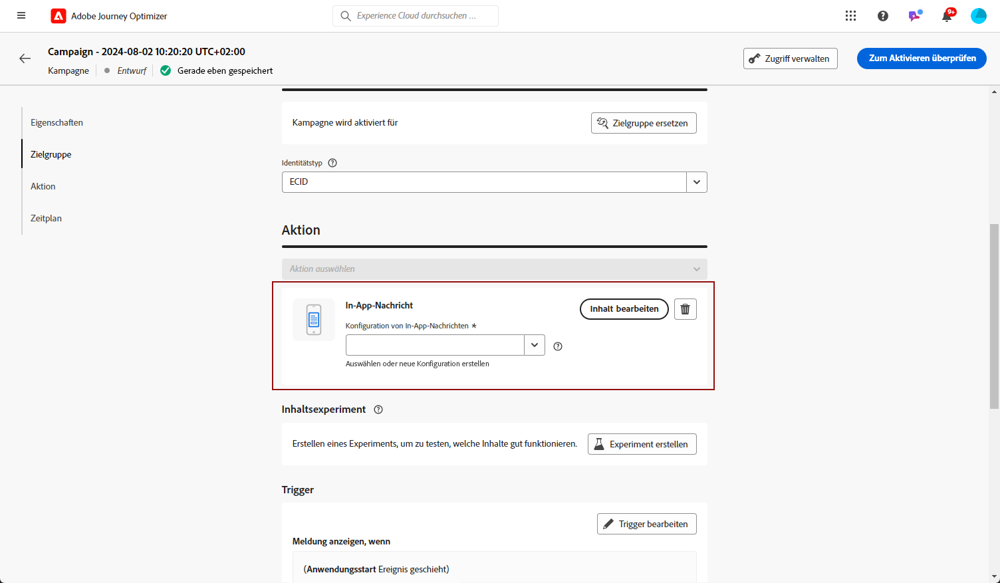
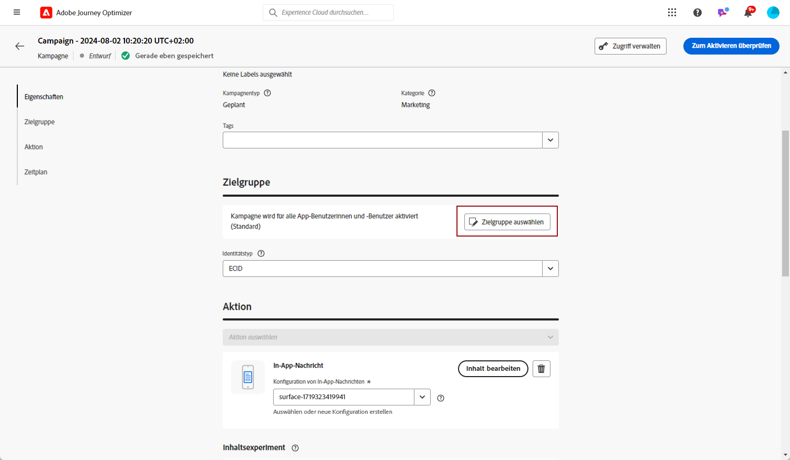
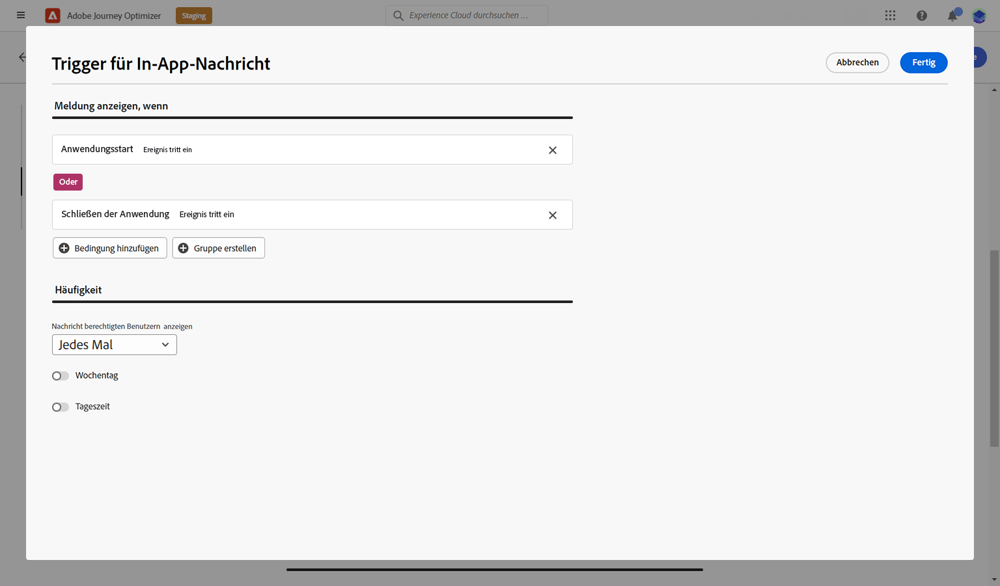
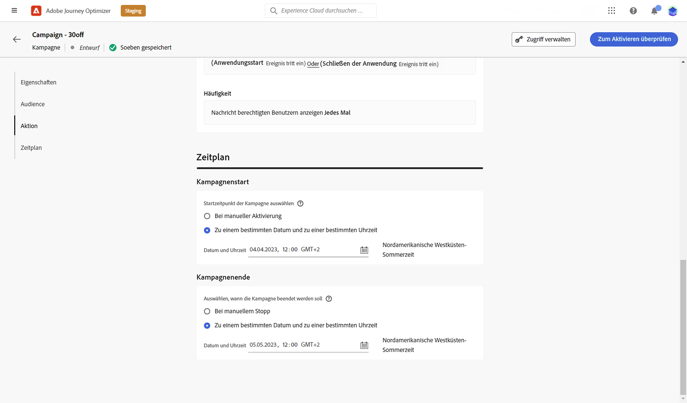
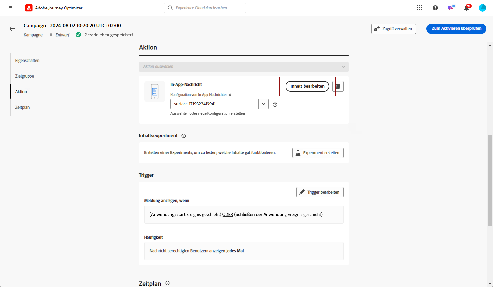

# Erstellen einer In-App-Nachricht {#create-in-app}

In-App-Nachrichten werden im Kontext einer Kampagne erstellt.

>[!BEGINTABS]

>[!TAB In-App-Nachricht zu einer Journey hinzufügen]

>[!AVAILABILITY]
>
>Die In-App-Aktivität ist derzeit als Beta-Version verfügbar, über die nur Benutzer ausgewählt werden können. Wenden Sie sich an die Kundenunterstützung von Adobe, um am Beta-Programm teilzunehmen.

1. Öffnen Sie Ihre Journey und ziehen Sie eine **[!UICONTROL In-App]** -Aktivität aus **[!UICONTROL Aktionen]** in der Palette.

   Wenn ein Profil das Ende seiner Journey erreicht, laufen alle ihm angezeigten In-App-Nachrichten automatisch ab. Aus diesem Grund wird nach Ihrer In-App-Aktivität automatisch eine Warteaktivität hinzugefügt, um einen angemessenen Zeitpunkt zu gewährleisten.

   

1. Geben Sie einen **[!UICONTROL Titel]** und **[!UICONTROL Beschreibung]** für Ihre Nachricht.

1. Wählen Sie die [In-App-Oberfläche](inapp-configuration.md) verwendet werden.

   

1. Sie können jetzt über die Schaltfläche **[!UICONTROL Inhalt bearbeiten]** mit der Erstellung Ihrer Inhalte beginnen. [Weitere Informationen](design-in-app.md)

1. Klicken **[!UICONTROL Trigger bearbeiten]** , um Ihren Trigger zu konfigurieren.

   

1. Wählen Sie die Häufigkeit Ihres Auslösers aus, wenn Ihre In-App-Nachricht aktiv ist:

   * **[!UICONTROL Jedes Mal anzeigen]**: Die Nachricht wird immer angezeigt, wenn die im Dropdown-Menü **[!UICONTROL Mobile-App-Auslöser]** ausgewählten Ereignisse eintreten.
   * **[!UICONTROL Einmal anzeigen]**: Die Nachricht wird nur beim ersten Mal angezeigt, wenn die im Dropdown-Menü **[!UICONTROL Mobile-App-Auslöser]** ausgewählten Ereignisse eintreten.
   * **[!UICONTROL Bis zu Clickthrough anzeigen]**: Diese Nachricht wird anzeigen, wenn die im Dropdown-Menü **[!UICONTROL Mobile-App-Auslöser]** ausgewählten Ereignisse eintreten, bis vom SDK ein Interaktionsereignis mit einer Aktion „angeklickt“ übermittelt wird.

1. Wählen Sie aus dem/den Dropdown-Menü(s) **[!UICONTROL Mobile-App-Auslöser]** die Ereignisse und Kriterien aus, die Ihre Nachricht auslösen:

   1. Wählen Sie aus der linken Dropdown-Liste das Ereignis aus, das eintreten muss, damit Ihre Nachricht ausgelöst wird.
   1. Wählen Sie aus der rechten Dropdown-Liste die für das ausgewählte Ereignis erforderliche Validierung aus.
   1. Klicken Sie auf die Schaltfläche **[!UICONTROL Hinzufügen]**, wenn Sie möchten, dass der Auslöser mehrere Ereignisse oder Kriterien berücksichtigt. Wiederholen Sie dann die obigen Schritte.
   1. Wählen Sie die Art der Verknüpfung Ihrer Ereignisse aus, z. B. **[!UICONTROL Und]**, wenn Sie möchten, dass **beide** Auslöser erfüllt sind, damit eine Nachricht angezeigt wird. Wählen Sie stattdessen **[!UICONTROL Oder]**, wenn Sie möchten, dass die Nachricht angezeigt, dass **einer** der Auslöser erfüllt ist.
   1. Klicken **[!UICONTROL Speichern]** wenn Ihre Trigger konfiguriert wurden.

   

1. Schließen Sie bei Bedarf Ihren Journey-Fluss ab, indem Sie zusätzliche Aktionen oder Ereignisse per Drag-and-Drop verschieben. [Weitere Informationen](../building-journeys/about-journey-activities.md)

1. Sobald Ihre In-App-Nachricht fertig ist, schließen Sie die Konfiguration ab und veröffentlichen Sie Ihre Journey, um sie zu aktivieren.

Weitere Informationen zur Konfiguration einer Journey finden Sie auf [dieser Seite](../building-journeys/journey-gs.md).

>[!TAB In-App-Nachricht zu einer Kampagne hinzufügen]

1. Rufen Sie das Menü **[!UICONTROL Kampagnen]** auf und klicken Sie auf **[!UICONTROL Kampagne erstellen]**.

1. Wählen Sie im Abschnitt **[!UICONTROL Eigenschaften]** den Ausführungstyp der Kampagne aus: Geplant oder API-ausgelöst. Weitere Informationen zu Kampagnentypen finden Sie auf [dieser Seite](../campaigns/create-campaign.md#campaigntype).

1. Wählen Sie im Bereich **[!UICONTROL Aktionen]** die **[!UICONTROL In-App-Nachricht]** und die **[!UICONTROL Programmoberfläche]** aus, die Sie zuvor für Ihre In-App-Nachricht konfiguriert haben. Klicken Sie dann auf **[!UICONTROL Erstellen]**.

   Erfahren Sie mehr über In-App-Konfiguration auf [dieser Seite](inapp-configuration.md).

   

1. Geben Sie im Abschnitt **[!UICONTROL Eigenschaften]** den **[!UICONTROL Titel]** und die **[!UICONTROL Beschreibung]** ein.

1. Um der In-App-Nachricht benutzerdefinierte oder Core-Datennutzungskennzeichnungen zuzuweisen, wählen Sie **[!UICONTROL Zugang verwalten]** aus. [Weitere Informationen](../administration/object-based-access.md).

1. Klicken Sie auf die Schaltfläche **[!UICONTROL Audience auswählen]**, um die Audience aus der Liste der verfügbaren Adobe Experience Platform-Segmente zu definieren. [Weitere Informationen](../segment/about-segments.md).

   

1. Wählen Sie im Feld **[!UICONTROL Identity-Namespace]** den Namespace aus, der zur Identifizierung der Personen im ausgewählten Segment verwendet werden soll. [Weitere Informationen](../event/about-creating.md#select-the-namespace).

1. Klicken Sie auf **[!UICONTROL Trigger bearbeiten]**, um die Ereignisse und Kriterien auszuwählen, die Ihre Nachricht auslösen sollen:

   1. Klicken Sie auf die Schaltfläche **Bedingung hinzufügen**, wenn Sie möchten, dass der Trigger mehrere Ereignisse oder Kriterien berücksichtigt.
   1. Wählen Sie die Art der Verknüpfung Ihrer Ereignisse aus, z. B. **[!UICONTROL Und]**, wenn Sie möchten, dass **beide** Auslöser erfüllt sind, damit eine Nachricht angezeigt wird. Wählen Sie stattdessen **[!UICONTROL Oder]**, wenn Sie möchten, dass die Nachricht angezeigt wird, wenn **einer** der Auslöser erfüllt ist.
   1. Klicken Sie auf **[!UICONTROL Gruppe erstellen]**, um Trigger zu gruppieren.

   

1. Wählen Sie die Häufigkeit Ihres Auslösers aus, wenn Ihre In-App-Nachricht aktiv ist. Die folgenden Optionen sind verfügbar:

   * **[!UICONTROL Immer]**: Die Nachricht wird immer angezeigt, wenn die im Dropdown-Menü **[!UICONTROL Mobile-App-Trigger]** ausgewählten Ereignisse eintreten.
   * **[!UICONTROL Einmal anzeigen]**: Die Nachricht wird nur beim ersten Mal angezeigt, wenn die im Dropdown-Menü **[!UICONTROL Mobile-App-Trigger]** ausgewählten Ereignisse eintreten.
   * **[!UICONTROL Bis zu Clickthrough]**: Diese Nachricht wird anzeigt, wenn die im Dropdown-Menü **[!UICONTROL Mobile-App-Trigger]** ausgewählten Ereignisse eintreten, bis vom SDK ein Interaktionsereignis mit der Aktion „Angeklickt“ übermittelt wird.
   * **[!UICONTROL X-mal]**: Diese Nachricht wird X-mal angezeigt.

1. Wählen Sie bei Bedarf aus, an welchem **[!UICONTROL Wochentag]** oder zu welcher **[!UICONTROL Tageszeit]** die In-App-Nachricht angezeigt wird.

1. Kampagnen sind so konzipiert, dass sie an einem bestimmten Datum oder in regelmäßigen Abständen ausgeführt werden. Erfahren Sie in [diesem Abschnitt](../campaigns/create-campaign.md#schedule), wie Sie den **[!UICONTROL Zeitplan]** der Kampagne konfigurieren können.

   

1. Sie können jetzt über die Schaltfläche **[!UICONTROL Inhalt bearbeiten]** mit der Erstellung Ihrer Inhalte beginnen. [Weitere Informationen](design-in-app.md)

   

>[!ENDTABS]

## Anleitungsvideo{#video}

Das folgende Video zeigt, wie Sie In-App-Nachrichten in Ihren Kampagnen erstellen, konfigurieren und veröffentlichen können.

>[!VIDEO](https://video.tv.adobe.com/v/3410430?quality=12&learn=on)

**Verwandte Themen:**

* [Entwerfen der In-App-Nachricht](design-in-app.md)
* [Testen und Senden der In-App-Nachricht](send-in-app.md)
* [In-App-Bericht](../reports/campaign-global-report.md#inapp-report)
* [In-App-Konfiguration](inapp-configuration.md)