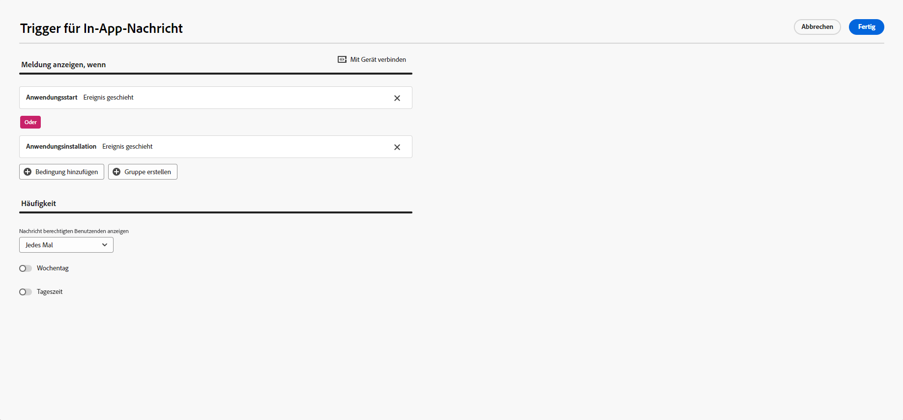
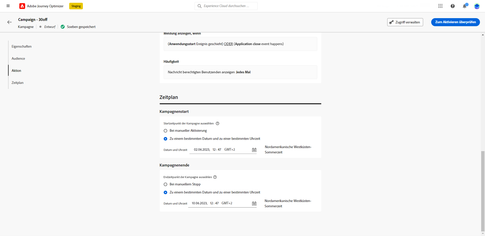
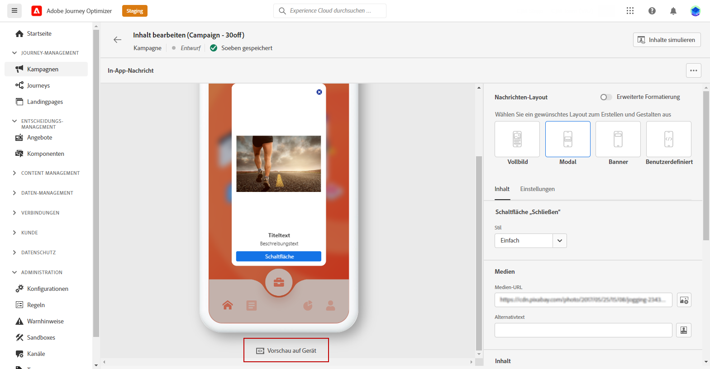

# In-App-Nachricht erstellen {#create-in-app}

## Kampagne und In-App-Nachricht erstellen{#create-in-app-in-a-campaign}

Gehen Sie wie folgt vor, um eine In-App-Nachricht zu erstellen:

1. Rufen Sie das Menü **[!UICONTROL Kampagnen]** auf und klicken Sie auf **[!UICONTROL Kampagne erstellen]**.

1. Geben Sie im Abschnitt **[!UICONTROL Eigenschaften]** an, wann Sie die Kampagne ausführen möchten.

1. Im **[!UICONTROL Aktionen]** wählen Sie die **[!UICONTROL In-App-Nachricht]** und **[!UICONTROL Anwendungsoberfläche]** zuvor für Ihre In-App-Nachricht konfiguriert. Wählen Sie dann **[!UICONTROL Erstellen]** aus.

   [Weitere Informationen zur In-App-Konfiguration](inapp-configuration.md).

   

1. Aus dem **[!UICONTROL Eigenschaften]** bearbeiten, bearbeiten Sie die **[!UICONTROL Titel]** und **[!UICONTROL Beschreibung]**.

1. Um der Landingpage benutzerdefinierte oder Core-Datennutzungsbezeichnungen zuzuweisen, wählen Sie **[!UICONTROL Zugriff verwalten]**. [Weitere Informationen](../administration/object-based-access.md).

1. Klicken Sie auf **[!UICONTROL Zielgruppe auswählen]** -Schaltfläche, um die Zielgruppe aus der Liste der verfügbaren Adobe Experience Platform-Segmente zu definieren. [Weitere Informationen](../segment/about-segments.md).

   

1. Wählen Sie im Feld **[!UICONTROL Identity-Namespace]** den Namespace aus, der zur Identifizierung der Personen im ausgewählten Segment verwendet werden soll. [Weitere Informationen](../event/about-creating.md#select-the-namespace).

1. Wählen Sie die Häufigkeit Ihres Triggers aus, wenn Ihre In-App-Nachricht aktiv ist:

   * **[!UICONTROL Jedes Mal anzeigen]**
   * **[!UICONTROL Einmal anzeigen]**
   * **[!UICONTROL Anzeigen bis zum Clickthrough]**

1. Wählen Sie das Ereignis aus, mit dem Ihre Nachricht von der **[!UICONTROL App-Trigger]**
Dropdown-Liste.

   Durch Auswahl eines Triggers legen Sie fest, durch welche Benutzeraktion die In-App-Nachricht angezeigt wird.

   

1. Kampagnen sind so konzipiert, dass sie an einem bestimmten Datum oder in regelmäßigen Abständen ausgeführt werden. Erfahren Sie, wie Sie die **[!UICONTROL Zeitplan]** der Kampagne in [diesem Abschnitt](../campaigns/create-campaign.md#schedule).

   

1. Sie können jetzt mit der Erstellung Ihres Inhalts beginnen mit der **[!UICONTROL Inhalt bearbeiten]** Schaltfläche.

   

## In-App-Nachrichten senden{#in-app-send}

### Vorschau auf Gerät {#preview-device}

Sie können eine Vorschau der In-App-Benachrichtigung auf einem bestimmten Gerät anzeigen.

1. Klicken **[!UICONTROL Vorschau auf Gerät]**.

   

1. Aus dem **[!UICONTROL Mit Gerät verbinden]** Fenster, klicken Sie auf **[!UICONTROL Starten]**.

1. Geben Sie im Feld **[!UICONTROL Basis-URL]** und klicken Sie auf **[!UICONTROL Nächste]**.

   

1. Scannen Sie den QR-Code mit Ihrem Gerät und geben Sie den angezeigten PIN-Code ein.

Ihre In-App-Nachricht kann jetzt direkt auf Ihrem Gerät ausgelöst werden, sodass Sie Ihre Nachricht auf einem Gerät in der Vorschau anzeigen und überprüfen können.

### Überprüfen und aktivieren Sie Ihre In-App-Benachrichtigung{#in-app-review}

Nachdem Sie Ihre In-App-Nachricht erstellt und deren Inhalt definiert und personalisiert haben, können Sie sie überprüfen und aktivieren.

Gehen Sie dazu wie folgt vor:

1. Verwenden Sie die **[!UICONTROL Aktivieren]** -Schaltfläche, um eine Zusammenfassung Ihrer Nachricht anzuzeigen.

   In der Zusammenfassung können Sie die Kampagne bei Bedarf ändern und überprüfen, ob ein Parameter falsch ist oder fehlt.

   

1. Vergewissern Sie sich, dass Ihre Kampagne korrekt konfiguriert ist, und klicken Sie dann auf **[!UICONTROL Aktivieren]**.

Ihre Kampagne ist jetzt aktiviert. Die in der Kampagne konfigurierte In-App-Benachrichtigung wird sofort oder am angegebenen Datum gesendet.

Nach dem Versand können Sie die Wirkung Ihrer In-App-Nachrichten im Campaign-Bericht messen. Weiterführende Informationen zum Reporting finden Sie in [diesem Abschnitt](inapp-report.md).

**Verwandte Themen:**

* [In-App-Nachricht erstellen](design-in-app.md)
* [In-App-Bericht](inapp-report.md)
* [In-App-Konfiguration](inapp-configuration.md)
