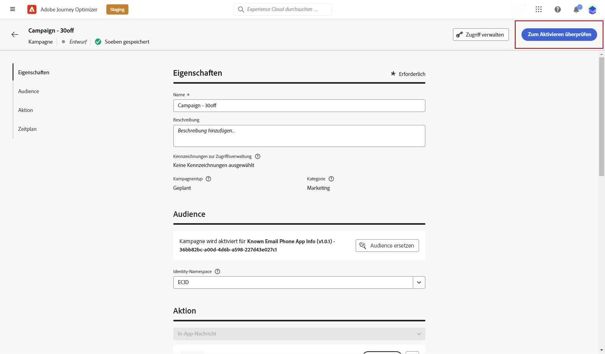

# In-App-Nachricht erstellen {#create-in-app}

## Kampagne und In-App-Nachricht erstellen{#create-in-app-in-a-campaign}

Gehen Sie wie folgt vor, um eine In-App-Nachricht zu erstellen:

1. Zugriff auf **[!UICONTROL Campaigns]** Menü und klicken Sie auf **[!UICONTROL Create campaign]**.

1. Im **[!UICONTROL Properties]** den Zeitpunkt der Kampagnenausführung festlegen.

1. Im **[!UICONTROL Actions]** wählen Sie die **[!UICONTROL In-app message]** und **[!UICONTROL App surface]** zuvor für Ihre In-App-Nachricht konfiguriert. Klicken Sie anschließend auf **[!UICONTROL Create]**.

   [Weitere Informationen zur In-App-Konfiguration](inapp-configuration.md).

   

1. Aus dem **[!UICONTROL Properties]** bearbeiten, bearbeiten Sie die **[!UICONTROL Title]** und **[!UICONTROL Description]**.

1. Um der Landingpage benutzerdefinierte oder Core-Datennutzungsbezeichnungen zuzuweisen, wählen Sie **[!UICONTROL Manage access]**. [Weitere Infos](../administration/object-based-access.md).

1. Klicken Sie auf **[!UICONTROL Select audience]** -Schaltfläche, um die Zielgruppe zu definieren, die aus der Liste der verfügbaren Adobe Experience Platform-Segmente ausgewählt werden soll. [Weitere Infos](../segment/about-segments.md).

   

1. Im **[!UICONTROL Identity namespace]** wählen Sie den Namespace aus, der verwendet werden soll, um die Kontakte aus dem ausgewählten Segment zu identifizieren. [Weitere Infos](../event/about-creating.md#select-the-namespace).

1. Wählen Sie die Häufigkeit Ihres Triggers aus, wenn Ihre In-App-Nachricht aktiv ist:

   * **[!UICONTROL Show every time]**: Zeigt immer die Nachricht an, wenn die Ereignisse im **[!UICONTROL Mobile app trigger]** angezeigt.
   * **[!UICONTROL Show once]**: Zeigen Sie diese Nachricht nur zum ersten Mal an, wenn die in der **[!UICONTROL Mobile app trigger]** angezeigt.
   * **[!UICONTROL Show until click through]**: Diese Meldung anzeigen, wenn die Ereignisse im **[!UICONTROL Mobile app trigger]** Dropdown-Liste wird angezeigt, bis das SDK ein Interaktionsereignis mit der Aktion &quot;angeklickt&quot;sendet.

1. Aus dem **[!UICONTROL Mobile app trigger]** wählen Sie die Ereignisse und Kriterien aus, die Ihre Nachricht auslösen:

   1. Wählen Sie aus der linken Dropdown-Liste das Ereignis aus, das zum Auslösen der Nachricht erforderlich ist.
   1. Wählen Sie aus der rechten Dropdown-Liste die für das ausgewählte Ereignis erforderliche Validierung aus.
   1. Klicken Sie auf **[!UICONTROL Add]** -Schaltfläche, wenn Sie möchten, dass der Auslöser mehrere Ereignisse oder Kriterien berücksichtigt. Wiederholen Sie dann die obigen Schritte.
   1. Wählen Sie die Art der Verknüpfung Ihrer Ereignisse aus, z. B. **[!UICONTROL And]** wenn Sie möchten **both** auslöst, um wahr zu sein, damit eine Nachricht angezeigt wird, oder wählen Sie **[!UICONTROL Or]** wenn die Nachricht angezeigt werden soll, wenn **entweder** der Auslöser wahr sind.

   

1. Wählen Sie das Ereignis aus, das Ihre Nachricht auslöst aus dem **[!UICONTROL Mobile app trigger]**
Dropdown-Liste.

   Durch Auswahl eines Triggers legen Sie fest, durch welche Benutzeraktion die In-App-Nachricht angezeigt wird.

   

1. Kampagnen sind so konzipiert, dass sie an einem bestimmten Datum oder in regelmäßigen Abständen ausgeführt werden. Erfahren Sie, wie Sie die **[!UICONTROL Schedule]** der Kampagne in [diesem Abschnitt](../campaigns/create-campaign.md#schedule).

   

1. Sie können jetzt mit der Erstellung Ihres Inhalts beginnen mit der **[!UICONTROL Edit content]** Schaltfläche.

   

## In-App-Nachrichten senden{#in-app-send}

### Vorschau auf Gerät {#preview-device}

Sie können eine Vorschau der In-App-Benachrichtigung auf einem bestimmten Gerät anzeigen.

1. Klicken **[!UICONTROL Preview on device]**.

   

1. Aus dem **[!UICONTROL Connect to device]** Fenster, klicken Sie auf **[!UICONTROL Start]**.

1. Geben Sie im Feld **[!UICONTROL Base URL]** und klicken Sie auf **[!UICONTROL Next]**.

   

1. Scannen Sie den QR-Code mit Ihrem Gerät und geben Sie den angezeigten PIN-Code ein.

Ihre In-App-Nachricht kann jetzt direkt auf Ihrem Gerät ausgelöst werden, sodass Sie Ihre Nachricht auf einem Gerät in der Vorschau anzeigen und überprüfen können.

### Überprüfen und aktivieren Sie Ihre In-App-Benachrichtigung{#in-app-review}

Nachdem Sie Ihre In-App-Nachricht erstellt und deren Inhalt definiert und personalisiert haben, können Sie sie überprüfen und aktivieren.

Gehen Sie dazu wie folgt vor:

1. Verwenden Sie die **[!UICONTROL Review to activate]** -Schaltfläche, um eine Zusammenfassung Ihrer Nachricht anzuzeigen.

   Mithilfe der Zusammenfassung können Sie bei Bedarf Ihre Kampagne ändern und überprüfen, ob ein Parameter falsch ist oder fehlt.

   

1. Vergewissern Sie sich, dass Ihre Kampagne korrekt konfiguriert ist, und klicken Sie dann auf **[!UICONTROL Activate]**.

Ihre Kampagne ist jetzt aktiviert. Die in der Kampagne konfigurierte In-App-Benachrichtigung wird sofort oder am angegebenen Datum gesendet.

Nach dem Versand können Sie die Wirkung Ihrer In-App-Nachrichten im Campaign-Bericht messen. Weiterführende Informationen zur Berichterstellung finden Sie im Abschnitt [diesem Abschnitt](inapp-report.md).

**Verwandte Themen:**

* [In-App-Nachricht erstellen](design-in-app.md)
* [In-App-Bericht](inapp-report.md)
* [In-App-Konfiguration](inapp-configuration.md)
