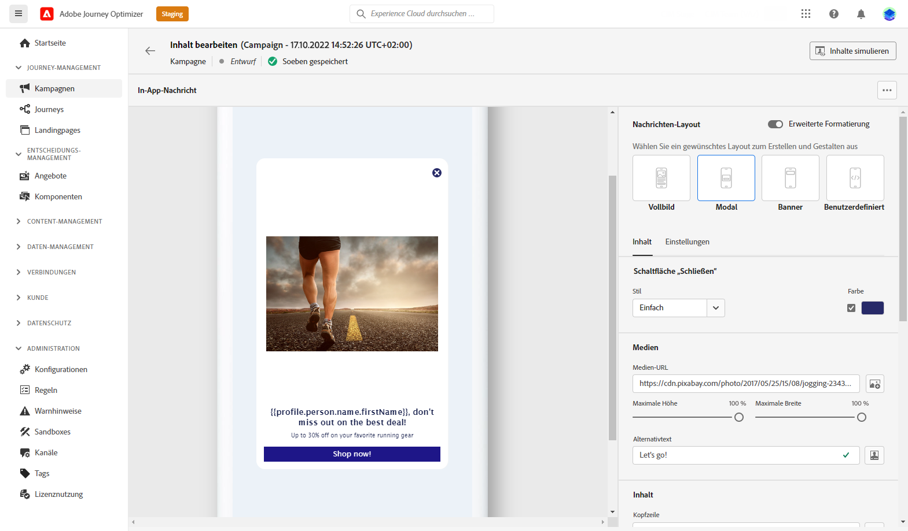

# Erste Schritte mit dem In-App-Kanal {#gs-in-app}

In-App-Nachrichten sind Benachrichtigungen, die Sie an Benutzer in Ihrer App senden können, um sie an bestimmte Zielpunkte weiterzuleiten. In-App-Benachrichtigungen können verwendet werden, um einen Dienst vorzuschlagen, eine neue Funktion oder ein spezielles Angebot zu bewerben oder einen neuen Benutzer zu integrieren.

Verwenden Sie Journey Optimizer, um In-App-Benachrichtigungen zu erstellen und Erlebnisoptionen zu konfigurieren, einschließlich des Nachrichtenlayouts und der Anzeige-, Text- und Schaltflächenoptionen.

## Voraussetzungen{#prerequisites-in-app}

Bevor In-App-Nachrichten gesendet werden, müssen Sie:

* Konfigurieren Sie den In-App-Kanal. [Weitere Infos](inapp-configuration.md)

* Vergewissern Sie sich, dass Sie über die richtigen Berechtigungen für Journey Optimizer-Kampagnen verfügen, bevor Sie beginnen. [Weitere Infos](../campaigns/get-started-with-campaigns.md#campaign-prerequisites)

Danach können Sie Ihre erste In-App-Nachricht erstellen, konfigurieren und senden. Erfahren Sie, wie Sie dies in erreichen können. [diesem Abschnitt](create-in-app.md).

<table style="table-layout:fixed"><tr style="border: 0;">
<td>

<a href="create-in-app.md"><strong>In-App-Nachricht erstellen</strong>

</td>
<td>

<a href="design-in-app.md"><strong>Erstellen von In-App-Inhalten</strong></a>

</td>
<td>

<a href="inapp-report.md"><strong>In-App-Bericht</strong></a>

</td>
<td>

<a href="inapp-configuration.md"><strong>In-App-Kanal konfigurieren</strong></a>

</td>
</tr></table>
