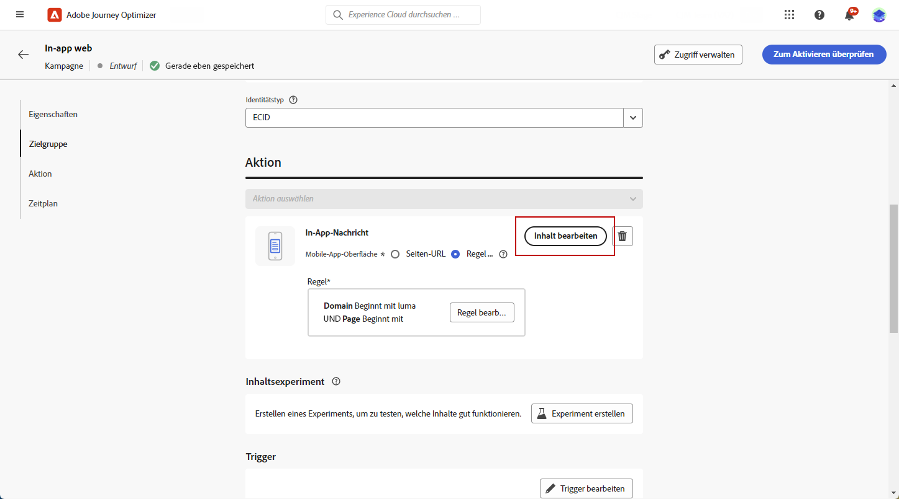

# Gestalten Ihrer Web-In-App-Inhalte {#in-app-web-design}

>[!BEGINSHADEBOX]

**Inhaltsverzeichnis**

* [Konfigurieren des Web-In-App-Kanals](configure-in-app-web.md)
* [Erstellen einer Web-In-App-Nachrichtenkampagne](create-in-app-web.md)
* Gestalten Ihrer Web-In-App-Inhalte

>[!ENDSHADEBOX]

Um den Inhalt einer In-App-Nachricht zu bearbeiten, klicken Sie im Menü **[!UICONTROL Aktion]** Ihrer Kampagne auf die Schaltfläche **[!UICONTROL Inhalt bearbeiten]**.

Der Umschalter **[!UICONTROL Erweiterte Formatierung]** aktiviert zusätzliche Optionen zum Anpassen des Erlebnisses.

Nachdem Sie Ihre In-App-Nachricht erstellt und deren Inhalt definiert und personalisiert haben, können Sie sie überprüfen und aktivieren. Die Benachrichtigungen werden dann entsprechend dem Zeitplan für die Kampagne gesendet. Weiterführende Informationen finden Sie auf [dieser Seite](send-in-app.md).

## Nachrichten-Layout {#message-layout}

Wählen Sie eine der vier Layout-Optionen aus dem Bereich **[!UICONTROL Nachrichten-Layout]** aus, die Ihnen je nach Messaging-Anforderung zur Auswahl angeboten werden.

* **[!UICONTROL Vollbild]**: Mit dieser Einstellung wird der gesamte Bildschirm der Geräte Ihrer Zielgruppe ausgefüllt.

  Unterstützt werden Medien- (Bild, Video), Text- und Schaltflächenkomponenten.

* **[!UICONTROL Modal]**: Mit dieser Einstellung wird ein großes Fenster im Stil eines Warnhinweises angezeigt, wobei Ihre Anwendung noch im Hintergrund sichtbar ist.

  Unterstützt werden Medien- (Bild, Video), Text- und Schaltflächenkomponenten.

* **[!UICONTROL Banner]**: Diese Art von Layout erscheint als systemeigene Warnmeldung.

  Sie können nur jeweils eine **[!UICONTROL Kopfzeile]** und einen **[!UICONTROL Hauptteil]** zu Ihrer Nachricht hinzufügen.

* **[!UICONTROL Benutzerspezifisch]**: Im Modus „Benutzerdefinierte Nachricht“ können Sie eine vorkonfigurierte HTML-Nachricht direkt importieren und bearbeiten.

   * Wählen Sie die Option **[!UICONTROL Erstellen]** aus, um Ihren rohen HTML-Code einzugeben oder einzufügen.

     Verwenden Sie den linken Bereich, um die Personalisierungsfunktionen von Journey Optimizer anzuwenden. Weiterführende Informationen hierzu finden Sie in [diesem Abschnitt](../personalization/personalize.md).

   * Wählen Sie **[!UICONTROL Import]** aus, um die HTML- oder ZIP-Datei zu importieren, die Ihren HTML-Inhalt enthält.

## Registerkarte „Inhalt“ {#content-tab}

Über die Registerkarte **Inhalt** können Sie den Inhalt der Benachrichtigung und den Stil der Schaltfläche **Schließen** festlegen. Ebenso können Sie von dieser Registerkarte aus auch Medien zu Ihrer In-App-Benachrichtigung hinzufügen und Aktionsschaltflächen ergänzen.

### Schaltfläche „Schließen“ {#close-button}

Wählen Sie den **[!UICONTROL Stil]** Ihrer Schaltfläche **[!UICONTROL Schließen]**.

Folgende Stile sind verfügbar:

* **[!UICONTROL Einfach]**
* **[!UICONTROL Kreis]**
* **[!UICONTROL Benutzerdefiniertes Bild]** von einer Medien-URL oder Ihren Assets.

+++Mehr Optionen mit erweiterter Formatierung

Wenn der Modus **[!UICONTROL Erweiterte Formatierung]** eingeschaltet ist, können Sie die Option **[!UICONTROL Farbe]** prüfen, um die Farbe und Deckkraft Ihrer Schaltfläche festzulegen.

+++

### Medien {#add-media}

Über das Feld **[!UICONTROL Medien]** können Sie Medien zu Ihrer In-App-Nachricht hinzufügen, um das Erlebnis für die Endbenutzenden attraktiv zu gestalten.

Geben Sie Ihre Medien-URL ein oder klicken Sie auf das Symbol **[!UICONTROL Assets auswählen]**, um Ihrer In-App-Nachricht direkt Assets hinzuzufügen, die in Ihrer Assets-Bibliothek gespeichert sind. [Weitere Informationen über Asset-Management](../content-management/assets-essentials.md).
Sie können auch einen **[!UICONTROL Alternativtext]** für Bildschirmlesehilfen hinzufügen.

+++Mehr Optionen mit erweiterter Formatierung

Wenn der Modus **[!UICONTROL Erweiterte Formatierung]** eingeschaltet ist, können Sie die Variablen **[!UICONTROL Maximale Höhe]** und **[!UICONTROL Maximale Breite]** für Ihre Medien individuell festlegen.

+++

### Inhalt {#title-body}

Um Ihre Nachricht zu erstellen, geben Sie den Inhalt in die Felder **[!UICONTROL Kopfzeile]** und **[!UICONTROL Hauptteil]** ein.

Verwenden Sie das Symbol **[!UICONTROL Personalisierung]**, um für eine persönlichere Gestaltung zu sorgen. Weitere Informationen zur Personalisierung im Ausdruckseditor von Adobe Journey Optimizer finden Sie [in diesem Abschnitt](../personalization/personalize.md).

+++Mehr Optionen mit erweiterter Formatierung

Wenn der Modus **[!UICONTROL Erweiterte Formatierung]** eingeschaltet ist, können Sie folgende Parameter für Ihre **[!UICONTROL Kopfzeile]** und Ihren **[!UICONTROL Hauptteil]** wählen:

* die **[!UICONTROL Schriftart]**
* die **[!UICONTROL Punkt-Größe]**
* die **[!UICONTROL Schriftfarbe]**
* die **[!UICONTROL Ausrichtung]**
+++

### Schaltflächen        {#add-buttons}

Fügen Sie Schaltflächen hinzu, über die Benutzende mit Ihrer In-App-Nachricht interagieren können.

So personalisieren Sie Ihre Schaltfläche:

1. Bearbeiten Sie das primäre Textfeld (#1) für die Schaltfläche. Sie können auch das Symbol **[!UICONTROL Personalisierung]** verwenden, um Inhalte und Personalisierungsdaten zu definieren.

1. Wählen Sie Ihr **[!UICONTROL Interaktionsereignis]**. Es definiert die Aktion Ihrer Schaltfläche, nachdem Benutzende damit interagiert haben.

1. Geben Sie Ihre Web-URL oder Ihren Deeplink im Feld **[!UICONTROL Zielgruppe]** an.

1. Um mehrere Schaltflächen hinzuzufügen, klicken Sie auf **[!UICONTROL Schaltfläche hinzufügen]**.

+++Mehr Optionen mit erweiterter Formatierung

Wenn der Modus **[!UICONTROL Erweiterte Formatierung]** aktiviert ist, können Sie für Ihre **[!UICONTROL Schaltflächen]** Folgendes auswählen:

* **[!UICONTROL Schriftart]**
* die **[!UICONTROL Punkt-Größe]**
* die **[!UICONTROL Schriftfarbe]**
* **[!UICONTROL Ausrichtung]**
* **[!UICONTROL Schaltflächenstil]**
* **[!UICONTROL Radius]**
* **[!UICONTROL Schaltflächenfarbe]**

+++

## Registerkarte „Einstellungen“ {#settings-tab}

Auf der Registerkarte **Einstellungen** können Sie das Nachrichten-Layout definieren und eine Vorschau Ihrer In-App-Nachricht anzeigen. Sie können auch auf erweiterte Formatierungsoptionen zugreifen.

### Layout {#layout-options}

Mit dem Feld **[!UICONTROL Hintergrundbild]** können Sie Ihrer In-App-Nachricht einen Hintergrund hinzufügen:

* Ein Medium von einem URL-Link.

* Eine Hintergrundfarbe.

### Nachricht {#message-tab}

Die standardmäßig aktivierte Option „UI-Übernahme“ ermöglicht es Ihnen, den Hintergrund hinter Ihrer In-App-Nachricht abzudunkeln, um den Fokus auf Ihren Inhalt zu legen.

+++Mehr Optionen mit erweiterter Formatierung

Wenn der Modus **[!UICONTROL Erweiterte Formatierung]** aktiviert ist, können Sie Ihre Nachricht mit den folgenden Optionen weiter personalisieren:

* **[!UICONTROL UI-Übernahme anpassen]**: Ermöglicht die Auswahl einer im Hintergrund anzuzeigenden Farbe und ihrer Deckkraft.

* **[!UICONTROL Größe anpassen]**: Damit können Sie die Breite und Höhe Ihrer In-App-Benachrichtigung anpassen.

* **[!UICONTROL Position anpassen]**: Damit können Sie die Position Ihrer In-App-Nachrichten auf dem Bildschirm Ihrer Benutzenden anpassen. Sie können die vertikale und die horizontale Ausrichtung ändern.

* **[!UICONTROL Nachricht mit abgerundeter Ecke]**: Ermöglicht es Ihnen, Ihrer In-App-Benachrichtigung eine runde Ecke hinzuzufügen, indem Sie den **[!UICONTROL Eckenradius]** ändern.

+++

**Verwandte Themen:**

* [Testen und Senden der In-App-Nachricht](send-in-app.md)
* [In-App-Bericht](../reports/campaign-global-report.md#inapp-report)
* [In-App-Konfiguration](inapp-configuration.md)