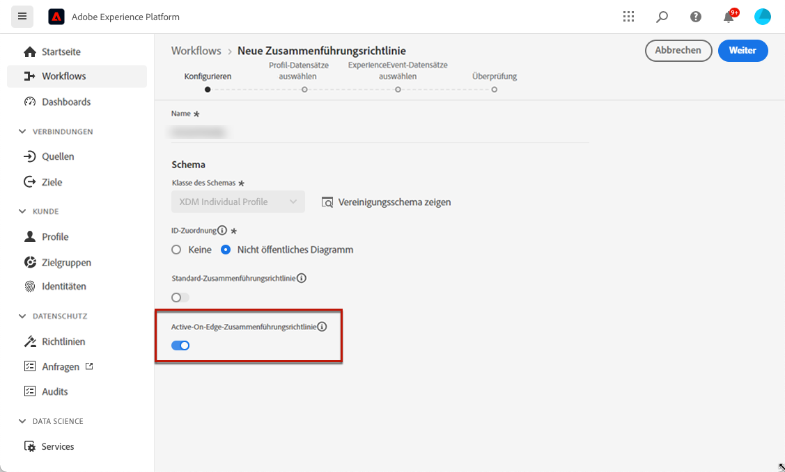

# Voraussetzungen für In-App-Kanäle {#inapp-configuration}

## Versandvoraussetzungen {#delivery-prerequisites}

Damit In-App-Nachrichten ordnungsgemäß zugestellt werden können, müssen die folgenden Einstellungen definiert werden:

* Zur [Datenerfassung in Adobe Experience Platform](https://experienceleague.adobe.com/docs/experience-platform/edge/datastreams/overview.html?lang=de){target="_blank"} muss ein Datenstrom definiert sein. Dazu können beispielsweise für den **[!UICONTROL Adobe Experience Platform]**-Service die Optionen Adobe Experience Platform Edge und **[!UICONTROL Adobe Journey Optimizer]** aktiviert werden.

  Dadurch wird sichergestellt, dass die von Journey Optimizer eingehenden Ereignisse korrekt von Adobe Experience Platform Edge verarbeitet werden. [Weitere Informationen](https://experienceleague.adobe.com/docs/experience-platform/edge/datastreams/configure.html?lang=de){target="_blank"}

  

* In [Adobe Experience Platform](https://experienceleague.adobe.com/docs/experience-platform/profile/home.html?lang=de){target="_blank"}, make sure you have the default merge policy with the **[!UICONTROL Active-On-Edge Merge Policy]** option enabled. To do this, select a policy under the **[!UICONTROL Customer]** > **[!UICONTROL Profiles]** > **[!UICONTROL Merge Policies]** Experience Platform menu. [Learn more](https://experienceleague.adobe.com/docs/experience-platform/profile/merge-policies/ui-guide.html?lang=de#configure){target="_blank"}

  Diese Zusammenführungsrichtlinie wird von eingehenden Kanälen in [!DNL Journey Optimizer] verwendet, um eingehende Kampagnen auf der Edge korrekt zu aktivieren und zu veröffentlichen. [Weitere Informationen](https://experienceleague.adobe.com/docs/experience-platform/profile/merge-policies/ui-guide.html?lang=de){target="_blank"}

  

## Voraussetzungen für die Kanalkonfiguration {#channel-prerequisites}

1. Rufen Sie das Menü **[!UICONTROL App-Oberflächen]** auf und klicken Sie auf **[!UICONTROL App-Oberfläche erstellen]**.

1. Fügen Sie Ihrer **[!UICONTROL Programmoberfläche]** einen Namen hinzu.

   

1. Konfigurieren Sie in der Dropdown-Liste **[!UICONTROL Apple iOS]** Ihre Mobile App für Apple iOS.

+++ Weitere Informationen

   1. Geben Sie Ihre **[!UICONTROL iOS Bundle-ID]** ein. Weitere Informationen zur **Bundle-ID** finden Sie in der [Apple-Dokumentation](https://developer.apple.com/documentation/appstoreconnectapi/bundle_ids).

   1. (optional) Wählen Sie die **[!UICONTROL Sandbox]**, von der aus Sie Push-Benachrichtigungen senden möchten. Hinweis: Für die Auswahl einer bestimmten Sandbox sind bestimmte Zugriffsberechtigungen erforderlich.

      Weitere Informationen zum Sandbox-Management sind auf [dieser Seite](../administration/sandboxes.md#assign-sandboxes) zu finden.

   1. Aktivieren Sie die Option **[!UICONTROL Push-Anmeldeinformationen]**, um Ihre .p8-Authentifizierungsschlüsseldatei per Drag-and-Drop abzulegen, falls erforderlich.

      Es ist auch möglich, die Option **[!UICONTROL Push-Anmeldeinformationen manuell eingeben]** zu aktivieren, um Ihren APNs-Authentifizierungsschlüssel direkt zu kopieren und einzufügen.

   1. Geben Sie Ihre **[!UICONTROL Schlüssel-ID]** und **[!UICONTROL Team-ID]** ein.

      

+++

1. Konfigurieren Sie in der Dropdown-Liste **[!UICONTROL Android]** Ihre Mobile App für Android.

+++ Weitere Informationen

   1. Geben Sie Ihren **[!UICONTROL Android-Paketnamen]** ein. Weitere Informationen zu **Paketnamen** finden Sie in der [Android-Dokumentation](https://support.google.com/admob/answer/9972781?hl=en#:~:text=The%20package%20name%20of%20an,supported%20third%2Dparty%20Android%20stores).

   1. (optional) Wählen Sie die **[!UICONTROL Sandbox]**, von der aus Sie Push-Benachrichtigungen senden möchten. Hinweis: Für die Auswahl einer bestimmten Sandbox sind bestimmte Zugriffsberechtigungen erforderlich.

      Weitere Informationen zum Sandbox-Management sind auf [dieser Seite](../administration/sandboxes.md#assign-sandboxes) zu finden.

   1. Aktivieren Sie die Option **[!UICONTROL Push-Anmeldeinformationen]**, um bei Bedarf die private .json-Schlüsseldatei per Drag-and-Drop abzulegen.

      Es ist auch möglich, die Option **[!UICONTROL Push-Anmeldeinformationen manuell eingeben]** zu aktivieren, um Ihren privaten FCM-Schlüssel direkt zu kopieren und einzufügen.

      

1. Klicken Sie auf **[!UICONTROL Speichern]**, wenn Sie die Konfiguration der **[!UICONTROL Programmoberfläche]** abgeschlossen haben.

   

   Ihre **[!UICONTROL Programmoberfläche]** ist jetzt beim Erstellen einer neuen Kampagne mit einer In-App-Nachricht verfügbar. [Weitere Informationen](create-in-app.md)

1. Nachdem Sie Ihre Programmoberfläche erstellt haben, müssen Sie eine Eigenschaft für Mobilgeräte erstellen.

   Informationen zum detaillierten Verfahren finden Sie auf [dieser Seite](https://experienceleague.adobe.com/docs/experience-platform/tags/admin/companies-and-properties.html?lang=de#for-mobile).

   

1. Installieren Sie über das Menü „Erweiterungen“ Ihrer neu erstellten Eigenschaft die folgenden Erweiterungen:

   * Adobe Experience Platform Edge Network
   * Adobe Journey Optimizer
   * AEP-Sicherheit
   * Einverständnis
   * Identität
   * Core für Mobilgeräte
   * Profil

   Informationen zum detaillierten Verfahren finden Sie auf [dieser Seite](https://experienceleague.adobe.com/docs/experience-platform/tags/ui/extensions/overview.html?lang=de#add-a-new-extension).

   

Der In-App-Kanal ist jetzt konfiguriert. Sie können nun mit dem Versand von In-App-Nachrichten an Ihre Benutzerinnen und Benutzer beginnen.

## Voraussetzungen für Inhaltsexperimente {#experiment-prerequisites}

Um Inhaltsexperimente für den In-App-Kanal zu aktivieren, müssen Sie sicherstellen, dass der [Datensatz](../data/get-started-datasets.md), der im [Datenstrom](https://experienceleague.adobe.com/docs/experience-platform/datastreams/overview.html?lang=de){target="_blank"} Ihrer In-App-Implementierung verwendet wird, auch in Ihrer Reporting-Konfiguration enthalten ist.

Anders ausgedrückt: Wenn Sie beim Konfigurieren des Reportings für Experimente einen Datensatz hinzufügen, der nicht in Ihrem Web-Datenstrom vorhanden ist, werden keine Web-Daten in den Inhaltsexperimentberichten angezeigt.

In [diesem Abschnitt](../campaigns/reporting-configuration.md#add-datasets) erfahren Sie, wie Sie Datensätze für das Reporting zu Inhaltsexperimenten hinzufügen.

>[!NOTE]
>
>Der Datensatz wird schreibgeschützt vom Reporting-System von [!DNL Journey Optimizer] verwendet und hat keine Auswirkungen auf die Erfassung oder Aufnahme von Daten.

Wenn Sie **nicht** die folgenden vordefinierten [Feldergruppen](https://experienceleague.adobe.com/docs/experience-platform/xdm/tutorials/create-schema-ui.html?lang=de#field-group){target="_blank"} for your dataset schema: `AEP Web SDK ExperienceEvent` and `Consumer Experience Event` (as defined in [this page](https://experienceleague.adobe.com/docs/platform-learn/implement-web-sdk/initial-configuration/configure-schemas.html?lang=de#add-field-groups){target="_blank"} verwenden, stellen Sie sicher, dass Sie die folgenden Feldergruppen hinzufügen: `Experience Event - Proposition Interactions`, `Application Details`, `Commerce Details` und `Web Details`. Diese werden vom Reporting zu Inhaltsexperimenten von [!DNL Journey Optimizer] verwendet, da sie verfolgen, an welchen Experimenten und Behandlungen die einzelnen Profile teilnehmen.

>[!NOTE]
>
>Das Hinzufügen dieser Feldergruppen hat keine Auswirkungen auf die normale Datenerfassung. Dies ist nur für die Seiten nützlich, bei denen ein Experiment ausgeführt wird, sodass das Tracking aller anderen Seiten unberührt bleibt.

## Anleitungsvideos{#video}

* Im folgenden Video erfahren Sie, wie Sie die Berechtigung **App-Konfiguration verwalten** zuweisen, um auf das Menü „Programmoberflächen“ zuzugreifen.

  +++Siehe Video

  >[!VIDEO](https://video.tv.adobe.com/v/3421607)

+++

**Verwandte Themen:**

* [Erstellen einer In-App-Nachricht](create-in-app.md)
* [Erstellen einer Kampagne](../campaigns/create-campaign.md)
* [Entwerfen der In-App-Nachricht](design-in-app.md)
* [In-App-Bericht](../reports/campaign-global-report.md#inapp-report)

