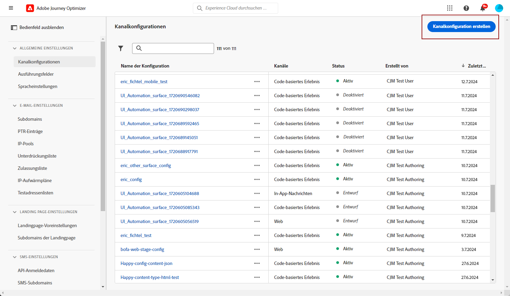

# In-App-Kanal konfigurieren {#inapp-configuration}

Bevor Sie In-App-Nachrichten senden, müssen Sie Ihren In-App-Kanal in [!DNL Adobe Experience Platform Data Collection].

1. Von Ihrem [!DNL Adobe Experience Platform Data Collection] -Konto, Zugriff auf **[!UICONTROL Datastream]** Menü und klicken Sie auf **[!UICONTROL Neuer Datenspeicher]**. Weitere Informationen zur Erstellung von Datastreams finden Sie unter [diese Seite](https://aep-sdks.gitbook.io/docs/getting-started/configure-datastreams).

1. Wählen Sie die [!DNL Adobe Experience Platform] Dienst.

   [!DNL Edge Segmentation], [!DNL Offer Decisioning] und [!DNL Adobe Journey Optimizer] ausgewählt sein.

   

1. Rufen Sie dann die **[!UICONTROL Anwendungsoberflächen]** Menü und klicken Sie auf **[!UICONTROL Oberfläche &quot;App erstellen&quot;]**.

   

1. Fügen Sie Ihrem **[!UICONTROL Anwendungsoberfläche]**.

1. Geben Sie in der Dropdown-Liste Apple iOS Ihre **iOS Bundle-ID**. Siehe [Apple-Dokumentation](https://developer.apple.com/documentation/appstoreconnectapi/bundle_ids) Weitere Informationen zu **Bundle-ID**.

   

1. Geben Sie in der Dropdown-Liste Android Ihre **Android-Paketname**. Siehe [Android-Dokumentation](https://support.google.com/admob/answer/9972781?hl=en#:~:text=The%20package%20name%20of%20an,supported%20third%2Dparty%20Android%20stores) Weitere Informationen zu **Paketname**.

1. Klicken **[!UICONTROL Speichern]** nach Abschluss der Konfiguration Ihrer **[!UICONTROL Anwendungsoberfläche]**.

   

   Ihre **[!UICONTROL Anwendungsoberfläche]** ist jetzt beim Erstellen einer neuen Kampagne mit einer In-App-Nachricht verfügbar. [Weitere Informationen](create-in-app.md)

1. Nachdem Sie Ihre App-Oberfläche erstellt haben, müssen Sie jetzt eine Eigenschaft für Mobilgeräte erstellen.

   Siehe [diese Seite](https://experienceleague.adobe.com/docs/experience-platform/tags/admin/companies-and-properties.html#for-mobile) für das detaillierte Verfahren.

   

1. Installieren Sie im Menü Erweiterungen Ihrer neu erstellten Eigenschaft die folgenden Erweiterungen:

   * Adobe Experience Platform Edge Network
   * Adobe Journey Optimizer
   * AEP Assurance
   * Einverständnis
   * Identifizieren
   * Mobile Core
   * Profil

   Siehe [diese Seite](https://experienceleague.adobe.com/docs/experience-platform/tags/ui/extensions/overview.html?lang=en#add-a-new-extension) für das detaillierte Verfahren.

   

Der In-App-Kanal ist jetzt konfiguriert. Sie können mit dem Versand von In-App-Nachrichten an Ihre Benutzer beginnen.

**Verwandte Themen:**

* [In-App-Nachricht erstellen](create-in-app.md)
* [Erstellen einer Kampagne](../campaigns/create-campaign.md)
* [In-App-Nachricht erstellen](design-in-app.md)
* [In-App-Bericht](inapp-report.md)
