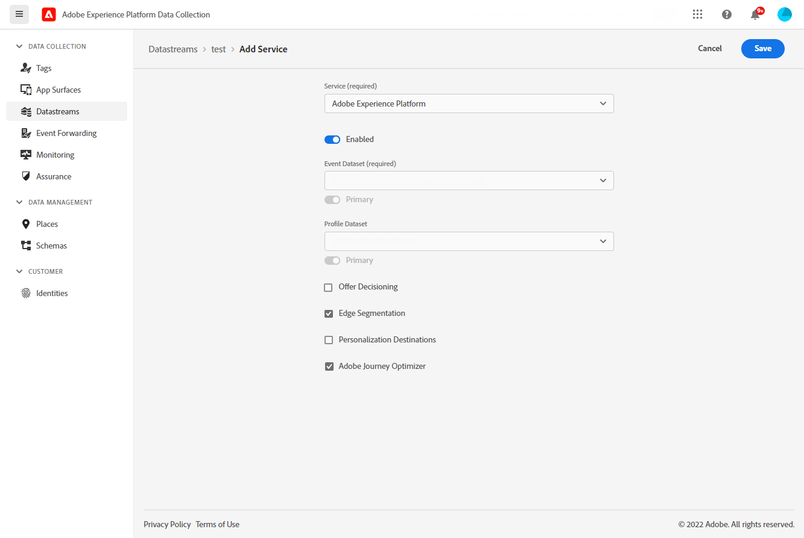

# Konfigurieren des In-App-Kanals {#inapp-configuration}

Bevor Sie In-App-Nachrichten senden können, müssen Sie Ihren In-App-Kanal in [!DNL Adobe Experience Platform Data Collection] konfigurieren.

1. Rufen Sie von Ihrem [!DNL Adobe Experience Platform Data Collection]-Konto aus das Menü **[!UICONTROL Datenstrom]** auf und klicken Sie auf **[!UICONTROL Neuer Datenstrom]**. Weiterführende Informationen zur Erstellung von Datenströmen finden Sie auf [dieser Seite](https://experienceleague.adobe.com/docs/experience-platform/edge/datastreams/configure.html?lang=de).

1. Wählen Sie den [!DNL Adobe Experience Platform]-Service.

   [!DNL Edge Segmentation] und [!DNL Adobe Journey Optimizer] müssen ausgewählt sein.

   

   >[!NOTE]
   >
   >Um Inhaltsexperimente für den In-App-Kanal zu aktivieren, müssen Sie sicherstellen, dass der [Datensatz](../data/get-started-datasets.md), der in Ihrem In-App-[Datenstrom](https://experienceleague.adobe.com/docs/experience-platform/datastreams/overview.html?lang=de){target="_blank"} verwendet wird, auch in Ihrer Reporting-Konfiguration vorhanden ist. Andernfalls werden In-App-Daten in den Inhaltsexperimentberichten nicht angezeigt. [Erfahren Sie, wie Sie Datensätze hinzufügen](../campaigns/reporting-configuration.md#add-datasets)
   >
   >Der Datensatz wird schreibgeschützt vom Reporting-System von [!DNL Journey Optimizer] verwendet und hat keine Auswirkungen auf die Erfassung oder Aufnahme von Daten.

1. Rufen Sie dann das Menü **[!UICONTROL App-Oberflächen]** auf und klicken Sie auf **[!UICONTROL App-Oberfläche erstellen]**.

   >[!NOTE]
   >
   > Sie benötigen die Berechtigung **App-Konfiguration verwalten**, um Zugriff auf das Menü **[!UICONTROL Programmoberflächen]** zu haben. Weiterführende Informationen finden Sie in [diesem Video](#video).

   

1. Fügen Sie Ihrer **[!UICONTROL Programmoberfläche]** einen Namen hinzu.

1. Geben Sie in der Dropdown-Liste „Apple iOS“ Ihre **iOS-Paket-ID** ein. Weitere Informationen zur **Paket-ID** finden Sie in der [Apple-Dokumentation](https://developer.apple.com/documentation/appstoreconnectapi/bundle_ids).

   

1. Geben Sie in der Dropdown-Liste „Android“ Ihren **Android-Paketnamen** ein. Weitere Informationen zu **Paketnamen** finden Sie in der [Android-Dokumentation](https://support.google.com/admob/answer/9972781?hl=en#:~:text=The%20package%20name%20of%20an,supported%20third%2Dparty%20Android%20stores).

1. Klicken Sie auf **[!UICONTROL Speichern]**, wenn Sie die Konfiguration der **[!UICONTROL Programmoberfläche]** abgeschlossen haben.

   

   Ihre **[!UICONTROL Programmoberfläche]** ist jetzt beim Erstellen einer neuen Kampagne mit einer In-App-Nachricht verfügbar. [Weitere Informationen](create-in-app.md)

1. Nachdem Sie Ihre Programmoberfläche erstellt haben, müssen Sie eine Eigenschaft für Mobilgeräte erstellen.

   Informationen zum detaillierten Verfahren finden Sie auf [dieser Seite](https://experienceleague.adobe.com/docs/experience-platform/tags/admin/companies-and-properties.html?lang=de#for-mobile).

   

1. Installieren Sie über das Menü „Erweiterungen“ Ihrer neu erstellten Eigenschaft die folgenden Erweiterungen:

   * Adobe Experience Platform Edge Network
   * Adobe Journey Optimizer
   * AEP-Sicherheit
   * Einverständnis
   * Identität
   * Core für Mobilgeräte
   * Profil

   Informationen zum detaillierten Verfahren finden Sie auf [dieser Seite](https://experienceleague.adobe.com/docs/experience-platform/tags/ui/extensions/overview.html?lang=de#add-a-new-extension).

   

Der In-App-Kanal ist jetzt konfiguriert. Sie können nun mit dem Versand von In-App-Nachrichten an Ihre Benutzerinnen und Benutzer beginnen.

**Verwandte Themen:**

* [Erstellen einer In-App-Nachricht](create-in-app.md)
* [Erstellen einer Kampagne](../campaigns/create-campaign.md)
* [Entwerfen der In-App-Nachricht](design-in-app.md)
* [In-App-Bericht](../reports/campaign-global-report.md#inapp-report)

## Anleitungsvideos{#video}

* Im folgenden Video erfahren Sie, wie Sie die Berechtigung **App-Konfiguration verwalten** zuweisen, um auf das Menü „Programmoberflächen“ zuzugreifen.

>[!VIDEO](https://video.tv.adobe.com/v/3421607)

