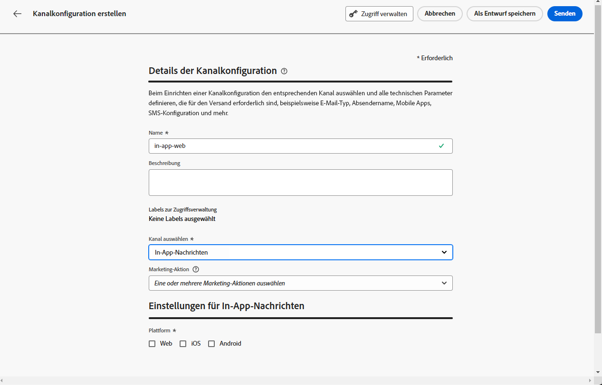
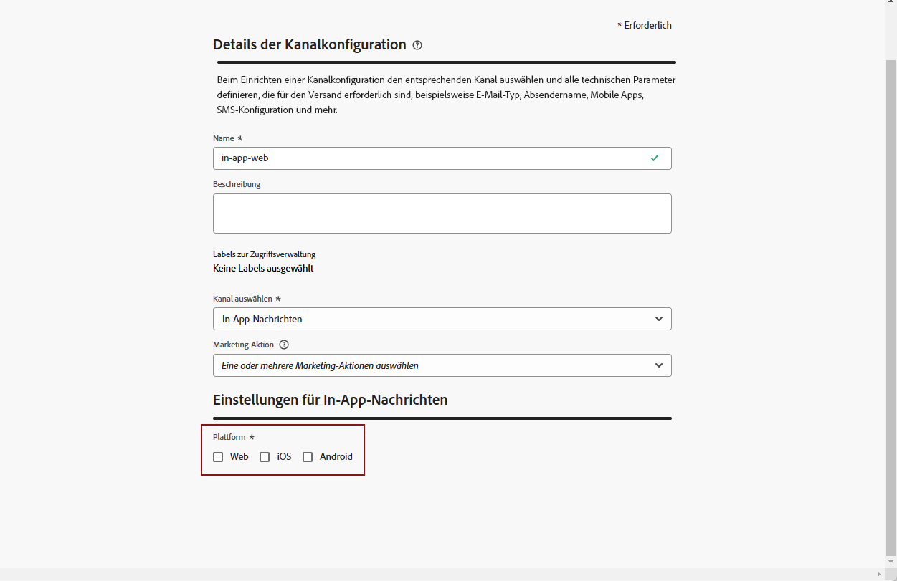

# Voraussetzungen und Konfiguration {#inapp-configuration}

## Konfigurationsschritte {#inapp-steps}

Um In-App-Nachrichten in Ihren Journeys und Kampagnen mit [!DNL Journey Optimizer] zu versenden, müssen Sie die folgenden Konfigurationsschritte durchführen.

1. Vergewissern Sie sich, dass Sie über die richtigen Berechtigungen für Journey Optimizer-Kampagnen verfügen, bevor Sie beginnen, selbst wenn Sie nur In-App-Nachrichten in Journeys verwenden möchten. Kampagnenberechtigungen sind nach wie vor erforderlich. [Weitere Informationen](../campaigns/get-started-with-campaigns.md#prerequisites).
1. Aktivieren Sie Adobe Journey Optimizer in Ihrem Datenstrom der Datenerfassung in Adobe Experience Platform und überprüfen Sie Ihre Standard-Zusammenführungsrichtlinie in Adobe Experience Platform, wie nachfolgend unter [Versandvoraussetzungen](#delivery-prerequisites) beschrieben.
1. Erstellen Sie eine Konfiguration des In-App-Nachrichtenkanals unter „Administration“ > „Kanäle“ > „Kanalkonfigurationen“, wie in [diesem Abschnitt](#channel-prerequisites) beschrieben.
1. Wenn Sie Inhaltsexperimente verwenden, stellen Sie sicher, dass Sie die [in diesem Abschnitt](#experiment-prerequisite) aufgeführten Anforderungen erfüllen.

Danach können Sie Ihre erste In-App-Nachricht erstellen, konfigurieren und senden. Wie Sie dies tun können, erfahren Sie in [diesem Abschnitt](create-in-app.md).

>[!CAUTION]
>
>Wenn Sie pseudonyme Profile (nicht authentifizierte Besucher) mit Ihren In-App-Nachrichten als Ziel auswählen, sollten Sie eine Time-to-Live (TTL) für das automatische Löschen von Profilen festlegen, um die Anzahl Ihrer interagierbaren Profile und die damit verbundenen Kosten zu verwalten. [Weitere Informationen](../start/guardrails.md#profile-management-inbound)

## Versandvoraussetzungen {#delivery-prerequisites}

Damit In-App-Nachrichten ordnungsgemäß zugestellt werden können, müssen die folgenden Einstellungen definiert werden:

* Für die [Datenerfassung in Adobe Experience Platform](https://experienceleague.adobe.com/docs/experience-platform/edge/datastreams/overview.html?lang=de){target="_blank"} muss ein Datenstrom definiert sein. Dazu können beispielsweise für den **[!UICONTROL Adobe Experience Platform]**-Service die Optionen Adobe Experience Platform Edge und **[!UICONTROL Adobe Journey Optimizer]** aktiviert werden.

  Dadurch wird sichergestellt, dass die von Journey Optimizer eingehenden Ereignisse korrekt von Adobe Experience Platform Edge verarbeitet werden. [Weitere Informationen](https://experienceleague.adobe.com/docs/experience-platform/edge/datastreams/configure.html?lang=de){target="_blank"}

  >[!NOTE]
  >
  >Die Verwendung von `context.datastream`-Attributen wird in Journey Optimizer derzeit nur für Web-Kanal-Kampagnen unterstützt. Der Versuch, `context.datastream` in In-App-Nachrichten zu verwenden, führt zu Validierungsfehlern wie `Invalid syntax Missing schema field: 'datastream`.

  

* Vergewissern Sie sich in [Adobe Experience Platform](https://experienceleague.adobe.com/docs/experience-platform/profile/home.html?lang=de){target="_blank"}, dass Sie die standardmäßige Zusammenführungsrichtlinie mit der Option **[!UICONTROL Active-On-Edge-Zusammenführungsrichtlinie]** aktiviert haben. Wählen Sie dazu im Experience Platform-Menü **[!UICONTROL Kunde]** > **[!UICONTROL Profile]** > **[!UICONTROL Zusammenführungsrichtlinien]** eine Richtlinie aus. [Weitere Informationen](https://experienceleague.adobe.com/docs/experience-platform/profile/merge-policies/ui-guide.html?lang=de#configure){target="_blank"}

  Diese Zusammenführungsrichtlinie wird von eingehenden Kanälen in [!DNL Journey Optimizer] verwendet, um eingehende Kampagnen am Edge korrekt zu aktivieren und zu veröffentlichen. [Weitere Informationen](https://experienceleague.adobe.com/docs/experience-platform/profile/merge-policies/ui-guide.html?lang=de){target="_blank"}

  >[!NOTE]
  >
  >Wenn Sie eine Zusammenführungsrichtlinie mit einer benutzerdefinierten **[!UICONTROL Datensatzpräferenz]** verwenden, stellen Sie sicher, dass Sie den Datensatz **[!UICONTROL Eingehende Journey]** innerhalb der angegebenen Zusammenführungsrichtlinie hinzufügen.

  

* Zur Fehlerbehebung beim Versand von Journey Optimizer-Web-Erlebnissen können Sie die Ansicht **Edge Delivery** in **Adobe Experience Platform Assurance** verwenden. Mit diesem Plug-in können Sie Anfrageaufrufe im Detail untersuchen, überprüfen, ob die erwarteten Edge-Aufrufe wie vorgesehen erfolgen, und Profildaten, einschließlich Identitätskarten, Segmentzugehörigkeiten und Zustimmungseinstellungen, untersuchen. Zusätzlich können Sie die Aktivitäten überprüfen, für die sich die Anfrage qualifiziert hat, und diejenigen identifizieren, für die sie nicht qualifiziert war.

  Mit dem Plug-in **Edge Delivery** erhalten Sie die nötigen Erkenntnisse, um Ihre eingehenden Implementierungen effektiv zu verstehen und Fehler zu beheben.

  [Weitere Informationen zur Ansicht „Edge Delivery“](https://experienceleague.adobe.com/de/docs/experience-platform/assurance/view/edge-delivery){target="_blank"}

## Erstellen einer In-App-Konfiguration {#channel-prerequisites}

Gehen Sie wie folgt vor, um in Journey Optimizer eine In-App-Konfiguration zu erstellen:

1. Rufen Sie das Menü **[!UICONTROL Kanäle]** > **[!UICONTROL Allgemeine Einstellungen]** > **[!UICONTROL Kanalkonfigurationen]** auf und klicken Sie dann auf **[!UICONTROL Kanalkonfiguration erstellen]**.

   

1. Geben Sie einen Namen und eine Beschreibung (optional) für die Konfiguration ein und wählen Sie dann den zu konfigurierenden Kanal aus.

   >[!NOTE]
   >
   > Namen müssen mit einem Buchstaben (A–Z) beginnen. Ein Name darf nur alphanumerische Zeichen enthalten. Sie können auch die Zeichen Unterstrich `_`, Punkt `.` und Bindestrich `-` verwenden.

1. Um der Konfiguration benutzerdefinierte oder grundlegende Datennutzungs-Labels zuzuweisen, können Sie **[!UICONTROL Zugriff verwalten]** auswählen. [Erfahren Sie mehr über die Zugriffssteuerung auf Objektebene (Object Level Access Control, OLAC)](../administration/object-based-access.md).

1. Wählen Sie eine **[!UICONTROL Marketing-Aktion]** aus, um Einverständnisrichtlinien mit den Nachrichten zu verknüpfen, die diese Konfiguration verwenden. Es werden alle mit der Marketing-Aktion verknüpften Einverständnisrichtlinien genutzt, um die Präferenzen Ihrer Kundinnen und Kunden zu respektieren. [Weitere Informationen](../action/consent.md#surface-marketing-actions)

1. Wählen Sie den Kanal **In-App-Messaging** aus.

   

1. Wählen Sie die Plattform aus, für die diese Einstellungen definiert werden sollen. Auf diese Weise können Sie die Ziel-App für jede Plattform festlegen und eine konsistente Inhaltsbereitstellung über mehrere Plattformen hinweg sicherstellen.

   >[!NOTE]
   >
   >Bei iOS- und Android-Plattformen basiert der Versand ausschließlich auf der App-ID. Wenn beide Apps dieselbe App-ID verwenden, werden Inhalte für beide bereitgestellt, unabhängig von der in der **[!UICONTROL Kanalkonfiguration]** ausgewählten Plattform.
   >Um den In-App-Nachrichtenversand auf eine bestimmte Plattform zu beschränken, müssen Sie gerätespezifische Regeln in Ihrer Journey- oder Kampagnenlogik implementieren.

   

1. Beim Web:

   * Sie können entweder eine **[!UICONTROL Seiten-URL]** eingeben, um Änderungen auf eine bestimmte Seite anzuwenden.

   * Sie können eine Regel erstellen, um mehrere URLs, die demselben Muster entsprechen, als Ziel festzulegen.

     +++ Erstellen einer Regel zum Seitenabgleich

      1. Wählen Sie **[!UICONTROL Regel zum Seitenabgleich]** als App-Konfiguration aus und geben Sie Ihre **[!UICONTROL Seiten-URL]** ein.

      1. Definieren Sie im Fenster **[!UICONTROL Konfigurationsregel bearbeiten]** die Kriterien für die Felder **[!UICONTROL Domain]** und **[!UICONTROL Seite]**.
      1. Personalisieren Sie Ihre Kriterien über die Dropdown-Listen für Bedingungen weiter.

         Wenn Sie beispielsweise Elemente bearbeiten möchten, die auf allen Vertriebs-Produktseiten Ihrer Luma-Website angezeigt werden, wählen Sie „Domain“ > „Beginnt mit“ > „luma und Seite“ > „Enthält“ > „Sales“ aus.

         

      1. Klicken Sie auf **[!UICONTROL Eine weitere Seitenregel hinzufügen]**, um bei Bedarf eine weitere Regel zu erstellen.

      1. Wählen Sie die **[!UICONTROL Standard-Authoring- und Vorschau-URL]** aus.

      1. Speichern Sie Ihre Änderungen. Die Regel wird auf dem Bildschirm **[!UICONTROL Kampagne erstellen]** angezeigt.

     +++

1. Für iOS und Android:

   * Geben Sie Ihre **[!UICONTROL App-ID]** ein.

1. Senden Sie Ihre Änderungen ab.

Sie können Ihre Konfiguration jetzt beim Erstellen Ihrer In-App-Nachricht auswählen.

## Reporting-Voraussetzungen {#experiment-prerequisites}

>[!NOTE]
>
>Der Datensatz wird schreibgeschützt vom Reporting-System von [!DNL Journey Optimizer] verwendet und hat keine Auswirkungen auf die Erfassung oder Aufnahme von Daten.

Um das Reporting für den In-App-Kanal zu aktivieren, müssen Sie sicherstellen, dass der [Datensatz](../data/get-started-datasets.md), der im [Datenstrom](https://experienceleague.adobe.com/docs/experience-platform/datastreams/overview.html?lang=de){target="_blank"} Ihrer In-App-Implementierung verwendet wird, auch in Ihrer Reporting-Konfiguration enthalten ist. Mit anderen Worten: Wenn Sie beim Konfigurieren des Reportings einen Datensatz hinzufügen, der nicht in Ihrem App-Datenstrom vorhanden ist, werden die App-Daten nicht in Ihren Berichten angezeigt. Erfahren Sie in [diesem Abschnitt](../reports/reporting-configuration.md#add-datasets), wie Sie Datensätze für das Reporting hinzufügen.

Wenn Sie die vordefinierten [Feldergruppen](https://experienceleague.adobe.com/docs/experience-platform/xdm/tutorials/create-schema-ui.html?lang=de#field-group){target="_blank"} `AEP Web SDK ExperienceEvent` und `Consumer Experience Event` (wie auf [dieser Seite](https://experienceleague.adobe.com/docs/platform-learn/implement-web-sdk/initial-configuration/configure-schemas.html?lang=de#add-field-groups){target="_blank"} definiert) für Ihr Datensatzschema **nicht** verwenden, stellen Sie sicher, dass Sie die folgenden Feldergruppen hinzufügen: `Experience Event - Proposition Interactions`, `Application Details`, `Commerce Details` und `Web Details`. Diese werden vom Reporting in [!DNL Journey Optimizer] benötigt, da sie verfolgen, an welchen Kampagnen und Journeys die einzelnen Profile teilnehmen.

[Weitere Informationen zur Reporting-Konfiguration](../reports/reporting-configuration.md)

>[!NOTE]
>
>Das Hinzufügen dieser Feldergruppen hat keine Auswirkungen auf die normale Datenerfassung. Dies ist nur für die Seiten nützlich, bei denen eine Kampagne oder Journey ausgeführt wird, sodass das Tracking aller anderen Seiten unberührt bleibt.

**Verwandte Themen:**

* [Erstellen einer In-App-Nachricht](create-in-app.md)
* [Erstellen einer Kampagne](../campaigns/create-campaign.md)
* [Entwerfen der In-App-Nachricht](design-in-app.md)
* [In-App-Bericht](../reports/campaign-global-report-cja-inapp.md)

