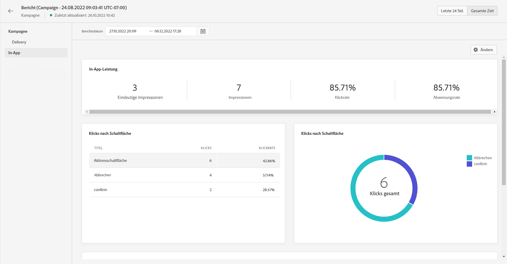

# In-App-Bericht {#inapp-report}

Der In-App-Bericht ist im Kampagnenbericht verfügbar.

Die Seite „Kampagnenbericht“ wird mit den folgenden Registerkarten angezeigt:

* [Campaign](../reports/campaign-global-report.md#campaign-live)
* [E-Mail](../reports/campaign-global-report.md#email-live)
* [Push-Benachrichtigung](../reports/campaign-global-report.md#push-live)
* [SMS](../reports/campaign-global-report.md#sms-live)
* [In-App](#in-app-global)

Der **[!UICONTROL Globale Bericht]** in Campaign ist in verschiedene Widgets unterteilt, die Erfolge und Fehler bei Ihrer Kampagne detailliert beschreiben. Jedes Widget kann bei Bedarf angepasst und gelöscht werden. Weiterführende Informationen dazu finden Sie in diesem [Abschnitt](../reports/global-report.md#modify-dashboard).

Eine detaillierte Liste aller in Adobe Journey Optimizer verfügbaren Metriken finden Sie auf [dieser Seite](../reports/global-report.md#list-of-components-global.md)

## Registerkarte „In-App“ {#inapp-global}

Im **[!UICONTROL globalen Bericht]** Ihrer Kampagne finden Sie auf der Registerkarte **[!UICONTROL In-App]** die wichtigsten Informationen zu den In-App-Sendungen, die in Ihrer Kampagne versendet wurden.

+++Erfahren Sie mehr über die verschiedenen Metriken und Widgets, die für den In-App-Bericht verfügbar sind.

Die KPIs der **[!UICONTROL In-App-Leistung]** geben die wichtigsten Informationen bezüglich der Interaktion Ihrer Besucher mit Ihren In-App-Nachrichten an, z. B.:

* **[!UICONTROL Eindeutige Impressions]**: Anzahl der eindeutigen Nutzer, an die die In-App-Nachricht gesendet wurde.

* **[!UICONTROL Impressions]**: Gesamtzahl der an alle Benutzer gesendeten In-App-Nachrichten.

* **[!UICONTROL Klickrate]**: Prozentualer Anteil der Benutzer, die mit den in der In-App-Nachricht enthaltenen Schaltflächen interagiert haben, im Verhältnis zur Zahl der Benutzer, die die Nachricht gesehen haben.

* **[!UICONTROL Abweisungsrate]**: Prozentsatz der In-App-Nachrichten, die von Empfängern abgewiesen wurden.

Das Diagramm **[!UICONTROL In-App-Zusammenfassung]** zeigt die Entwicklung Ihrer In-App-Impressions für den betroffenen Zeitraum an.

Das Diagramm und die Tabelle **[!UICONTROL Klicks nach Schaltfläche]** enthalten die verfügbaren Daten für das Empfängerverhalten je nach Schaltfläche:

* **[!UICONTROL Klicks]**: Gesamtzahl der Empfänger, die mit den in der In-App-Nachricht enthaltenen Schaltflächen interagiert haben.

* **[!UICONTROL Klickrate]**: Prozentualer Anteil der Benutzer, die mit den in der In-App-Nachricht enthaltenen Schaltflächen interagiert haben, im Verhältnis zur Zahl der Benutzer, die die Nachricht gesehen haben.
+++

**Verwandte Themen:**

* [Erstellen einer In-App-Nachricht](../in-app/create-in-app.md)
* [Entwerfen der In-App-Nachricht](../in-app/design-in-app.md)
* [In-App-Konfiguration](../in-app/inapp-configuration.md)
