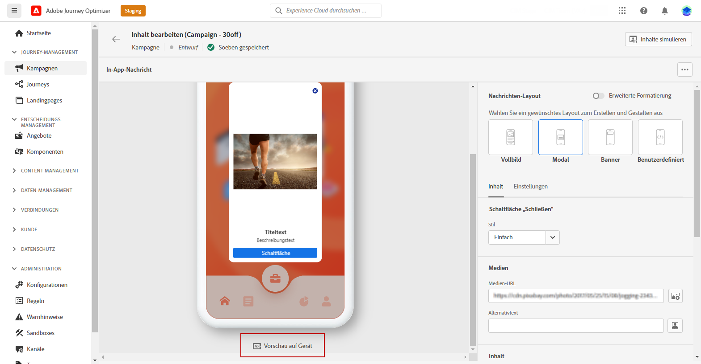
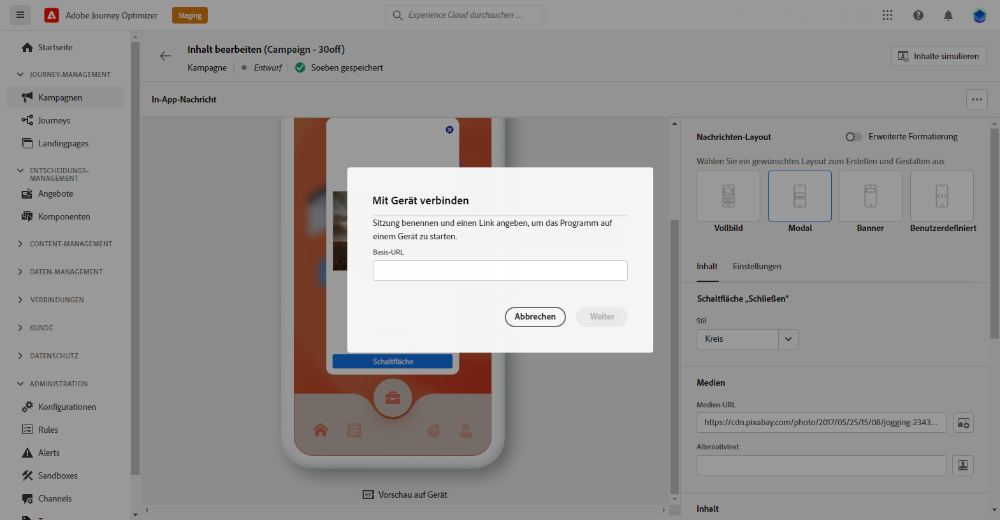
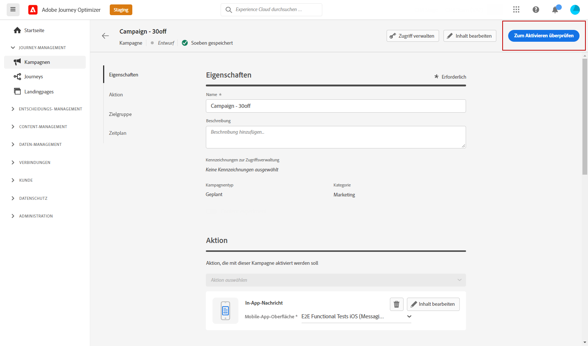

# Testen und Senden von In-App-Benachrichtigung {#create-in-app}

## Vorschau auf Gerät {#preview-device}

Wenn Sie eine Vorschau der In-App-Benachrichtigung erhalten möchten, bevor diese für alle Benutzerinnen und Benutzer live geschaltet wird, können Sie eine Vorschau von ihr auf einem bestimmten Gerät sehen. Mit dieser Funktion können Sie sicherstellen, dass die Benachrichtigung wie gewünscht auf dem ausgewählten Gerät aussieht und funktioniert, und so eine bessere Benutzererfahrung für Ihre Audience bieten.

Gehen Sie dazu wie folgt vor:

1. Klicken Sie auf **[!UICONTROL Vorschau auf Gerät]**.

   

1. Klicken Sie im Fenster **[!UICONTROL Mit Gerät verbinden]** auf **[!UICONTROL Start]**.

1. Geben Sie die **[!UICONTROL Basis-URL]** Ihrer Anwendung ein und klicken Sie auf **[!UICONTROL Weiter]**.

   

1. Scannen Sie den QR-Code mit Ihrem Gerät und geben Sie den angezeigten PIN-Code ein.

Ihre In-App-Nachricht kann jetzt direkt auf Ihrem Gerät ausgelöst werden, sodass Sie Ihre Nachricht auf einem Gerät in der Vorschau anzeigen und überprüfen können.

## Überprüfen und Aktivieren Ihrer In-App-Benachrichtigung{#in-app-review}

Nachdem Sie Ihre In-App-Nachricht erstellt und deren Inhalt definiert und personalisiert haben, können Sie sie überprüfen und aktivieren.

Gehen Sie dazu wie folgt vor:

1. Verwenden Sie die Schaltfläche **[!UICONTROL Zum Aktivieren überprüfen]**, um eine Zusammenfassung Ihrer Nachricht anzuzeigen.

   In der Zusammenfassung können Sie die Kampagne bei Bedarf ändern und überprüfen, ob ein Parameter falsch ist oder fehlt.

   

1. Vergewissern Sie sich, dass Ihre Kampagne korrekt konfiguriert ist, und klicken Sie dann auf **[!UICONTROL Aktivieren]**.

Ihre Kampagne ist jetzt aktiviert. Die in der Kampagne konfigurierte In-App-Benachrichtigung wird sofort oder zum angegebenen Datum versendet.

Nach dem Versand können Sie die Wirkung Ihrer In-App-Nachrichten im Kampagnen- oder Journey-Bericht messen. Weiterführende Informationen zum Reporting finden Sie in [diesem Abschnitt](../reports/campaign-global-report.md#inapp-report).

**Verwandte Themen:**

* [Erstellen einer In-App-Nachricht](create-in-app.md)
* [Entwerfen der In-App-Nachricht](design-in-app.md)
* [In-App-Bericht](../reports/campaign-global-report.md#inapp-report)
* [In-App-Konfiguration](inapp-configuration.md)
