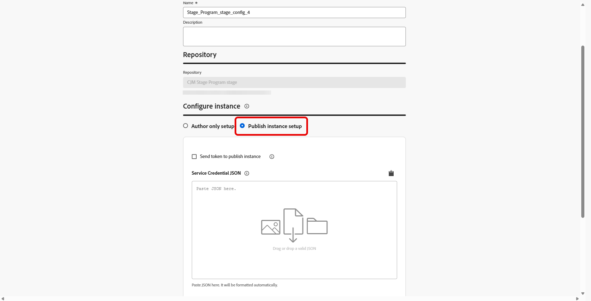
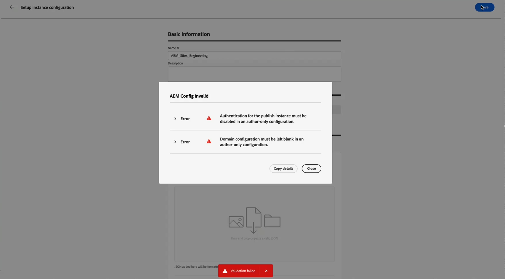

# Konfigurieren des Adobe Experience Manager-Repository-Zugriffs {#aem-admin-settings}

>[!BEGINSHADEBOX]

**Auf dieser Seite** Erfahren Sie, wie Administratoren eine Sandbox mit einem Adobe Experience Manager-Repository verbinden und dabei den Nur-Autoren- oder Veröffentlichungszugriff, benutzerdefinierte Domains und Authentifizierung festlegen, damit Marketing-Experten AEM-Inhaltsfragmente in ihren Journey und Kampagnen verwenden können.

>[!ENDSHADEBOX]

Adobe Journey Optimizer lässt sich mit **[!DNL Adobe Experience Manager as a Cloud Service]** und **[!DNL Adobe Experience Manager Managed Service]** integrieren, sodass Sie **Inhaltsfragmente“ in Journey und** verwenden können. **Inhaltsfragmente** werden standardmäßig aus dem Adobe Experience Manager-Veröffentlichungs-Repository gelesen. Administratoren können im Menü **[!UICONTROL AEM-Integration} auf den]** wechseln oder den Veröffentlichungszugriff anpassen.

➡️ Wenn das Repository konfiguriert ist, fahren Sie mit [Arbeiten mit Experience Manager-Inhaltsfragmenten](../integrations/aem-fragments.md) für Authoring- und Auswahlaufgaben in Journey Optimizer fort.

## Konfigurieren von Repositorys {#configure-ui}

>[!NOTE]
>
> **[!UICONTROL AEM-Integration]** speichert Repository-Einstellungen **pro Sandbox**. Jede Sandbox behält ihre eigenen Integrationen bei und gilt nicht für alle Sandboxes.

Journey Optimizer speichert eine Integration pro Organisation, Sandbox und Adobe Experience Manager-Repository. Wenn Sie eine neue Integration für dieselbe Kombination speichern, ersetzt sie die vorherigen Einstellungen, nur die neueste Konfiguration wird beibehalten.

➡️ [Entdecken Sie diese Funktion für Adobe Experience Manager Managed Service im Video](#video)

So konfigurieren Sie Ihr Repository:

1. Rufen Sie **[!UICONTROL Administration]** > **[!UICONTROL Kanäle]** > **[!UICONTROL AEM-Integration]** auf.

1. Klicken Sie **[!UICONTROL Konfiguration erstellen]**.

   

1. Wenn Sie **[!DNL Adobe Experience Manager Managed Services]** verwenden, geben Sie einen Repository-Hostnamen, der mit `adobecqms.net` endet, in das Feld **[!UICONTROL Benutzerdefinierte AMS-Repo-ID]** ein.

   

1. Wenn Sie **[!DNL Adobe Experience as a Cloud Service]** verwenden, wählen Sie das zu konfigurierende Repository aus und klicken Sie auf **[!UICONTROL Weiter]**.

   Darüber hinaus können Sie auf **[!UICONTROL Anzeigen]** klicken, um auf dieses Repository zuzugreifen.

   >[!IMPORTANT]
   >
   >Das Speichern einer neuen Konfiguration für dieselbe Organisation, Sandbox und dasselbe Repository **ersetzt** die Standardkonfiguration, d. h. **publish** Repository.

   

1. Geben Sie **[!UICONTROL Name]** und **[!UICONTROL Beschreibung]** ein.

1. Wählen Sie Ihr Setup:

   +++ Setup nur für Autor

   Wählen Sie **[!UICONTROL Nur Autoren-Setup]** aus, wenn Journey Optimizer nur Inhaltsfragmente aus der Adobe Experience Manager-**Autoren**-Umgebung lesen soll. Die Replikation von Autoren- zu Veröffentlichungs- und Live-Veröffentlichungsaktualisierungen wird nicht unterstützt.

   

   +++

   +++ Einrichtung der Veröffentlichungsinstanz

   Standardmäßig ist jedes **[!DNL Adobe Experience Manager as a Cloud Service]**-Repository so konfiguriert, dass es die **-Instanz**. Sie können mit dem Testschritt für Inhaltsfragmente fortfahren, ohne diese Einstellungen zu ändern.

   Wenn Ihre Veröffentlichungsinstanz **authentifiziert** ist oder Sie eine benutzerdefinierte Veröffentlichungsdomäne verwenden müssen, führen Sie die folgenden Schritte aus.

   1. Wählen Sie **[!UICONTROL Veröffentlichungsinstanz einrichten]** aus, um die Einstellungen der Veröffentlichungsinstanz zu aktivieren.

      

   1. Aktivieren Sie **[!UICONTROL Token an Veröffentlichungsinstanz senden]** damit Service-Anmeldeinformationen in Anfragen an die Veröffentlichungsinstanz eingeschlossen sind.

   1. Fügen Sie eine gültige **[!UICONTROL Dienstanmeldeinformations-JSON]** zur Authentifizierung ein.

   1. Geben Sie optional eine benutzerdefinierte Domain an, wenn Ihr Unternehmen den standardmäßigen AEM-Veröffentlichungs-Host (`publish-XX-XX.adobeaemcloud.com`) zum Abrufen von Inhalten nicht erreichen kann.

      

   +++

1. Nachdem Sie die Einrichtung der Instanz abgeschlossen haben, wählen Sie ein Inhaltsfragment aus, um zu bestätigen, dass die Integration funktioniert.

   

1. Wählen **im Fenster &quot;**&quot; das Fragment aus, das Sie testen möchten, und klicken Sie dann auf **[!UICONTROL Auswählen]**.

1. Klicken Sie auf **[!UICONTROL Speichern]**.

1. Beim Speichern mit ausgewähltem Test-Inhaltsfragment wird die Validierung automatisch ausgeführt. Wenn die Validierung fehlschlägt, wird eine Fehlerliste angezeigt, damit Sie die Konfiguration beheben können.

   

1. Um diese Repository-Integration zu bearbeiten oder zu deaktivieren, rufen Sie Ihre zuvor erstellte Konfiguration über das Menü **[!UICONTROL AEM-Integration]** auf.

Beim Speichern dieser Konfiguration speichert Journey Optimizer sie für dieses Repository in der aktuellen Sandbox. Sie können dieses Repository und seine Einstellungen dann verwenden, wenn Sie im Inhaltsratgeber-Selektor Inhalte **und**.

## Anleitungsvideo {#video}

Erfahren Sie, wie Administratoren die Repository-Einstellungen für Adobe Experience Manager Managed Services in Journey Optimizer konfigurieren, damit Marketing-Experten Inhaltsfragmente in Journey und Kampagnen verwenden können.

>[!VIDEO](https://video.tv.adobe.com/v/3492529?quality=12)
