# Arbeiten mit Dynamic Media {#aem-dynamic}

## Erste Schritte mit Dynamic Media {#gs-aem-dynamic}

Die Asset-Auswahl unterstützt nun Dynamic Media, sodass Sie genehmigte Dynamic Media-Ausgabedarstellungen in Journey Optimizer nahtlos auswählen und verwenden können. Änderungen an Assets in Adobe Experience Manager werden sofort in Ihren Journey Optimizer-Inhalten übernommen. Es werden also stets die aktuellen Versionen verwendet, ohne dass manuelle Aktualisierungen erforderlich sind.

Beachten Sie, dass diese Integration nur für Kundschaft verfügbar ist, die Dynamic Media Manager as a Cloud Service nutzt.

Weitere Informationen zu Dynamic Media in Adobe Experience Manager as a Cloud Service finden Sie in der [Dokumentation zu Experience Manager](https://experienceleague.adobe.com/de/docs/experience-manager-cloud-service/content/assets/dynamicmedia/dynamic-media){target="_blank"}.

>[!AVAILABILITY]
>
>Für Kundinnen und Kunden im Gesundheitswesen wird die Integration nur bei einer Lizenzierung der Add-on-Angebote Journey Optimizer Healthcare Shield und Adobe Experience Manager Extended Security for Healthcare aktiviert.

## Hinzufügen und Verwalten von Dynamic Media {#dynamic-media}

Verbessern und optimieren Sie Ihre Inhalte für jeden Bildschirm oder Browser, indem Sie dynamische Medien aus Adobe Experience Manager as a Cloud Service direkt in Ihre Journey Optimizer-Inhalte einfügen.  Anschließend können Sie bei Bedarf die Größe ändern, zuschneiden, Verbesserungen und andere Anpassungen vornehmen.

>[!IMPORTANT]
>
>Dynamic Media mit OpenAPI muss in Adobe Experience Manager as a Cloud Service aktiviert sein. [Weitere Informationen](https://experienceleague.adobe.com/de/docs/experience-manager-cloud-service/content/assets/dynamicmedia/dynamic-media-open-apis/dynamic-media-open-apis-overview#enable-dynamic-media-open-apis){target="_blank"}.

Die Dynamic Media-Integration mit Adobe Journey Optimizer ist sowohl für den [Scene7-Modus](https://experienceleague.adobe.com/de/docs/experience-manager-65/content/assets/dynamic/config-dms7){target="_blank"} von Dynamic Media als auch [mit OpenAPI](https://experienceleague.adobe.com/de/docs/experience-manager-cloud-service/content/assets/dynamicmedia/dynamic-media-open-apis/dynamic-media-open-apis-overview){target="_blank"} verfügbar.

<!--
>[!AVAILABILITY]
>
>Older versions of Outlook (including 2016) do not support rendering of content with Dynamic Media.  We are actively working on a permanent fix to enhance compatibility. In the meantime, apply the following guidelines:
>
>* For Dynamic Media Scene7 URLs: Append `?bfc=on` to the image URL. This enables automatic format negotiation, ensuring the most compatible image format is delivered based on the client's capabilities.
>
>* For Dynamic Media with Open API: Use the `.avif` format. This format includes built-in fallback mechanisms to deliver a compatible format when necessary.
>
-->

Gehen Sie wie folgt vor, um ein Adobe Experience Manager-Asset zu Ihrem HTML-Inhalt hinzuzufügen:

1. Ziehen Sie eine **[!UICONTROL HTML-Komponente]** per Drag-and-Drop in Ihren Inhalt.

1. Wählen Sie **[!UICONTROL Quell-Code anzeigen]** aus.

   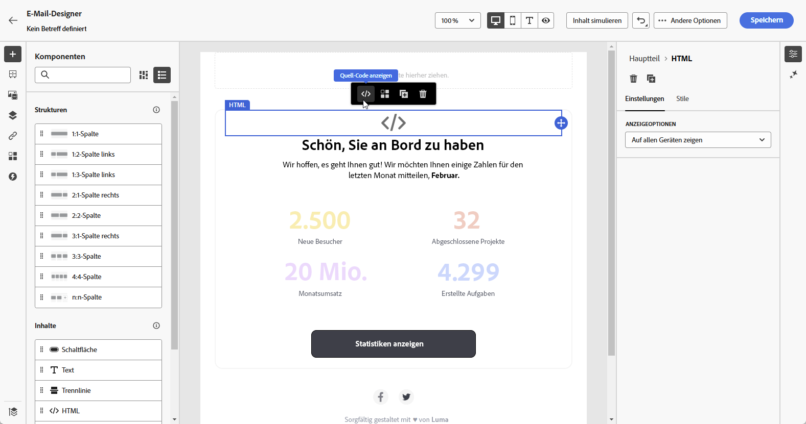

1. Navigieren Sie im Menü **[!UICONTROL HTML bearbeiten]** zu **[!UICONTROL Assets]** und klicken Sie dann auf **[!UICONTROL Asset-Auswahl öffnen]**.

   Alternativ können Sie die URL Ihres Assets kopieren und einfügen.

   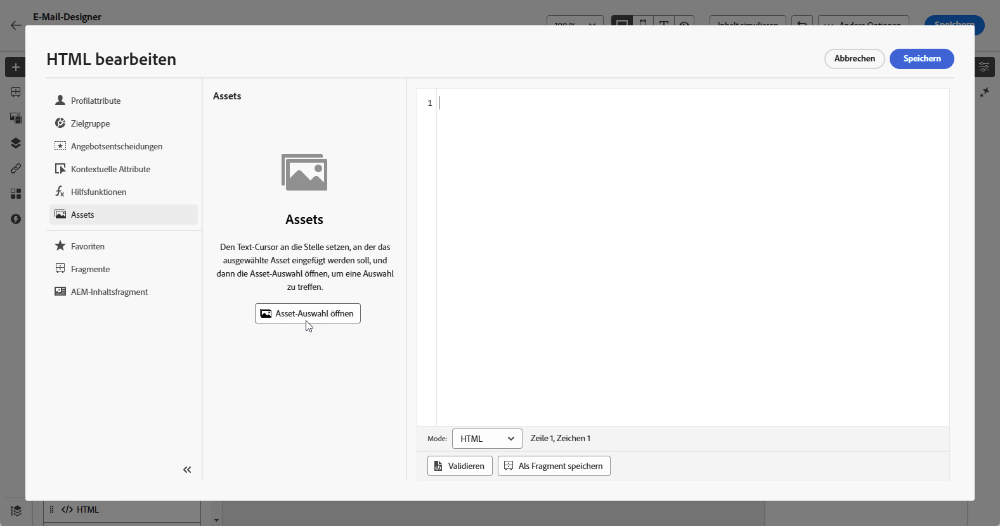

1. Durchsuchen Sie Ihre AEM-Assets und wählen Sie das Asset aus, das zu Ihren Inhalten hinzugefügt werden soll.

1. Passen Sie die Bildparameter (z. B. Höhe, Breite, Drehung, Spiegelung, Helligkeit, Farbton usw.) nach Bedarf an Ihre Asset-Anforderungen an.

   Eine umfassende Liste der Bildparameter, die der URL hinzugefügt werden können, finden Sie in der [Dokumentation zu Experience Manager](https://experienceleague.adobe.com/de/docs/dynamic-media-developer-resources/image-serving-api/image-serving-api/http-protocol-reference/command-reference/c-command-reference){target="_blank"}.

   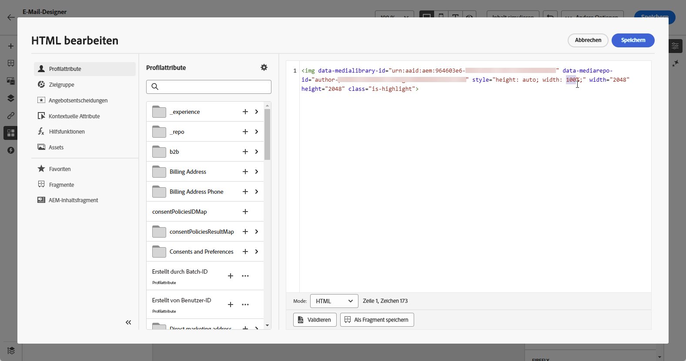

1. Klicken Sie auf **[!UICONTROL Speichern]**.

Ihr Inhalt enthält jetzt dynamische Medien. Alle Aktualisierungen, die Sie in Experience Manager vornehmen, werden automatisch in Journey Optimizer angezeigt.

## Personalisieren von Textüberlagerungen {#text-overlay}

Passen Sie dynamische Medien einfach an, indem Sie die vorhandene Textüberlagerung durch neuen Text Ihrer Wahl ersetzen, was nahtlose Aktualisierungen und Personalisierungen ermöglicht.

Beispielsweise können Sie mithilfe der Experimentierfunktion die vorhandene Textüberlagerung aktualisieren, indem Sie sie für jede Abwandlung durch anderen Text ersetzen und sicherstellen, dass sie beim Öffnen einer Nachricht für jedes Profil angepasst wird.

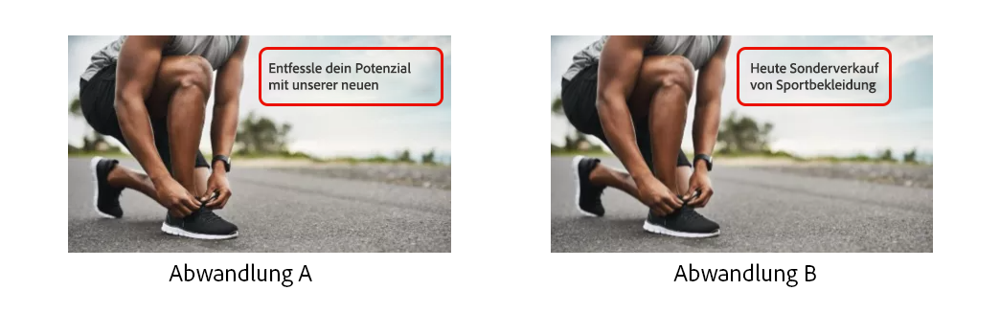

>[!AVAILABILITY]
>
>Die **Personalisierung von Textüberlagerungen** ist ausschließlich im [Scene7-Modus](https://experienceleague.adobe.com/de/docs/experience-manager-65/content/assets/dynamic/config-dms7){target="_blank"} von Dynamic Media verfügbar. Da der Scene7-Modus für Kundinnen und Kunden im Gesundheitswesen nicht verfügbar ist, werden Inhalte mithilfe einer Binärkopie des Bildes aus Journey Optimizer gerendert. Wenden Sie sich bei Ausnahmen an den Adobe-Support.

Gehen Sie wie folgt vor, um Ihre Textüberlagerung zu personalisieren:

1. Ziehen Sie eine **[!UICONTROL HTML-Komponente]** per Drag-and-Drop in Ihren Inhalt.

1. Wählen Sie **[!UICONTROL Quell-Code anzeigen]** aus.

1. Greifen Sie über das Menü **[!UICONTROL HTML bearbeiten]** auf **[!UICONTROL Assets]** und dann auf **[!UICONTROL Asset-Auswahl öffnen]** zu.

   Sie können Ihre Assets-URL auch einfach kopieren und einfügen.

1. Durchsuchen Sie Ihre AEM-Assets und wählen Sie das Asset aus, das zu Ihren Inhalten hinzugefügt werden soll.

1. Ersetzen Sie die Überlagerung durch den gewünschten Text.

   

1. Aktualisieren Sie die Bildparameter:

   * **Layer**: Geben Sie das Basiselement ein, in dem der Text platziert wird.
   * **Size**: Aktualisieren Sie die Größe des Textblocks.
   * **TextAttr**: Passen Sie die Größe der Textschrift an.
   * **Pos**: Legen Sie die Position des Textes im Bild.

   >[!WARNING]
   >
   >Der Parameter „Layer“ ist erforderlich, um die dynamischen Medien zu aktualisieren.

   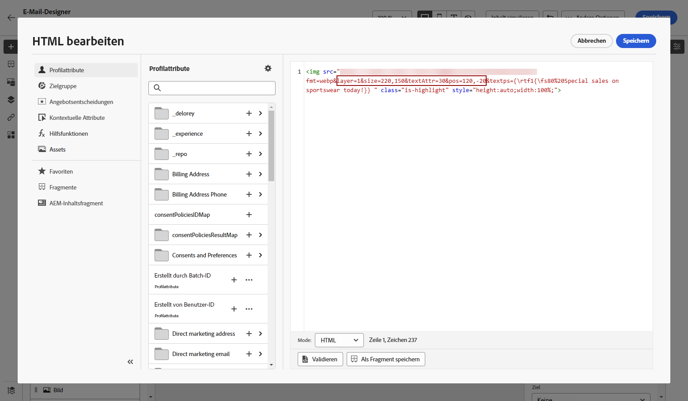

1. Klicken Sie auf **[!UICONTROL Speichern]**.

Ihr Inhalt enthält jetzt Ihre aktualisierte Textüberlagerung.

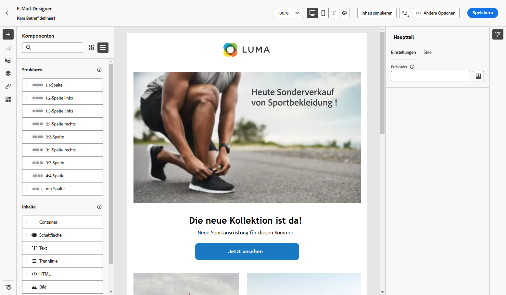

## Hinzufügen und Verwalten der Dynamic Media-Vorlage {#dynamic-media-template}

Fügen Sie ganz einfach Ihre Dynamic Media-Vorlage in Journey Optimizer hinzu und aktualisieren Sie Ihre Medieninhalte bei Bedarf. Sie können jetzt Personalisierungsfelder in Ihre Medien integrieren, sodass Sie in Journey Optimizer benutzerfreundlichere und ansprechendere Inhalte erstellen können.

Erfahren Sie mehr über [Dynamic Media-Vorlagen](https://experienceleague.adobe.com/de/docs/dynamic-media-classic/using/template-basics/quick-start-template-basics){target="_blank"}.

>[!AVAILABILITY]
>
>Die **Dynamic Media-Vorlage** ist ausschließlich im [Scene7-Modus](https://experienceleague.adobe.com/de/docs/experience-manager-65/content/assets/dynamic/config-dms7) von Dynamic Media verfügbar. Da der Scene7-Modus für Kundinnen und Kunden im Gesundheitswesen nicht verfügbar ist, werden Inhalte nicht gerendert. Wenden Sie sich bei Ausnahmen an den Experience Manager-Support.

### Mit Bildkomponente {#image-component}

Sie können Ihre dynamische Vorlage mithilfe der Bildkomponente direkt in Ihren Inhalt einfügen:

1. Öffnen Sie Ihre Kampagne oder Journey und greifen Sie auf Ihre Inhalte zu.

1. Ziehen Sie eine **Bildkomponente** per Drag-and-Drop in Ihr Layout.

   Weitere Informationen zur Bildkomponente finden Sie auf [dieser Seite](../email/content-components.md).

   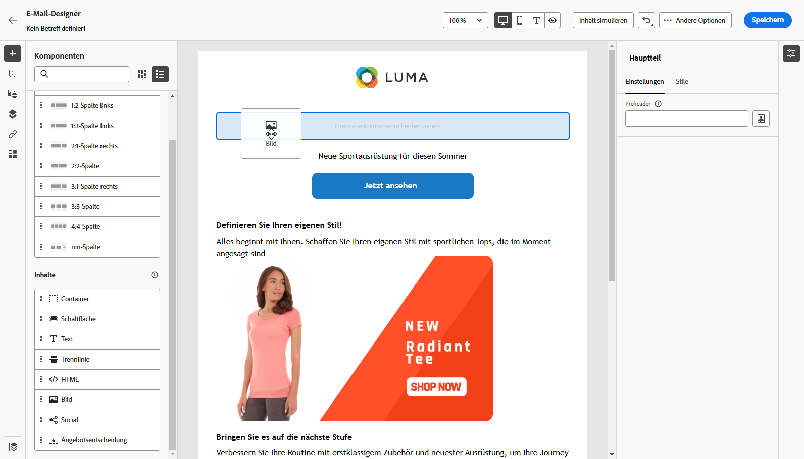

1. Durchsuchen Sie Ihre AEM-Assets und wählen Sie die Dynamic Media-Vorlage aus, die zu Ihren Inhalten hinzugefügt werden soll.

   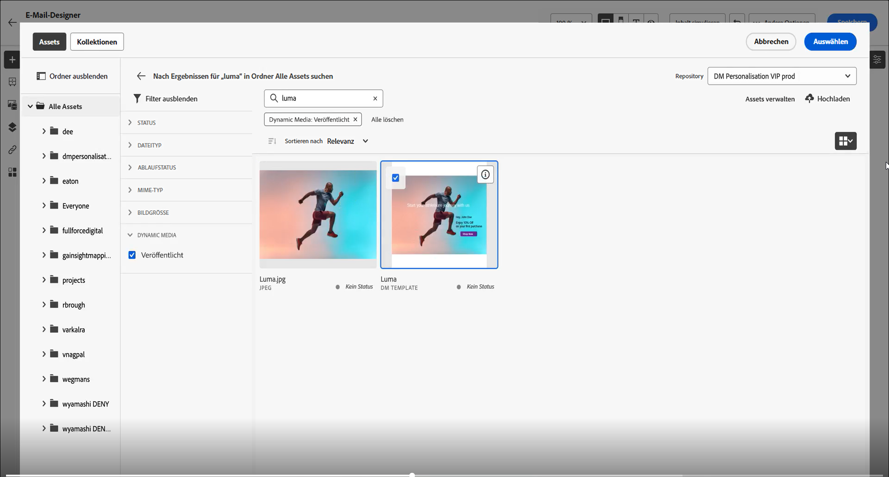

1. Navigieren Sie zu den **Bildeinstellungen**, um auf die Parameter Ihrer Dynamic Media-Vorlage zuzugreifen.

   Die verfügbaren Felder hängen von den Parametern ab, die während der [Vorlagenerstellung](https://experienceleague.adobe.com/de/docs/dynamic-media-classic/using/template-basics/creating-template-parameters#creating_template_parameters){target="_blank"} in Adobe Experience Manager hinzugefügt wurden.

   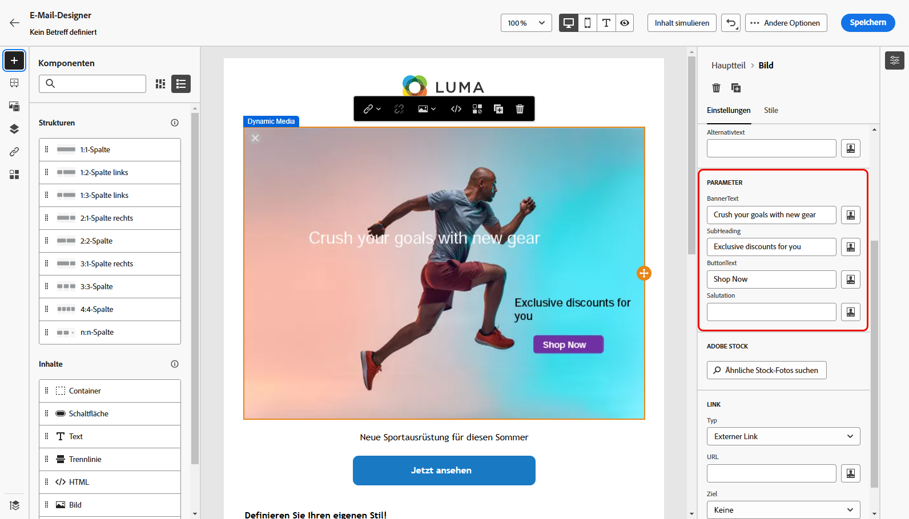

1. Füllen Sie die verschiedenen Felder aus und verwenden Sie den Personalisierungseditor, um personalisierte Inhalte hinzuzufügen. Sie können ein beliebiges Attribut verwenden, z. B. Profilname, Stadt oder andere relevante Details, um ein benutzerfreundlicheres Erlebnis zu schaffen.

   Weitere Informationen zur Personalisierung finden Sie auf [dieser Seite](../personalization/personalize.md).

   

1. Bedingte Inhalte können auf die Dynamic Media-Komponente angewendet werden, um verschiedene Inhaltsvarianten zu generieren. [Weitere Informationen](../personalization/dynamic-content.md)

1. Klicken Sie auf **[!UICONTROL Speichern]**.

Sobald Sie Ihre Tests durchgeführt und den Inhalt validiert haben, können Sie Ihre Nachricht an Ihre Zielgruppe senden. 

### Mit HTML-Komponente {#html-component}

Sie können Ihre dynamische Vorlage mithilfe der HTML-Komponente direkt in Ihren Inhalt einfügen:

1. Öffnen Sie Ihre Kampagne oder Journey und greifen Sie auf Ihre Inhalte zu.

1. Ziehen Sie eine **HTML-Komponente** per Drag-and-Drop in Ihr Layout.

   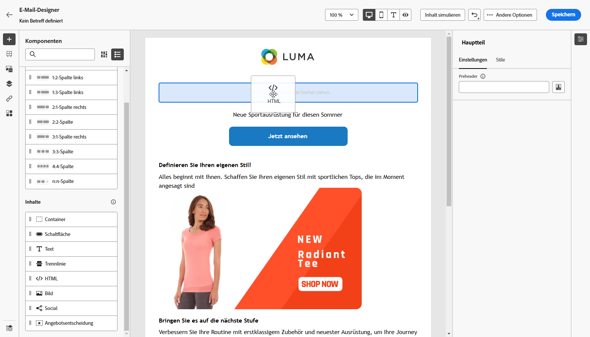

1. Wählen Sie **[!UICONTROL Quell-Code anzeigen]** aus.

   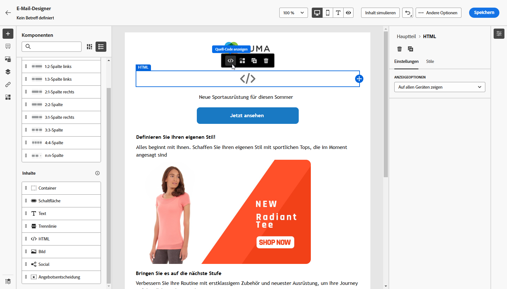

1. Greifen Sie über das Menü **[!UICONTROL HTML bearbeiten]** auf **[!UICONTROL Assets]** und dann auf **[!UICONTROL Asset-Auswahl öffnen]** zu.

   Sie können Ihre Assets-URL auch einfach kopieren und einfügen.

1. Passen Sie die Bildtextparameter nach Bedarf an Ihre Asset-Anforderungen an.

   

1. Klicken Sie auf **[!UICONTROL Speichern]**.

Sobald Sie Ihre Tests durchgeführt und den Inhalt validiert haben, können Sie Ihre Nachricht an Ihre Zielgruppe senden. 

<!--
## Personalization with Text Overlay

Easily customize any dynamic media by replacing the existing text overlay with new text of your choice, allowing for seamless updates and personalization.

In this example, our goal is to update the existing text overlay by replacing it with a new validity date and adding a personalization block, ensuring it is customized for each profile when they open their messages.

1. Drag and drop an **[!UICONTROL HTML component]** into your content.

1. Select **[!UICONTROL Show the source code]**.

1. From the **[!UICONTROL Edit HTML]** menu, access **[!UICONTROL Assets]** then **[!UICONTROL Open asset selector]**.

    You can also simply copy and paste your assets URL.

1. Browse through your AEM assets and select the one you want to add to your content.

1. Replace the overlay with the desired text.

    Here we change the validity date from 31st December 2024 to the 1st July 2025.

1. Add the required personalization fields to your image.

1. Click **[!UICONTROL Save]**.

Your content now includes your updated text overlay and personalization.

## Add Dynamic media conditional content

Enable conditional content in your dynamic media to better target your audience and deliver a more personalized experience.

1. Drag and drop an **[!UICONTROL HTML component]** into your content.

1. Select **[!UICONTROL Show the source code]**.

1. From the **[!UICONTROL Edit HTML]** menu, access **[!UICONTROL Assets]** then **[!UICONTROL Open asset selector]**.

    You can also simply copy and paste your assets URL.

1. Browse through your AEM assets and select the one you want to add to your content.

1. Once your dynamic media is inserted to your content, select **[!UICONTROL Enable conditional]** content from your HTML component toolbar to create your different user experiences. 

1. From the Variant - 1, click **[!UICONTROL Select condition]** to fine tune your audience.

1. Choose your condition or create a new one if needed and click **[!UICONTROL Select]**.

    [Learn more about conditions](../personalization/create-conditions.md)

1. Select your **[!UICONTROL Component]** and access the **[!UICONTROL Settings]** menu.

1. In the **[!UICONTROL Custom Attributes]** menu, populate the Dynamic Media text and personalization fields to customize the content for your audience.

-->

## Anleitungsvideo {#video}

Erfahren Sie, wie Sie Adobe Experience Manager Dynamic Media mit Adobe Journey Optimizer integrieren, um eine Aktualisierung und Personalisierung von Inhalten in Echtzeit zu ermöglichen.

In diesem Tutorial wird beschrieben, wie Sie Bilder direkt in AJO ändern, im HTML-Modus Textüberlagerungen hinzufügen, Dynamic Media-Vorlagen in AEM zur Hyperpersonalisierung erstellen und Kampagnen personalisieren, indem Sie Inhalte auf verschiedene Zielgruppensegmente zuschneiden. Diese Integration ermöglicht es Marketing-Fachleuten, ansprechende und personalisierte Kampagnen effizient zu erstellen, ohne zwischen Anwendungen wechseln zu müssen.

>[!VIDEO](https://video.tv.adobe.com/v/3457695/?learn=on&enablevpops=&autoplay=true)

