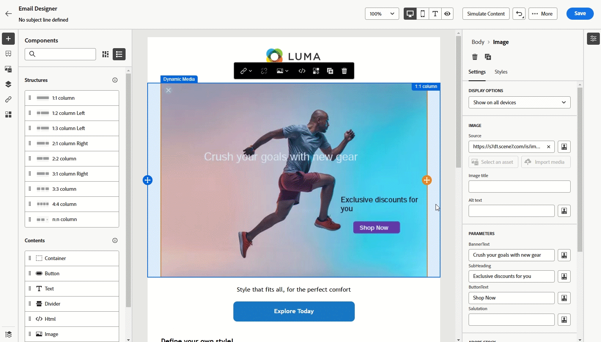

# Arbeiten mit Dynamic Media {#aem-dynamic}

>[!AVAILABILITY]
>
>Diese Integration ist nur für eine Reihe von Organisationen verfügbar (eingeschränkte Verfügbarkeit). Um Zugang zu erhalten, wenden Sie sich an den Adobe-Support.

Der Asset-Wähler unterstützt jetzt Dynamic Media, sodass Sie genehmigte Dynamic Media-Ausgabedarstellungen in Journey Optimizer nahtlos auswählen und verwenden können. Änderungen an Assets in Adobe Experience Manager werden sofort in Ihren Journey Optimizer-Inhalten übernommen, sodass stets die aktuellen Versionen verwendet werden, ohne dass manuelle Aktualisierungen erforderlich sind.

Beachten Sie, dass diese Integration nur für Kunden verfügbar ist, die Dynamic Media Manager as a Cloud Service verwenden.

Weitere Informationen zu Dynamic Media in Adobe Experience Manager as a Cloud Service finden Sie in der [Dokumentation zu Experience Manager](https://experienceleague.adobe.com/de/docs/experience-manager-cloud-service/content/assets/dynamicmedia/dynamic-media){target="_blank"}.

## Hinzufügen und Verwalten von Dynamic Media {#dynamic-media}

Verbessern und optimieren Sie Ihre Inhalte für jeden Bildschirm oder Browser, indem Sie Dynamic Media aus Adobe Experience Manager as a Cloud Service direkt in Ihre Journey Optimizer-Inhalte einfügen.  Anschließend können Sie bei Bedarf die Größe ändern, zuschneiden, verbessern und andere Anpassungen vornehmen.

1. Ziehen Sie eine **[!UICONTROL HTML-Komponente]** per Drag-and-Drop in Ihren Inhalt.

1. Wählen Sie **[!UICONTROL Quellcode anzeigen]** aus.

   

1. Navigieren **[!UICONTROL im Menü &quot;HTML bearbeiten]** zu **[!UICONTROL Assets]** klicken Sie dann auf **[!UICONTROL Asset-Auswahl öffnen]**.

   Alternativ können Sie die URL Ihres Assets kopieren und einfügen.

   

1. Durchsuchen Sie Ihre AEM-Assets und wählen Sie das Asset aus, das Sie zu Ihren Inhalten hinzufügen möchten.

1. Passen Sie die Bildparameter (z. B. Höhe, Breite, Drehen, Spiegeln, Helligkeit, Farbton usw.) nach Bedarf an Ihre Asset-Anforderungen an.

   Eine umfassende Liste der Bildparameter, die der URL hinzugefügt werden können, finden Sie in der [Dokumentation zu Experience Manager](https://experienceleague.adobe.com/de/docs/dynamic-media-developer-resources/image-serving-api/image-serving-api/http-protocol-reference/command-reference/c-command-reference).

   

1. Klicken Sie auf **[!UICONTROL Speichern]**.

Ihr Inhalt enthält jetzt Dynamic Media. Alle Aktualisierungen, die Sie in Experience Manager vornehmen, werden automatisch in Journey Optimizer angezeigt.

## Textüberlagerung personalisieren {#text-overlay}

Passen Sie Dynamic Media einfach an, indem Sie die vorhandene Textüberlagerung durch neuen Text Ihrer Wahl ersetzen, was nahtlose Aktualisierungen und Personalisierung ermöglicht.

Beispielsweise können Sie mithilfe der Experimentierfunktion die vorhandene Textüberlagerung aktualisieren, indem Sie sie für jede Abwandlung durch einen anderen Text ersetzen und sicherstellen, dass sie für jedes Profil angepasst wird, wenn es seine Nachrichten öffnet.

1. Ziehen Sie eine **[!UICONTROL HTML-Komponente]** per Drag-and-Drop in Ihren Inhalt.

1. Wählen Sie **[!UICONTROL Quellcode anzeigen]** aus.

1. Greifen Sie über das **[!UICONTROL HTML bearbeiten]** auf **[!UICONTROL Assets]** und dann auf **[!UICONTROL Asset-Wähler öffnen]** zu.

   Sie können Ihre Assets-URL auch einfach kopieren und einfügen.

1. Durchsuchen Sie Ihre AEM-Assets und wählen Sie das Asset aus, das Sie zu Ihren Inhalten hinzufügen möchten.

1. Ersetzen Sie die Überlagerung durch den gewünschten Text.

   

1. Aktualisieren Sie die Bildparameter:

   * **Ebene**: Geben Sie das Basiselement ein, in dem der Text platziert wird.
   * **Größe**: Aktualisieren Sie die Größe des Textblocks.
   * **TextAttr**: Passen Sie die Größe Ihrer Textschriftart an.
   * **Pos**: die Position Ihres Textes im Bild festlegen.

   >[!WARNING]
   >
   >Der Ebenenparameter ist erforderlich, um Dynamic Media zu aktualisieren.

   

1. Klicken Sie auf **[!UICONTROL Speichern]**.

Ihr Inhalt enthält jetzt Ihre aktualisierte Textüberlagerung.

## Hinzufügen und Verwalten Ihrer Dynamic Media-Vorlage {#dynamic-media-template}

Fügen Sie ganz einfach Ihre Dynamic Media-Vorlage in Journey Optimizer hinzu und aktualisieren Sie Ihre Medieninhalte bei Bedarf. Sie können jetzt Personalisierungsfelder in Ihre Medien integrieren, sodass Sie in Journey Optimizer benutzerfreundlichere und ansprechendere Inhalte erstellen können.

Weitere Informationen zu [Dynamic Media-Vorlage](https://experienceleague.adobe.com/de/docs/dynamic-media-classic/using/template-basics/quick-start-template-basics).

### Mit Bildkomponente {#image-component}

Sie können Ihre dynamische Vorlage mithilfe der Bildkomponente direkt in Ihren Inhalt einfügen:

1. Öffnen Sie Ihre Kampagne oder Journey und greifen Sie auf Ihre Inhalte zu.

1. Ziehen Sie eine **Bildkomponente** per Drag-and-Drop in Ihr Layout.

   Weitere Informationen zur Bildkomponente finden Sie auf [dieser Seite](../email/content-components.md).

   

1. Durchsuchen Sie Ihre AEM-Assets und wählen Sie die Dynamic Media-Vorlage aus, die Sie zu Ihren Inhalten hinzufügen möchten.

   

1. Navigieren **in den** Bildeinstellungen“, um auf die Parameter Ihrer Dynamic Media-Vorlage zuzugreifen.

   Die verfügbaren Felder hängen von den Parametern ab, die bei der [Vorlagenerstellung](https://experienceleague.adobe.com/de/docs/dynamic-media-classic/using/template-basics/creating-template-parameters#creating_template_parameters) in Adobe Experience Manager hinzugefügt wurden.

   

1. Füllen Sie die verschiedenen Felder aus und verwenden Sie den Personalisierungseditor, um personalisierte Inhalte hinzuzufügen. Sie können jedes Attribut verwenden, z. B. den Profilnamen, die Stadt oder andere relevante Details, um ein benutzerfreundlicheres Erlebnis zu schaffen.

   Weitere Informationen zur Personalisierung finden [ auf dieser Seite](../personalization/personalize.md).

   

1. Bedingte Inhalte können auf die Dynamic Media-Komponente angewendet werden, um verschiedene Varianten des Inhalts zu generieren. [Weitere Informationen](../personalization/dynamic-content.md)

1. Klicken Sie auf **[!UICONTROL Speichern]**.

Nachdem Sie Ihre Tests durchgeführt und den Inhalt validiert haben, können Sie Ihre Nachricht an Ihre Audience senden.

### Mit HTML-Komponente {#html-component}

Sie können Ihre dynamische Vorlage mithilfe der HTML-Komponente direkt in Ihren Inhalt einfügen:

1. Öffnen Sie Ihre Kampagne oder Journey und greifen Sie auf Ihre Inhalte zu.

1. Ziehen Sie eine **HTML-Komponente** per Drag-and-Drop in Ihr Layout.

   

1. Wählen Sie **[!UICONTROL Quellcode anzeigen]** aus.

   

1. Greifen Sie über das **[!UICONTROL HTML bearbeiten]** auf **[!UICONTROL Assets]** und dann auf **[!UICONTROL Asset-Wähler öffnen]** zu.

   Sie können Ihre Assets-URL auch einfach kopieren und einfügen.

1. Passen Sie die Bildtextparameter nach Bedarf an Ihre Asset-Anforderungen an.

   

1. Klicken Sie auf **[!UICONTROL Speichern]**.

Nachdem Sie Ihre Tests durchgeführt und den Inhalt validiert haben, können Sie Ihre Nachricht an Ihre Audience senden.

<!--
## Personalization with Text Overlay

Easily customize any dynamic media by replacing the existing text overlay with new text of your choice, allowing for seamless updates and personalization.

In this example, our goal is to update the existing text overlay by replacing it with a new validity date and adding a personalization block, ensuring it is customized for each profile when they open their messages.

1. Drag and drop an **[!UICONTROL HTML component]** into your content.

1. Select **[!UICONTROL Show the source code]**.

1. From the **[!UICONTROL Edit HTML]** menu, access **[!UICONTROL Assets]** then **[!UICONTROL Open asset selector]**.

    You can also simply copy and paste your assets URL.

1. Browse through your AEM assets and select the one you want to add to your content.

1. Replace the overlay with the desired text.

    Here we change the validity date from 31st December 2024 to the 1st July 2025.

1. Add the required personalization fields to your image.

1. Click **[!UICONTROL Save]**.

Your content now includes your updated text overlay and personalization.

## Add Dynamic media conditional content

Enable conditional content in your dynamic media to better target your audience and deliver a more personalized experience.

1. Drag and drop an **[!UICONTROL HTML component]** into your content.

1. Select **[!UICONTROL Show the source code]**.

1. From the **[!UICONTROL Edit HTML]** menu, access **[!UICONTROL Assets]** then **[!UICONTROL Open asset selector]**.

    You can also simply copy and paste your assets URL.

1. Browse through your AEM assets and select the one you want to add to your content.

1. Once your dynamic media is inserted to your content, select **[!UICONTROL Enable conditional]** content from your HTML component toolbar to create your different user experiences. 

1. From the Variant - 1, click **[!UICONTROL Select condition]** to fine tune your audience.

1. Choose your condition or create a new one if needed and click **[!UICONTROL Select]**.

    [Learn more about conditions](../personalization/create-conditions.md)

1. Select your **[!UICONTROL Component]** and access the **[!UICONTROL Settings]** menu.

1. In the **[!UICONTROL Custom Attributes]** menu, populate the Dynamic Media text and personalization fields to customize the content for your audience.

-->
