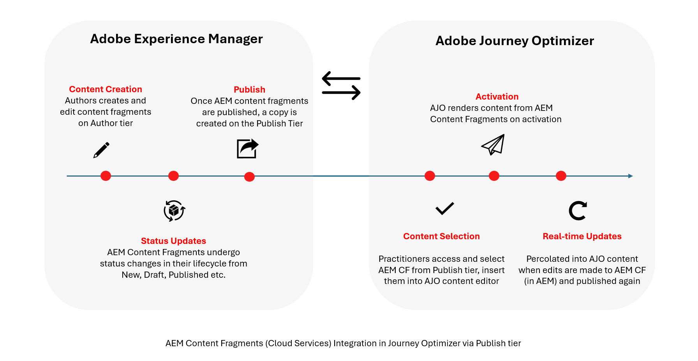

# Erste Schritte mit Adobe Experience Manager-Inhaltsfragmenten {#aem-fragments}

>[!BEGINSHADEBOX]

**Auf dieser Seite** Erste Schritte mit Adobe Experience Manager-Inhaltsfragmenten und erfahren Sie, wie der Autoren- und Veröffentlichungslebenszyklus bestimmt, welche Fragmente in Journey Optimizer verfügbar sind.

>[!ENDSHADEBOX]

>[!AVAILABILITY]
>
>Für Kundinnen und Kunden im Gesundheitswesen wird die Integration nur bei einer Lizenzierung der Add-on-Angebote Journey Optimizer Healthcare Shield und Adobe Experience Manager Enhanced Security aktiviert.

Durch die Integration von Adobe Experience Manager as a Cloud Service mit Adobe Journey Optimizer können Sie jetzt Ihre AEM-Inhaltsfragmente nahtlos in Journey Optimizer in Ihre Inhalte integrieren. Diese optimierte Verbindung vereinfacht den Zugriff auf und die Nutzung von AEM-Inhalten und ermöglicht die Erstellung personalisierter und dynamischer Kampagnen und Journeys.

Weitere Informationen zu AEM-Inhaltsfragmenten finden Sie unter [Arbeiten mit Inhaltsfragmenten](https://experienceleague.adobe.com/de/docs/experience-manager-cloud-service/content/sites/administering/content-fragments/content-fragments-with-journey-optimizer){target="_blank"} in der Dokumentation zu Experience Manager.

## Lebenszyklus von Inhaltsfragmenten

Inhaltsfragmente folgen verschiedenen Lebenszyklusphasen, je nachdem, in welcher Adobe Experience Manager-Ebene sie vorhanden sind. [Weitere Informationen finden Sie in der Dokumentation zu Adobe Experience Manager](https://experienceleague.adobe.com/de/docs/experience-manager-cloud-service/content/sites/authoring/author-publish)

Inhalte werden auf der **Autorenebene“ erstellt und verwaltet** wo Fragmente Status wie Neu, Entwurf, Veröffentlicht, Geändert oder Veröffentlichung rückgängig gemacht haben können. Diese Status gelten nur für die **Autorenebene** und unterstützen die Inhaltserstellung und -überprüfung.

Wenn ein Inhaltsfragment veröffentlicht wird, wird eine Kopie auf der **Veröffentlichungsebene** erstellt und über einen öffentlichen, nicht authentifizierten Endpunkt verfügbar gemacht. Journey Optimizer kann ausschließlich mit dieser **Veröffentlichungsebene“ integriert**.

Infolgedessen werden in Journey Optimizer nur veröffentlichte oder geänderte Inhaltsfragmente angezeigt und es wird immer die neueste veröffentlichte Version verwendet. Änderungen, die nach der Veröffentlichung vorgenommen werden, werden erst dann in Journey Optimizer übernommen, wenn das Inhaltsfragment erneut veröffentlicht wurde.
