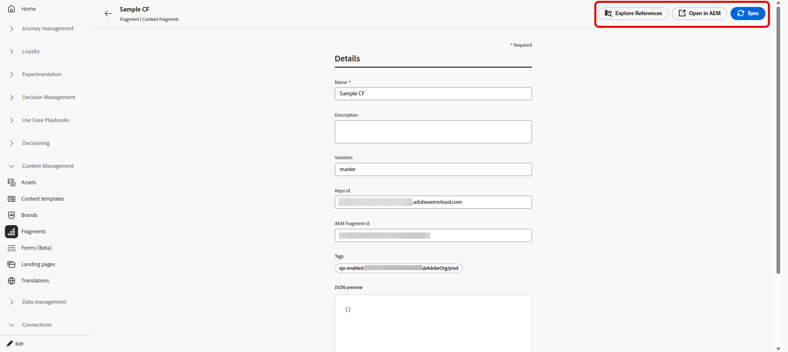

# Verwalten von Adobe Experience Manager-Inhaltsfragmenten {#aem-fragments}

>[!BEGINSHADEBOX]

**Auf dieser Seite** Verwalten Sie AEM-Inhaltsfragmente über die Liste Inhaltsverwaltungsfragmente , um den Status und die Metadaten zu überwachen. Überprüfen Sie, wo Fragmente in Journey und Kampagnen verwendet werden, synchronisieren Sie veröffentlichte Updates aus Experience Manager und öffnen Sie Fragmente zur Bearbeitung, ohne Journey Optimizer verlassen zu müssen.

>[!ENDSHADEBOX]

Durch die Integration von Adobe Experience Manager as a Cloud Service oder Managed Services mit Adobe Journey Optimizer können Sie AEM-Inhaltsfragmente in Ihren Inhalten verwenden und den Fragmentstatus überprüfen, ohne Journey Optimizer verlassen zu müssen.

Wenn Sie ein bereits auf einer Journey oder in Campaign verwendetes Fragment erneut veröffentlichen, beginnt der Synchronisierungszeitgeber, nachdem das Fragment in Adobe Experience Manager **veröffentlicht** wurde. Aktualisierte Inhalte sind in der Regel innerhalb von **5 Minuten in Journey Optimizer verfügbar** Für unitäre Journey und Kampagnen wird die Änderung für Batch-Sendungen im **nächsten Verarbeitungs-Batch** angezeigt. Siehe [Arbeiten mit Adobe Experience Manager-](aem-fragments.md). Wenn Verzögerungen auftreten, können Sie dieses Fragment manuell aus Journey Optimizer synchronisieren, um die neueste veröffentlichte Version abzurufen.

## Zugriff auf AEM-Inhaltsfragmente {#access-aem-fragments}

1. Wählen Sie im Menü **[!UICONTROL Content]** die Option **[!UICONTROL Fragmente]** aus.

1. Öffnen Sie die Registerkarte **[!UICONTROL AEM]** Fragments, um die in Adobe Experience Manager verfügbaren Inhaltsfragmente anzuzeigen.

1. Klicken Sie in der Fragmentliste auf , um **[!UICONTROL Verweise zu]**.

   

1. Wählen Sie ein Fragment aus, um seinen Status und die verfügbaren Aktionen zu überprüfen:

   * **[!UICONTROL Verweise erkunden]**: Anzeigen der Journey, Kampagnen, orchestrierten Kampagnen und Vorlagen, die das Fragment verwenden.
   * **[!UICONTROL In AEM öffnen]**: Öffnen Sie das Fragment in Adobe Experience Manager, um es zu bearbeiten oder erneut zu veröffentlichen.
   * **[!UICONTROL Synchronisieren]**: Rufen Sie die neueste veröffentlichte Version von Adobe Experience Manager nach Journey Optimizer ab, z. B. wenn erneut veröffentlichte Inhalte nach dem üblichen Synchronisierungsfenster nicht angezeigt werden. Wenn das Steuerelement deaktiviert ist, entspricht das Fragment bereits der veröffentlichten Version in Experience Manager.

     

1. Das **[!UICONTROL Details]**-Menü ermöglicht die Überprüfung von Metadaten und die Vorschau der synchronisierten Payload:

   * **[!UICONTROL Name]**: Titel des aus Adobe Experience Manager importierten Inhaltsfragments.
   * **[!UICONTROL Beschreibung]**: Beschreibung aus Adobe Experience Manager importiert.
   * **[!UICONTROL Variante]**: Veröffentlichte Variante, die derzeit für dieses Fragment dargestellt wird.
   * **[!UICONTROL Repo-ID]**: Repository-Kennung für das Fragment in Adobe Experience Manager.
   * **[!UICONTROL AEM Fragment-ID]**: Eindeutige Inhaltsfragment-Kennung in Adobe Experience Manager.
   * **[!UICONTROL Tags]**: Tags, die in Adobe Experience Manager zugewiesen sind, einschließlich Journey Optimizer-Aktivierungs-Tags, die bestimmen, ob das Fragment in Selektoren für Ihr Unternehmen und Ihre Sandbox angezeigt wird. [Erfahren Sie, wie Sie Tags erstellen und zuweisen](aem-fragments.md#create-tag)
   * **[!UICONTROL JSON-Vorschau]**: Schreibgeschützte JSON-Struktur des von Journey Optimizer verwendeten Fragmentinhalts.

1. Verwenden **[!UICONTROL in &quot;]** erkunden“ die Registerkarten, um Journey, Kampagnen, orchestrierte Kampagnen und Vorlagen anzuzeigen, die auf das Fragment verweisen.

   

➡️ [Weitere Informationen zu Inhaltsfragmenten](aem-fragments.md)

