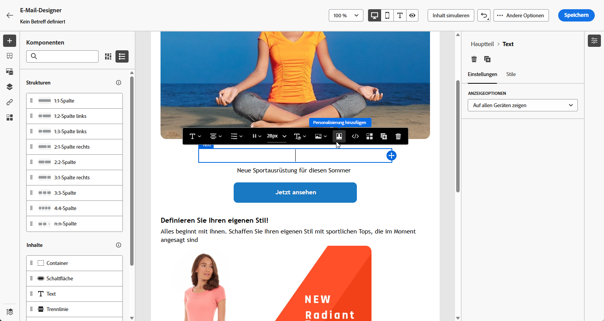
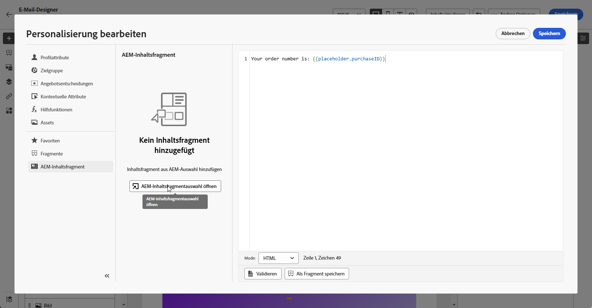
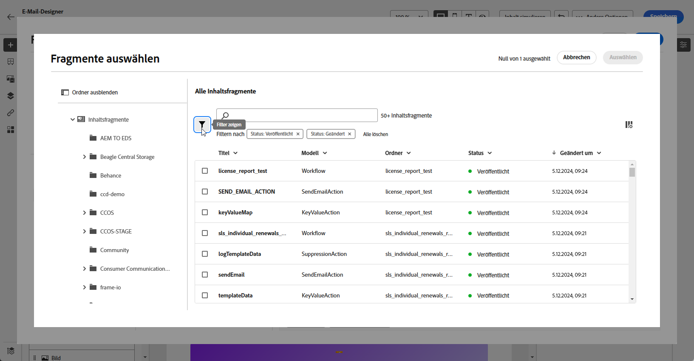
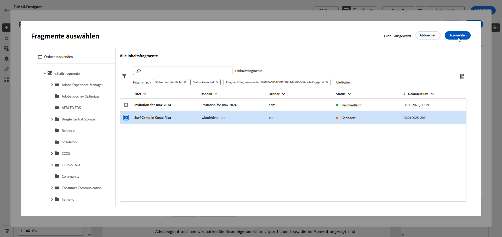
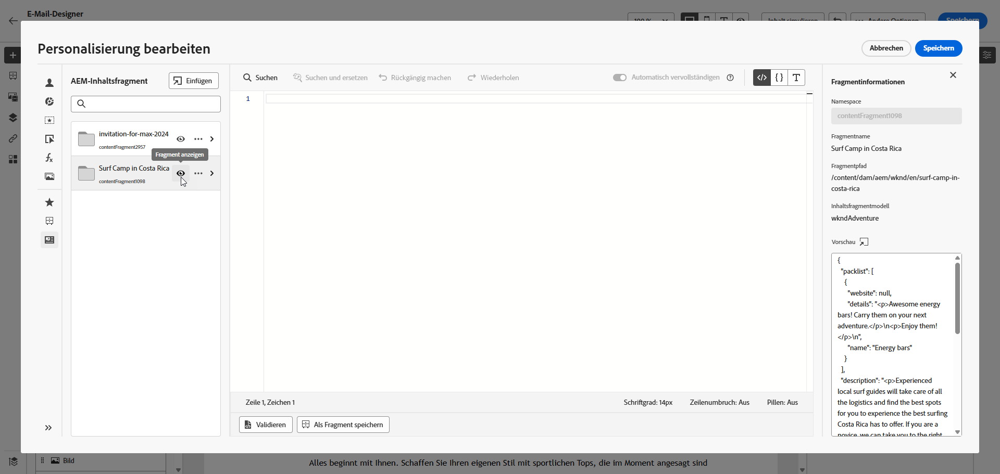
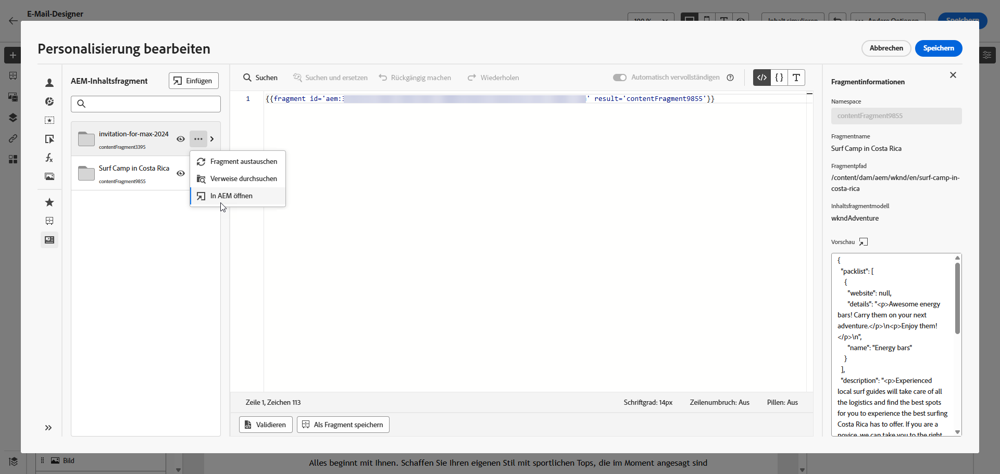
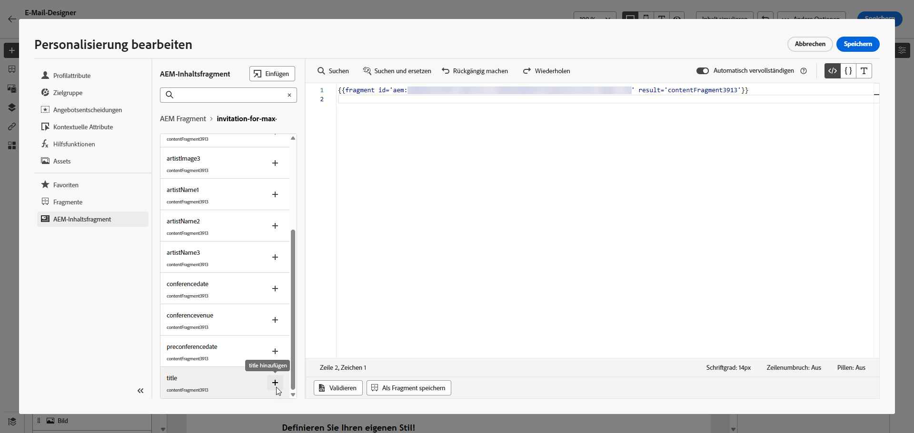
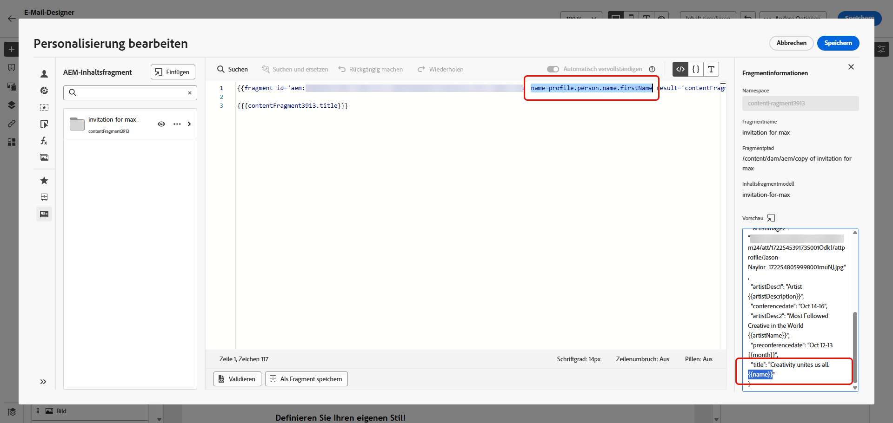

# Inhaltsfragmente in Adobe Experience Manager {#aem-fragments}

Durch die Integration von Adobe Experience Manager as a Cloud Service mit Adobe Journey Optimizer können Sie jetzt Ihre AEM-Inhaltsfragmente nahtlos in Journey Optimizer in Ihre Inhalte integrieren. Diese optimierte Verbindung vereinfacht den Zugriff auf und die Nutzung von AEM-Inhalten und ermöglicht die Erstellung personalisierter und dynamischer Kampagnen und Journeys.

Weitere Informationen zu AEM-Inhaltsfragmenten finden Sie unter [Arbeiten mit Inhaltsfragmenten](https://experienceleague.adobe.com/de/docs/experience-manager-cloud-service/content/sites/administering/content-fragments/content-fragments-with-journey-optimizer){target="_blank"} in der Dokumentation zu Experience Manager.

## Bevor Sie beginnen {#start}

>[!AVAILABILITY]
>
>Für Kundinnen und Kunden im Gesundheitswesen wird die Integration nur bei einer Lizenzierung der Add-on-Angebote Journey Optimizer Healthcare Shield und Adobe Experience Manager Enhanced Security aktiviert.

### Einschränkungen {#limitations}

Beachten Sie die folgenden Einschränkungen beim Arbeiten mit Adobe Experience Manager-Inhaltsfragmenten in Journey Optimizer:

* **Inhaltsfragmenttypen**: Nur einfache Inhaltsfragmente werden unterstützt. Varianten und verschachtelte Fragmente werden derzeit nicht unterstützt.

* **Mehrsprachige Inhalte**: Es wird nur der manuelle Fluss unterstützt.

* **Personalization**: Es werden nur Profilattribute, kontextuelle Attribute, statische Zeichenfolgen und vordeklarierte Variablen unterstützt. Abgeleitete oder berechnete Attribute werden nicht unterstützt.

* **Aktualisierungen und Versionierung**: Inhaltsfragmentaktualisierungen müssen von Adobe Experience Manager manuell erneut veröffentlicht werden. Es gibt keine automatische Versionsabstimmung zwischen Adobe Experience Manager und Journey Optimizer.

* **Caching**: Journey Optimizer ruft Inhaltsfragmente in Echtzeit aus der Adobe Experience Manager-Veröffentlichung ab. Es gibt keine Pre-Render-Zwischenspeicherung.

* **Proofing**: Der Testversand für veröffentlichte Kampagnen und Journey spiegelt Daten aus der neuesten Experience Manager-Inhaltsfragmentveröffentlichung wider. Es gibt keine historische Versionssperre.

* **Benutzerzugriff**: Es wird empfohlen, die Anzahl der Benutzer mit Zugriff auf die Veröffentlichung von Inhaltsfragmenten zu begrenzen, um das Risiko versehentlicher Fehler zu reduzieren.

### Inhaltssynchronisierungsfluss {#content-sync-flow}

Die Integration zwischen Adobe Experience Manager und Journey Optimizer folgt diesem Datenfluss:

1. **[Erstellen und Verfassen](https://experienceleague.adobe.com/de/docs/experience-manager-cloud-service/content/sites/administering/content-fragments/managing#creating-a-content-fragment)**: Inhalte werden in Adobe Experience Manager als Inhaltsfragmente erstellt und konfiguriert.

1. **[Tagging](https://experienceleague.adobe.com/de/docs/experience-manager-cloud-service/content/sites/administering/content-fragments/managing#manage-tags)**: Inhaltsfragmente müssen mit dem Journey Optimizer-spezifischen Tag (`ajo-enabled:{OrgId}/{SandboxName}`) getaggt werden.

1. **[Veröffentlichen](https://experienceleague.adobe.com/de/docs/experience-manager-cloud-service/content/sites/administering/content-fragments/managing#publishing-and-previewing-a-fragment)**: Inhaltsfragmente werden in Adobe Experience Manager veröffentlicht und stehen damit Journey Optimizer zur Verfügung.

1. **[Zugriff](#aem-add)**: Journey Optimizer ruft verfügbare Inhaltsfragmente aus der Adobe Experience Manager-Veröffentlichungsinstanz in Echtzeit ab und zeigt sie an.

1. **[Integration](#aem-add)**: Inhaltsfragmente werden ausgewählt und in Kampagnen oder Journey integriert.

## Erstellen und Zuweisen eines Tags in Experience Manager

Bevor Sie Ihr Inhaltsfragment in Journey Optimizer verwenden, müssen Sie ein Tag speziell für Journey Optimizer erstellen:

1. Greifen Sie auf Ihre **Experience Manager**-Umgebung zu.

1. Wählen Sie im Menü **Tools** die Option **Tagging** aus.

   

1. Klicken Sie auf **Tag erstellen**.

1. Stellen Sie sicher, dass die ID der folgenden Syntax entspricht: `ajo-enabled:{AJO-OrgId}/{AJO-SandboxName}`.

1. Klicken Sie auf **Erstellen**.

1. Definieren Sie Ihr Inhaltsfragmentmodell, wie in der [Dokumentation zu Experience Manager](https://experienceleague.adobe.com/de/docs/experience-manager-cloud-service/content/sites/administering/content-fragments/content-fragment-models){target="_blank"} beschrieben und weisen Sie Ihr neu erstelltes Journey Optimizer-Tag zu.

Diese Echtzeitverbindung stellt sicher, dass Ihre Inhalte immer aktuell sind, bedeutet aber auch, dass alle Änderungen an veröffentlichten Fragmenten sofort aktive Kampagnen und Journey betreffen.

Sie können jetzt mit der Erstellung und Konfiguration Ihres Inhaltsfragments zur späteren Verwendung in Journey Optimizer beginnen. Weitere Informationen hierzu finden Sie in der [Dokumentation zu Experience Manager](https://experienceleague.adobe.com/de/docs/experience-manager-cloud-service/content/sites/administering/content-fragments/managing){target="_blank"}.

## Hinzufügen von Experience Manager-Inhaltsfragmenten {#aem-add}

Nachdem Sie Ihre AEM-Inhaltsfragmente erstellt und personalisiert haben, können Sie sie in Ihre Journey Optimizer-Kampagne oder -Journey importieren.

1. Erstellen Sie Ihre [Kampagne](../campaigns/create-campaign.md) oder [Journey](../building-journeys/journey-gs.md).

1. Um auf Ihr AEM-Inhaltsfragment zuzugreifen, klicken Sie auf  in einem beliebigen Textfeld oder öffnen Sie den Quell-Code über eine HTML-Inhaltskomponente.

   

1. Klicken Sie im Menü **[!UICONTROL AEM-Inhaltsfragment]** im linken Bereich auf **[!UICONTROL AEM-Inhaltsfragmentauswahl öffnen]**.

   

1. Wählen Sie ein **[!UICONTROL Inhaltsfragment]** aus der verfügbaren Liste aus, das in Ihren Journey Optimizer-Inhalt importiert werden soll.

1. Klicken Sie auf **[!UICONTROL Filter anzeigen]**, um Ihre Inhaltsfragmentliste zu optimieren.

   Standardmäßig ist der Filter „Inhaltsfragment“ so voreingestellt, dass nur genehmigte Inhalte angezeigt werden.

   

1. Nachdem Sie Ihr **[!UICONTROL Inhaltsfragment]** ausgewählt haben, klicken Sie auf **[!UICONTROL Auswählen]**, um es zu öffnen.

   

1. Klicken Sie auf **[!UICONTROL Fragment anzeigen]**, um Ihre Fragmentinformationen anzuzeigen. Beachten Sie, dass durch Öffnen des Menüs **[!UICONTROL Fragmentinformationen]** der Editor in den schreibgeschützten Modus versetzt wird.

   Wählen Sie im Menü rechts **[!UICONTROL Vorschau]** aus, um Ihr Fragment in Adobe Experience Manager anzuzeigen.

   

1. Klicken Sie auf , um auf das erweiterte Menü Ihres Fragments zuzugreifen:

   * **[!UICONTROL Fragment austauschen]**
   * **[!UICONTROL Verweise durchsuchen]**
   * **[!UICONTROL In AEM öffnen]**

   

1. Wählen Sie die gewünschten Felder aus Ihrem **[!UICONTROL Fragment]** aus, um sie zu Ihrem Inhalt hinzuzufügen.
   <!--
    Note that if you choose to copy the value, any future updates to the Content Fragment will not be reflected in your campaign or journey. However, using dynamic placeholders ensures real-time updates.-->

   

1. Um die Echtzeit-Personalisierung zu aktivieren, müssen alle in einem **[!UICONTROL Inhaltsfragment]** verwendeten Platzhalter von der Benutzerin bzw. vom Benutzer explizit als Parameter im Fragment-Helfer-Tag deklariert werden. Sie können diese Platzhalter mit den folgenden Methoden Profilattributen, kontextuellen Attributen, statischen Zeichenfolgen oder vordefinierten Variablen zuordnen:

   1. **Zuordnung zu Profilen oder kontextuellen Attributen**: Weisen Sie den Platzhalter einem Profil oder einem kontextuellen Attribut zu, z. B. name = profile.person.name.firstName.

   1. **Statische Zeichenfolgenzuordnung**: Weisen Sie einen festen Zeichenfolgenwert zu, indem Sie ihn in doppelte Anführungszeichen setzen, z. B. name = „John“.

   1. **Variablenzuordnung**: Verweisen Sie auf eine Variable, die zuvor innerhalb derselben HTML deklariert wurde, z. B. name = &#39;variableName&#39;.
Stellen Sie in diesem Fall mit der folgenden Syntax sicher, dass **_variableName_** deklariert wird, bevor Sie die Fragment-ID hinzufügen:

      ```html
       
      ```

   Im folgenden Beispiel wird der Platzhalter **_name_** dem Attribut **_profile.person.name.firstName_** im Fragment zugeordnet.

   {zoomable="yes"}

1. Klicken Sie auf **[!UICONTROL Speichern]**. Sie können jetzt den Nachrichteninhalt testen und überprüfen, wie in [&#x200B; Abschnitt beschrieben](../content-management/preview.md).
Sobald Sie Ihre Tests durchgeführt und den Inhalt validiert haben, können Sie Ihrer Zielgruppe [Ihre Kampagne senden](../campaigns/review-activate-campaign.md) oder für sie [Ihre Journey veröffentlichen](../building-journeys/publish-journey.md).

Mit Adobe Experience Manager können die Journey Optimizer-Kampagnen oder -Journeys identifiziert werden, in denen ein Inhaltsfragment verwendet wird. Weitere Informationen hierzu sind in der [Dokumentation zu Adobe Experience Manager](https://experienceleague.adobe.com/de/docs/experience-manager-cloud-service/content/sites/administering/content-fragments/extension-content-fragment-ajo-external-references) verfügbar.

## Fehlerbehebung {#troubleshooting}

Wenn beim Arbeiten mit Adobe Experience Manager-Inhaltsfragmenten in Journey Optimizer Probleme auftreten, lesen Sie die folgenden häufigen Probleme und Lösungen:

| Problem | Ursache | Lösung |
|-|-|-|
| **Tag nicht gefunden** oder **Inhaltsfragment nicht in Selektor sichtbar** | Adobe Experience Manager-Tag-Syntax stimmt nicht mit dem erforderlichen `ajo-enabled:{OrgId}/{SandboxName}` überein | Überprüfen Sie, ob die Tag-ID die richtige **Organisations-ID** und **Sandbox-Name** verwendet. Stellen Sie sicher, dass keine Leerzeichen oder falschen Trennzeichen vorhanden sind. Veröffentlichen Sie das Inhaltsfragment nach der Korrektur des Tags erneut. |
| **Inhaltsfragment wird nicht in der Liste angezeigt** | Inhaltsfragment befindet sich im Entwurfsstatus oder ist nicht genehmigt | In der Journey Optimizer-Auswahl werden nur genehmigte und veröffentlichte Inhaltsfragmente angezeigt. Veröffentlichen Sie das Inhaltsfragment in Adobe Experience Manager und stellen Sie sicher, dass es den Status Genehmigt hat. |
| **Undefinierter Variablenfehler** | Personalization-Platzhalter nicht im Fragment-Helper-Tag deklariert | Fügen Sie alle erforderlichen Parameter zum Fragment-Helper-Tag hinzu. Jeder im Inhaltsfragment verwendete Platzhalter muss explizit mit seiner Zuordnung deklariert werden. |
| **Korrekturabzug zeigt unerwartete Inhalte an** | Der Korrekturabzug verwendet die neueste veröffentlichte Version von Adobe Experience Manager | Korrekturabzüge spiegeln immer die neueste Veröffentlichung des Inhaltsfragments in Adobe Experience Manager wider. Wenn Sie die letzten Änderungen in Adobe Experience Manager vorgenommen haben, veröffentlichen Sie das Fragment erneut und aktualisieren Sie den Korrekturabzug. |
| **Fehler: Zugriff verweigert (CPES)** | Benutzerrolle ist nicht berechtigt, auf bestimmte Attribute zuzugreifen | Wenden Sie sich an Ihren Systemadministrator, um sicherzustellen, dass Ihre Rolle über die entsprechenden Berechtigungen für das Profil oder die kontextuellen Attribute verfügt, die bei der Personalisierung verwendet werden. |
| **Fragment zeigt leere oder fehlende Inhalte an** | Fehlende erforderliche Personalisierungsparameter oder Fallback-Werte | Stellen Sie sicher, dass alle erforderlichen Parameter bereitgestellt werden, und erwägen Sie, Fallback-Werte für optionale Attribute hinzuzufügen. |

Wenn das Problem weiterhin besteht, wenden Sie sich mit Details zu Ihrer Inhaltsfragment-ID, der Kampagnen- oder Journey-ID und allen angezeigten Fehlermeldungen an den Adobe-Support.
