# Arbeiten mit Adobe Experience Manager-Inhaltsfragmenten {#aem-fragments}

>[!AVAILABILITY]
>
>Diese Integration gilt nur für **Adobe Experience Manager as a Cloud Service Sites** für **Inhaltsfragmente**. Journey Optimizer liest Fragmente aus der **Veröffentlichungsebene** (nicht aus der Autorenebene).

Die Integration zwischen Adobe Experience Manager und Journey Optimizer folgt diesem Datenfluss:

1. **[Konfigurieren der Dispatcher](https://experienceleague.adobe.com/de/docs/experience-manager-cloud-service/content/sites/administering/content-fragments/content-fragments-with-journey-optimizer#dispatcher-configuration){target="_blank"}**: Damit Journey Optimizer über die Inhaltsfragmentverwaltungs-API auf Adobe Experience Manager-Inhaltsfragmente zugreifen kann, müssen Sie zunächst die Dispatcher konfigurieren. Dies ist eine Voraussetzung für die Integration.

1. **[Erstellen und Verfassen](https://experienceleague.adobe.com/de/docs/experience-manager-cloud-service/content/sites/administering/content-fragments/managing#creating-a-content-fragment)**: Inhalte werden in Adobe Experience Manager als Inhaltsfragmente erstellt und konfiguriert.

1. **[Tagging](https://experienceleague.adobe.com/de/docs/experience-manager-cloud-service/content/sites/administering/content-fragments/managing#manage-tags)**: Inhaltsfragmente müssen mit dem Journey Optimizer-spezifischen Tag (`ajo-enabled:{OrgId}/{SandboxName}`) getaggt werden.

1. **[Veröffentlichen](https://experienceleague.adobe.com/de/docs/experience-manager-cloud-service/content/sites/administering/content-fragments/managing#publishing-and-previewing-a-fragment)**: Inhaltsfragmente werden in Adobe Experience Manager veröffentlicht und stehen damit Journey Optimizer zur Verfügung.

1. **[Zugriff](#aem-add)**: Journey Optimizer ruft verfügbare Inhaltsfragmente aus der Adobe Experience Manager-Veröffentlichungsinstanz in Echtzeit ab und zeigt sie an.

1. **[Integration](#aem-add)**: Inhaltsfragmente werden ausgewählt und in Kampagnen oder Journey integriert.

Wenn ein Inhaltsfragment in Adobe Experience Manager veröffentlicht wird, wird ein Ereignis gesendet, um den Inhalt in Journey Optimizer zu aktualisieren. Wenn die Aktualisierung erfolgreich ist, wird das Inhaltsfragment innerhalb von etwa 5 Minuten für unitäre Journey und im nächsten Verarbeitungsstapel für Batch-Anwendungsfälle verfügbar. Sobald das Update in Journey Optimizer verfügbar ist, werden die zuletzt veröffentlichten Inhalte für alle geltenden Kampagnen und Journey verwendet.

>[!AVAILABILITY]
>
>Für Kundinnen und Kunden im Gesundheitswesen wird die Integration nur bei einer Lizenzierung der Add-on-Angebote Journey Optimizer Healthcare Shield und Adobe Experience Manager Extended Security for Healthcare aktiviert.

## Erstellen und Zuweisen eines Tags in Experience Manager

>[!IMPORTANT]
>
>Damit Journey Optimizer über die Inhaltsfragmentverwaltungs-API auf Adobe Experience Manager-Inhaltsfragmente zugreifen kann, müssen Sie zunächst [den Dispatcher konfigurieren](https://experienceleague.adobe.com/de/docs/experience-manager-cloud-service/content/sites/administering/content-fragments/content-fragments-with-journey-optimizer#dispatcher-configuration){target="_blank"}.

Bevor Sie Ihr Inhaltsfragment in Journey Optimizer verwenden, müssen Sie ein Tag speziell für Journey Optimizer erstellen:

1. Greifen Sie auf Ihre **Experience Manager**-Umgebung zu.

1. Wählen Sie im Menü **Tools** die Option **Tagging** aus.

   

1. Klicken Sie auf **Tag erstellen**.

1. Stellen Sie sicher, dass die ID der folgenden Syntax entspricht: `ajo-enabled:{AJO-OrgId}/{AJO-SandboxName}`.

1. Klicken Sie auf **Erstellen**.

1. Definieren Sie Ihr Inhaltsfragmentmodell, wie in der [Dokumentation zu Experience Manager](https://experienceleague.adobe.com/de/docs/experience-manager-cloud-service/content/sites/administering/content-fragments/content-fragment-models){target="_blank"} beschrieben und weisen Sie Ihr neu erstelltes Journey Optimizer-Tag zu.

Diese Echtzeitverbindung stellt sicher, dass Ihre Inhalte immer aktuell sind, bedeutet aber auch, dass alle Änderungen an veröffentlichten Fragmenten sofort aktive Kampagnen und Journey betreffen.

Sie können jetzt mit der Erstellung und Konfiguration Ihres Inhaltsfragments zur späteren Verwendung in Journey Optimizer beginnen. Weitere Informationen hierzu finden Sie in der [Dokumentation zu Experience Manager](https://experienceleague.adobe.com/de/docs/experience-manager-cloud-service/content/sites/administering/content-fragments/managing){target="_blank"}.

## Hinzufügen von Experience Manager-Inhaltsfragmenten {#aem-add}

Nachdem Sie Ihre AEM-Inhaltsfragmente erstellt und personalisiert haben, können Sie sie in Ihre Journey Optimizer-Kampagne oder -Journey importieren.

1. Erstellen Sie Ihre [Kampagne](../campaigns/create-campaign.md) oder [Journey](../building-journeys/journey-gs.md).

1. Um auf Ihr AEM-Inhaltsfragment zuzugreifen, klicken Sie auf  in einem beliebigen Textfeld oder öffnen Sie den Quell-Code über eine HTML-Inhaltskomponente.

   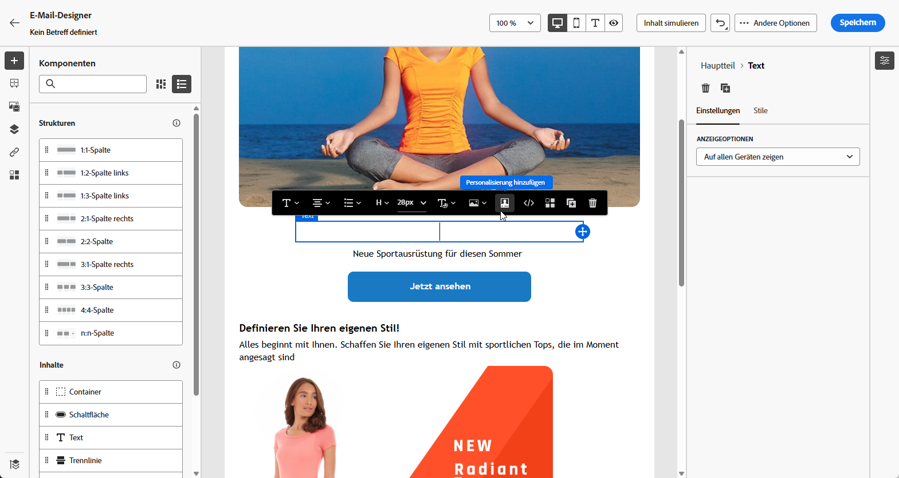

1. Klicken Sie im Menü **[!UICONTROL AEM-Inhaltsfragment]** im linken Bereich auf **[!UICONTROL AEM-Inhaltsfragmentauswahl öffnen]**.

   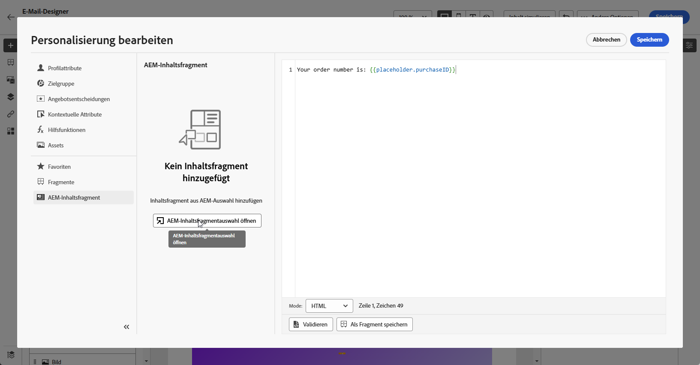

1. Durchsuchen Sie die Liste und wählen Sie ein **[!UICONTROL Inhaltsfragment]** aus, das Sie in Ihren Journey Optimizer-Inhalt importieren möchten.

   >[!NOTE]
   >
   > Wenn das Fragment eine oder mehrere **veröffentlichte** Varianten aufweist, wird in **[!UICONTROL Selektor]** Dropdown-Liste „Variante“ angezeigt. Wenn keine **[!UICONTROL Variante]** ausgewählt ist, wird die Variante **Main** automatisch verwendet. Weitere Informationen finden Sie unter [Arbeiten mit Inhaltsfragmentvarianten](#aem-variations).

1. Klicken Sie auf **[!UICONTROL Filter anzeigen]**, um Ihre Inhaltsfragmentliste zu optimieren.

   Standardmäßig ist der Filter „Inhaltsfragment“ so voreingestellt, dass nur genehmigte Inhalte angezeigt werden.

   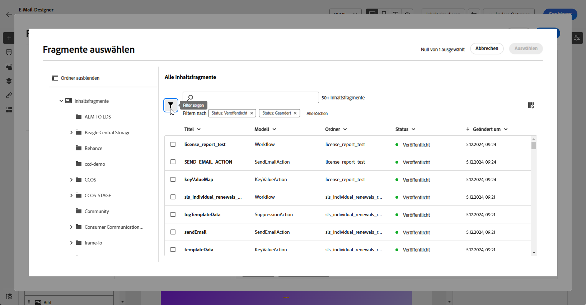

1. Nachdem Sie Ihr **[!UICONTROL Inhaltsfragment]** ausgewählt haben, klicken Sie auf **[!UICONTROL Auswählen]**, um es hinzuzufügen.

   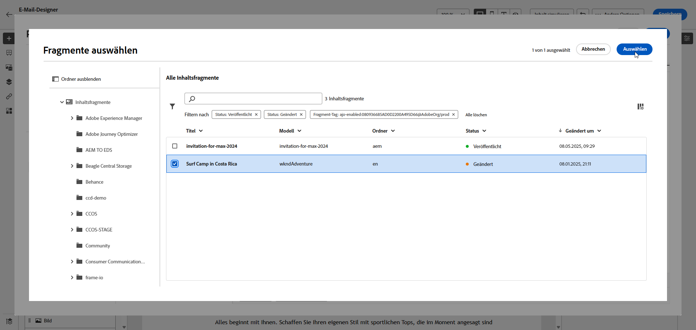

1. Klicken Sie auf **[!UICONTROL Fragment anzeigen]**, um Ihre Fragmentinformationen anzuzeigen. Beachten Sie, dass durch Öffnen des Menüs **[!UICONTROL Fragmentinformationen]** der Editor in den schreibgeschützten Modus versetzt wird.

   Wählen Sie im Menü rechts **[!UICONTROL Vorschau]** aus, um Ihr Fragment in Adobe Experience Manager anzuzeigen.

   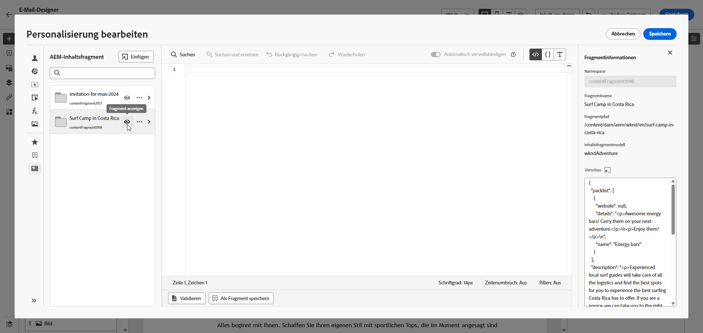

1. Klicken Sie auf , um auf das erweiterte Menü Ihres Fragments zuzugreifen:

   * **[!UICONTROL Fragment austauschen]**
   * **[!UICONTROL Verweise durchsuchen]**
   * **[!UICONTROL In AEM öffnen]**

   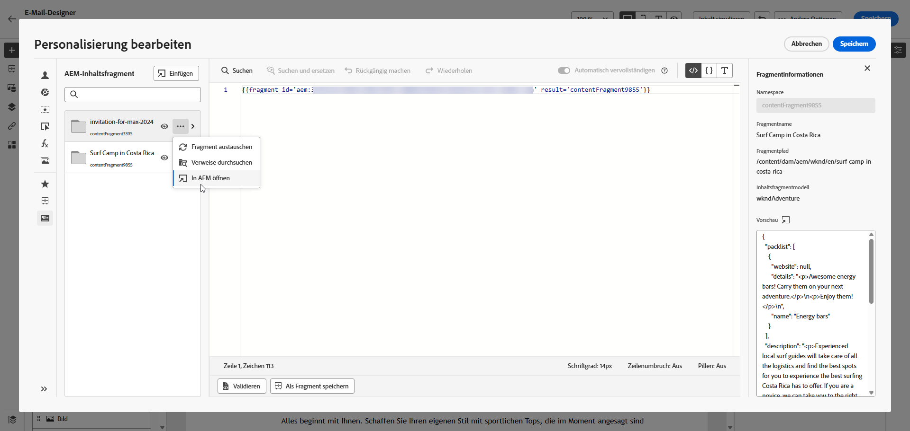

1. Wählen Sie die gewünschten Felder aus Ihrem **[!UICONTROL Fragment]** aus, um sie zu Ihrem Inhalt hinzuzufügen.

   <!--
    Note that if you choose to copy the value, any future updates to the Content Fragment will not be reflected in your campaign or journey. However, using dynamic placeholders ensures real-time updates.
-->

    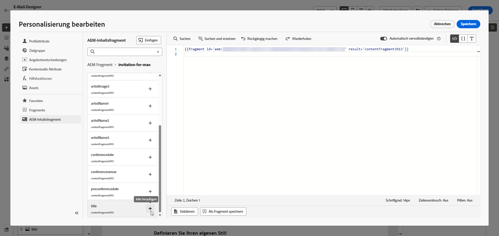

1. Um eine Bild-URL anzuzeigen, die in einem Inhaltsfragmentattribut gespeichert ist, z. B. einem Pfad oder einem URL-Feld aus dem Fragmentmodell, fügen Sie sie in Ihre HTML mit einem ``-Tag und dem Fragmentattribut als Quelle ein, z. B.:

   ```html
   
   ```

   >[!NOTE]
   >
   >Relative Bild-URLs von Adobe Experience Manager werden nicht unterstützt. Verwenden Sie **absolute** URLs.

1. Wählen Sie **Pillen: Aus**, um das Pillenerlebnis zu aktivieren und die Lesbarkeit durch Ausblenden langer Attributpfade zu verbessern.

   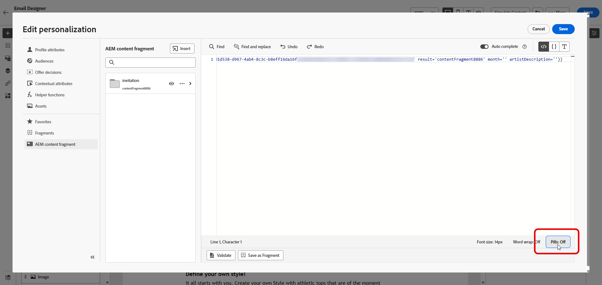

1. Um **Personalisierungs-Platzhalter** die in Adobe Experience Manager erstellt wurden, in Ihrem Fragmenttext zu verwenden, definieren Sie sie im Inhaltsfragment in Adobe Experience Manager wie folgt: `{{name}}`.

   In Journey Optimizer sind diese Token Platzhalter. Wenn das **Pillen**-Erlebnis aktiviert ist, werden sie im Abschnitt **[!UICONTROL AEM]** Inhaltsfragment“ der rechten Leiste neben Fragmentfeldern angezeigt.

1. Um die Echtzeit-Personalisierung zu aktivieren, müssen alle in einem **[!UICONTROL Inhaltsfragment]** verwendeten Platzhalter von der Benutzerin bzw. vom Benutzer explizit als Parameter im Fragment-Helfer-Tag deklariert werden. Ordnen Sie diese Platzhalter Profilattributen, kontextuellen Attributen, statischen Zeichenfolgen oder vordefinierten Variablen wie folgt zu:

   1. **Zuordnung zu Profilen oder kontextuellen Attributen**: Weisen Sie den Platzhalter einem Profil oder einem kontextuellen Attribut zu, z. B. name = profile.person.name.firstName.

   1. **Statische Zeichenfolgenzuordnung**: Weisen Sie einen festen Zeichenfolgenwert zu, indem Sie ihn in doppelte Anführungszeichen setzen, z. B. name = „John“.

   1. **Variablenzuordnung**: Verweisen Sie auf eine Variable, die zuvor innerhalb derselben HTML deklariert wurde, z. B. name = &#39;variableName&#39;.
Stellen Sie in diesem Fall mit der folgenden Syntax sicher, dass **_variableName_** deklariert wird, bevor Sie die Fragment-ID hinzufügen:

      ```html
       
      ```

   Im folgenden Beispiel wird der Platzhalter **_month_** dem Attribut **_profile.person.BirthDate_** im Fragment zugeordnet.

   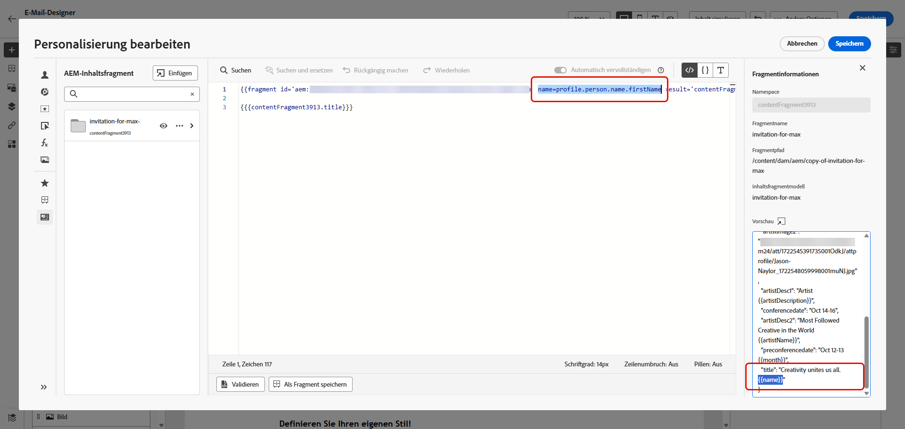{zoomable="yes"}

1. Klicken Sie auf **[!UICONTROL Speichern]**. Sie können nun den Inhalt Ihrer Nachricht testen und überprüfen, wie in [diesem Abschnitt](../content-management/preview.md) beschrieben.

   <!--Note that the Content Fragment you selected stays active for this message. When you open the Personalization Editor in another field or content block, you can keep working with the same fragment from the **[!UICONTROL AEM Content Fragment]** section and add more fields without reopening **[!UICONTROL Open AEM CF selector]**.-->

Sobald Sie Ihre Tests durchgeführt und den Inhalt validiert haben, können Sie Ihrer Zielgruppe [Ihre Kampagne senden](../campaigns/review-activate-campaign.md) oder für sie [Ihre Journey veröffentlichen](../building-journeys/publish-journey.md).

Mit Adobe Experience Manager können die Journey Optimizer-Kampagnen oder -Journeys identifiziert werden, in denen ein Inhaltsfragment verwendet wird. Weitere Informationen hierzu sind in der [Dokumentation zu Adobe Experience Manager](https://experienceleague.adobe.com/de/docs/experience-manager-cloud-service/content/sites/administering/content-fragments/extension-content-fragment-ajo-external-references){target="_blank"} verfügbar.

## Arbeiten mit Varianten von Inhaltsfragmenten {#aem-variations}

In Adobe Experience Manager besteht jedes Inhaltsfragment aus Folgendem:

* **Main**: Der Kerninhalt des Fragments, der immer vorhanden ist, nicht gelöscht werden kann und die Grundlage für alle Varianten ist.
* **Varianten**: eine oder mehrere Permutationen von **Main**, die Autoren für bestimmte Kanäle oder Szenarien erstellen. Varianten innerhalb des Fragments sind nicht als separate Assets vorhanden und können mit (**) verglichen und synchronisiert**.

Beispiele für Anwendungsfälle mit Varianten:

* Eine kurze Version einer Kopie für eine Push-Benachrichtigung und eine längere Version für E-Mails.
* Regionale Tonanpassungen ohne Erstellen eines separaten Fragments.
* Kanalspezifisches Messaging (z. B. Web im Vergleich zu Mobile).

➡️ [Weitere Informationen finden Sie in der Dokumentation zu Adobe Experience Manager](https://experienceleague.adobe.com/de/docs/experience-manager-65/content/assets/content-fragments/content-fragments-variations)

Mit Journey Optimizer können Sie auswählen, welche Variante beim Einfügen eines Fragments verwendet werden soll. So können verschiedene Kampagnen oder Journey auf verschiedene Ausgabedarstellungen desselben Quellinhalts in Adobe Experience Manager angewiesen sein, ohne Fragmente zu duplizieren.

So wählen Sie eine Variante aus:

1. Öffnen Sie eine [Kampagne](../campaigns/create-campaign.md) oder [Journey](../building-journeys/journey-gs.md).

1. Klicken Sie auf das Symbol  in einem beliebigen Textfeld oder öffnen Sie die HTML-Quelle in einer HTML-Inhaltskomponente.

1. Klicken Sie im **[!UICONTROL AEM]** Inhaltsfragment auf **[!UICONTROL Inhaltsfragmentauswahl öffnen]**.

   

1. Um ein gebietsschemaspezifisches Adobe Experience Manager-Inhaltsfragment in der Tabellenansicht auszuwählen, verwenden Sie **[!UICONTROL Tabelle anpassen]**, um die Spalte **[!UICONTROL Sprache]** hinzuzufügen. Die Gebietsschemawerte werden in der Tabelle angezeigt, sodass Sie das entsprechende Fragment identifizieren und auswählen können.

   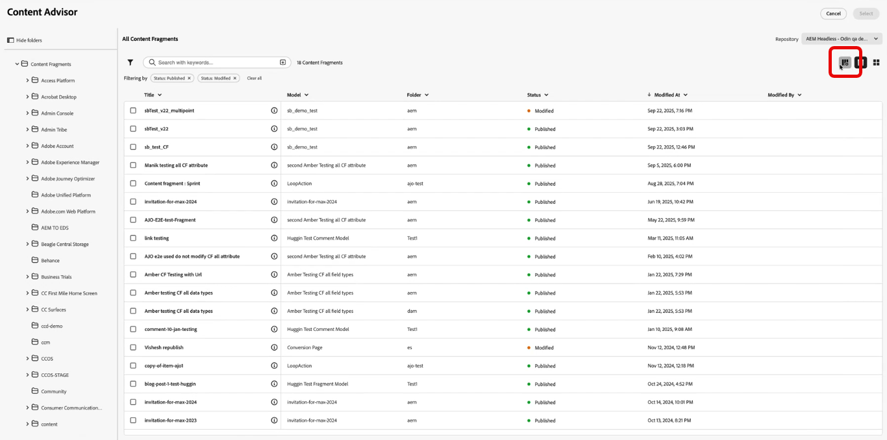

1. Wählen Sie Ihr **[!UICONTROL Inhaltsfragment]** aus.

1. Klicken Sie auf , um das Menü **[!UICONTROL Details]** zu öffnen. Wenn das Fragment eine oder mehrere veröffentlichte Varianten aufweist, wird **[!UICONTROL Dropdown-]** „Variante“ neben den Fragmentdetails angezeigt.

   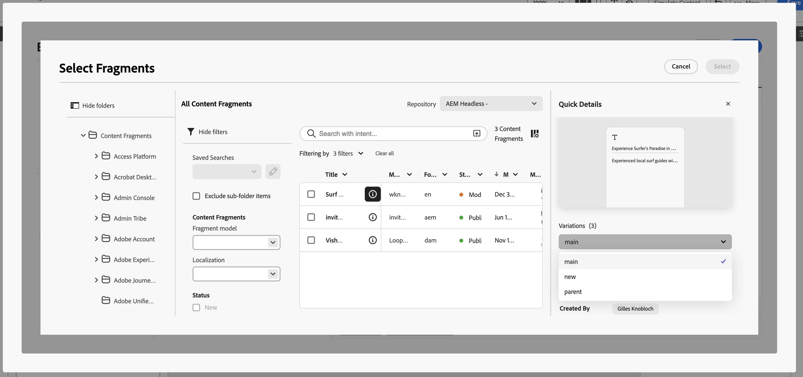

1. Klicken Sie **[!UICONTROL Menü &quot;]**&quot; auf **[!UICONTROL Verweise erkunden]**, um verwandte Optionen in Adobe Experience Manager für Variantendetails, Vorschau und Testversand zu öffnen, sofern verfügbar.

1. Wählen Sie Ihre Variante aus und klicken Sie dann auf **[!UICONTROL Auswählen]**.

   >[!NOTE]
   >
   > Wenn Sie keine Variante auswählen oder das Fragment hinzugefügt wurde, bevor die Variantenunterstützung verfügbar war, verwendet Journey Optimizer die **Main**-Variante automatisch zur Versandzeit.

Nachdem Sie ein Fragment mit einer Variante eingefügt haben, wird bei der erneuten Veröffentlichung in Adobe Experience Manager jede **referenzierte Variante** in aktiven Kampagnen oder Journey automatisch aktualisiert. Für Vorschau und Testversand wird weiterhin die ausgewählte Variante mit den zuletzt veröffentlichten Inhalten für diese Variante verwendet.
