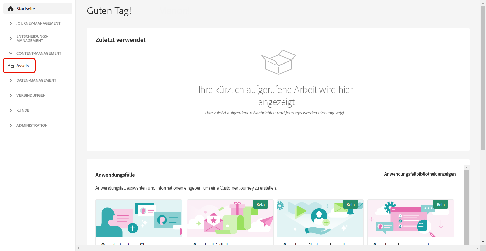
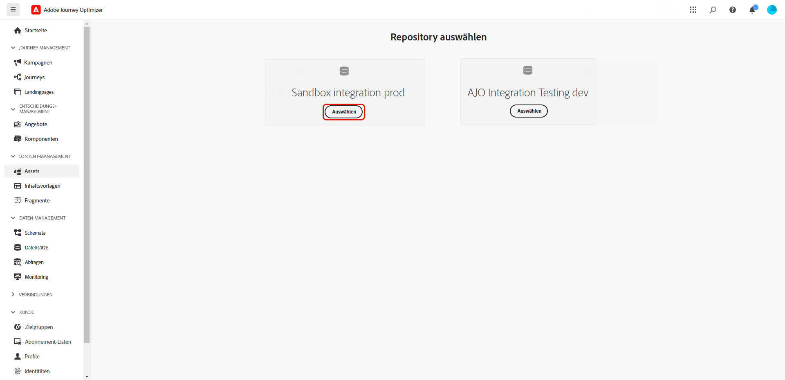
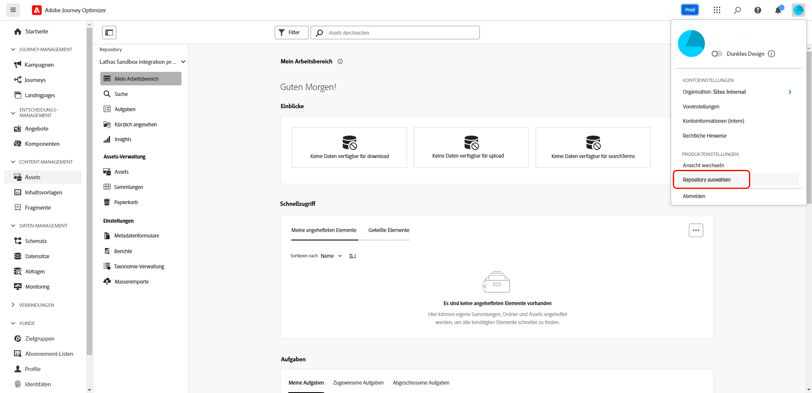
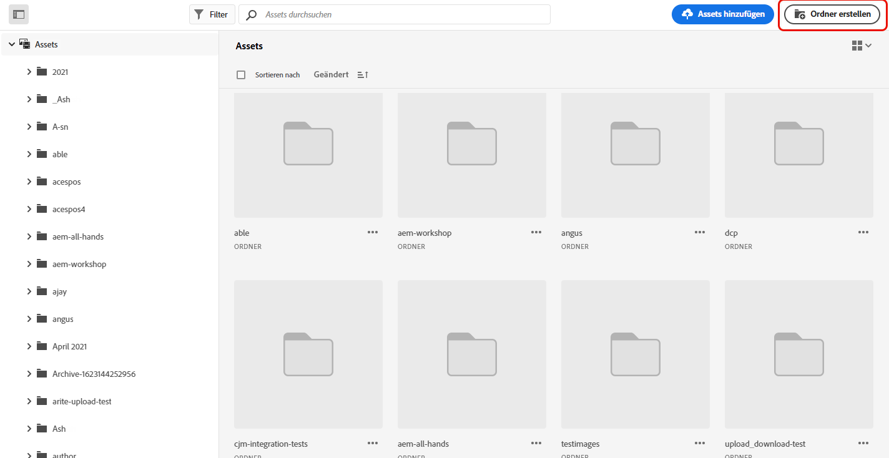
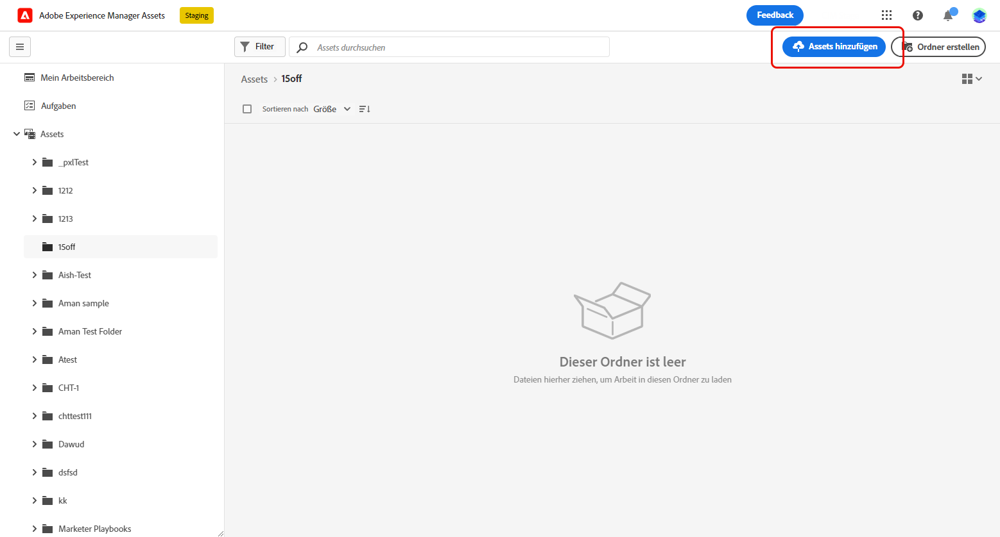
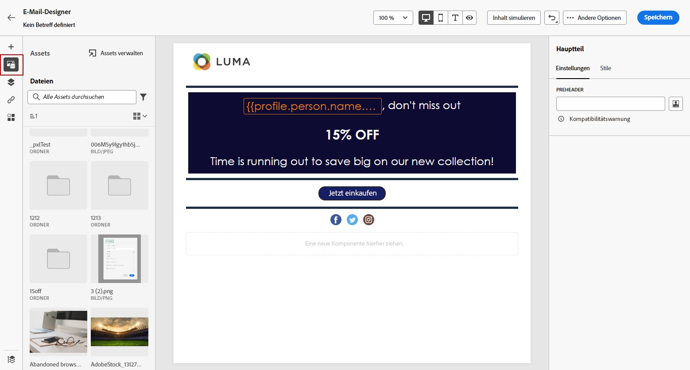
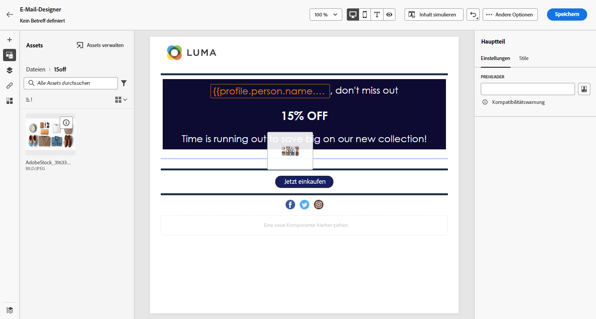
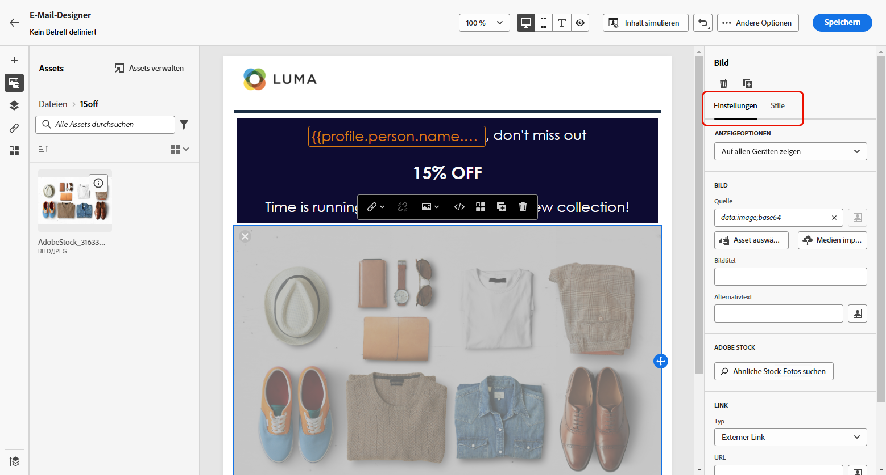

# Erstellen und Verwalten von Assets mit [!DNL Experience Manager Assets]{#experience-manager-assets}

## Erste Schritte mit [!DNL Experience Manager Assets] {#get-started-assets}

Zusammenführen von Marketing- und Kreativ-Workflows mithilfe von **[!DNL Adobe Experience Manager Assets]**. Greifen Sie auf **[!DNL Assets Essentials]** oder **[!DNL Assets as a Cloud Service]** zu, die beide nativ mit **[!DNL Adobe Journey Optimizer]** integriert sind, um digitale Assets zu speichern, zu verwalten, zu entdecken und zu verbreiten. Dies bietet ein zentrales Repository für Assets, die Sie für Ihre Nachrichten verwenden können.

**[!DNL Adobe Experience Manager Assets]** bietet zwei kollaborative und zentralisierte Asset-Arbeitsbereiche, die Ihr Kreativsystem erweitern und digitale Assets für die Bereitstellung von Erlebnissen zusammenfassen.

* **[!DNL Assets as a Cloud Service]**: Adobe Experience Manager Assets as a Cloud Service bietet eine benutzerfreundliche Cloud-Lösung für effizientes Digital Asset Management und dynamische Medien. Es integriert nahtlos fortschrittliche Funktionen, darunter künstliche Intelligenz und maschinelles Lernen.

  Weitere Informationen finden Sie in der Dokumentation zu [Adobe Experience Manager Assets as a Cloud Service](https://experienceleague.adobe.com/docs/experience-manager-cloud-service/content/assets/overview.html?lang=de){target="_blank"}.

* **[!DNL Assets Essentials]**: Experience Manager Assets Essentials ist eine leichtgewichtige Assets as a Cloud Service-Lösung für einheitliches Asset-Management und Zusammenarbeit. Mit seiner modernen, vereinfachten Benutzeroberfläche ermöglicht es Kreativ- und Marketing-Teams, digitale Assets mühelos zu speichern, zu entdecken und zu verbreiten.

  Weitere Informationen finden Sie in der [Dokumentation zu Adobe Experience Manager Assets Essentials](https://experienceleague.adobe.com/docs/experience-manager-assets-essentials/help/introduction.html?lang=de){target="_blank"}.

Abhängig von Ihrem Vertrag können Sie **[!DNL Adobe Experience Manager Assets Essentials]** oder **[!DNL Adobe Experience Manager Assets as a Cloud Service]** direkt von **[!DNL Adobe Journey Optimizer]** aus über den linken Menübereich **[!UICONTROL Assets]** aufrufen. Sie können auch auf Assets und Ordner zugreifen, während Sie [einen E-Mail-Inhalt entwerfen](../email/get-started-email-design.md).

## Voraussetzungen{#assets-prerequisites}

>[!BEGINTABS]

>[!TAB Adobe Experience Manager Assets Essentials]

Bevor Sie [!DNL Adobe Experience Manager Assets Essentials] verwenden können, müssen Sie Benutzende zu den Produktprofilen **Assets Essentials-Endbenutzende** oder/und **Assets Essentials-Benutzende** hinzufügen. Weitere Informationen finden Sie in der [Dokumentation zu Assets Essentials](https://experienceleague.adobe.com/docs/experience-manager-assets-essentials/help/get-started-admins/deploy-administer.html?lang=de#add-user-groups){target="_blank"}.

>[!NOTE]
>Für Journey Optimizer-Produkte, die vor dem 6. Januar 2022 erworben wurden, müssen Sie **[!DNL Adobe Experience Manager Assets Essentials]** für Ihre Organisation bereitstellen. Weitere Informationen finden Sie unter [Bereitstellen von Assets Essentials](https://experienceleague.adobe.com/docs/experience-manager-assets-essentials/help/deploy-administer.html?lang=de){target="_blank"}.

>[!TAB Adobe Experience Manager Assets as a Cloud Service]

Bevor Sie **[!DNL Adobe Experience Manager Assets as a Cloud Service]** verwenden können, müssen Sie Benutzende zu Assets Cloud Services hinzufügen. Erfahren Sie mehr unter [Adobe Experience Manager Assets as a Cloud Service](https://experienceleague.adobe.com/docs/experience-manager-cloud-service/content/security/ims-support.html?lang=de).

>[!ENDTABS]

## Hochladen und Hinzufügen von Assets{#add-asset}

Um Dateien in **[!DNL Assets Essentials]** oder **[!DNL Assets as a Cloud Service]** zu importieren, müssen Sie zunächst den Ordner suchen oder erstellen, in dem diese gespeichert werden sollen. Danach können Sie diese Dateien in Ihren E-Mail-Inhalt einfügen.

1. Wählen Sie auf der [!DNL Adobe Journey Optimizer]-Startseite die Registerkarte **[!UICONTROL Assets]** im Menü **[!UICONTROL Content-Management]** aus, um **[!DNL Assets Essentials]** oder **[!DNL Assets as a Cloud Service]** aufzurufen.

   

1. Wählen Sie das Repository für die Assets in Journey Optimizer aus. Sie können sich entweder für ein **[!DNL Assets Essentials]**- oder **[!DNL Assets as a Cloud Service]**-Repository entscheiden, sofern Sie diese Lösung besitzen.

   

   +++ Erfahren Sie, wie zwischen Asset-Repositorys gewechselt werden kann.

   Um das Asset-Repository zu ändern, wählen Sie das Kontosymbol oben rechts aus und klicken Sie auf **[!UICONTROL Repository wählen]**.

   

   +++

1. Doppelklicken Sie im mittleren Bereich oder in der Baumansicht auf einen Ordner, um ihn zu öffnen.

   Sie können auch auf **[!UICONTROL Ordner erstellen]** klicken, um einen neuen Ordner zu erstellen.

   

1. Klicken Sie im ausgewählten oder erstellten Ordner auf **[!UICONTROL Assets hinzufügen]**, um ein neues Asset in Ihren Ordner hochzuladen.

   

1. Von **[!UICONTROL Dateien hochladen]** aus klicken Sie auf **[!UICONTROL Durchsuchen]** und wählen Sie aus, ob Sie **[!UICONTROL Dateien durchsuchen]** oder **[!UICONTROL Ordner durchsuchen]** möchten.

1. Wählen Sie die Datei aus, die Sie hochladen möchten. Wenn Sie fertig sind, klicken Sie auf **[!UICONTROL Hochladen]**. Weitere Informationen zum Verwalten von Assets finden Sie auf dieser [Seite](https://experienceleague.adobe.com/docs/experience-manager-assets-essentials/help/manage-organize.html?lang=de).

1. Um Ihre Assets mit Adobe Photoshop Express weiter zu bearbeiten, doppelklicken Sie auf die Assets. Klicken Sie dann im Kontextmenü auf das Symbol **[!UICONTROL Bearbeitungsmodus]**. [Weitere Informationen](https://experienceleague.adobe.com/docs/experience-manager-assets-essentials/help/edit-images.html?lang=de){target="_blank"}.

   

1. Wählen Sie in [!DNL Adobe Journey Optimizer] im linken Bereich des E-Mail-Designers das Menü **[!UICONTROL Asset-Auswahl]** aus.

   

1. Wählen Sie den zuvor erstellten **[!UICONTROL Assets]**-Ordner aus. Sie können auch in der Suchleiste nach Ihrem Asset oder Ordner suchen.

1. Ziehen Sie Ihr Asset in den E-Mail-Inhalt.

   

1. Sie können Ihre Assets weiter anpassen, z. B. indem Sie einen externen Link oder einen Text mit den Registerkarten **[!UICONTROL Einstellungen]** und **[!UICONTROL Stile]** hinzufügen. [Weitere Informationen zu Komponenteneinstellungen](../email/content-components.md)

   

   <!--
    After adding your asset to your email, use the **[!UICONTROL Find similar Stock photos]** option to locate Stock photos that match the content, color, and composition of your image. [Learn more about Adobe Stock](stock.md).

    Note that this option is available for licensed/unlicensed Stock images and images from your Assets folder. 

    
    -->

## Häufig gestellte Fragen {#faq-assets}

Im Folgenden finden Sie häufig gestellte Fragen zu Adobe Experience Manager Assets.

Sie würden gerne mehr erfahren? Verwenden Sie die Feedback-Optionen unten auf dieser Seite, um Ihre Frage zu stellen, oder vernetzen Sie sich mit der [Adobe Journey Optimizer-Community](https://experienceleaguecommunities.adobe.com/t5/adobe-journey-optimizer/ct-p/journey-optimizer?profile.language=de){target="_blank"}.

+++ Kann ich das gebündelte Assets Essentials-Repository in Journey Optimizer weiter verwenden?

Wenn Sie über die Bereitstellung **[!DNL Adobe Experience Manager Assets as a Cloud Service]** verfügen, haben Sie Zugriff sowohl auf das **[!DNL Adobe Experience Manager Assets Essentials]**- als auch das **[!DNL Adobe Experience Manager Assets as a Cloud Service]**-Repository, sofern die Benutzerin bzw. der Benutzer über die entsprechenden Berechtigungen verfügt. Diese Repositorys sind getrennt und nicht synchronisiert. Eine Benutzerin bzw. ein Benutzer in Journey Optimizer kann beide Repositorys sehen, einschließlich anderer Umgebungen, für die eine Berechtigung vorliegt, wie z. B. Stage, Dev, usw., und sollte mit dem Repository-Selektor in der Lage sein, nahtlos zwischen ihnen zu wechseln.

+++

+++ Wie werden Assets verwaltet? Werden Änderungen bei Assets as a Cloud Service in Journey Optimizer berücksichtigt?

**[!DNL Adobe Experience Manager Assets as a Cloud Service]** ist ähnlich wie **[!DNL Adobe Experience Manager Assets Essentials]** mit Journey Optimizer integriert. Wenn Änderungen an Assets vorgenommen werden, wird eine binäre Kopie erstellt. Beachten Sie, dass Aktualisierungen in **[!DNL Assets as a Cloud Service]** nicht automatisch auf Live-E-Mail-Kampagnen übertragen werden. Alle Änderungen müssen im E-Mail-Designer manuell neu ausgewählt werden, um die Synchronisation zwischen den Assets und den laufenden E-Mail-Kampagnen zu gewährleisten.

+++

+++ Kann ich beim Verfassen von E-Mails in Journey Optimizer dynamische Medien-URLs verwenden?

Ja, Sie können dynamische Medien-URLs innerhalb der E-Mail-Erstellung von Journey Optimizer verwenden. Fügen Sie einfach die URLs ein, anstatt sie über die Asset-Auswahl auszuwählen.

+++

+++ Können Benutzerinnen und Benutzer von Journey Optimizer Änderungen am Repository von Adobe Experience Manager Assets as a Cloud Service über die Journey Optimizer-Oberfläche vornehmen?

Solange die Person eine standardmäßige Berechtigung für **[!DNL Adobe Experience Manager Assets as a Cloud Service]** besitzt und die Berechtigung „Bearbeiten“ für das Repository hat, kann sie Änderungen am **[!DNL Adobe Experience Manager Assets as a Cloud Service]**-Repository vornehmen.

+++

+++ Warum werden Bilder in E-Mails, die von Journey Optimizer gesendet werden, manchmal nicht geladen?

Wenn Assets (z. B. Bilder) über Adobe Experience Manager verwaltet und in Journey Optimizer verwendet werden, unterliegen sie einer Asset-Lebenszyklusrichtlinie mit einer TTL (Time-to-Live). Nach Ablauf des TTL-Zeitraums können Assets aus dem Speicher (CDN) entfernt werden, was zu beschädigten Bildern in E-Mails führen kann, die auf diese Assets verweisen.

>[!NOTE]
>
>Die Asset-TTL wird von Adobe Journey Optimizer-Backend-Services verwaltet und kann derzeit von Kunden nicht konfiguriert werden. Der aktuelle TTL-Zeitraum ist für alle Journey Optimizer-Organisationen auf 730 Tage festgelegt.

+++

+++ Wie kann ich fehlerhafte Bilder aufgrund des Asset-Ablaufs auflösen?

So stellen Sie die Bildverfügbarkeit bei abgelaufenen Assets wieder her:

1. **Betroffene Assets erneut veröffentlichen**: Navigieren Sie zum Asset in Adobe Experience Manager und veröffentlichen Sie es erneut. Dadurch wird das Asset erneut im CDN verfügbar.

2. **Inhaltsreferenzen aktualisieren**: Wenn Sie Inhaltsfragmente oder Vorlagen verwenden, die auf abgelaufene Assets verweisen:
   * Erstellen eines Entwurfs oder Klons des Inhaltsfragments
   * Asset erneut hinzufügen oder auswählen
   * Veröffentlichen des aktualisierten Inhalts

3. **Proaktive Verwaltung**: Um zukünftige Unterbrechungen zu vermeiden, sollten Sie in aktiven E-Mail-Kampagnen verwendete Assets regelmäßig überprüfen und erneut veröffentlichen, insbesondere solche, die sich dem TTL-Ablaufzeitraum nähern.

>[!CAUTION]
>
>Die Anforderungen an die erneute Veröffentlichung gelten für alle Umgebungen (Produktion, Staging, Entwicklung). Stellen Sie sicher, dass Assets verfügbar bleiben, indem Sie ihren Lebenszyklus angemessen verwalten.

+++

+++ Wird die Logik zum Ablauf von Assets in Zukunft verbessert?

Ja, Adobe arbeitet aktiv an Verbesserungen, um die Logik zum Ablauf von Assets und zur Lebenszyklusverwaltung zu verfeinern. Diese Verbesserungen sollen einen besseren Überblick über den Asset-Lebenszyklusstatus bieten und das Risiko von fehlerhaften Bildern in Live-Kampagnen verringern.

Die neuesten Aktualisierungen erhalten Sie von Ihrem Adobe-Accountteam oder lesen Sie die Versionshinweise zu Adobe Journey Optimizer.

+++
