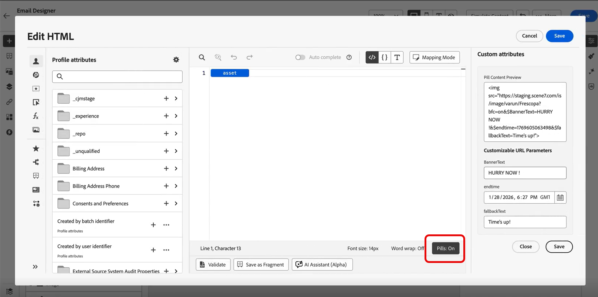
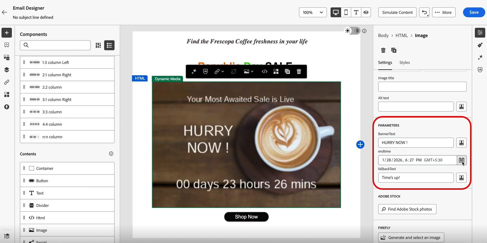

# Countdown-Timer einfügen {#countdown}

Erstellen Sie eine Dringlichkeit und maximieren Sie Konversionen mit Dynamic Media-Countdown-Timern, die in Echtzeit aktualisiert werden, wenn Empfänger Ihre E-Mails öffnen. Diese Funktion ist ideal für Flash-Verkäufe, zeitlich begrenzte Angebote und zeitkritische Promotions.

Als Marketing-Experte für eine Einzelhandelsmarke führen Sie beispielsweise einen 48-Stunden-Flash-Verkauf durch. Verwenden Sie den Countdown-Timer in Ihren Werbe-E-Mails:

* Empfänger, die sofort öffnen, sehen „47 Stunden verbleibend“
* Empfänger, die 24 Stunden später öffnen, sehen „23 Stunden verbleibend“
* Empfänger, die nach dem Verkauf öffnen, sehen „Die Zeit ist um!“

Weitere Informationen zum Hinzufügen von Countdown-Timern zu Ihrer Dynamic Media-Vorlage in Adobe Experience Manager finden Sie [diesem Dokument](assets/do-not-localize/countdown.pdf).

1. Erstellen Sie **[!DNL Adobe Experience Manager]** eine Dynamic Media-Vorlage und fügen Sie ihr eine Countdown-Timer-Komponente hinzu.

   

1. Erstellen Sie **[!DNL Journey Optimizer]** eine neue Kampagne oder öffnen Sie eine bestehende und greifen Sie dann auf die E-Mail-Designer zu.

1. Ziehen Sie per Drag-and-Drop eine **HTML**- oder **Asset**-Komponente in Ihren E-Mail-Inhalt.

1. Bewegen Sie den Mauszeiger über die Komponente und klicken Sie **[!UICONTROL Quellcode anzeigen]** (für HTML-Komponenten) oder **[!UICONTROL Durchsuchen]** (für Asset-Komponenten).

   

1. Navigieren Sie im Menü **[!UICONTROL HTML bearbeiten]** zu **[!UICONTROL Assets]** und klicken Sie auf **[!UICONTROL Asset-Auswahl öffnen]**, um Ihre veröffentlichte Dynamic Media-Vorlage zu durchsuchen und auszuwählen.

   

1. Aktivieren Sie das Pillenerlebnis, indem Sie Pillen aktivieren umschalten. Dies verbessert die Lesbarkeit, indem lange Attributpfade ausgeblendet werden.

   

1. Konfigurieren **[!UICONTROL im Menü „Benutzerdefinierte]**&quot; alle anpassbaren URL-Parameter, die für Ihre Vorlage erforderlich sind.

   Klicken Sie **[!UICONTROL Speichern]** wenn Sie fertig sind.

   

1. Alternativ können Sie auch auf die Parameter der Dynamic Media-Vorlage zugreifen, indem Sie das Asset in der E-Mail-Designer auswählen und dann auf das Menü **[!UICONTROL Einstellungen]** zugreifen.

   Konfigurieren Sie Folgendes:

   * **Bannertext**: Der mit dem Timer angezeigte Text
   * **Endzeit**: Datum und Uhrzeit, zu der der Countdown abläuft. Geben Sie die Uhrzeit nur in GMT (Greenwich Mean Time) ein. Das System akzeptiert keine anderen Zeitzonen.
   * **Fallback-Text**: Die Nachricht, die nach dem Ende des Timers angezeigt wird

   

1. Klicken Sie **[!UICONTROL Vorschau]**, um den Timer mit Echtzeit-Countdown-Updates anzuzeigen und Ihre Konfiguration zu überprüfen.

Wenn Empfänger die E-Mail öffnen, sehen sie die genaue verbleibende Zeit für Ihren Flash-Verkauf. Wird die E-Mail zu einem späteren Zeitpunkt erneut geöffnet, wird der Countdown automatisch mit der aktuell verbleibenden Zeit aktualisiert. Nach dem Enddatum wird die Standardmeldung automatisch angezeigt.
