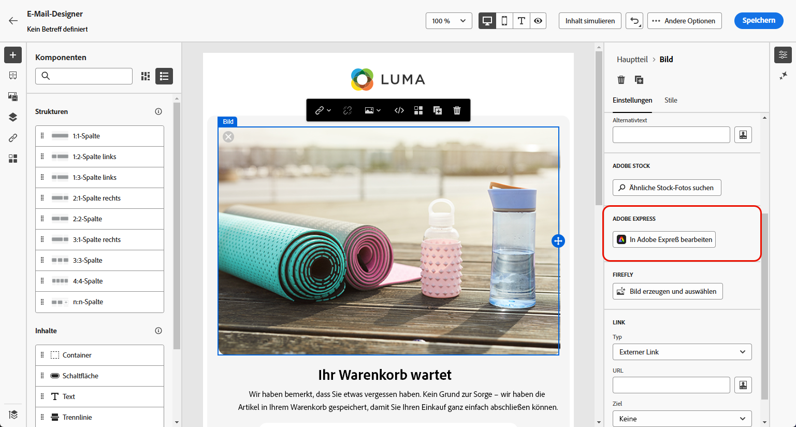
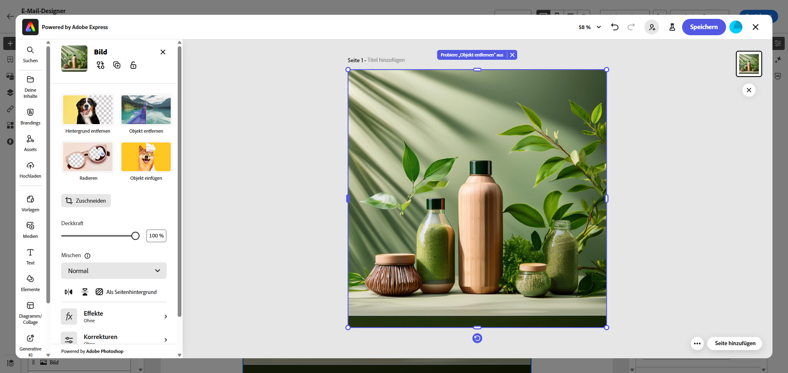
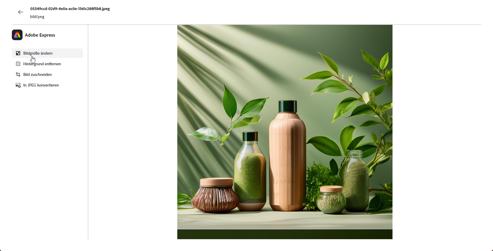
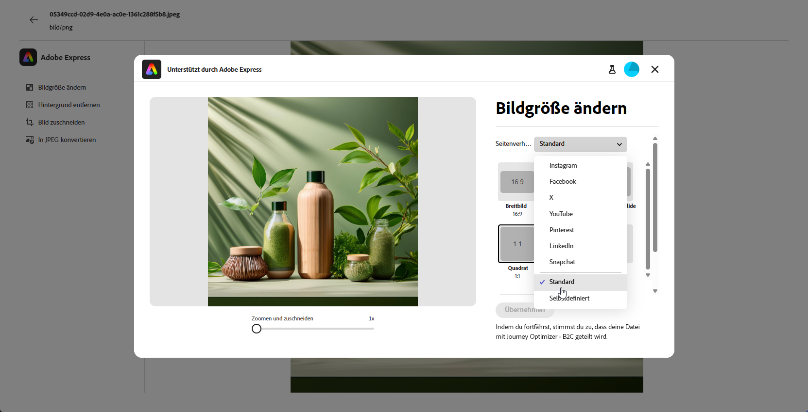
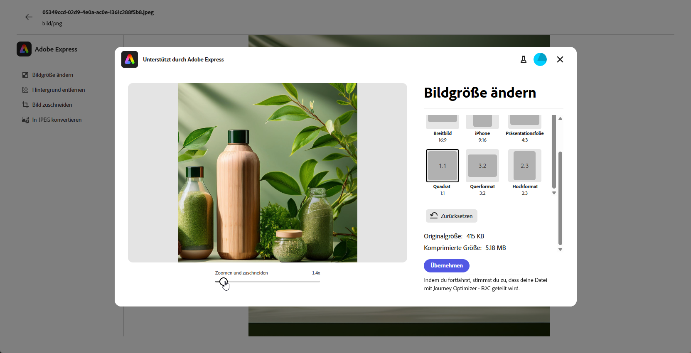
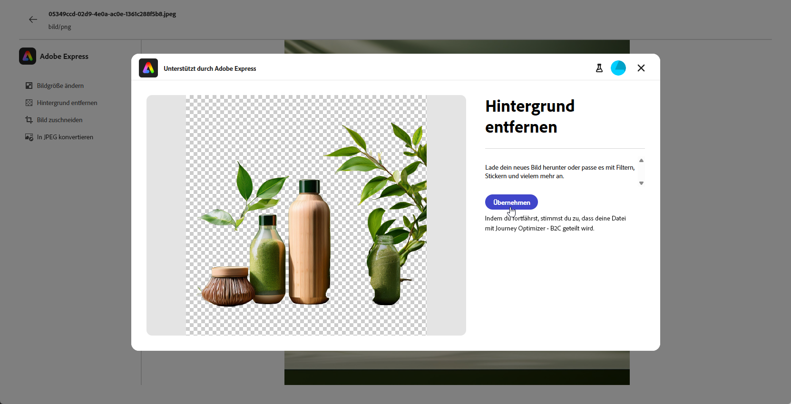
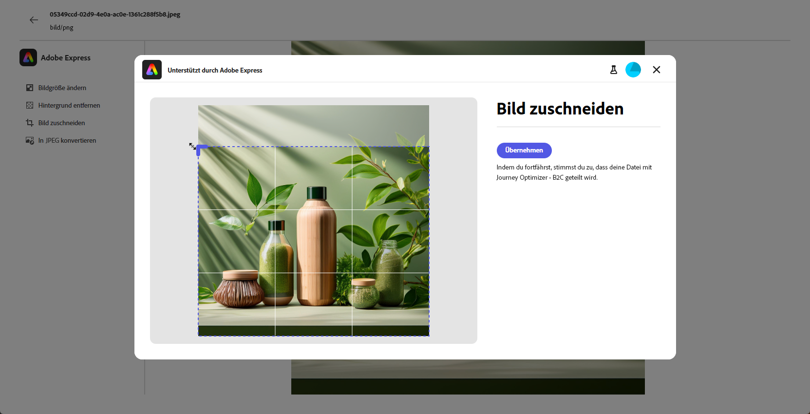
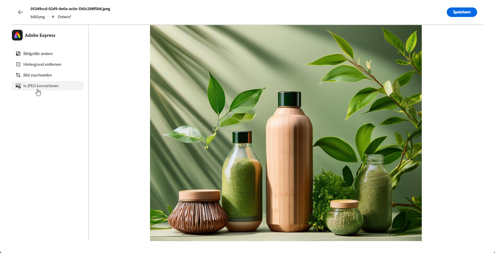
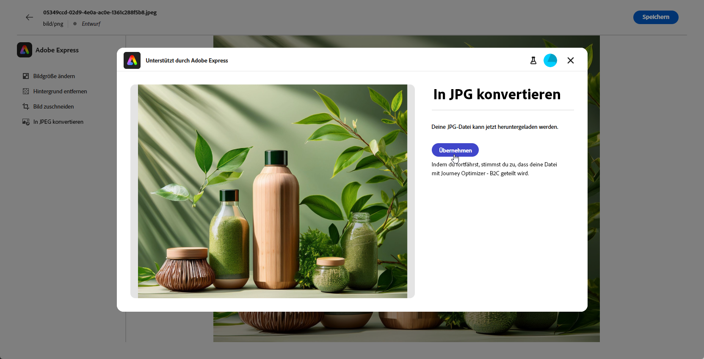
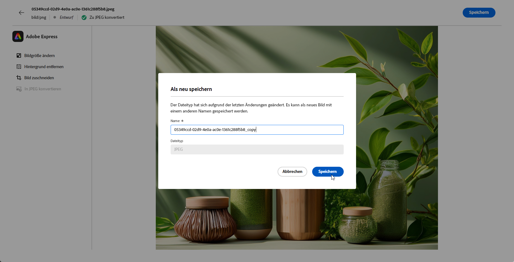

# Bearbeiten von Assets mit [!DNL Adobe Express]{#express}

>[!CONTEXTUALHELP]
>id="ajo_express_menu"
>title="Integration mit Adobe Express"
>abstract="Beginnen Sie mit der Personalisierung Ihrer Assets mit der Integration von Adobe Express. Mit dieser Funktion können Sie die Größe von Bildern ändern, Hintergründe entfernen, visuelle Elemente zuschneiden und Assets in JPEG oder PNG konvertieren."

>[!AVAILABILITY]
>
>Die Adobe Express-Integration in Adobe Journey Optimizer ist derzeit nicht für die Verwendung mit Healthcare Shield oder Privacy and Security Shield verfügbar.

Die Adobe Express-Integration in Adobe Journey Optimizer ermöglicht Ihnen den einfachen Zugriff auf die leistungsstarken Bearbeitungswerkzeuge von Adobe Express beim Erstellen von Inhalten. Dank dieser Integration können Sie die Größe von Bildern ändern, Hintergründe entfernen, visuelle Elemente zuschneiden und Assets in JPEG oder PNG konvertieren, ohne zwischen Lösungen wechseln zu müssen.

Weitere Informationen zu Adobe Express finden Sie in [dieser Dokumentation](https://helpx.adobe.com/de/express/user-guide.html).

Um auf das Menü &quot;**[!DNL Adobe Express]**&quot; zuzugreifen, rufen Sie **E-Mail** Designer Ihre Bildeinstellungen auf und klicken Sie auf **[!UICONTROL Bearbeiten in Adobe Express]**.

## Adobe Express Enterprise-Lizenz {#licence}

Die in den folgenden Abschnitten beschriebenen Funktionen sind für Benutzende ohne Adobe Express Enterprise-Lizenz verfügbar.

Mit einer Enterprise-Lizenz erhalten Benutzende vollen Zugriff auf den Adobe Express-Editor, mit dem sie Bilder ändern können, indem sie Farbe, Helligkeit, Schärfe, Kontrast, Abmessungen und zusätzliche Einstellungen anpassen.

+++Verfügbare Anwendungsfälle für Anwender mit einer Enterprise-Lizenz für Adobe Express

* [Hintergrund entfernen](https://helpx.adobe.com/express/create-and-edit-images/edit-images/remove-background.html)
* [Objekte entfernen](https://helpx.adobe.com/express/create-and-edit-images/create-and-modify-with-generative-ai/remove-objects-generative-fill.html)
* [Löschen](https://helpx.adobe.com/express/create-and-edit-images/edit-images/eraser.html)
* [Objekt einfügen](https://helpx.adobe.com/express/adobe-express-on-mobile/create-and-edit-designs/generative-fill-mobile.html)
* [Zuschneiden](https://helpx.adobe.com/express/create-and-edit-images/edit-images/crop-and-shape-images.html)
* [Effekte](https://helpx.adobe.com/express/add-effects-to-your-designs/add-images-and-visuals/apply-image-filters.html)

+++

## Bildgröße ändern {#resize}

1. Wählen Sie im Adobe Express-Menü **[!UICONTROL Bildgröße ändern]** aus.

   

1. Wählen Sie das **[!UICONTROL Seitenverhältnis]** aus, das den Proportionen Ihres Assets am besten entspricht.

   

1. Verwenden Sie den Regler zum Zoomen und Zuschneiden Ihres Assets und ziehen Sie, um den sichtbaren Bereich zu schwenken und anzupassen.

   

1. Klicken Sie **[!UICONTROL Zurücksetzen]**, um den ursprünglichen Zustand Ihres Assets wiederherzustellen.

1. Klicken Sie auf **[!UICONTROL Anwenden]** sobald die Größenanpassung des Bildes Ihren Anforderungen entspricht. Klicken Sie dann **[!UICONTROL Speichern]** auf das geänderte Asset.

1. Klicken Sie im Fenster **[!UICONTROL Bild hochladen]** auf **[!UICONTROL Weiter]** und wählen Sie einen Ordner zum Speichern des geänderten Assets aus.

   Klicken Sie dann auf **[!UICONTROL Importieren]**.

Ihr Bild kann jetzt in Ihren Inhalten verwendet werden.

## Hintergrund entfernen {#background}

1. Wählen Sie im Menü Adobe Express die Option **[!UICONTROL Hintergrund entfernen]** aus.

   

1. Das Asset wird automatisch ohne Hintergrund angezeigt.

   Klicken Sie **[!UICONTROL Anwenden]**, um dies in Ihrem Inhalt zu verwenden.

   

1. Klicken Sie auf **[!UICONTROL Speichern]**.

1. Klicken Sie im Fenster **[!UICONTROL Bild hochladen]** auf **[!UICONTROL Weiter]** und wählen Sie einen Ordner zum Speichern des geänderten Assets aus.

   Klicken Sie dann auf **[!UICONTROL Importieren]**.

Ihr Bild kann jetzt in Ihren Inhalten verwendet werden.

## Bild zuschneiden {#crop-image}

1. Wählen Sie im Menü Adobe Express die Option **[!UICONTROL Bild zuschneiden]** aus.

   

1. Ziehen Sie die Eckpunkte, um das Bild nach Bedarf anzupassen und zuzuschneiden.

   

1. Klicken Sie **[!UICONTROL Anwenden]**, um dies in Ihrem Inhalt zu verwenden. Klicken Sie dann **[!UICONTROL Speichern]** auf das geänderte Asset.

1. Klicken Sie im Fenster **[!UICONTROL Bild hochladen]** auf **[!UICONTROL Weiter]** und wählen Sie einen Ordner zum Speichern des geänderten Assets aus.

   Klicken Sie dann auf **[!UICONTROL Importieren]**.

Ihr Bild kann jetzt in Ihren Inhalten verwendet werden.

## In JPEG oder PNG konvertieren {#convert}

1. Wählen Sie im Menü Adobe Express die Option **[!UICONTROL In JPEG konvertieren]** oder **[!UICONTROL In PNG konvertieren]** je nach Originalbildformat aus.

   

1. Klicken Sie **[!UICONTROL Apply]**, um die Konvertierung zu starten.

   

1. Klicken Sie auf **[!UICONTROL Speichern]**.

1. Mit der Formatänderung können Sie es als neues Bild mit einem anderen Namen speichern. Aktualisieren Sie **[!UICONTROL Name]** und klicken Sie auf **[!UICONTROL Speichern]**.

   

1. Klicken Sie im Fenster **[!UICONTROL Bild hochladen]** auf **[!UICONTROL Weiter]** und wählen Sie einen Ordner zum Speichern des geänderten Assets aus.

   Klicken Sie dann auf **[!UICONTROL Importieren]**.

Ihr Bild kann jetzt in Ihren Inhalten verwendet werden.
