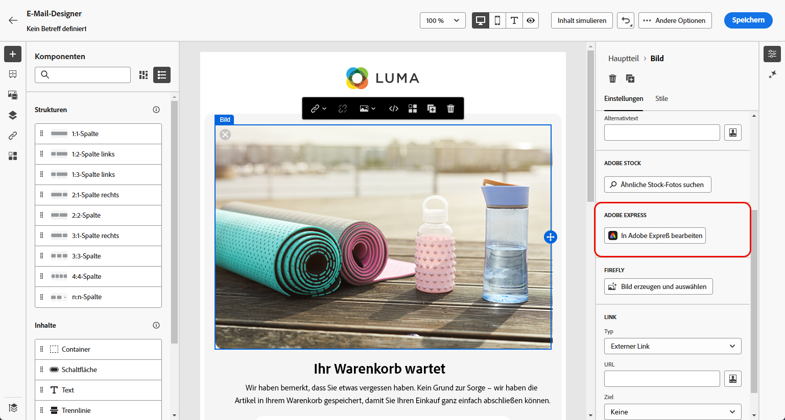
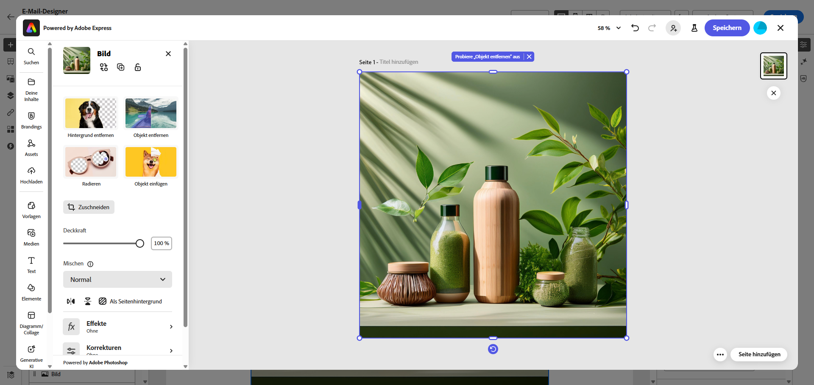
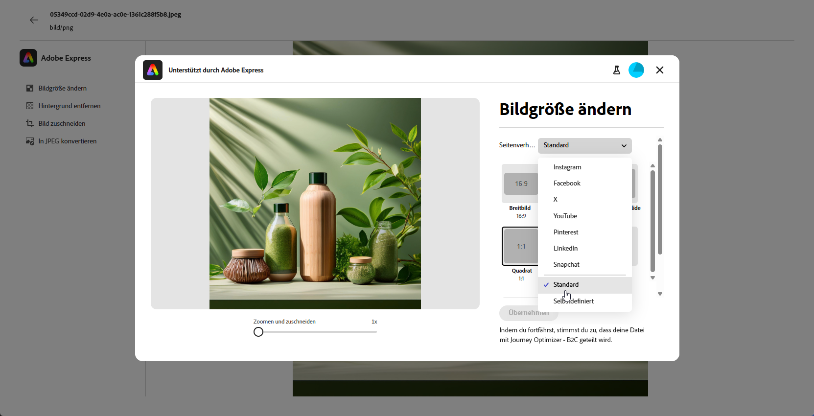
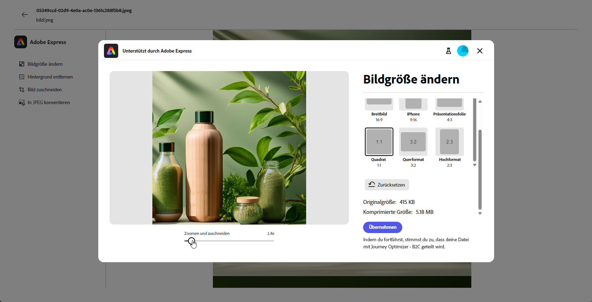
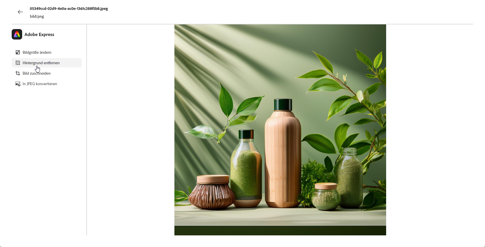
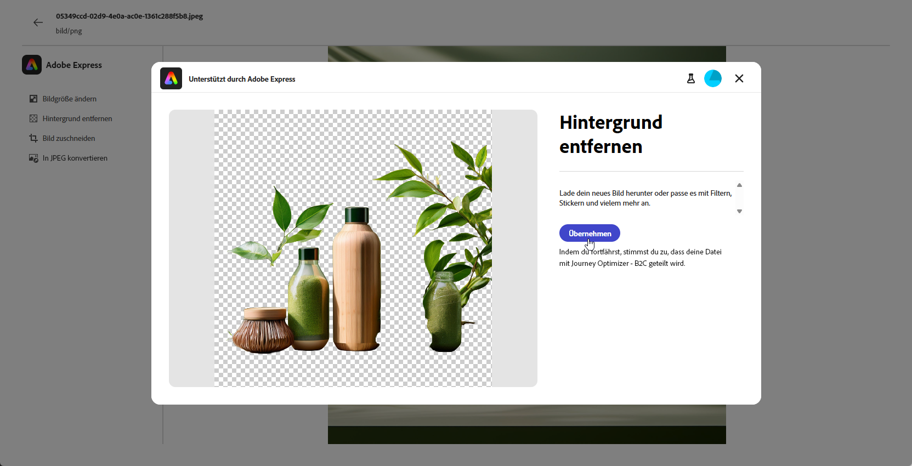
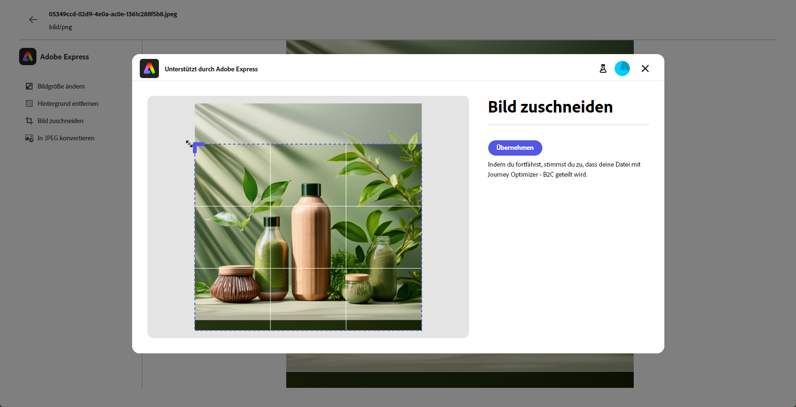
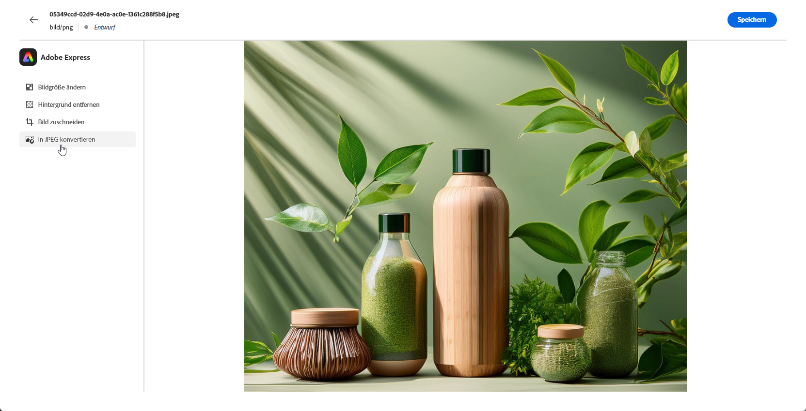
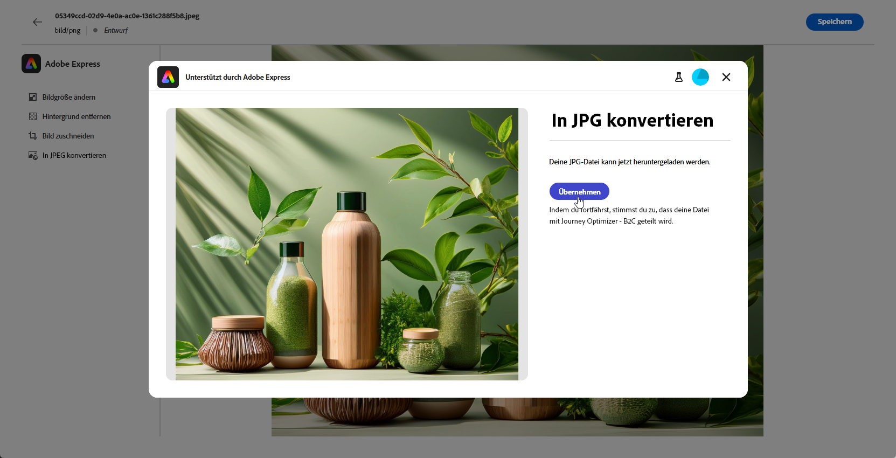
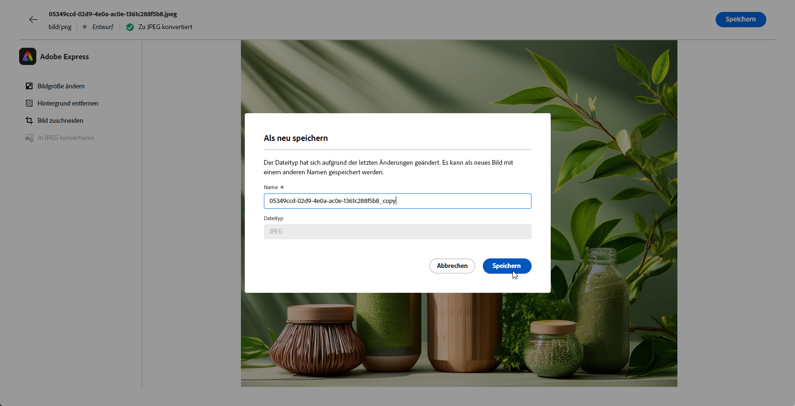

# Bearbeiten von Assets mit [!DNL Adobe Express]{#express}

>[!BEGINSHADEBOX]

**Auf dieser Seite** Erfahren Sie, wie Sie Ihre Assets mit der Adobe Express-Integration in Journey Optimizer bearbeiten können, um die Bildgröße zu ändern, Hintergründe zu entfernen, visuelle Elemente zuzuschneiden und Assets in JPEG oder PNG zu konvertieren.

>[!ENDSHADEBOX]

>[!CONTEXTUALHELP]
>id="ajo_express_menu"
>title="Adobe Express-Integration"
>abstract="Beginnen Sie mit der Personalisierung Ihrer Assets mit der Integration von Adobe Express. Mit dieser Funktion können Sie die Größe von Bildern ändern, Hintergründe entfernen, visuelle Elemente zuschneiden und Assets in JPEG oder PNG konvertieren."

>[!IMPORTANT]
>
>Durch Verwendung der Adobe Express-Integration verlassen die Daten Journey Optimizer. Verwenden Sie diese Integration nicht mit PHI oder anderen Gesundheitsdaten.

Die Adobe Express-Integration in Adobe Journey Optimizer ermöglicht Ihnen einen einfachen Zugriff auf die leistungsstarken Bearbeitungs-Tools von Adobe Express beim Erstellen von Inhalten. Dank dieser Integration können Sie die Größe von Bildern ändern, Hintergründe entfernen, visuelle Elemente zuschneiden und Assets in JPEG oder PNG konvertieren, ohne zwischen Lösungen wechseln zu müssen.

Weitere Informationen zu Adobe Express finden Sie in [dieser Dokumentation](https://helpx.adobe.com/de/express/user-guide.html).

Um auf das **[!DNL Adobe Express]**-Menü zuzugreifen, rufen Sie im E-Mail-Designer Ihre **Bildeinstellungen** auf und klicken Sie auf **[!UICONTROL In Adobe Express bearbeiten]**.

➡️ [Funktion im Video kennenlernen](#video)

## Verwenden von Adobe Express mit einer Enterprise-Lizenz {#licence}

Die in den folgenden Abschnitten beschriebenen Funktionen sind für Benutzende ohne Adobe Express Enterprise-Lizenz verfügbar.

Mit einer Enterprise-Lizenz haben Benutzende vollen Zugriff auf den Web-Editor von Adobe Express, mit dem sie Asset-Einstellungen anpassen, Inhalte mit Firefly generieren, Text hinzufügen und zusätzliche Anpassungen vornehmen können.

Weitere Informationen zu verfügbaren Anwendungsfällen für Benutzende mit einer Enterprise-Lizenz für Adobe Express finden Sie in der [Dokumentation zu Adobe Express Web](https://helpx.adobe.com/de/express/web.html).

## Verwenden von Adobe Express ohne eine Enterprise-Lizenz  {#edit}

Ohne eine Enterprise-Lizenz haben Benutzende Zugriff auf die folgenden Anwendungsfälle, die mit Adobe Express verfügbar sind:

* [Ändern der Bildgröße](#resize)
* [Entfernen von Hintergründen](#background)
* [Zuschneiden von Bildern](#crop-image)
* [Konvertieren in JPEG oder PNG](#convert)

### Ändern der Bildgröße {#resize}

1. Wählen Sie im Adobe Express-Menü die Option **[!UICONTROL Bildgröße ändern]** aus.

   

1. Wählen Sie das **[!UICONTROL Seitenverhältnis]** aus, das am besten zu den Asset-Proportionen passt.

   

1. Verwenden Sie den Regler zum Zoomen und Zuschneiden Ihres Assets und ziehen Sie, um den sichtbaren Bereich zu schwenken und anzupassen.

   

1. Klicken Sie auf **[!UICONTROL Zurücksetzen]**, um den ursprünglichen Zustand Ihres Assets wiederherzustellen.

1. Klicken Sie auf **[!UICONTROL Übernehmen]**, sobald die Größenanpassung des Bildes Ihren Anforderungen entspricht. Klicken Sie dann auf **[!UICONTROL Speichern]**, um das geänderte Asset zu speichern.

1. Klicken Sie im Fenster **[!UICONTROL Bild hochladen]** auf **[!UICONTROL Weiter]** und wählen Sie einen Ordner zum Speichern des geänderten Assets aus.

   Klicken Sie dann auf **[!UICONTROL Importieren]**.

Ihr Bild kann jetzt in Ihrem Inhalt verwendet werden.

### Entfernen von Hintergründen {#background}

1. Wählen Sie im Adobe Express-Menü die Option **[!UICONTROL Hintergrund entfernen]** aus.

   

1. Das Asset wird automatisch ohne Hintergrund angezeigt.

   Klicken Sie auf **[!UICONTROL Übernehmen]**, um es in Ihrem Inhalt zu verwenden.

   

1. Klicken Sie auf **[!UICONTROL Speichern]**.

1. Klicken Sie im Fenster **[!UICONTROL Bild hochladen]** auf **[!UICONTROL Weiter]** und wählen Sie einen Ordner zum Speichern des geänderten Assets aus.

   Klicken Sie dann auf **[!UICONTROL Importieren]**.

Ihr Bild kann jetzt in Ihrem Inhalt verwendet werden.

### Zuschneiden von Bildern {#crop-image}

1. Wählen Sie im Adobe Express-Menü die Option **[!UICONTROL Bild zuschneiden]** aus.

   

1. Ziehen Sie die Eckziehpunkte, um das Bild nach Bedarf anzupassen und zuzuschneiden.

   

1. Klicken Sie auf **[!UICONTROL Übernehmen]**, um es in Ihrem Inhalt zu verwenden. Klicken Sie dann auf **[!UICONTROL Speichern]**, um das geänderte Asset zu speichern.

1. Klicken Sie im Fenster **[!UICONTROL Bild hochladen]** auf **[!UICONTROL Weiter]** und wählen Sie einen Ordner zum Speichern des geänderten Assets aus.

   Klicken Sie dann auf **[!UICONTROL Importieren]**.

Ihr Bild kann jetzt in Ihrem Inhalt verwendet werden.

### Konvertieren in JPEG oder PNG {#convert}

1. Wählen Sie im Adobe Express-Menü abhängig vom ursprünglichen Bildformat die Option **[!UICONTROL In JPEG konvertieren]** oder **[!UICONTROL In PNG konvertieren]** aus.

   

1. Klicken Sie auf **[!UICONTROL Übernehmen]**, um die Konvertierung zu starten.

   

1. Klicken Sie auf **[!UICONTROL Speichern]**.

1. Nach der Formatänderung können Sie das Bild als neues Bild mit einem anderen Namen speichern. Ändern Sie den **[!UICONTROL Namen]** und klicken Sie auf **[!UICONTROL Speichern]**.

   

1. Klicken Sie im Fenster **[!UICONTROL Bild hochladen]** auf **[!UICONTROL Weiter]** und wählen Sie einen Ordner zum Speichern des geänderten Assets aus.

   Klicken Sie dann auf **[!UICONTROL Importieren]**.

Ihr Bild kann jetzt in Ihrem Inhalt verwendet werden.

## Anleitungsvideo {#video}

Erfahren Sie, wie Sie Ihre Assets in Adobe Journey Optimizer mit Adobe Express-Tools bearbeiten.

>[!VIDEO](https://video.tv.adobe.com/v/3455532/?captions=ger&quality=12)

