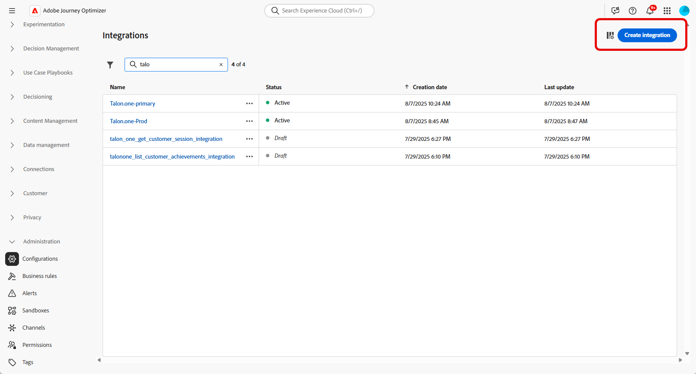

# Arbeiten mit Integrationen {#external-sources}

## Überblick

Die Funktion **Integrationen** ermöglicht eine nahtlose Integration von externen Datenquellen in Adobe Journey Optimizer. Sie erleichtert somit die Integration externer Daten und Inhaltsquellen in Ihre Kampagnen und erlaubt es Ihnen, hochgradig personalisierte und dynamische Nachrichten über verschiedene Kanäle hinweg bereitzustellen.

Sie können diese Funktion verwenden, um externe Daten und Inhalte aus Drittanbieter-Tools abzurufen, z. B.:

* **Prämienpunkte** aus Treueprogrammsystemen.
* **Preisinformationen** für Produkte.
* **Produktempfehlungen** aus Empfehlungs-Engines.
* **Logistische Updates** wie Versandstatus.

## Beta-Einschränkungen {#limitations}

Die Beta-Version weist die folgenden Einschränkungen auf:

* Es werden nur ausgehende Kanäle unterstützt.

* Für API-Aufrufantworten wird nur das JSON-Format unterstützt. HTML- und Raw-Binärbildausgaben sind nicht verfügbar.

* Es werden nur Abruf-APIs unterstützt, die auf bestimmte Inhalte abzielen. Auflistungs-APIs sind nicht verfügbar.

* Die Integrationsfunktion ist sowohl für Journeys als auch für Kampagnen verfügbar, wird aber in Fragmenten nicht unterstützt.

## Konfigurieren Ihrer Integration {#configure}

Als Admin können Sie externe Integrationen einrichten, indem Sie die folgenden Schritte ausführen:

1. Navigieren Sie im linken Menü zum Abschnitt **[!UICONTROL Konfigurationen]** und klicken Sie auf der Karte **[!UICONTROL Integrationen]** auf **[!UICONTROL Verwalten]**.

   Klicken Sie dann auf **[!UICONTROL Integration erstellen]**, um eine neue Konfiguration zu starten.

   

1. Es müssen ein **[!UICONTROL Name]** und eine **[!UICONTROL Beschreibung]** für die Integration angegeben werden.

   >[!NOTE]
   >
   >Diese Felder dürfen keine Leerzeichen enthalten.

1. Geben Sie die **[!UICONTROL URL]** des API-Endpunkts ein, der Pfadparameter mit Variablen enthalten kann, die sich mithilfe von Labels und Standardwerten definieren lassen.

1. Konfigurieren Sie die **[!UICONTROL Pfadvorlage]** mit **[!UICONTROL Name]** und **[!UICONTROL Standardwert]**.

   

1. Wählen Sie die **[!UICONTROL HTTP-Methode]** zwischen GET und POST aus.

1. Klicken Sie je nach Bedarf für Ihre Integration auf **[!UICONTROL Header hinzufügen]** und/oder **[!UICONTROL Abfrageparameter hinzufügen]**. Geben Sie für jeden Parameter die folgenden Details an:

   * **[!UICONTROL Parameter]**: Eine eindeutige Kennung, die intern verwendet wird, um auf den Parameter zu verweisen.

   * **[!UICONTROL Name]**: Der tatsächliche Name des Parameters, wie von der API erwartet.

   * **[!UICONTROL Typ]**: Wählen Sie **Konstante** für einen festen Wert oder **Variable** für eine dynamische Eingabe.

   * **[!UICONTROL Wert]**: Geben Sie für Konstanten den Wert direkt ein oder wählen Sie eine Variablenzuordnung aus.

   * **[!UICONTROL Obligatorisch]**: Geben Sie an, ob dieser Parameter obligatorisch ist.

   

1. Wählen Sie einen **[!UICONTROL Authentifizierungstyp]**:

   * **[!UICONTROL Keine Authentifizierung]**: Bei offenen APIs, für die keine Anmeldedaten erforderlich sind.

   * **[!UICONTROL API-Schlüssel]**: Authentifizieren von Anfragen mithilfe eines statischen API-Schlüssels. Geben Sie den **[!UICONTROL API-Schlüsselnamen]**, den **[!UICONTROL API-Schlüsselwert]** und den **[!UICONTROL Speicherort]** an.

   * **[!UICONTROL Einfache Authentifizierung]**: Verwenden der einfachen HTTP-Standardauthentifizierung. Geben Sie **[!UICONTROL Benutzername]** und **[!UICONTROL Kennwort]** ein.

   * **[!UICONTROL OAuth 2.0]**: Authentifizieren mit dem OAuth 2.0-Protokoll. Klicken Sie auf das Symbol , um die **[!UICONTROL Payload]** zu konfigurieren oder zu aktualisieren.

   

1. Legen Sie die **[!UICONTROL Richtlinienkonfiguration]** fest, z. B. den **[!UICONTROL Timeout]** für API-Anfragen und die Möglichkeit, Drosselung, Cache und/oder Wiederholungsversuche zu aktivieren.

1. Mit dem Feld **[!UICONTROL Antwort-Payload]** können Sie festlegen, welche Felder der Beispielausgabe für die Personalisierung von Nachrichten verwendet werden sollen.

   Klicken Sie auf das Symbol  und fügen Sie eine beispielhafte JSON-Antwort-Payload ein, um Datentypen automatisch zu erkennen.

1. Wählen Sie die Felder aus, die für die Personalisierung bereitgestellt werden sollen, und geben Sie die entsprechenden Datentypen an.

   

1. Verwenden Sie **[!UICONTROL Testverbindung senden]**, um die Integration zu validieren.

   Klicken Sie nach dem Validieren auf **[!UICONTROL Aktivieren]**.

## Verwenden externer Integrationen für die Personalisierung {#personalization}

Als Marketing-Fachleute können Sie konfigurierte Integrationen verwenden, um Ihre Inhalte zu personalisieren. Führen Sie folgende Schritte aus:

1. Greifen Sie auf Ihren Kampagneninhalt zu und klicken Sie in Ihren Text- oder HTML-**[!UICONTROL Komponenten]** auf **[!UICONTROL Personalisierung hinzufügen]**.

[Weitere Informationen zu Komponenten](../email/content-components.md)

   

1. Navigieren Sie zum Abschnitt **[!UICONTROL Integrationen]** und klicken Sie auf **[!UICONTROL Integrationen öffnen]**, um alle aktiven Integrationen anzuzeigen.

   

1. Wählen Sie eine Integration aus und klicken Sie auf **[!UICONTROL Speichern]**.

   

1. Aktivieren Sie den **[!UICONTROL Pillen-Modus]**, um das erweiterte Integrationsmenü zu entsperren.

   

1. Um die Einrichtung der Integration abzuschließen, definieren Sie die Integrationsattribute, die zuvor bei der [Konfiguration](#configure) angegeben wurden.

   Sie können diesen Attributen Werte zuweisen – entweder mithilfe statischer Werte, die konstant bleiben, oder mithilfe von Profilattributen, die Informationen dynamisch aus Benutzerprofilen abrufen.

   

1. Sobald die Integrationsattribute definiert sind, können Sie die Integrationsfelder in Ihren Inhalten für personalisierte Nachrichten verwenden, indem Sie auf das Symbol  klicken.

   

1. Klicken Sie auf **[!UICONTROL Speichern]**.

Ihre Integrationspersonalisierung wird jetzt erfolgreich auf Ihre Inhalte angewendet, sodass alle Empfängerinnen und Empfänger ein maßgeschneidertes, relevantes Erlebnis erhalten, das auf den von Ihnen konfigurierten Attributen basiert.

