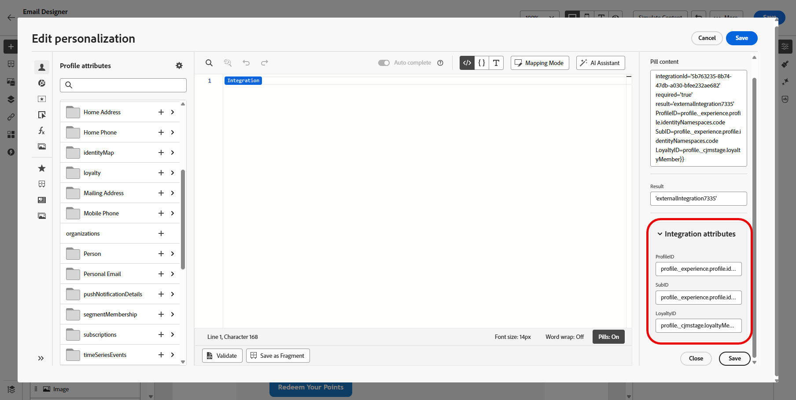

# Arbeiten mit Integrationen {#external-sources}

## Überblick

Die **Integrationen** ermöglicht die nahtlose Integration von Datenquellen von Drittanbietern in Adobe Journey Optimizer. Diese Funktion optimiert die Integration externer Daten und Inhaltsquellen in Ihre Kampagnen und ermöglicht es Ihnen, hochgradig personalisierte und dynamische Nachrichten über mehrere Kanäle hinweg bereitzustellen.

Sie können diese Funktion verwenden, um auf externe Daten zuzugreifen und Inhalte von Drittanbieter-Tools abzurufen, z. B.:

* **Prämienpunkte** aus Treuesystemen
* **Preisinformationen** für Produkte.
* **Produktempfehlungen** von Empfehlungs-Engines.
* **Logistische Updates** wie Versandstatus.

## Konfigurieren der Integration {#configure}

Als Administrator können Sie externe Integrationen einrichten, indem Sie die folgenden Schritte ausführen:

1. Navigieren Sie zum Abschnitt **[!UICONTROL Konfigurationen]** im linken Menü und klicken Sie auf **[!UICONTROL Karte]** Integrationen **[!UICONTROL auf]**.

   Klicken Sie dann auf **[!UICONTROL Integration erstellen]**, um eine neue Konfiguration zu starten.

   

1. Geben Sie einen **[!UICONTROL Name]** und **[!UICONTROL Beschreibung]** für Ihre Integration an.

   >[!NOTE]
   >
   >Diese Felder dürfen keine Leerzeichen enthalten.

1. Geben Sie den API-Endpunkt **[!UICONTROL URL]** ein, der Pfadparameter mit Variablen enthalten kann, die mithilfe von Kennzeichnungen und Standardwerten definiert werden können.

1. Konfigurieren Sie **[!UICONTROL Pfadvorlage]** mit **[!UICONTROL Name]** und **[!UICONTROL Standardwert]**.

   

1. Wählen Sie die **[!UICONTROL HTTP-Methode]** zwischen GET und POST aus.

1. Klicken Sie **[!UICONTROL Kopfzeile hinzufügen]** und/oder **[!UICONTROL Abfrageparameter hinzufügen]** wie für Ihre Integration erforderlich. Geben Sie für jeden Parameter die folgenden Details an:

   * **[!UICONTROL Parameter]**: Eine eindeutige Kennung, die intern verwendet wird, um auf den Parameter zu verweisen.

   * **[!UICONTROL Name]**: Der tatsächliche Name des Parameters, wie von der API erwartet.

   * **[!UICONTROL Typ]**: Wählen Sie **Konstante** für einen festen Wert oder **Variable** für die dynamische Eingabe.

   * **[!UICONTROL Wert]**: Geben Sie den Wert direkt für Konstanten ein oder wählen Sie eine Variablenzuordnung aus.

   * **[!UICONTROL Obligatorisch]**: Geben Sie an, ob dieser Parameter erforderlich ist.

   

1. Wählen Sie einen **[!UICONTROL Authentifizierungstyp]**:

   * **[!UICONTROL Keine Authentifizierung]**: Für offene APIs, für die keine Anmeldeinformationen erforderlich sind.

   * **[!UICONTROL API-Schlüssel]**: Authentifizieren von Anfragen mithilfe eines statischen API-Schlüssels. Geben Sie den **[!UICONTROL API-Schlüsselnamen &#x200B;]**, **[!UICONTROL API-Schlüsselwert &#x200B;]** und geben Sie Ihren **[!UICONTROL Speicherort]** an.

   * **[!UICONTROL Einfache Authentifizierung]**: Verwenden Sie die standardmäßige HTTP-Standardauthentifizierung. Geben Sie **[!UICONTROL Benutzername]** und **[!UICONTROL Kennwort]** ein.

   * **[!UICONTROL OAuth 2.0]**: Authentifizierung mit dem OAuth 2.0-Protokoll. Klicken Sie auf das -Symbol, um die **[!UICONTROL Payload“ zu konfigurieren oder]**.

   

1. Legen Sie **[!UICONTROL Richtlinienkonfiguration]** wie **[!UICONTROL Timeout]** für API-Anfragen fest und wählen Sie die Aktivierung von Drosselung, Cache und/oder Wiederholung aus.

1. Mit dem **[!UICONTROL Antwort-Payload]**-Feld können Sie entscheiden, welche Felder der Beispielausgabe für die Nachrichtenpersonalisierung verwendet werden müssen.

   Klicken Sie auf  und fügen Sie eine JSON-Beispiel-Antwort-Payload ein, um Datentypen automatisch zu erkennen.

1. Wählen Sie die Felder aus, die für die Personalisierung bereitgestellt werden sollen, und geben Sie die entsprechenden Datentypen an.

   

1. Verwenden Sie **[!UICONTROL Testverbindung senden]** um die Integration zu validieren.

   Klicken Sie nach der Validierung auf **[!UICONTROL Aktivieren]**.

## Verwenden externer Integrationen für die Personalisierung {#personalization}

Als Marketing-Experte können Sie konfigurierte Integrationen verwenden, um Ihre Inhalte zu personalisieren. Führen Sie folgende Schritte aus:

1. Greifen Sie auf Ihren Kampagneninhalt zu und klicken Sie auf **[!UICONTROL Personalisierung hinzufügen]** in Ihrem Text oder in HTML **[!UICONTROL Komponenten]**.

[Weitere Informationen zu Komponenten](../email/content-components.md)

   

1. Navigieren Sie zum Abschnitt **[!UICONTROL Integrationen]** und klicken Sie auf **[!UICONTROL Integrationen öffnen]** um alle aktiven Integrationen anzuzeigen.

   

1. Wählen Sie eine Integration aus und klicken Sie auf **[!UICONTROL Speichern]**.

   

1. Aktivieren Sie den **[!UICONTROL Pillen]**-Modus, um das erweiterte Integrationsmenü zu entsperren.

   

1. Um die Einrichtung der Integration abzuschließen, definieren Sie die Integrationsattribute, die zuvor während der Konfiguration [ wurden](#configure).

   Sie können diesen Attributen Werte zuweisen, entweder mithilfe statischer Werte, die konstant bleiben, oder mithilfe von Profilattributen, die Informationen dynamisch aus Benutzerprofilen abrufen.

   

1. Sobald Integrationsattribute definiert sind, können Sie jetzt die Integrationsfelder in Ihrem Inhalt für personalisierte Nachrichten verwenden, indem Sie auf das Symbol  klicken.

   

1. Klicken Sie auf **[!UICONTROL Speichern]**.

Ihre Integrations-Personalisierung wird jetzt erfolgreich auf Ihre Inhalte angewendet, sodass jeder Empfänger ein maßgeschneidertes, relevantes Erlebnis erhält, das auf den von Ihnen konfigurierten Attributen basiert.

