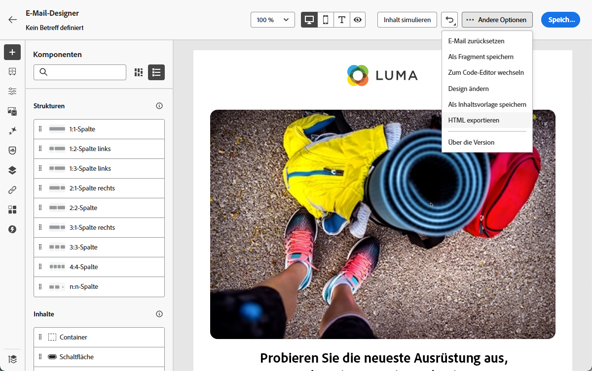
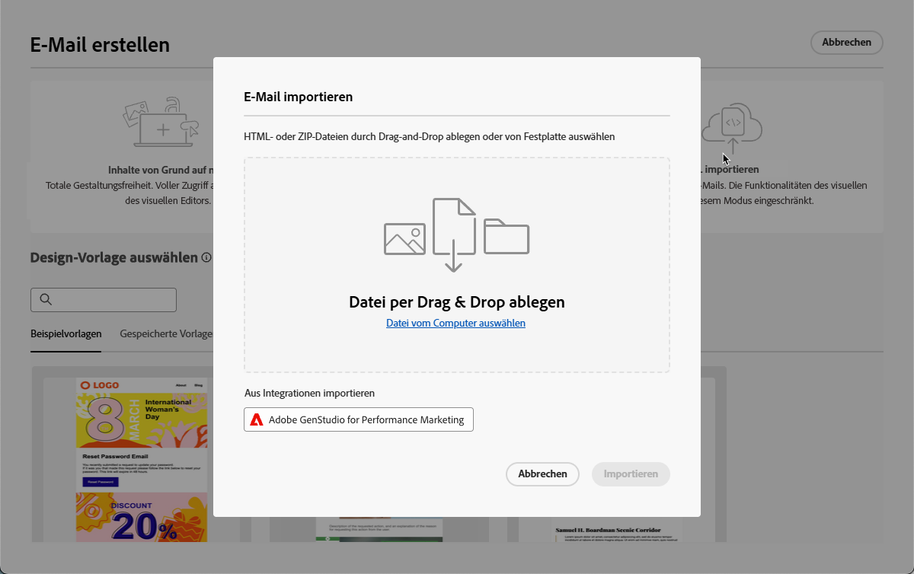
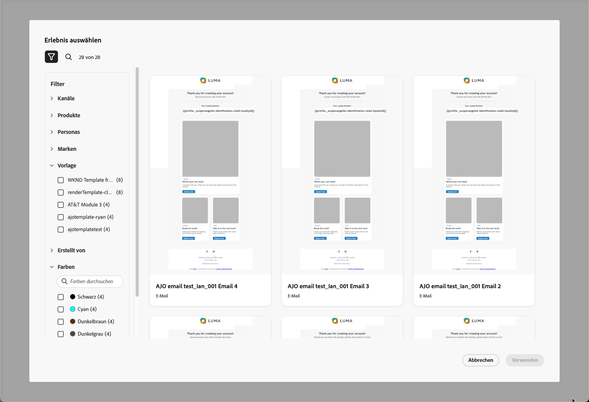
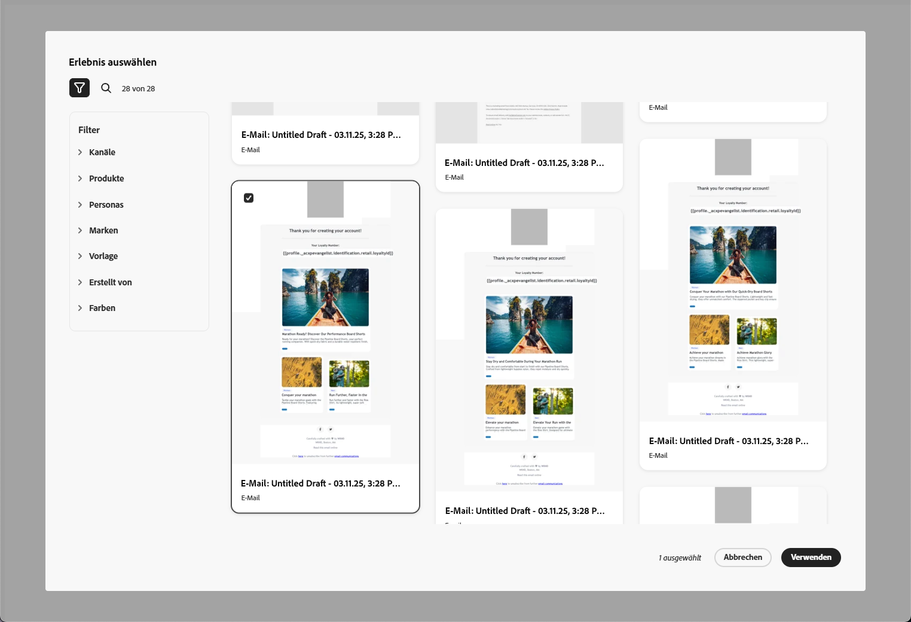
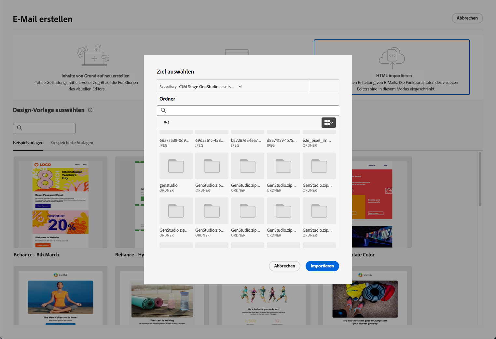
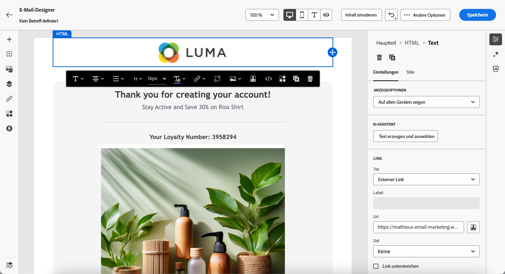
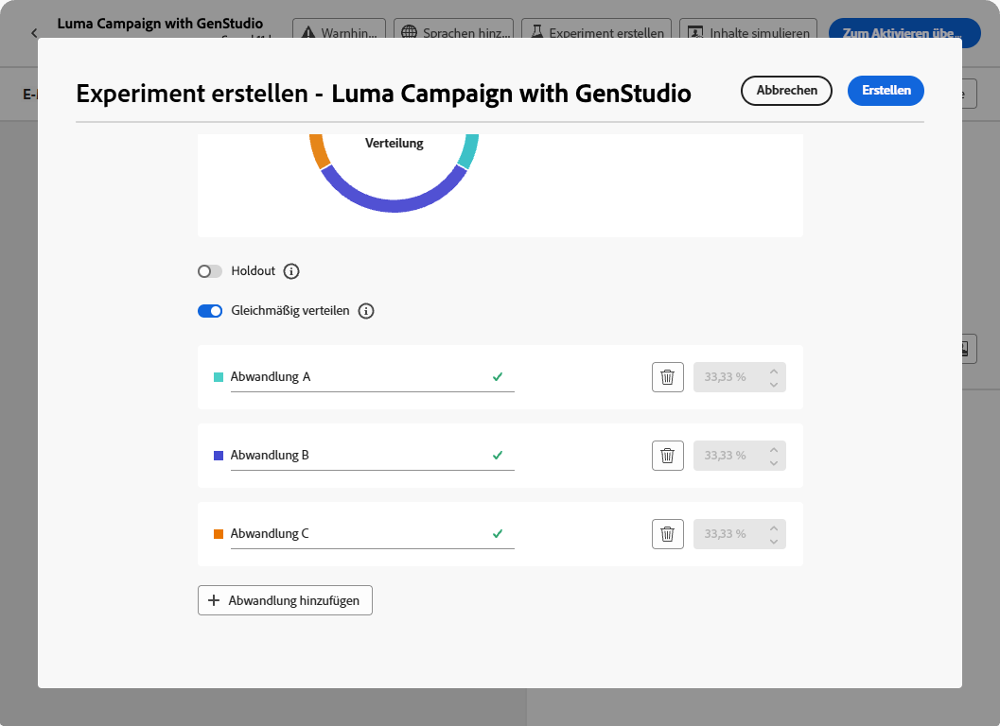
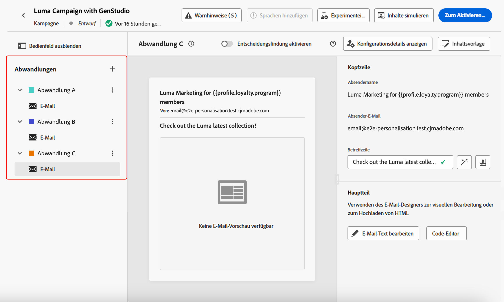

# Arbeiten mit GenStudio for Performance Marketing {#ajo-genstudio}

>[!CONTEXTUALHELP]
>id="ajo_genstudio_button"
>title="Verwenden einer mit GenStudio erstellten Vorlage"
>abstract="Dank der nahtlosen Integration mit Adobe GenStudio for Performance Marketing können Sie eine mit KI-Technologie von Adobe erweiterte GenStudio-Vorlage einfach importieren."

## Erste Schritte mit GenStudio {#gs-genstudio}

[Adobe GenStudio for Performance Marketing](https://experienceleague.adobe.com/de/docs/genstudio-for-performance-marketing/user-guide/home){target="_blank"} ist eine generative KI-First-Anwendung, mit der Marketing-Teams ihre eigenen Anzeigen und E-Mails erstellen können, um wirkungsvolle, personalisierte Marketing-Kampagnen voranzubringen, die Ihren Markenstandards und Unternehmensrichtlinien entsprechen. Dank der KI-Technologie von Adobe bietet diese Anwendung eine umfassende Palette an Tools, die die komplexe Erstellung und Verwaltung von Inhalten vereinfachen, sodass sich Kreative darauf konzentrieren können, innovativ zu sein.

>[!AVAILABILITY]
>
>* Die GenStudio-Integration in [!DNL Adobe Journey Optimizer] ist derzeit nicht für die Verwendung mit den Add-ons **Healthcare Shield** oder **Privacy and Security Shield** verfügbar.
>
>* Diese Funktion steht nur für den E-Mail-Kanal zur Verfügung.

Um die Marketing-Effizienz zu verbessern und die Markenkonsistenz zu wahren, können Sie [!DNL **GenStudio for Performance Marketing**]-Erlebnisse nahtlos mit [!DNL **Adobe Journey Optimizer**] integrieren. Auf diese Weise können Sie die KI-gestützte Inhaltserstellung von [!DNL GenStudio] zusammen mit den erweiterten Orchestrierungsfunktionen von [!DNL Journey Optimizer] nutzen.

>[!INFO]
>
>Weitere Informationen finden Sie in diesem [Überblick](https://business.adobe.com/de/products/genstudio-for-performance-marketing.html?lang=de#watch-overview){target="_blank"} und einer [Demo](https://business.adobe.com/de/products/genstudio-for-performance-marketing.html?lang=de#demo){target="_blank"} zu [!DNL Adobe GenStudio for Performance Marketing].

➡️ [Funktion im Video kennenlernen](#video)

## Voraussetzungen {#genstudio-prerequisites}

Um die [!DNL GenStudio for Performance Marketing] Integration mit [!DNL Journey Optimizer] zu verwenden, stellen Sie sicher, dass die folgenden Anforderungen erfüllt sind:

* Ihr Unternehmen muss über eine aktive Lizenz für [!DNL GenStudio for Performance Marketing] verfügen.

* Sowohl [!DNL GenStudio for Performance Marketing] als auch [!DNL Adobe Journey Optimizer] müssen derselben IMS-Organisation angehören.

* Benutzer müssen mindestens über die Rolle **Mitarbeiter** oder höher verfügen, [!DNL GenStudio for Performance Marketing] die Integrationsfunktionen nutzen zu können. [Erfahren Sie mehr über Benutzerrollen in GenStudio](https://experienceleague.adobe.com/de/docs/genstudio-for-performance-marketing/user-guide/intro/user-roles){target="_blank"}

<!--To access the GenStudio integration in [!DNL Adobe Journey Optimizer] feature, users need to be granted the **xxx** permission. [Learn more](../administration/permissions.md)

>[!IMPORTANT]
>
>* Before starting using this capability, read out related [Guardrails and Limitations](#generative-guardrails).-->

<!--Guardrails and limitations {#genstudio-guardrails}

General guidelines for using the GenStudio integration in [!DNL Adobe Journey Optimizer] for email generation are listed below:

See if guidelines/limitations such as the ones listed [here](../content-management/gs-generative.md#generative-guardrails) for AI Assistant can apply.

The following limitations apply to GenStudio integration in [!DNL Adobe Journey Optimizer]:-->

## Nutzung der GenStudio-Funktionen in Journey Optimizer {#use-genstudio}

Durch die Integration von [!DNL GenStudio for Performance Marketing] und [!DNL Journey Optimizer] können Marketing-Fachleute in Ihrem Unternehmen besser im Team arbeiten, um Prozesse zu optimieren.

Eine technische Marketing-Fachkraft, die mit [!DNL Journey Optimizer] E-Mail-Kampagnen entwickelt und automatisiert, kann beispielsweise mit einer Performance-Marketing-Fachkraft zusammenarbeiten, die Inhalte mithilfe von [!DNL GenStudio] erstellt.

Mithilfe dieser Integration können beide zusammenarbeiten, um markenkonforme Inhalte von [!DNL GenStudio] einfach in [!DNL Journey Optimizer] zu integrieren und so ansprechende E-Mails zu versenden, die auf bestimmte Kundensegmente zugeschnitten sind und den Umsatz fördern.

### Wichtigste Funktionen {#genstudio-capabilities}

Diese Integration erschließt leistungsstarke Funktionen für Ihre Marketing-Organisation:

* **KI-gestützte Inhaltserstellung**: Nutzen Sie die generative KI von Adobe, um mehrere markeninterne E-Mail-Varianten effizient mit intelligenten Kopiervorschlägen und Designelementen zu erstellen.

* **Nahtlose Workflow-Integration**: Exportieren Sie Journey Optimizer-E-Mail-Vorlagen nach GenStudio, erstellen Sie Varianten mit KI-Aufforderungen und importieren Sie sie in einem vereinfachten Prozess wieder in Journey Optimizer.

* **Zentralisiertes Asset-**: Greifen Sie auf den von Adobe Experience Manager Assets unterstützten ContentHub von GenStudio zu, um alle digitalen Assets an einem zentralen Ort zu organisieren, zu speichern und abzurufen.

* **Inhaltsexperiment**: Importieren Sie mehrere E-Mail-Varianten von GenStudio in Journey Optimizer und nutzen Sie Experimentierfunktionen, um die Inhalte mit der besten Leistung zu testen und zu identifizieren.

* **Leistungsgesteuerte Einblicke**: Verfolgen Sie die Kampagnenleistung mit KI-gestützten Analysen, um zu verstehen, welche kreativen Elemente bei Ihrer Audience Anklang finden, und optimieren Sie zukünftige Kampagnen.

### Häufige Anwendungsfälle {#genstudio-use-cases}

Die Integration zwischen [!DNL GenStudio for Performance Marketing] und 
Journey Optimizer&rbrack; unterstützt verschiedene Marketing-Szenarien:

* **Produkteinführungskampagnen**: Generieren Sie schnell mehrere E-Mail-Varianten für Produktankündigungen, testen Sie sie mit verschiedenen Zielgruppensegmenten und skalieren Sie die erfolgreichste Version für Ihren Kundenstamm.

* **Urlaubs- und saisonale Werbeaktionen**: Erstellen Sie zeitkritische Kampagneninhalte in großem Maßstab mithilfe von GenStudio-Vorlagen, um die Markenkonsistenz bei Einhaltung enger Fristen sicherzustellen.

* **A/B-Tests im großen Maßstab**: Erstellen Sie zahlreiche Inhaltsvarianten in GenStudio und testen Sie sie systematisch in Journey Optimizer, um die E-Mail-Leistung kontinuierlich zu verbessern.

* **Personalisierung für mehrere Segmente** Generieren Sie in GenStudio maßgeschneiderte Inhalte für verschiedene Kundenpersonas und stellen Sie dann jede Variante für das entsprechende Segment in Journey Optimizer bereit, um die Relevanz zu maximieren.

## Verwenden der GenStudio-Integration {#how-to-use}

Der Integrations-Workflow besteht aus zwei Hauptschritten: Exportieren einer Vorlage von Journey Optimizer nach GenStudio und Importieren von GenStudio-Erlebnissen zurück in Journey Optimizer.

### Exportieren einer HTML-Vorlage von Journey Optimizer nach GenStudio {#export-from-ajo-to-genstudio}

Exportieren Sie zunächst eine [!DNL Journey Optimizer] HTML-Vorlage mit den Richtlinien Ihrer Marke nach [!DNL GenStudio for Performance Marketing]. Führen Sie dazu folgende Schritte durch.

1. Greifen Sie in [!DNL Journey Optimizer] auf den Inhalt Ihrer E-Mail in einer Journey oder Kampagne zu. [Weitere Informationen](../email/get-started-email-design.md#key-steps)

1. Wählen Sie im E-Mail-Designer über die Schaltfläche **[!UICONTROL Mehr]** die Option **[!UICONTROL HTML exportieren]** aus.

   {zoomable="yes"}

1. Laden Sie diese exportierte HTML-Vorlage in [!DNL GenStudio for Performance Marketing] hoch. <!--Make sure you detect the fields that the generative AI uses to insert content in order to create an actionable template.-->

   >[!NOTE]
   >
   >Informationen zum Hochladen einer HTML-Vorlage in [!DNL GenStudio] finden Sie im entsprechenden Abschnitt des [Benutzerhandbuchs zu Adobe GenStudio for Performance Marketing](https://experienceleague.adobe.com/de/docs/genstudio-for-performance-marketing/user-guide/content/templates/use-templates#templates-from-ajo-and-marketo){target="_blank"}.

1. Verwenden Sie in GenStudio diese Vorlage, um mehrere E-Mail-Varianten mit KI-Prompts zu erstellen und zu speichern.

   >[!NOTE]
   >
   >Wie Sie E-Mail-Erlebnisse erstellen, erfahren Sie im entsprechenden [Abschnitt](https://experienceleague.adobe.com/de/docs/genstudio-for-performance-marketing/user-guide/create/create-email-experience){target="_blank"} des GenStudio-Benutzerhandbuchs.

### Nutzen von GenStudio-Erlebnissen in Journey Optimizer {#leverage-genstudio-experiences}

Nachdem Sie E-Mail-Varianten in GenStudio erstellt haben, importieren Sie sie wieder in [!DNL Journey Optimizer], um sie in Ihren Kampagnen zu verwenden. Gehen Sie wie folgt vor.

1. [Fügen Sie in [!DNL Journey Optimizer] eine E-Mail zu einer Kampagne hinzu](../email/create-email.md).

1. Gehen Sie im Bildschirm zur Kampagnenkonfiguration den Bildschirm [Inhalt bearbeiten](../email/create-email.md#define-email-content) durch und klicken Sie auf **[!UICONTROL E-Mail-Text bearbeiten]**, um den E-Mail-Designer zu öffnen. [Weitere Informationen](../email/get-started-email-design.md#key-steps)

1. Wählen Sie auf der Startseite des E-Mail-Designers die Option **[!UICONTROL HTML importieren]** aus und klicken Sie auf die Schaltfläche **[!UICONTROL Adobe GenStudio for Performance Marketing]**.

   {zoomable="yes"}

1. Durchsuchen Sie die GenStudio-Erlebnisse, um mit der Erstellung Ihrer Inhalte zu beginnen. Sie können die Erlebnisse nach verschiedenen Kriterien filtern, z. B. nach Produkten, Personas, Marken oder sogar Farben.

   <!--{zoomable="yes"}-->

1. Wählen Sie ein Erlebnis aus und klicken Sie auf **[!UICONTROL Verwenden]**.

   {zoomable="yes"}

1. Wählen Sie den Ordner aus, in den das GenStudio-Erlebnis importiert werden soll.

   {zoomable="yes"}

1. Der ausgewählte Inhalt wird im E-Mail-Designer angezeigt.

   {zoomable="yes"}

   >[!NOTE]
   >
   >GenStudio[Erlebnisse, die aus einer  [!DNL Journey Optimizer]  erstellt wurden](#export-from-ajo-to-genstudio) werden direkt in E-Mail-Designer importiert, wobei sämtliche Bearbeitungsfunktionen genutzt werden können. GenStudio-Erlebnisse, die ohne [!DNL Journey Optimizer] erstellt wurden, werden in den [Kompatibilitätsmodus](../email/existing-content.md) importiert, der möglicherweise nur über eingeschränkte Bearbeitungsfunktionen verfügt.

1. Verwenden Sie die [Tools zur Bearbeitung von E](../email/content-from-scratch.md)Mail-Inhalten und [Personalisierungsfelder](../personalization/personalize.md), um Ihre E-Mail nach Bedarf zu bearbeiten. Speichern Sie Ihren Inhalt.

1. Gehen Sie zurück zur Übersichtsseite der Kampagne und klicken Sie auf **[!UICONTROL Experiment erstellen]**, um die Experimentierfunktion zu verwenden. [Erfahren Sie, wie Sie ein Inhaltsexperiment erstellen](../content-management/content-experiment.md).

   <!--{zoomable="yes"}-->

1. Erstellen Sie mehrere Abwandlungen und wiederholen Sie die obigen Schritte, um die anderen von Ihnen in [!DNL GenStudio] erstellten E-Mail-Erlebnisvarianten zu importieren und schnell nutzen zu können.

   {zoomable="yes"}

1. Speichern Sie Ihre Änderungen und [aktivieren](../campaigns/review-activate-campaign.md) Sie die Kampagne. 

1. Verfolgen Sie nach dem Ausführen des Experiments mit dem [Experimentkampagnenbericht](../reports/campaign-global-report-cja-experimentation.md), wie Ihre Kampagnenabwandlungen funktionieren. Sie können dann die Ergebnisse Ihres Experiments auslegen. [Weitere Informationen](../content-management/get-started-experiment.md#interpret-results)

## Häufig gestellte Fragen {#genstudio-faq}

Hier finden Sie Antworten auf häufig gestellte Fragen zur Integration von [!DNL GenStudio for Performance Marketing] mit [!DNL Journey Optimizer].

+++Kann ich die GenStudio-Integration für andere Kanäle als E-Mail verwenden?

Derzeit ist die [!DNL GenStudio for Performance Marketing]-Integration nur für den E-Mail-Kanal verfügbar. In zukünftigen Versionen wird möglicherweise Unterstützung für zusätzliche Kanäle hinzugefügt.
+++

+++Ist die GenStudio-Integration für alle Journey Optimizer-Kunden verfügbar?

Die Integration ist derzeit für Organisationen, die die Add-on **Angebote Healthcare Shield** oder **Privacy and Security Shield** verwenden, nicht verfügbar.
+++

+++Kann ich GenStudio-Inhalte bearbeiten, nachdem ich sie in Journey Optimizer importiert habe?

Ja, nachdem Sie GenStudio-Erlebnisse in [!DNL Journey Optimizer] importiert haben, können Sie die [Inhaltsbearbeitungs-Tools“ von E-Mail-Designer verwenden &#x200B;](../email/content-from-scratch.md) ([) &#x200B;](../personalization/personalize.md), um Ihren E-Mail-Inhalt weiter anzupassen.
+++

+++Was passiert mit GenStudio-Erlebnissen, die ohne Journey Optimizer-Vorlage erstellt wurden?

Aus einer [!DNL Journey Optimizer] erstellte GenStudio-Erlebnisse werden direkt in die E-Mail-Designer importiert. GenStudio-Erlebnisse, die ohne eine [!DNL Journey Optimizer]-Vorlage erstellt wurden, werden in den [Kompatibilitätsmodus](../email/existing-content.md) importiert.
+++

+++Kann ich mehrere GenStudio-E-Mail-Varianten in Journey Optimizer testen?

Ja, Sie können mehrere Inhaltsbehandlungen erstellen, indem Sie verschiedene GenStudio-E-Mail-Varianten importieren und die Journey Optimizer-Funktion [Inhaltsexperiment](../content-management/content-experiment.md) verwenden, um zu testen, welche Variante bei Ihrer Audience am besten funktioniert.
+++

+++Wie stellt GenStudio die Markenkonsistenz sicher?

GenStudio verwendet KI-gestützte Markenprüfungen, um sicherzustellen, dass alle generierten Inhalte Ihren Markenstandards und -richtlinien entsprechen. Wenn Sie Vorlagen hochladen, die Ihre Markenelemente enthalten, wendet GenStudio diese Standards auf alle Inhaltsvarianten an, die in der Plattform erstellt werden.
+++

+++Kann ich mit anderen Team-Mitgliedern an GenStudio-Erlebnissen zusammenarbeiten?

Ja, GenStudio wurde für die Zusammenarbeit entwickelt. Mehrere Team-Mitglieder mit entsprechenden Berechtigungen können zusammenarbeiten, um E-Mail-Erlebnisse zu erstellen und zu verfeinern, bevor sie in [!DNL Journey Optimizer] importiert werden.
+++

## Anleitungsvideo {#video}

Erfahren Sie, wie Sie eine E-Mail-Vorlage aus Journey Optimizer in GenStudio for Performance Marketing exportieren, markenkonforme E-Mails mit der Vorlage in GenStudio erstellen und diese dann nahtlos wieder in Journey Optimizer importieren.

>[!VIDEO](https://video.tv.adobe.com/v/3456038/?quality=12)