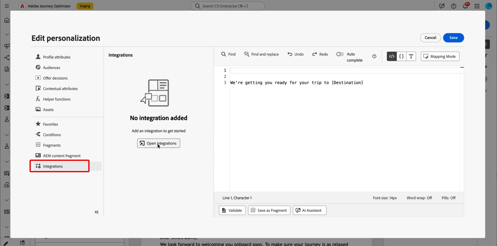

# Verwenden externer Integrationen für die Personalisierung {#integrations-personalization}

>[!BEGINSHADEBOX]

**Auf dieser Seite:** Erfahren Sie, wie Marketing-Experten konfigurierte Integrationen anwenden, um E-Mail-, SMS- und Push-Inhalte zu personalisieren und einen API-Aufruf an einen anderen zu verketten, um umfangreicheres und dynamisches Messaging zu ermöglichen.

>[!ENDSHADEBOX]

Bevor Sie externe Integrationen in Ihren Inhalten verwenden, bestätigen Sie, dass ein Administrator jede Integration **konfiguriert und aktiviert** (Endpunkt, Authentifizierung, Richtlinien, Antwort-Payload und Aktivierung) hat, wie in [Arbeiten mit Integrationen](integrations.md) beschrieben.

Sie können bis zu **3** Integrationen pro **[!UICONTROL Fragment]** und bis zu **5** der Nachricht hinzufügen. Integrationen, die nur aus Fragmenten stammen, werden nicht für die **5** gezählt.

## Anwenden der Integrationspersonalisierung auf Ihre Inhalte {#apply-integration-personalization}

Als Marketing-Fachleute können Sie konfigurierte Integrationen verwenden, um Ihre Inhalte zu personalisieren. Führen Sie folgende Schritte aus:

1. Greifen Sie auf Ihren Kampagneninhalt zu und klicken Sie in Ihren Text- oder HTML-**[!UICONTROL Komponenten]** auf **[!UICONTROL Personalisierung hinzufügen]**.

   [Weitere Informationen zu Komponenten](../email/content-components.md)

   

1. Navigieren Sie zum Abschnitt **[!UICONTROL Integrationen]** und klicken Sie auf **[!UICONTROL Integrationen öffnen]**, um alle aktiven Integrationen anzuzeigen.

   Beachten Sie, dass **Journey Optimizer-Fragmente** für Integrationen verfügbar sind, aber nur ausgehende Kanäle unterstützen. Nach der Veröffentlichung eines Fragments ist das Hinzufügen und Speichern neuer Integrationen deaktiviert, um Auswirkungen auf bestehende Journey und Kampagnen zu vermeiden.

   

1. Wählen Sie eine Integration aus und klicken Sie auf **[!UICONTROL Speichern]**.

   

1. Aktivieren Sie den **[!UICONTROL Pillen-Modus]**, um das erweiterte Integrationsmenü zu entsperren.

   

1. Wenn Sie die Integrationspersonalisierung erstellen, enthält der Integrations-Helper ein **`required`**, das definiert, wie Fehler oder fehlende Daten mit Standardinhalten interagieren:

   * **`required=true`** (Standard): Das Rendern dieser Nachricht wird angehalten. Der Versand wird mit **`ExternalDataLookupExclusion`** ausgeschlossen und dieser Ausschluss wird im **Nachrichten-Feedback-Datensatz“**.
   * **`required=false`**: Die Ergebnisvariable wird auf **`null`** festgelegt und das Rendern wird fortgesetzt. Verwenden Sie Standardtext, Fallbacks oder bedingte Logik in Ihrer Vorlage, damit Profile keine leeren Inhalte erhalten, wenn die Integration keine Daten zurückgibt.

     

1. Um die Einrichtung der Integration abzuschließen, definieren Sie die Integrationsattribute, die zuvor bei der [Konfiguration](integrations.md#configure) angegeben wurden.

   Sie können diesen Attributen Werte zuweisen – entweder mithilfe statischer Werte, die konstant bleiben, oder mithilfe von Profilattributen, die Informationen dynamisch aus Benutzerprofilen abrufen.

   

1. Sobald die Integrationsattribute definiert sind, können Sie die Integrationsfelder in Ihren Inhalten für personalisierte Nachrichten verwenden, indem Sie auf das Symbol  klicken.

   

   >[!NOTE]
   >
   >Token in Ihrer Vorlage dürfen nur Felder verwenden, die der Administrator in der Integrationskonfiguration bereitgestellt hat. Beispielsweise ist `{{weatherResponse.temperature}}` gültig, wenn `temperature` verfügbar gemacht wird; `{{weatherResponse.humidity}}` wird im Editor abgelehnt, wenn `humidity` nicht verfügbar ist.

1. Klicken Sie auf **[!UICONTROL Speichern]**.

Ihre Integrationspersonalisierung wird jetzt erfolgreich auf Ihre Inhalte angewendet, sodass alle Empfängerinnen und Empfänger ein maßgeschneidertes, relevantes Erlebnis erhalten, das auf den von Ihnen konfigurierten Attributen basiert.


## Einen API-Aufruf einem anderen zuordnen {#map-integration-chain}

Sie können Integrationen verketten, sodass die Ergebnisse eines Aufrufs an den nächsten weitergeleitet werden, z. B. Pfadsegmente, Kopfzeilen oder Abfrageparameter. Die Aufrufe werden in der richtigen Reihenfolge in derselben Nachricht ausgeführt, was eine umfassendere Personalisierung ohne benutzerdefinierten Code unterstützt.

Bevor Sie beginnen, stellen Sie Folgendes sicher:

* Ein Administrator hat jede benötigte Integration konfiguriert und aktiviert. Siehe [Konfigurieren der Integration](integrations.md).
* Platzhalter, Kopfzeilen und Abfrageparameter für Variablenpfade werden in der Integrationskonfiguration mit Marketer-orientierten Kennzeichnungen eingerichtet.
* Der Administrator legte die Antwortfelder offen, die Sie für jede Integration in der **[!UICONTROL Antwort-Payload]** benötigen, damit sie beim Authoring angezeigt werden.

Im folgenden Beispiel wird eine Reservierungsintegration verwendet, die eine Flugnummer aus der Buchung des Profils zurückgibt, dann eine Fluginformationsintegration, die diese Nummer für den Live-Status (Verspätungen, Ziel) verwendet. Sie ordnen die Eingaben der zweiten Integration der Antwort des ersten Aufrufs zu.

1. Öffnen Sie Ihre Nachricht oder Ihr Fragment und öffnen Sie den Personalisierungseditor.

   

1. Klicken **[!UICONTROL unter]** auf **[!UICONTROL Integrationen öffnen]**.

   

1. Fügen Sie die Integration hinzu, deren Antwort den nächsten Aufruf bedient, z. B. Reservierungs- oder Buchungsdaten, die die Flugkennung enthalten.

   

1. (Optional) Öffnen Sie das Menü **[!UICONTROL Hilfsfunktion]** und fügen Sie einen Helper hinzu, z. B. die `Let`-Funktion, wenn Sie eine benannte Variable an die Reservierungsantwort binden möchten.

   >[!NOTE]
   >
   > Es sind nur Felder verfügbar, die in der vom Administrator definierten **[!UICONTROL Antwort-Payload]** verfügbar sind. Sie können nicht auf Eigenschaften verweisen, die in der Konfiguration nicht bereitgestellt wurden.

1. Wenn Sie eine Hilfsvariable verwenden, ordnen Sie diese Variable dem Feld zu, das die Reservierungsintegration für die nachgelagerte Verwendung zurückgibt, z. B. die Flugnummer in der Passagier- oder Buchungs-Payload.

   

1. Fügen Sie im **[!UICONTROL Integrationen öffnen]** die zweite Integration hinzu, z. B. „Flugstatus“.

   

1. Öffnen Sie in der zweiten Integration **[!UICONTROL Integrationsattribute]**. Wählen Sie für jede Eingabe, die Daten aus dem ersten Aufruf wiederverwenden muss, z. B. eine Pfadvariable, Kopfzeile oder Abfrageparameter, eine Zuordnungsquelle aus der ersten Integrationsantwort aus.

   Beim **[!UICONTROL Pillen]**-Erlebnis können Sie die Ausgabe des ersten Aufrufs direkt der Eingabe des zweiten Aufrufs ohne `Let`-Anweisung zuordnen. Wenn Sie `Let` verwendet haben, können Sie stattdessen diese Variable zuordnen.

   

1. Fügen Sie Token aus der zweiten Integration mit dem Steuerelement  in Ihren Inhalt ein, z. B. Ziel aus der Fluginformationsantwort.

   

1. Speichern Sie Ihren Inhalt.

Beim **[!UICONTROL Simulieren]** oder Senden führt Journey Optimizer Integrationen der Reihe nach aus: Der erste Aufruf verwendet den konfigurierten Profilkontext und das Ergebnis erstellt die zweite Anfrage. Ob eine bestimmte Integration zur Simulations- oder Sendezeit ausgeführt wird, hängt von Ihrer Einrichtung und Ihrem Kanal ab.


## Verwenden von Adobe Target-Daten in Vorlagen {#use-adobe-target-in-templates}

In diesem Abschnitt wird erläutert, wie Sie **Integrationen** in Adobe Journey Optimizer verwenden können, um Personalisierungsdaten zum Sendezeitpunkt aus **[!DNL Adobe Target]** abzurufen und sie in Nachrichtenvorlagen zu verwenden. Es wird davon ausgegangen, dass die Target-Bereitstellungs-API bereits als Integration konfiguriert wurde.

Konfigurationsschritte finden Sie unter [Arbeiten mit Integrationen](integrations.md) und im Beispiel [Adobe Target Recommendations](vendor-integration.md#adobe-target-recommendations) .

Die Target-Bereitstellungs-API gibt ein `prefetch.mboxes`-Array zurück. Jede Mbox enthält ein `options` mit `content`- und `type`. Der `type` bestimmt, wie Sie `content` in Ihrer Vorlage verwenden. Öffnen Sie die Registerkarte, die Ihrer Mbox-Antwort entspricht, und führen Sie dann die Schritte aus, um diese Daten in Ihrer Nachricht zu verwenden.

>[!BEGINTABS]

>[!TAB JSON-Inhalt]

Wenn `type` `json` wird, ist das `content` Feld eine **JSON-Zeichenfolge**. Analysieren Sie sie, bevor Sie auf verschachtelte Felder zugreifen. Das folgende Beispiel zeigt eine typische Bereitstellungs-API-Antwort für eine JSON-Mbox.

```json
{
  "status": 200,
  "prefetch": {
    "mboxes": [
      {
        "index": 0,
        "name": "SummerOffer",
        "options": {
          "content": "{\"recommendations\":[{\"productId\":\"p101\",\"name\":\"Noise Smartwatch\",\"price\":2999},{\"productId\":\"p205\",\"name\":\"Boat Earbuds\",\"price\":1499}],\"strategy\":\"collaborative-filtering\"}",
          "type": "json"
        }
      }
    ]
  }
}
```

Verwenden Sie drei Helper nacheinander, um die Target-Antwort abzurufen, zu extrahieren und zu analysieren.

1. **Zielgruppenantwort abrufen.** Rufen Sie die konfigurierte Target-Integration mit `externalDataLookup` auf. Setzen Sie `integrationName` auf **[!UICONTROL Name]** dieser Integration (ersetzen Sie den Beispiel-Platzhalter `target_recommendations`). Verwenden Sie den `result`, um die Vorlagenvariable zu benennen, die die vollständige Payload der Bereitstellungs-API enthält - z. B. `targetResponse`.

   Sie können die Integration auch direkt aus dem Menü **[!UICONTROL Integrationen]** im linken Navigationsbereich des Personalisierungseditors auswählen. Siehe [Anwenden der Integrationspersonalisierung auf Ihre Inhalte](#apply-integration-personalization).

   ```handlebars
   {{externalDataLookup integrationName="target_recommendations" result="targetResponse"}}
   ```

1. **Extrahieren Sie eine bestimmte Mbox mit valueAtPath.** `valueAtPath` extrahiert ein Element aus einem Array anhand seines 0-basierten Index und weist es einer Vorlagenvariablen zu. Verwenden Sie den Parameter `idx` , um anzugeben, auf welches Element zugegriffen werden soll.

   ```handlebars
   {{valueAtPath targetResponse.prefetch.mboxes idx=0 result="summerOffer"}}
   ```

   | Parameter | Beschreibung |
   | --- | --- |
   | `path` | Pfad zum Array (positionell, kein Keyword) |
   | `idx` | Index auf Basis 0 für Array-Zugriff (optional) |
   | `result` | Variablenname zum Speichern des extrahierten Werts |

   >[!NOTE]
   >
   > Wenn `idx` außerhalb des Bereichs liegt, wird beim Rendern eine Ausnahme ausgelöst. Schützen Sie ungültige Indizes mit ``, wenn der Index ungültig sein könnte. PQL-Ausdrücke können nicht als Pfad verwendet werden. **Verfügbar seit Version 2025.9.0.**

1. **Analysieren Sie die JSON-Zeichenfolge mit parseJson.** Das Feld „Mbox-`options.content`&quot; ist eine unformatierte JSON-Zeichenfolge. `parseJson` konvertiert sie in ein strukturiertes Objekt, auf dessen Felder dann direkt in der Vorlage zugegriffen werden kann.

   ```handlebars
   {{parseJson jsonStr=summerOffer.options.content result="summerOfferContent"}}
   ```

   | Parameter | Beschreibung |
   | --- | --- |
   | `jsonStr` | Pfad zum Zeichenfolgenfeld, das eine gültige JSON enthält |
   | `result` | Variablenname zum Speichern des geparsten Objekts |

   >[!NOTE]
   >
   > Wenn die JSON-Zeichenfolge ungültig ist oder der Verweis null ist, wird `result` auf `null` gesetzt - es wird kein Rendering-Fehler ausgegeben. Testen Sie mit Ihrer tatsächlichen Target-Antwort, um zu bestätigen, dass der Inhalt gültiges JSON ist. **Verfügbar seit: 2026.6.0**

1. **Zugriff auf die Daten.** Verwenden Sie nach der Analyse die Punktnotation, um auf Felder aus `summerOfferContent` zuzugreifen. So rendern Sie eine Liste von Empfehlungen:

   ```handlebars
   {{externalDataLookup integrationName="target_recommendations" result="targetResponse"}}
   {{valueAtPath targetResponse.prefetch.mboxes idx=0 result="summerOffer"}}
   {{parseJson jsonStr=summerOffer.options.content result="summerOfferContent"}}
   
   Strategy: {{summerOfferContent.strategy}}
   {{#each summerOfferContent.recommendations as |rec|}}
     {{rec.name}} — {{rec.price}}
   {{/each}}
   ```

>[!TAB HTML-Inhalte]

Wenn `type` `html` ist, ist das `content` eine HTML-Zeichenfolge, die gerendert werden kann. Sie müssen sie nicht parsen. Das folgende Beispiel zeigt eine typische Bereitstellungs-API-Antwort für eine HTML-Mbox.

```json
{
  "status": 200,
  "prefetch": {
    "mboxes": [
      {
        "index": 0,
        "name": "SummerOffer",
        "options": {
          "content": "<div class=\"offer\"><h2>Summer Sale</h2><p>50% off Smartwatch</p></div>",
          "type": "html"
        }
      }
    ]
  }
}
```

Rufen Sie die Mbox ab, extrahieren Sie sie und rendern Sie `content` direkt. `parseJson` überspringen.

```handlebars
{{externalDataLookup integrationName="target_recommendations" result="targetResponse"}}
{{valueAtPath targetResponse.prefetch.mboxes idx=0 result="summerOffer"}}
{{{summerOffer.options.content}}}
```

>[!NOTE]
>
> Verwenden Sie **Dreifach** geschweifte Klammern`{{{...}}}`, um HTML-Inhalte unverändert zu rendern. Doppelte Klammern `{{...}}` setzen HTML-Entitäten um und rendern rohe Tag-Zeichenfolgen anstelle von HTML.

>[!ENDTABS]

## Anleitungsvideo {#video}

In diesem Video wird gezeigt, wie **Integrationen** Adobe Journey Optimizer mit externen APIs verbinden, damit Sie Live-Daten und -Inhalte in **ausgehende** Kanäle, E-Mail, SMS und Push-Benachrichtigungen übertragen können, um eine relevantere Personalisierung zu erzielen.

>[!VIDEO](https://video.tv.adobe.com/v/3484118/?learn=on)
