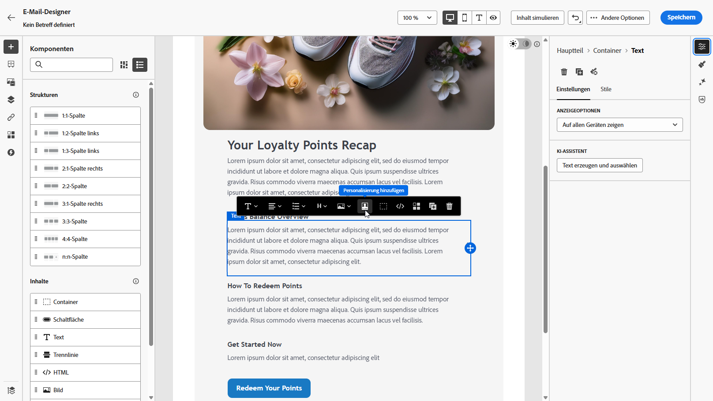
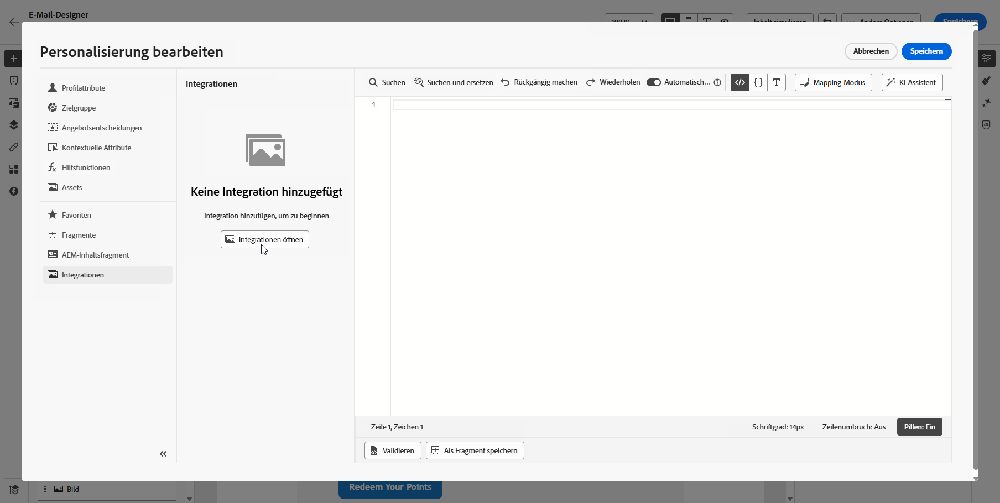
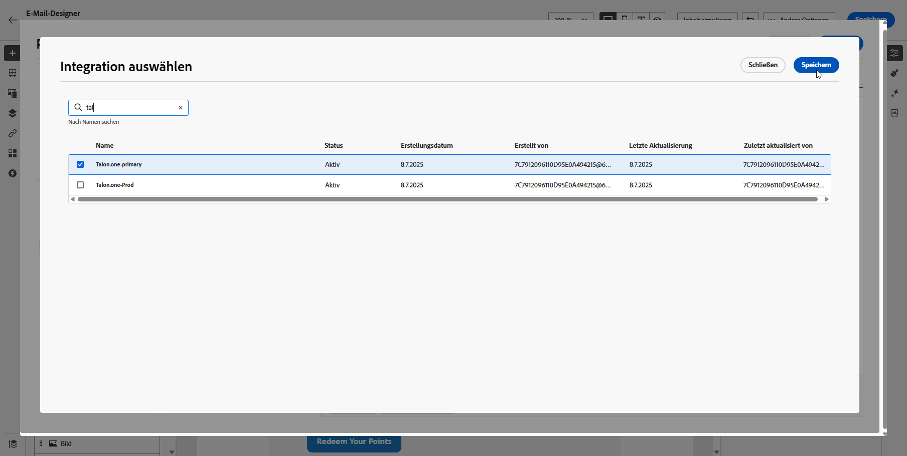
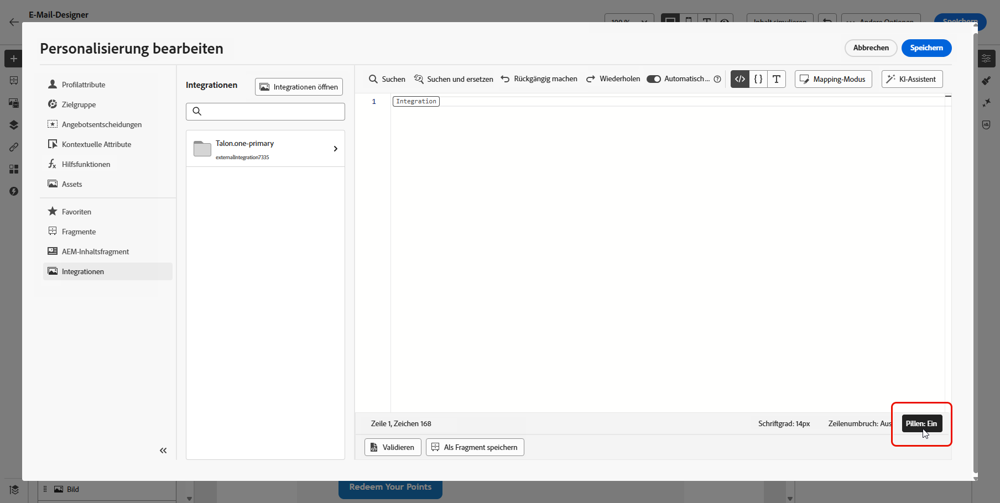
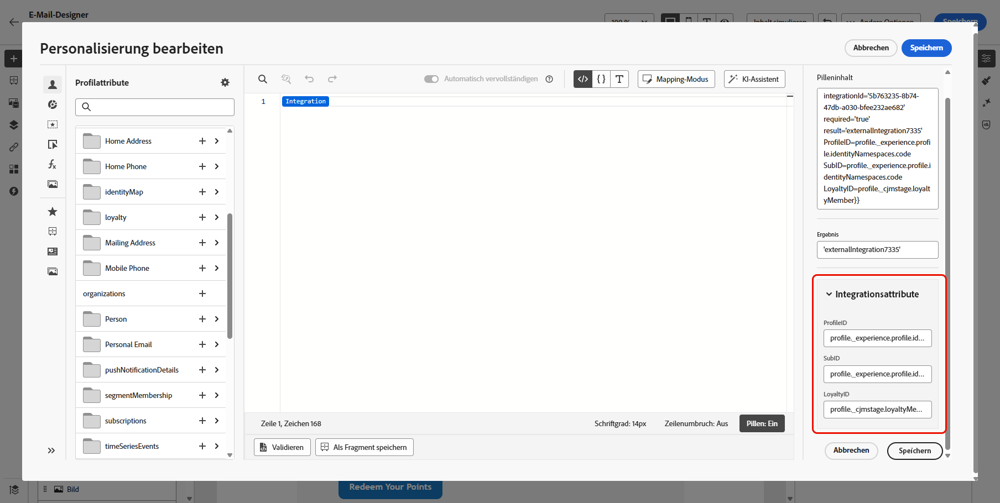
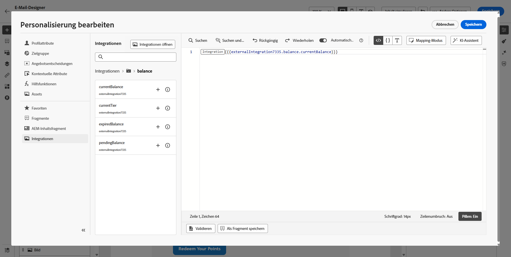
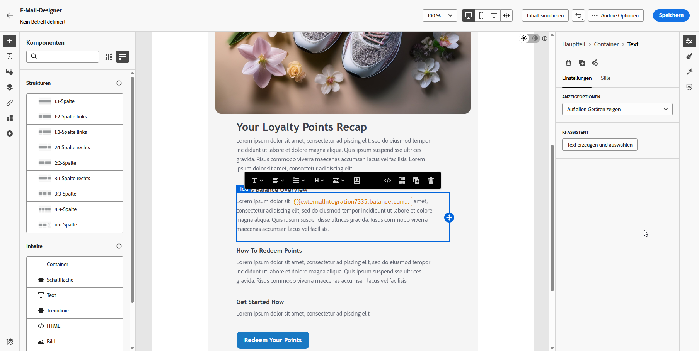

# Verwenden externer Integrationen für die Personalisierung {#integrations-personalization}

Bevor Sie externe Integrationen in Ihren Inhalten verwenden, bestätigen Sie, dass ein Administrator jede Integration **konfiguriert und aktiviert** (Endpunkt, Authentifizierung, Richtlinien, Antwort-Payload und Aktivierung) hat, wie in [Arbeiten mit Integrationen](integrations.md) beschrieben.

Sie können bis zu **3** Integrationen pro **[!UICONTROL Fragment]** und bis zu **5** der Nachricht hinzufügen. Integrationen, die nur aus Fragmenten stammen, werden nicht für die **5** gezählt.

## Anwenden der Integrationspersonalisierung auf Ihre Inhalte {#apply-integration-personalization}

Als Marketing-Fachleute können Sie konfigurierte Integrationen verwenden, um Ihre Inhalte zu personalisieren. Führen Sie folgende Schritte aus:

1. Greifen Sie auf Ihren Kampagneninhalt zu und klicken Sie in Ihren Text- oder HTML-**[!UICONTROL Komponenten]** auf **[!UICONTROL Personalisierung hinzufügen]**.

   [Weitere Informationen zu Komponenten](../email/content-components.md)

   

1. Navigieren Sie zum Abschnitt **[!UICONTROL Integrationen]** und klicken Sie auf **[!UICONTROL Integrationen öffnen]**, um alle aktiven Integrationen anzuzeigen.

   Beachten Sie, dass **Journey Optimizer-Fragmente** für Integrationen verfügbar sind, aber nur ausgehende Kanäle unterstützen. Nach der Veröffentlichung eines Fragments ist das Hinzufügen und Speichern neuer Integrationen deaktiviert, um Auswirkungen auf bestehende Journey und Kampagnen zu vermeiden.

   

1. Wählen Sie eine Integration aus und klicken Sie auf **[!UICONTROL Speichern]**.

   

1. Aktivieren Sie den **[!UICONTROL Pillen-Modus]**, um das erweiterte Integrationsmenü zu entsperren.

   

1. Wenn Sie die Integrationspersonalisierung erstellen, enthält der Integrations-Helper ein **`required`**, das definiert, wie Fehler oder fehlende Daten mit Standardinhalten interagieren:

   * **`required=true`** (Standard): Das Rendern dieser Nachricht wird angehalten. Der Versand wird mit **`ExternalDataLookupExclusion`** ausgeschlossen und dieser Ausschluss wird im **Nachrichten-Feedback-Datensatz“**.
   * **`required=false`**: Die Ergebnisvariable wird auf **`null`** festgelegt und das Rendern wird fortgesetzt. Verwenden Sie Standardtext, Fallbacks oder bedingte Logik in Ihrer Vorlage, damit Profile keine leeren Inhalte erhalten, wenn die Integration keine Daten zurückgibt.

     

1. Um die Einrichtung der Integration abzuschließen, definieren Sie die Integrationsattribute, die zuvor bei der [Konfiguration](integrations.md#configure) angegeben wurden.

   Sie können diesen Attributen Werte zuweisen – entweder mithilfe statischer Werte, die konstant bleiben, oder mithilfe von Profilattributen, die Informationen dynamisch aus Benutzerprofilen abrufen.

   

1. Sobald die Integrationsattribute definiert sind, können Sie die Integrationsfelder in Ihren Inhalten für personalisierte Nachrichten verwenden, indem Sie auf das Symbol  klicken.

   

   >[!NOTE]
   >
   >Token in Ihrer Vorlage dürfen nur Felder verwenden, die der Administrator in der Integrationskonfiguration bereitgestellt hat. Beispielsweise ist `{{weatherResponse.temperature}}` gültig, wenn `temperature` verfügbar gemacht wird; `{{weatherResponse.humidity}}` wird im Editor abgelehnt, wenn `humidity` nicht verfügbar ist.

1. Klicken Sie auf **[!UICONTROL Speichern]**.

Ihre Integrationspersonalisierung wird jetzt erfolgreich auf Ihre Inhalte angewendet, sodass alle Empfängerinnen und Empfänger ein maßgeschneidertes, relevantes Erlebnis erhalten, das auf den von Ihnen konfigurierten Attributen basiert.

<!--

## Map one API call to another {#map-integration-chain}

You can **chain** integrations so that values returned by one active integration drive the inputs (path, headers, or query parameters) of another. That lets you build a real-time data flow in a single message without custom code.

Before you start, make sure that:

* An administrator has configured and activated every integration you need. See [Configure your Integration](integrations.md).
* Variable path placeholders, headers, and query parameters are set up in the integration configuration with marketer-facing labels.
* The administrator exposed the response fields you need in each integration's **[!UICONTROL Response payload]** so they appear when authoring.

In the below example, a reservation system integration returns a flight booking reference from the profile context. A separate flight-information integration expects that reference as a **path variable**. In the personalization editor, you map the second integration's variable to a field from the first integration's response, instead of a static value or profile attribute alone.

1. Open your message or fragment and place the cursor where you want personalized content (for example, a **[!UICONTROL Text]** field).

1. Open the personalization editor and go to **[!UICONTROL Integrations]** → **[!UICONTROL Open integrations]**.

1. Select the integration whose output will supply the downstream input (in the example, the reservation or profile API that returns the flight identifier).

1. Define that integration's inputs as usual—static values, profile attributes, or other allowed mappings—then save so its response is available for chaining.

    >[!NOTE]
    >
    > Fields must appear in the administrator-defined response payload for each integration. You cannot reference response properties that were not exposed in configuration.

1. Select the **second** integration (for example, the API that needs the flight number or booking reference on the URL path).

1. For each input that must come from the first call—often a **path variable** or **variable** header/query parameter—choose the mapping source that references the **first integration's response** (for example, the flight booking reference field from the reservation payload). Do not use a static test value if you need live, profile-specific data.

1. Insert the response tokens you need in the content (for example, destination name from the flight API, loyalty balance from a loyalty integration) using the  control.

1. Save the personalization.

When you **simulate** or send, Journey Optimizer resolves integrations in order: the first call runs with the profile context you configured; its output is used to build the second request. Different integrations may run at simulation time and at send time according to your setup and channel behavior.

-->

## Anleitungsvideo {#video}

In diesem Video wird gezeigt, wie **Integrationen** Adobe Journey Optimizer mit externen APIs verbinden, damit Sie Live-Daten und -Inhalte in **ausgehende** Kanäle, E-Mail, SMS und Push-Benachrichtigungen übertragen können, um eine relevantere Personalisierung zu erzielen.

>[!VIDEO](https://video.tv.adobe.com/v/3484127/?captions=ger&learn=on)
