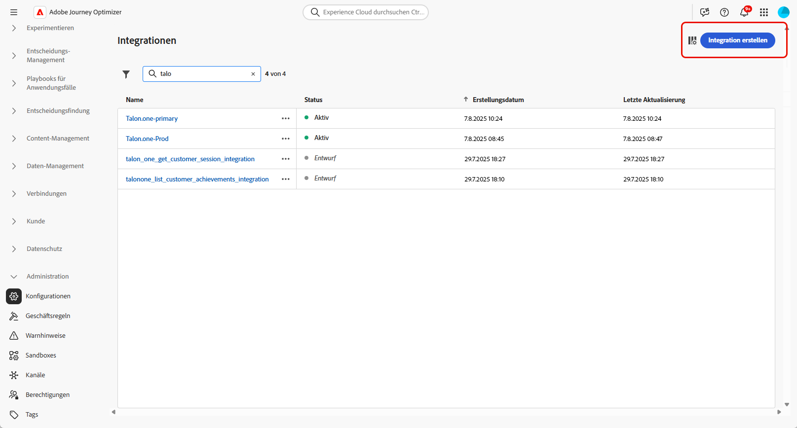
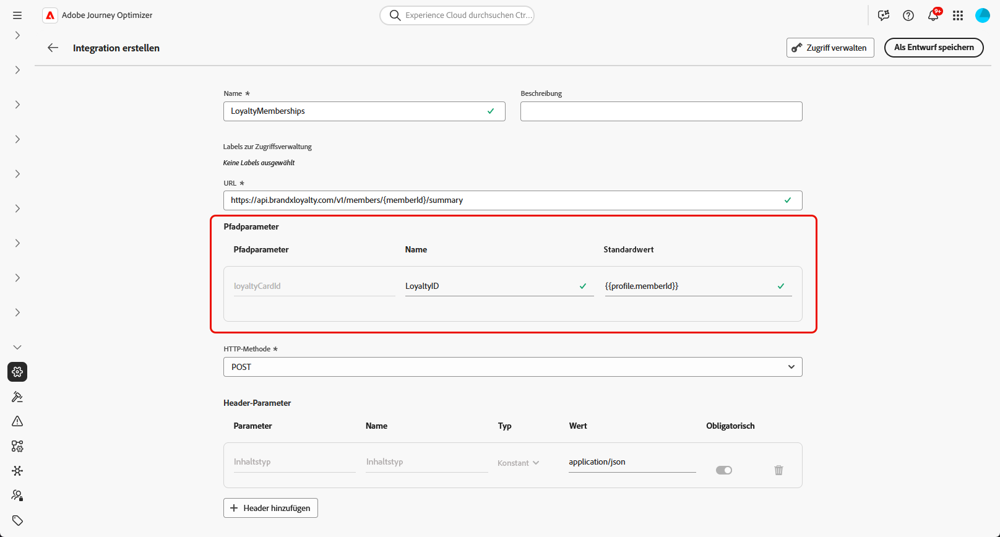
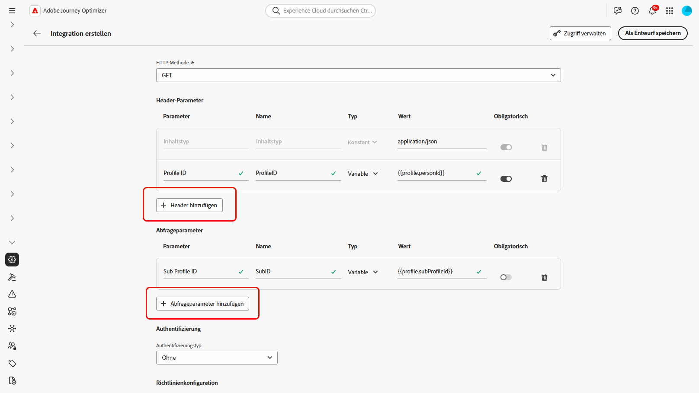
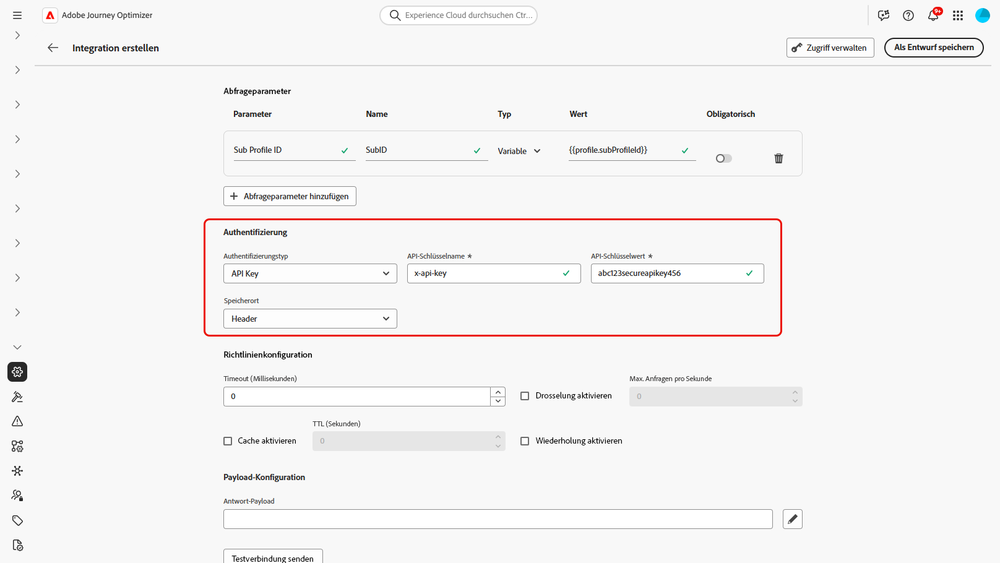
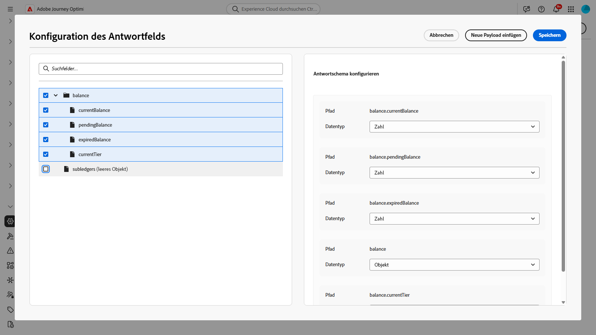
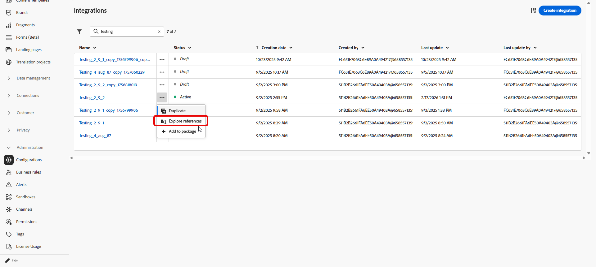
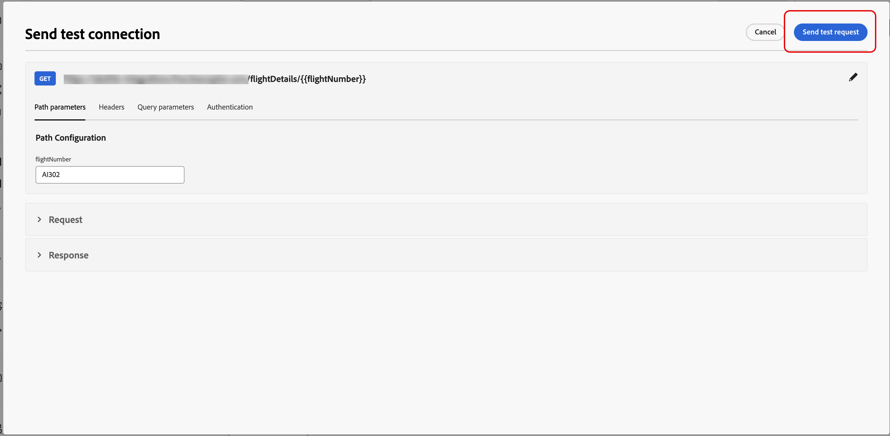

# Arbeiten mit Integrationen {#external-sources}

## Überblick

Die **Integrationen**-Funktion verknüpft Adobe Journey Optimizer mit Drittanbietersystemen, deren Daten und zusammenstellbaren Inhalt Sie bereits an anderer Stelle verwalten. Sie können dieses Material beim Authoring und beim Versand aufdecken, was responsivere, personalisierte Erlebnisse für alle in Journey Optimizer verwendeten Kanäle unterstützt.

Sie können diese Funktion verwenden, um externe Daten und Inhalte aus Drittanbieter-Tools abzurufen, z. B.:

* **Prämienpunkte** aus Treueprogrammsystemen.
* **Preisinformationen** für Produkte.
* **Produktempfehlungen** aus Empfehlungs-Engines.
* **Logistische Updates** wie Versandstatus.

Um mit der Verwendung von Integrationen beginnen zu können, müssen Benutzenden die Berechtigungen **[!UICONTROL AJO-Integrationskonfiguration verwalten]** und **[!UICONTROL AJO-Integrationskonfiguration anzeigen]** gewährt werden. [Weitere Informationen zu Berechtigungen](../administration/permissions.md)

+++ Erfahren Sie, wie Sie Berechtigungen für Integrationen zuweisen

1. Gehen Sie im Produkt **[!UICONTROL Berechtigungen]** zur Registerkarte **[!UICONTROL Rollen]** und wählen Sie die gewünschte **[!UICONTROL Rolle]** aus.

1. Klicken Sie auf **[!UICONTROL Bearbeiten]**, um die Berechtigungen zu ändern.

1. Fügen Sie die Ressource **[!UICONTROL AJO-]** hinzu und wählen Sie dann die entsprechenden Integrationsberechtigungen aus dem Dropdown-Menü aus.

   

1. Klicken Sie auf **[!UICONTROL Speichern]**, um die Änderungen anzuwenden.

   Die Berechtigungen aller Benutzenden, die dieser Rolle bereits zugewiesen sind, werden automatisch aktualisiert.

1. Um diese Rolle neuen Benutzenden zuzuweisen, navigieren Sie im Dashboard **[!UICONTROL Rollen]** zur Registerkarte **[!UICONTROL Benutzer]** und klicken Sie auf **[!UICONTROL Benutzer hinzufügen]**.

1. Geben Sie den Namen und die E-Mail-Adresse der Benutzerin oder des Benutzers ein oder wählen Sie aus der Liste aus und klicken Sie dann auf **[!UICONTROL Speichern]**.

Wenn die Benutzerin bzw. der Benutzer vorher noch nicht erstellt wurde, lesen Sie [diese Dokumentation](https://experienceleague.adobe.com/de/docs/experience-platform/access-control/abac/permissions-ui/users).

+++

## Konfigurieren Ihrer Integration {#configure}

>[!AVAILABILITY]
>
> Diese Integrationsfunktion ist auf ausgehende Kanäle (E-Mail, SMS und Push) beschränkt und unterstützt das Abrufen von JSON oder HTML.

Als Admin können Sie externe Integrationen einrichten, indem Sie die folgenden Schritte ausführen:

1. Navigieren Sie im linken Menü zum Abschnitt **[!UICONTROL Konfigurationen]** und klicken Sie auf der Karte **[!UICONTROL Integrationen]** auf **[!UICONTROL Verwalten]**.

   Klicken Sie dann auf **[!UICONTROL Integration erstellen]**, um eine neue Konfiguration zu starten.

   

1. Fügen Sie optional einen **cURL**-Befehl ein, um die URL, die HTTP-Methode, die Kopfzeilen und Abfrageparameter automatisch auszufüllen.

1. Es müssen ein **[!UICONTROL Name]** und eine **[!UICONTROL Beschreibung]** für die Integration angegeben werden.

   >[!NOTE]
   >
   >**[!UICONTROL Name]** Feld darf keine Leerzeichen enthalten.

1. Geben Sie den API-Endpunkt (**[!UICONTROL )]**.

   Umschließen Sie für Pfadvariablen eine Beschriftung in doppelte geschweifte Klammern in der URL, z. B. `https://api.example.com/v1/products/{{productId}}`, und legen Sie dann jeden Platzhalter in „Pfadvorlage **[!UICONTROL fest]**.

1. Konfigurieren Sie **[!UICONTROL Pfadvorlage]** mit **[!UICONTROL Name]** und **[!UICONTROL Standardwert]** für jeden Platzhalter, den Sie der URL hinzugefügt haben.

   Beachten Sie **[!UICONTROL dass „Name]** nur im Editor eine dem Marketing zugewandte Beschriftung ist, sie wird nicht in der API-Anfrage gesendet.

   

1. Wählen Sie die **[!UICONTROL HTTP-Methode]** zwischen GET und POST aus.

1. Klicken Sie je nach Bedarf für Ihre Integration auf **[!UICONTROL Header hinzufügen]** und/oder **[!UICONTROL Abfrageparameter hinzufügen]**. Geben Sie für jeden Parameter die folgenden Details an:

   * **[!UICONTROL Parameter]**: Der tatsächliche Header- oder Abfrageparametername, wie von der API erwartet.

   * **[!UICONTROL Name]**: Ein marketerfreundlicher Titel für diesen Parameter, den Autoren beim Zuordnen von Werten in Kampagnen auswählen.

   * **[!UICONTROL Typ]**: Wählen Sie **Konstante** für einen festen Wert oder **Variable** für eine dynamische Eingabe.

   * **[!UICONTROL Wert]**: Geben Sie für Konstanten den Wert direkt ein oder wählen Sie eine Variablenzuordnung aus.

   * **[!UICONTROL Obligatorisch]**: Geben Sie an, ob dieser Parameter obligatorisch ist. Wenn bei obligatorischen **[!UICONTROL Variablen]**-Parametern zur Laufzeit kein Wert aufgelöst und kein Standard angegeben wird, schlägt die Anfragegenerierung mit einem Fehler fehl und der ausgehende API-Aufruf wird nicht ausgeführt.

   

1. Wählen Sie einen **[!UICONTROL Authentifizierungstyp]**:

   * **[!UICONTROL Keine Authentifizierung]**: Bei offenen APIs, für die keine Anmeldedaten erforderlich sind.

   * **[!UICONTROL API-Schlüssel]**: Authentifizieren von Anfragen mithilfe eines statischen API-Schlüssels. Geben Sie den **[!UICONTROL API-Schlüsselnamen]**, den **[!UICONTROL API-Schlüsselwert]** und den **[!UICONTROL Speicherort]** an.

   * **[!UICONTROL Einfache Authentifizierung]**: Verwenden der einfachen HTTP-Standardauthentifizierung. Geben Sie **[!UICONTROL Benutzername]** und **[!UICONTROL Kennwort]** ein.

   * **[!UICONTROL OAuth 2.0]**: Authentifizieren mit dem OAuth 2.0-Protokoll. Klicken Sie auf das Symbol , um die **[!UICONTROL Payload]** zu konfigurieren oder zu aktualisieren.

   

1. Legen Sie **[!UICONTROL Richtlinienkonfiguration]** wie **[!UICONTROL Timeout]** für API-Anfragen fest und wählen Sie die Aktivierung von Drosselung, Cache und/oder Wiederholung aus.

   >[!NOTE]
   >
   >Bei aktivierter Drosselung liegen die unterstützten Raten bei 50 bis 5.000 TPS. Die Beschränkungen gelten für **Integration**, nicht für jeden API-Endpunkt.
   >
   >Wenn der Wiederholungsvorgang aktiviert ist, **andere Fehler standardmäßig (** Mal), **200 ms**, **400 ms** und **800 ms** zwischen den Versuchen.

1. Mit dem Feld **[!UICONTROL Antwort-Payload]** können Sie festlegen, welche Felder der Beispielausgabe für die Personalisierung von Nachrichten verwendet werden sollen.

   Klicken Sie auf das Symbol  und fügen Sie eine beispielhafte JSON-Antwort-Payload ein, um Datentypen automatisch zu erkennen.

1. Wählen Sie die Felder aus, die für die Personalisierung bereitgestellt werden sollen, und geben Sie die entsprechenden Datentypen an.

   

   >[!NOTE]
   >
   >Die **[!UICONTROL Antwort-Payload]**-Konfiguration definiert die erwartete Antwort für das Authoring einschließlich aller in diesem Schritt angewendeten Schemata. Marketing-Experten dürfen nur auf offen gelegte Felder verweisen. Token für andere Pfade schlagen die Validierung im Editor fehl.

1. Verwenden Sie **[!UICONTROL Testverbindung senden]**, um die Integration zu validieren. [Erfahren Sie mehr über das Testen Ihrer Verbindung](#connection)

   Klicken Sie nach dem Validieren auf **[!UICONTROL Aktivieren]**.

1. Greifen Sie auf Ihre neu erstellte Integration zu:

   * **Aktualisieren**: Ändern Sie nur **Authentifizierung** Details und **Richtlinienkonfiguration**. Für Live-Journey und -Kampagnen gelten Aktualisierungen. Bevor Sie Änderungen speichern, verwenden Sie das Menü **[!UICONTROL Verweise erkunden]**, um zu bestätigen, wo die Integration verwendet wird.
   * **Archivieren**: Archivieren einer Integrationskonfiguration.

   

Klicken Sie nach der Aktivierung auf , um auf das Menü **[!UICONTROL Verweise erkunden]** zuzugreifen und die Verwendung für diese Konfiguration zu überprüfen, einschließlich der davon abhängigen Journey und Kampagnen.

### Sendezeitbeschränkungen und -verhalten {#configure-send-time}

Zum Zeitpunkt des Versands können Antworten von der externen API standardmäßig bis zu **4 MB**. Alles, was größer ist, wird als Integrationsfehler behandelt und **erneute Versuche werden nicht versucht** wenn der Fehler durch die Antwortgröße verursacht wird.

Die Aufrufe **die von** konfigurierte Drosselungsrate ein: Journey Optimizer plant Versuche bis zu diesem Limit, selbst wenn das externe System ausfällt oder Fehler zurückgibt. Wenn **cache** aktiviert ist, werden nur **erfolgreiche** Antworten gespeichert und wiederverwendet, bis der **TTL** definierte Cache abläuft. Fehlgeschlagene Antworten werden nie zwischengespeichert.

Jede Nachricht in der Warteschlange verfügt außerdem über ein Gültigkeitsfenster (TTL). Wenn die Verarbeitung fehlschlägt und eine Nachricht über dieses Fenster hinausgeht, **das System sie** und gibt ein **`MessageValidityExclusion`** aus, sodass veraltete Arbeit aus der Warteschlange entfernt wird und Ressourcen verfügbar bleiben.

## Testen der Verbindung {#connection}

**[!UICONTROL Testverbindung senden]** validiert die Endpunkt-URL, Authentifizierung und Anfragestruktur vor der Aktivierung anhand der Ziel-API, was das Risiko von Laufzeitfehlern während der Nachrichtenverarbeitung reduziert.

1. Wenn die URL, die HTTP-Methode, die Header und die Abfrageparameter definiert sind, klicken Sie auf **[!UICONTROL Verbindung testen]**, um einen Konnektivitätstest durchzuführen und die Konfiguration zu bestätigen.

1. Geben **[!UICONTROL im Dialogfeld Testverbindung senden]** Standardwerte für alle **[!UICONTROL Variable]**-Platzhalter im URL-Pfad, in den Kopfzeilen und in den Abfrageparametern ein.

   Diese Werte sind in der Testanfrage enthalten. Journey Optimizer ruft den Endpunkt auf und meldet, ob die Verbindung erfolgreich hergestellt wurde oder fehlgeschlagen ist.

   

1. Wenn der Test eine erfolgreiche Antwort zurückgibt, wählen Sie **[!UICONTROL Als Antwort-Payload verwenden]** aus, um den Antworttext in das Feld **[!UICONTROL Antwort-Payload]** zu kopieren. Weitere Informationen finden Sie in Schritt 10 unter [Integration konfigurieren](#configure), wo Datentypen erkannt und Felder für die Personalisierung ausgewählt werden können.

   

1. Wenn der Test nicht erfolgreich ist, erweitern Sie die **[!UICONTROL Fehler]**-Dropdown-Liste, um die Fehlerdetails zu überprüfen, die Integrationskonfiguration nach Bedarf zu aktualisieren, und führen Sie **[!UICONTROL Testverbindung senden]** erneut aus.

   

Wählen Sie nach erfolgreichem Test **[!UICONTROL Aktivieren]** in der Integrationskonfiguration aus. Siehe [Konfigurieren der Integration](#configure).

